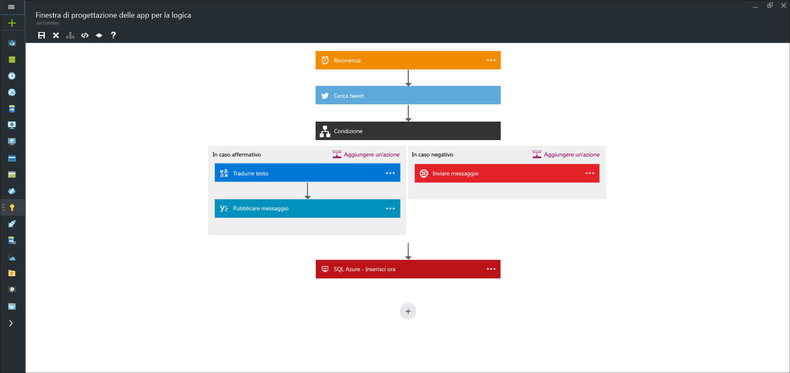

<properties 
	pageTitle="Cosa sono le app per la logica?" 
	description="Informazioni sulle App per la logica del servizio app" 
	authors="kevinlam1" 
	manager="dwrede" 
	editor="" 
	services="app-service\logic" 
	documentationCenter=""/>

<tags
	ms.service="app-service-logic"
	ms.workload="na"
	ms.tgt_pltfrm="na"
	ms.devlang="na"
	ms.topic="hero-article" 
	ms.date="07/12/2016"
	ms.author="klam"/>

#Cosa sono le app per la logica?

| Riferimento rapido |
| --------------- |
| [Linguaggio di definizione delle app per la logica](https://msdn.microsoft.com/library/azure/mt643789.aspx) |
| [Documentazione del connettore delle app per la logica](../connectors/apis-list.md) |
| [Forum delle app per la logica](https://social.msdn.microsoft.com/Forums/it-IT/home?forum=azurelogicapps) |

Le app per la logica consentono di semplificare e implementare processi aziendali complessi. Offrono una finestra di progettazione visiva per modellare e automatizzare i processi aziendali come serie di passaggi definiti flusso di lavoro. È possibile progettare i flussi di lavoro in modo che vengano avviati da un trigger e quindi eseguano ogni passaggio necessario. Per ogni passaggio viene richiamata un'API e contemporaneamente vengono gestite in modo sicuro l'autenticazione e le procedure consigliate, come l'impostazione del checkpoint e l'esecuzione durevole.

Ecco alcuni vantaggi dell'uso delle app per la logica:

- Risparmio di tempo nella progettazione di processi complessi tramite strumenti di progettazione di facile comprensione
- Semplicità di implementazione di attività che risulterebbero altrimenti difficili da implementare nel codice
- Possibilità di iniziare subito la progettazione dai modelli
- Personalizzazione delle app per la logica mediante le API
- Connessione a sistemi diversi
- Monetizzazione delle app per la logica nel Marketplace
- Possibilità di iniziare a progettare in modo semplice e di sviluppare le app in base alle necessità crescenti

Le app per la logica sono un servizio iPaaS (integration Platform as a Service) completamente gestito, che consente agli sviluppatori di evitare attività aggiuntive per la gestione dell'hosting, della scalabilità, della disponibilità e della gestione.

È soprattutto possibile combinare le app per la logica con i [connettori gestiti][managedapis] predefiniti, per semplificare la soluzione degli scenari più complessi:

Come indicato, le app per la logica consentono di automatizzare i processi aziendali. Ecco alcuni esempi:
 
* È possibile replicare automaticamente nuovi record nel database SQL e inviare messaggi al front desk.
* È possibile trovare automaticamente tweet negativi e inviarli a un canale slack.
* Quando viene creato un file in un server FTP, analizzare il file, aggiungere nuovi record a Dynamics CRM e quindi creare un elemento in un elenco di SharePoint.

Tutti questi scenari possono essere configurati tramite la finestra di progettazione visiva e senza scrivere una singola riga di codice. È possibile iniziare [subito a sviluppare la propria app per la logica][create].

## Perché usare le app per la logica?

Se si vuole automatizzare qualsiasi processo aziendale, ad esempio, individuare tweet negativi e pubblicarli nel canale slack interno o replicare nuovi record del cliente da SQL, appena arrivano, nel sistema CRM, le app per la logica facilitano l'integrazione di diverse origini dati, dal cloud a un'infrastruttura locale. Per altre informazioni, vedere i [connettori][managedapis] e [iniziare][create] subito per scoprire le attività che è possibile eseguire.

L'[account di integrazione aziendale][biztalk] consente inoltre di gestire scenari di integrazione avanzati con le funzionalità di [messaggistica XML][xml], [gestione dei partner commerciali][tpm] e altro ancora.

- **Strumenti di progettazione facili da usare**: è possibile progettare le app per la logica in modalità end-to-end nel browser. Iniziare con un trigger: da una semplice pianificazione a un momento qualsiasi in cui compare un tweet relativo alla propria azienda. Quindi, gestire un numero qualsiasi di azioni usando la raccolta completa di connettori.

- **Comporre SaaS facilmente**: persino le attività di composizione che sono facili da descrivere sono invece difficili da implementare nel codice. Le app per la logica facilitano la connessione ai diversi sistemi. Se, ad esempio, si vuole creare nel software CRM un'attività basata sulle proprie attività negli account di Facebook o Twitter oppure si vuole connettere la propria soluzione di marketing cloud al sistema di fatturazione locale, le app per la logica sono il modo più rapido e affidabile per risolvere questi problemi.

- **Iniziare rapidamente con i modelli**: per iniziare subito è disponibile una [raccolta di modelli][templates] che consente di creare rapidamente alcune soluzioni comuni. Dalle soluzioni BizTalk avanzate alla semplice connettività SaaS e persino alcune soluzioni senza alcuno scopo particolare, la raccolta è il modo più veloce per comprendere il potere delle app per la logica.

- **Estensibilità integrata**: se il connettore necessario non è disponibile, le app per la logica sono progettate per poter interagire con le app per le API. È possibile creare facilmente la propria app per le API da usare come API personalizzata. Sarà possibile creare una nuova app personalizzata oppure condividerla nel Marketplace e realizzare profitti.

- **Straordinaria potenza di integrazione reale**: è possibile iniziare facilmente e svilupparsi secondo le necessità. Le app per la logica possono sfruttare facilmente la potenza di BizTalk, la soluzione di integrazione leader del settore offerta da Microsoft, che consente ai professionisti dell'integrazione di creare le soluzioni necessarie. Altre informazioni su [Enterprise Integration Pack](./app-service-logic-enterprise-integration-overview.md).

## Concetti delle app per la logica

Di seguito sono riportate alcune informazioni fondamentali per comprendere appieno l'esperienza delle app per la logica.

- **Flusso di lavoro**: le app per la logica consentono di modellare graficamente i processi aziendali come una serie di passaggi, o flusso di lavoro.
- **Connettori gestiti**: le app per la logica devono avere accesso ai dati e ai servizi. I connettori gestiti vengono creati in maniera specifica per assistere l'utente durante la connessione ai dati e la successiva elaborazione. Per un elenco dei connettori ora disponibili, vedere [Elenco di connettori gestiti][managedapis].
- **Trigger**: alcuni connettori gestiti possono anche fungere da trigger. Un trigger avvia una nuova istanza di un flusso di lavoro basata su un evento specifico, ad esempio l'arrivo di un messaggio di posta elettronica oppure una modifica nell'account di archiviazione di Azure.
-  **Azioni**: ogni passaggio dopo il trigger in un flusso di lavoro viene chiamato azione. Ogni azione viene in genere mappata a un'operazione sul connettore gestito o app per le API personalizzate.
- **Enterprise Integration Pack**: per scenari di integrazione più avanzati, App per la logica include le funzionalità di BizTalk. BizTalk è la piattaforma di integrazione leader del settore di Microsoft. Enterprise Integration Pack consente di includere facilmente la convalida, la trasformazione e molto altro nei flussi di lavoro dell'app per la logica.

## Introduzione  

 - Per iniziare a usare le app per la logica, seguire l'esercitazione [Creare una nuova app per la logica][create].
 - [Visualizzare esempi e scenari comuni](app-service-logic-examples-and-scenarios.md)
 - [Le app per la logica consentono di automatizzare i processi aziendali](http://channel9.msdn.com/Events/Build/2016/T694)
 - [Informazioni su come integrare i sistemi correnti con le app per la logica](http://channel9.msdn.com/Events/Build/2016/P462)
- Per altre informazioni sulla piattaforma del servizio app di Azure, vedere [Servizio app di Azure][appservice].

[biztalk]: app-service-logic-enterprise-integration-accounts.md
[appservice]: ../app-service/app-service-value-prop-what-is.md
[create]: app-service-logic-create-a-logic-app.md
[managedapis]: ../connectors/apis-list.md
[tpm]: app-service-logic-enterprise-integration-accounts.md
[xml]: app-service-logic-enterprise-integration-b2b.md
[templates]: app-service-logic-use-logic-app-templates.md

<!---HONumber=AcomDC_0713_2016-->