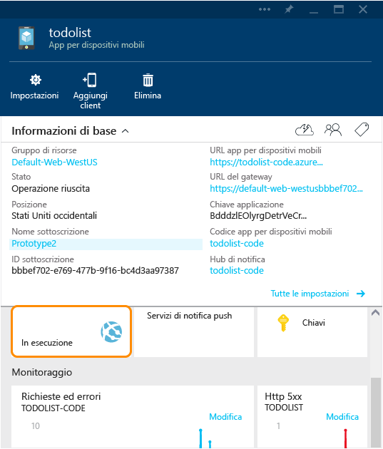
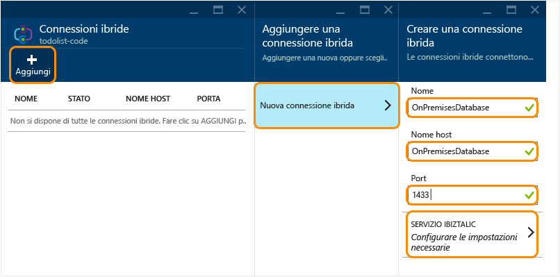
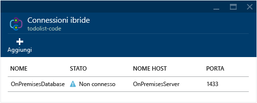
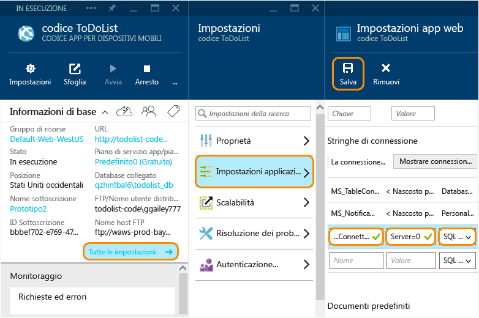

<properties
	pageTitle="Connettere un'app per dispositivi mobili di Azure a un'istanza di SQL Server locale mediante Connessioni ibride | Microsoft Azure"
	description="Informazioni su come connettersi a un'istanza di SQL Server locale da un'app per dispositivi mobili del servizio app mediante Connessioni ibride"
	services="app-service\mobile"
	documentationCenter=""
	authors="ggailey777"
	manager="dwrede"
	editor=""/>

<tags
	ms.service="app-service-mobile"
	ms.workload="na"
	ms.tgt_pltfrm="na"
	ms.devlang="multiple"
	ms.topic="get-started-article"
	ms.date="07/30/2015"
	ms.author="glenga"/>

# Connettersi a un'istanza di SQL Server locale dalle app per dispositivi mobili mediante Connessioni ibride

Quando un'azienda passa al cloud, potrebbe non essere possibile eseguire subito la migrazione di tutte le risorse in Azure. La funzionalità Connessioni ibride consente alla funzionalità App per dispositivi mobili di Azure App Service di connettersi in modo sicuro alle risorse locali. In questo modo, è possibile rendere accessibili i dati locali ai client mobili mediante Azure. Sono supportate tutte le risorse che usano una porta TCP statica, compresi Microsoft SQL Server, MySQL, le API Web HTTP e la maggior parte dei servizi Web personalizzati. La funzionalità Connessioni ibride usa l'autorizzazione con firma di accesso condiviso per proteggere le connessioni tra il servizio mobile e Gestione connessione ibrida locale. Per altre informazioni, vedere [Panoramica delle connessioni ibride](../integration-hybrid-connection-overview.md).

In questa esercitazione si apprenderà come modificare un back-end .NET dell'app per dispositivi mobili in modo da usare un database SQL Server locale anziché il database SQL di Azure di cui viene effettuato il provisioning con il servizio.

[AZURE.INCLUDE [app-service-mobile-to-web-and-api](../../includes/app-service-mobile-to-web-and-api.md)]

## Prerequisiti ##

Per completare questa esercitazione, è necessario disporre di:

- **Back-end dell'app per dispositivi mobili esistente**  Seguire l'[esercitazione con guida rapida](app-service-mobile-dotnet-backend-windows-store-dotnet-get-started-preview.md) per creare e scaricare un nuovo back-end .NET dell'app per dispositivi mobili dal [portale di Azure].

[AZURE.INCLUDE [hybrid-connections-prerequisites](../../includes/hybrid-connections-prerequisites.md)]

## Installare SQL Server Express, abilitare TCP/IP e creare un database SQL Server locale

[AZURE.INCLUDE [hybrid-connections-create-on-premises-database](../../includes/hybrid-connections-create-on-premises-database.md)]

## Creare una connessione ibrida

È necessario creare una nuova connessione ibrida e un servizio BizTalk per la parte di codice del back-end dell'app per dispositivi mobili, ovvero un'app Web.

1. Nel [portale di Azure] passare all'app per dispositivi mobili e fare clic sul pulsante del back-end dell'app Web.

	

	Verrà visualizzata l'app Web che implementa il codice del back-end per l'app per dispositivi mobili, ovvero il nome dell'app per dispositivi mobili seguito da `-code`.

2. Scorrere il pannello dell'app Web verso il basso e fare clic su **Connessioni ibride**.

	

2. Nel pannello Connessioni ibride fare clic su **Aggiungi**, quindi su **Nuova connessione ibrida**.

3. Nel pannello **Crea connessione ibrida** fornire un **Nome** e un **Nome host** per la connessione ibrida e impostare la **Porta** su `1433`.

	

4. Fare clic su **Servizio BizTalk** e immettere un nome per il servizio BizTalk, quindi fare clic due volte su **OK**.

	Questa esercitazione utilizza **mobile1**; sarà necessario fornire un nome univoco per il nuovo servizio BizTalk.

	Al termine del processo, nell'area **Notifiche** verrà visualizzata una luce di colore verde per segnalare l'**esito positivo dell'operazione** e il pannello **Connessione ibrida** mostrerà la nuova connessione ibrida con stato **Non connesso**.

	

A questo punto è stata completata una parte importante dell'infrastruttura della connessione ibrida cloud. Nel passaggio successivo verrà creato un elemento locale corrispondente.

## Installare l'istanza locale di Hybrid Connection Manager per completare la connessione

[AZURE.INCLUDE [app-service-hybrid-connections-manager-install](../../includes/app-service-hybrid-connections-manager-install.md)]

## Configurare il progetto di back-end dell'app per dispositivi mobili per la connessione al database di SQL Server

In questo passaggio definire una stringa di connessione per il database locale e modificare il back-end dell'app per dispositivi mobili per l'uso di questa connessione.

1. In Visual Studio 2013 aprire il progetto che definisce il back-end dell'app per dispositivi mobili.

	Per informazioni su come scaricare il progetto di back-end .NET, vedere l'[esercitazione con guida rapida](app-service-mobile-dotnet-backend-windows-store-dotnet-get-started-preview.md).

2. In Esplora soluzioni aprire il file Web.config, individuare la sezione **connectionStrings**, aggiungere una nuova voce SqlClient simile alla seguente, che punta al database di SQL Server locale:

	    <add name="OnPremisesDBConnection"
         connectionString="Data Source=OnPremisesServer,1433;
         Initial Catalog=OnPremisesDB;
         User ID=HybridConnectionLogin;
         Password=<**secure_password**>;
         MultipleActiveResultSets=True"
         providerName="System.Data.SqlClient" />

	Ricordare di sostituire `<**secure_password**>` in questa stringa con la password creata per *HbyridConnectionLogin*.

3. Fare clic su **Salva** in Visual Studio per salvare il file Web.config.

	> [AZURE.NOTE]Questa impostazione di connessione viene usata per l'esecuzione nel computer locale. Per l'esecuzione in Azure viene eseguito l'override di questa impostazione con l'impostazione di connessione definita nel portale.

4. Espandere la cartella **Modelli** e aprire il file di modello dati, che termina con *Context.cs*.

6. Modificare il costruttore di istanza **DbContext** per passare il valore `OnPremisesDBConnection` al costruttore **DbContext** di base, simile al frammento di codice seguente:

        public class hybridService1Context : DbContext
        {
            public hybridService1Context()
                : base("OnPremisesDBConnection")
            {
            }
        }

	Il servizio userà ora la nuova connessione al database di SQL Server.

## Aggiornare Azure in modo da usare la stringa di connessione locale

Successivamente, è necessario aggiungere un'impostazione dell'app per la nuova stringa di connessione in modo da poter essere usata da Azure.

1. Nel codice back-end dell'app Web per l'app per dispositivi mobili all'interno del [portale di Azure] fare clic su **Tutte le impostazioni**, quindi su **Impostazioni applicazione**.

3. Nel pannello **Impostazioni app Web** scorrere fino a **Stringhe di connessione** e aggiungere una nuova stringa di connessione di **SQL Server** denominata `OnPremisesDBConnection` con un valore simile a `Server=OnPremisesServer,1433;Database=OnPremisesDB;User ID=HybridConnectionsLogin;Password=<**secure_password**>`.

	Sostituire `<**secure_password**>` con la password sicura per il database locale.

	

2. Premere **Salva** per salvare la connessione ibrida e la stringa di connessione creata.

## Pubblicare e testare il back-end dell'app per dispositivi mobili in Azure

Infine, è necessario pubblicare il back-end dell'app per dispositivi mobili in Azure e verificare che venga usata la connessione ibrida per archiviare i dati nel database locale.

3. In Visual Studio fare clic con il pulsante destro del mouse sul progetto, scegliere **Pubblica**, quindi in **Pubblica sul Web** fare clic su **Siti Web di Microsoft Azure**.

	Invece di usare Visual Studio, è anche possibile [usare Git per pubblicare il back-end](mobile-services-dotnet-backend-store-code-source-control.md).

2. Accedere con le credenziali di Azure e selezionare il servizio in **Seleziona siti Web esistenti**.

	Visual Studio scaricherà le impostazioni di pubblicazione direttamente da Azure.

3. Infine, fare clic su **Pubblica**.

	Al termine della pubblicazione, il servizio viene riavviato e viene visualizzata la pagina iniziale del back-end.

4. Richiamare alcune operazioni che generano modifiche al database usando il pulsante **Prova adesso** nella pagina iniziale come già eseguito in precedenza o usando un'app client connessa all'app per dispositivi mobili.

	>[AZURE.NOTE]Quando si usa il pulsante**Prova adesso** per avviare le pagine delle API della Guida, specificare la chiave dell'applicazione come password (con un nome utente vuoto).

4. In SQL Server Management Studio connettersi all'istanza di SQL Server, aprire Esplora oggetti, espandere il database **OnPremisesDB** ed espandere **Tabelle**.

5. Fare clic con il pulsante destro del mouse sulla tabella **hybridService1.TodoItems** e scegliere **Seleziona prime 1000 righe** per visualizzare i risultati.

	Si noti che le modifiche generate nell'app client sono state salvate dal back-end dell'app per dispositivi mobili nel database locale usando la connessione ibrida.

## Vedere anche ##

+ [Sito Web delle connessioni ibride](../../services/biztalk-services/)
+ [Panoramica delle connessioni ibride](../integration-hybrid-connection-overview.md)
+ [Servizi BizTalk: schede Dashboard, Monitor, Scala, Configura e Connessione ibrida](../biztalk-dashboard-monitor-scale-tabs.md)
+ [Come modificare un modello di dati in un servizio mobile back-end .NET](../mobile-services-dotnet-backend-how-to-use-code-first-migrations.md)

<!-- IMAGES -->

<!-- Links -->
[portale di Azure]: https://portal.azure.com/
[Azure Management Portal]: http://go.microsoft.com/fwlink/p/?linkid=213885
[Get started with Mobile Services]: ../mobile-services-dotnet-backend-windows-store-dotnet-get-started.md

<!---HONumber=Oct15_HO4-->