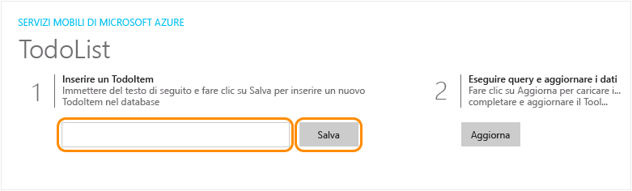
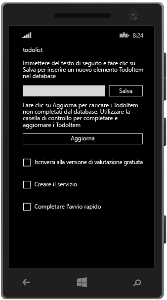

<properties
	pageTitle="Creare un'app universale di Windows Runtime 8.1 universale in app per dispositivi mobili del servizio app di Azure | Microsoft Azure"
	description="Seguire questa esercitazione per iniziare a usare i back-end dell'app per dispositivi mobili di Azure per lo sviluppo per Windows Store in C#, Visual Basic o JavaScript."
	services="app-service\mobile"
	documentationCenter="windows"
	authors="ggailey777"
	manager="dwrede"
	editor=""/>

<tags
	ms.service="app-service-mobile"
	ms.workload="mobile"
	ms.tgt_pltfrm="mobile-windows"
	ms.devlang="dotnet"
	ms.topic="hero-article"
	ms.date="08/14/2015"
	ms.author="glenga"/>

#Creare un'app Windows

[AZURE.INCLUDE [app-service-mobile-selector-get-started-preview](../../includes/app-service-mobile-selector-get-started-preview.md)]
&nbsp;  
[AZURE.INCLUDE [app-service-mobile-note-mobile-services-preview](../../includes/app-service-mobile-note-mobile-services-preview.md)]

##Panoramica

Questa esercitazione illustra come aggiungere un servizio back-end basato sul cloud a un'app universale di Windows Runtime 8.1 mediante un back-end dell'app per dispositivi mobili di Azure. Le soluzioni per app universali di Windows includono progetti di app per Windows Store 8.1 e Windows Phone Store 8.1, oltre a un progetto condiviso comune.

[AZURE.INCLUDE [app-service-mobile-windows-universal-get-started-preview](../../includes/app-service-mobile-windows-universal-get-started-preview.md)]

##Prerequisiti

Per completare l'esercitazione, sono necessari gli elementi seguenti:

* Un account Azure attivo. Se non è disponibile un account, è possibile iscriversi per accedere a una versione di valutazione di Azure e ottenere un massimo di 10 app per dispositivi mobili gratuite che potranno essere usate anche dopo il termine del periodo di valutazione. Per informazioni dettagliate, vedere la pagina relativa alla [versione di valutazione gratuita di Azure](http://azure.microsoft.com/pricing/free-trial/).

* [Visual Studio Community 2013] o versione successiva.

>[AZURE.NOTE]Per iniziare a usare Azure App Service prima di registrarsi per ottenere un account Azure, passare alla pagina [Prova il servizio app](http://go.microsoft.com/fwlink/?LinkId=523751&appServiceName=mobile). In questa pagina è possibile creare immediatamente un'app per dispositivi mobili iniziale temporanea in App Service. Non è necessario fornire una carta di credito né impegnarsi in alcun modo.

##Creare un nuovo back-end dell'app per dispositivi mobili di Azure

[AZURE.INCLUDE [app-service-mobile-dotnet-backend-create-new-service-preview](../../includes/app-service-mobile-dotnet-backend-create-new-service-preview.md)]

## Scaricare il progetto server

1. Nel [portale di Azure] fare clic su **Esplora tutto** > **App Web**, quindi fare clic sul back-end dell'app per dispositivi mobili appena creato.

2. Nel back-end dell'app per dispositivi mobili fare clic su **Tutte le impostazioni** e in **App per dispositivi mobili** fare clic su **Avvio rapido** > **Windows (C#)**.

3. In **Scarica ed esegui il progetto server** in **Crea una nuova app** fare clic su **Scarica**, estrarre i file di progetto compressi nel computer locale, quindi aprire la soluzione in Visual Studio.

4. Compilare il progetto per ripristinare i pacchetti NuGet.

##Pubblicare il progetto server in Azure

[AZURE.INCLUDE [app-service-mobile-dotnet-backend-publish-service-preview](../../includes/app-service-mobile-dotnet-backend-publish-service-preview.md)]

##Scaricare ed eseguire il progetto client

Dopo aver creato il back-end dell'app per dispositivi mobili, usare l'avvio rapido disponibile nel portale di Azure per creare una nuova app o modificare un'app esistente per connettersi al back-end dell'app per dispositivi mobili.

In questa sezione viene scaricato un progetto di modello di app universale di Windows personalizzato per la connessione al back-end dell'app per dispositivi mobili di Azure.

1. Nel pannello del back-end dell'app per dispositivi mobili fare clic su **Tutte le impostazioni** e quindi in **App per dispositivi mobili** fare clic su **Avvio rapido** > **Windows (C#)**.

2.  In **Scarica ed esegui il progetto Windows** in **Crea una nuova app** fare clic su **Scarica** ed estrarre i file compressi del progetto nel computer locale.

3. (Facoltativo) Aggiungere il progetto di app universale di Windows alla soluzione con il progetto server. Ciò semplifica il debug e il test dell'app e del back-end nella stessa soluzione di Visual Studio, se si sceglie di eseguire questa operazione.

4. Con l'app di Windows Store come progetto di avvio, premere il tasto F5 per ricompilare il progetto e avviare l'app di Windows Store.

5. Nell'app digitare un testo significativo, ad esempio *Complete the tutorial* nella casella di testo **Insert a TodoItem**, quindi fare clic su **Save**.

	

	Verrà inviata una richiesta POST al nuovo back-end dell'app per dispositivi mobili ospitato in Azure.

6. Interrompere il debug, fare clic con il pulsante destro del mouse sul progetto `<your app name>.WindowsPhone`, quindi scegliere **Imposta come progetto di avvio** e quindi premere di nuovo F5.

	

	Tenere presente che i dati salvati dal passaggio precedente vengono caricati dall'app per dispositivi mobili dopo l'avvio dell'app Windows.

##Passaggi successivi

* [Aggiungere l'autenticazione all'app](app-service-mobile-dotnet-backend-windows-store-dotnet-get-started-users-preview.md)  Informazioni sull'autenticazione degli utenti dell'app con un provider di identità.

* [Aggiungere notifiche push all'app](app-service-mobile-dotnet-backend-windows-store-dotnet-get-started-push-preview.md)  Informazioni sull'invio di una notifica push di base all'app.

<!-- Anchors. -->
<!-- Images. -->
<!-- URLs. -->
[Get started with authentication]: app-service-mobile-dotnet-backend-windows-store-dotnet-get-started-users-preview.md
[Mobile App SDK]: http://go.microsoft.com/fwlink/?LinkId=257545
[portale di Azure]: https://portal.azure.com/
[Visual Studio Community 2013]: https://go.microsoft.com/fwLink/p/?LinkID=534203

<!------HONumber=Sept15_HO1-->