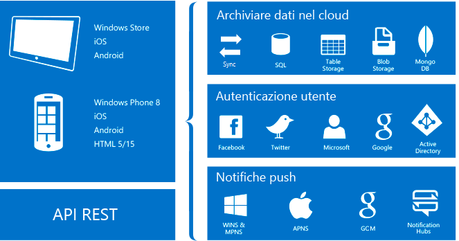

# Informazioni su App per dispositivi mobili nel servizio app di Azure
Il servizio app di Azure è un'offerta di [piattaforma distribuita come servizio ](https://azure.microsoft.com/overview/what-is-paas/) (PaaS) interamente gestita per sviluppatori professionisti. Il servizio offre un set completo di funzionalità per scenari Web, per dispositivi mobili e di integrazione. 

La funzionalità App per dispositivi mobili del servizio app di Azure offre a integratori di sistemi e sviluppatori aziendali una piattaforma di sviluppo di applicazioni per dispositivi mobili con scalabilità elevata e disponibilità globale.

## Perché le app per dispositivi mobili?
Con la funzionalità App per dispositivi mobili, è possibile:

* **Compilare app native e multipiattaforma**. Sia che si compilino app native iOS, Android e Windows o app multipiattaforma Xamarin o Cordova (PhoneGap), è possibile sfruttare il servizio app usando SDK nativi.
* **Connettersi ai sistemi aziendali**. Con la funzionalità App per dispositivi mobili, è possibile aggiungere l'accesso aziendale in pochi minuti e connettersi alle risorse aziendali locali o nel cloud.
* **Compilare app offline con sincronizzazione dei dati**. È possibile aumentare la produttività della forza lavoro mobile compilando app eseguibili offline e usando App per dispositivi mobili per sincronizzare i dati in background quando è disponibile la connettività con qualsiasi origine dati o API SaaS (Software as a Service) aziendale.
* **Inviare notifiche push a milioni di utenti in pochi secondi**. È possibile coinvolgere i clienti con notifiche push immediate su qualsiasi dispositivo, personalizzate in base alle specifiche esigenze e inviate al momento giusto.

## Funzionalità di App per dispositivi mobili
Le funzionalità seguenti sono importanti per lo sviluppo per dispositivi mobili abilitati per il cloud:

* **Autenticazione e autorizzazione**. È possibile scegliere da un elenco in costante crescita di provider di identità, tra cui Azure Active Directory per l'autenticazione aziendale, nonché provider di servizi di social networking come Facebook, Google, Twitter e account Microsoft. App per dispositivi mobili offre un servizio OAuth 2.0 per ogni provider. È anche possibile integrare l'SDK del provider di identità per funzionalità specifiche del provider.

    Altre informazioni sulle [funzionalità di autenticazione].

* **Accesso ai dati**. App per dispositivi mobili offre un'origine dati OData v3 ottimizzata per dispositivi mobili collegata al database SQL di Azure o a un'istanza locale di SQL Server. Dato che questo servizio può essere basato su Entity Framework, consente una facile integrazione con altri provider di dati NoSQL e SQL, tra cui [Archiviazione tabelle di Azure], MongoDB e [Azure Cosmos DB], e provider di API SaaS come Office 365 e Salesforce.com.

* **Sincronizzazione offline**. Gli SDK client facilitano la compilazione di applicazioni per dispositivi mobili solide e reattive che funzionano con un set di dati offline. Il set di dati può essere sincronizzato con i dati back-end, con supporto della risoluzione dei conflitti.

  Altre informazioni sulle [funzionalità dati].

* **Notifiche push**. Gli SDK client si integrano facilmente con le funzionalità di registrazione di Hub di notifica di Azure, consentendo di inviare notifiche push a milioni di utenti contemporaneamente.

  Altre informazioni sulle [funzionalità di notifica push].

* **SDK client**. Viene offerto un set completo di SDK client che coprono lo sviluppo nativo ([iOS], [Android] e [Windows]), multipiattaforma ([Xamarin.iOS, Xamarin.Android] e [Xamarin.Forms]) e di applicazioni ibride ([Apache Cordova]). Ogni SDK client è disponibile con una licenza MIT ed è open source.

## Funzionalità del servizio app di Azure
Le funzionalità della piattaforma seguenti sono utili per i siti di produzione per dispositivi mobili:

* **Scalabilità automatica**. Il servizio app consente di aumentare rapidamente le prestazioni o il numero di istanze per gestire qualsiasi carico di lavoro in ingresso dei clienti. È possibile selezionare manualmente il numero e le dimensioni delle VM o configurare la scalabilità automatica per ridimensionare il back-end delle app per dispositivi mobili in base al carico o alla pianificazione.

  Altre informazioni sulla [scalabilità automatica].

* **Ambienti di staging**. Il servizio app può eseguire più versioni del sito e consente così di eseguire test A/B, test in ambiente di produzione nell'ambito di un piano DevOps più ampio e staging sul posto di un nuovo back-end.

  Altre informazioni sugli [ambienti di staging].

* **Distribuzione continua**: il servizio app può integrarsi con i sistemi comuni per la gestione del controllo del codice sorgente e consente così di distribuire automaticamente una nuova versione del back-end eseguendo il push in un ramo del sistema per la gestione del controllo del codice sorgente.

  Altre informazioni sulle [opzioni di distribuzione](../app-service/app-service-deploy-local-git.md).

* **Rete virtuale**. Il servizio app può connettersi alle risorse locali usando una rete virtuale, Azure ExpressRoute o connessioni ibride.

  Altre informazioni su [connessioni ibride], [reti virtuali] ed [ExpressRoute].

* **Ambienti isolati e dedicati**. È possibile eseguire il servizio app in un ambiente completamente isolato e dedicato per l'esecuzione sicura delle app del servizio app di Azure su larga scala. Un ambiente di questo tipo è ideale per i carichi di lavoro delle applicazioni che richiedono scalabilità elevata, isolamento o accesso alla rete sicuro.

  Altre informazioni sugli [ambienti del servizio app].

## Passaggi successivi

Per iniziare a usare App per dispositivi mobili nel servizio app di Azure, completare l'[esercitazione introduttiva]. L'esercitazione illustra le nozioni di base della creazione di un back-end e un client per dispositivi mobili di propria scelta, nonché l'integrazione dell'autenticazione, della sincronizzazione offline e delle notifiche push. È possibile completare l'esercitazione più volte, una per ogni applicazione client.

Per altre informazioni su App per dispositivi mobili, vedere la [mappa di apprendimento].
Per altre informazioni sulla piattaforma Servizio app di Azure, vedere [Servizio app di Azure].

<!-- URLs. -->
[Migrate your mobile service to App Service]: app-service-mobile-migrating-from-mobile-services.md
[esercitazione introduttiva]: app-service-mobile-ios-get-started.md
[Archiviazione tabelle di Azure]:../cosmos-db/table-storage-how-to-use-dotnet.md
[Azure Cosmos DB]: ../cosmos-db/sql-api-get-started.md
[funzionalità di autenticazione]: ./app-service-mobile-auth.md
[funzionalità dati]: ./app-service-mobile-offline-data-sync.md
[funzionalità di notifica push]: ../notification-hubs/notification-hubs-push-notification-overview.md
[iOS]: ./app-service-mobile-ios-how-to-use-client-library.md
[Android]: ./app-service-mobile-android-how-to-use-client-library.md
[Windows]: ./app-service-mobile-dotnet-how-to-use-client-library.md
[Xamarin.iOS, Xamarin.Android]: ./app-service-mobile-dotnet-how-to-use-client-library.md
[Xamarin.Forms]: ./app-service-mobile-xamarin-forms-get-started.md
[Apache Cordova]: ./app-service-mobile-cordova-how-to-use-client-library.md
[scalabilità automatica]: ../app-service/web-sites-scale.md
[ambienti di staging]: ../app-service/web-sites-staged-publishing.md
[connessioni ibride]: ../biztalk-services/integration-hybrid-connection-overview.md
[reti virtuali]: ../app-service/web-sites-integrate-with-vnet.md
[ExpressRoute]: ../app-service/environment/app-service-app-service-environment-network-configuration-expressroute.md
[ambienti del servizio app]: ../app-service/environment/intro.md
[mappa di apprendimento]: https://azure.microsoft.com/en-us/documentation/learning-paths/appservice-mobileapps/
