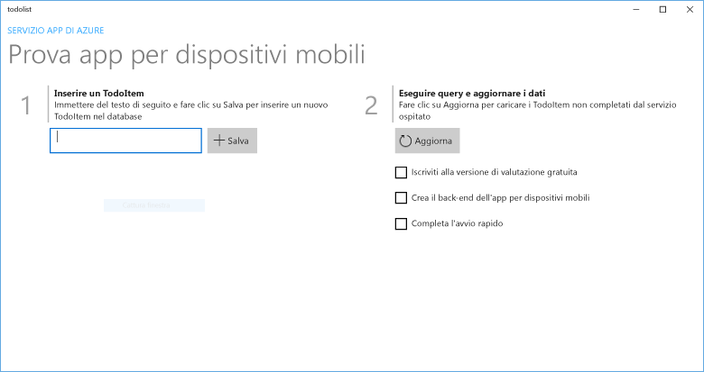
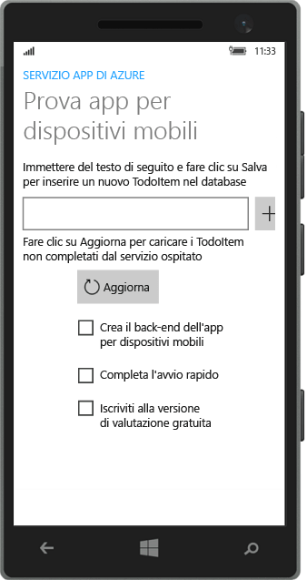
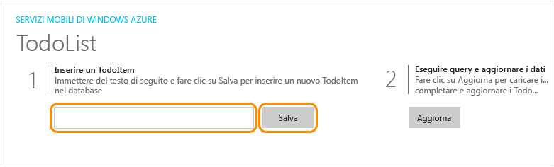

# Creare un'app Windows
[!INCLUDE [app-service-mobile-selector-get-started](../../includes/app-service-mobile-selector-get-started.md)]

## Panoramica
Questa esercitazione illustra come aggiungere un servizio back-end basato sul cloud a un'app UWP (Universal Windows Platform). Per altre informazioni, vedere [Informazioni sulle app per dispositivi mobili](app-service-mobile-value-prop.md). Di seguito sono riportate alcune schermate dell'app completata:

   
Esecuzione in un computer desktop. 

  
Esecuzione in un telefono.

Il completamento di questa esercitazione costituisce un prerequisito per tutte le altre esercitazioni delle app per dispositivi mobili relative ad app UWP. 

## Prerequisiti
Per completare l'esercitazione, sono necessari gli elementi seguenti:

* Un account Azure attivo. Se non è disponibile un account, è possibile iscriversi per accedere a una versione di valutazione di Azure e ottenere un massimo di 10 app per dispositivi mobili gratuite che potranno essere usate anche dopo il termine del periodo di valutazione. Per informazioni dettagliate, vedere la pagina relativa alla [versione di valutazione gratuita di Azure](https://azure.microsoft.com/pricing/free-trial/).
* [Visual Studio Community 2015] o versione successiva.

> [!NOTE]
> Per iniziare a usare il servizio app di Azure prima di registrarsi per ottenere un account Azure, passare alla pagina [Prova il servizio app](https://azure.microsoft.com/try/app-service/mobile/). In questa pagina è possibile creare immediatamente un'app per dispositivi mobili iniziale temporanea in App Service. Non è necessario fornire una carta di credito né impegnarsi in alcun modo.
> 
> 

## Creare un nuovo back-end dell'app per dispositivi mobili di Azure
Per creare un nuovo back-end dell'app per dispositivi mobili, attenersi alla procedura seguente.

[!INCLUDE [app-service-mobile-dotnet-backend-create-new-service](../../includes/app-service-mobile-dotnet-backend-create-new-service.md)]

È stato eseguito il provisioning di un back-end dell'app per dispositivi mobili di Azure che può essere usato dalle applicazioni client per dispositivi mobili. Successivamente, scaricare un progetto server per un semplice back-end "todo list" e pubblicarlo in Azure.

## Configurare il progetto server
[!INCLUDE [app-service-mobile-configure-new-backend.md](../../includes/app-service-mobile-configure-new-backend.md)]

## Scaricare ed eseguire il progetto client
Dopo aver configurato il back-end dell'app per dispositivi mobili, è possibile creare una nuova app client o modificarne una esistente per connettersi ad Azure. In questa sezione viene scaricato un progetto di modello di app UWP personalizzato per la connessione al back-end dell'app per dispositivi mobili.

1. Nel pannello **Avvio rapido** del back-end dell'app per dispositivi mobili fare clic su **Crea una nuova app** > **Download**, quindi estrarre i file di progetto compressi nel computer locale.
   
    
2. (Facoltativo) Aggiungere il progetto di app UWP alla stessa soluzione in cui si trova il progetto server. Ciò semplifica il debug e il test dell'app e del back-end nella stessa soluzione di Visual Studio, se si sceglie di eseguire questa operazione. Per aggiungere un progetto di app UWP alla soluzione, è necessario usare Visual Studio 2015 o versione successiva.
3. Specificare l'app UWP come progetto di avvio, quindi premere il tasto F5 per distribuire ed eseguire l'app.
4. Nell'app digitare un testo significativo, ad esempio *Complete the tutorial* nella casella di testo **Insert a TodoItem** (Inserire TodoItem), quindi fare clic su **Save** (Salva).
   
    
   
    Verrà inviata una richiesta POST al nuovo back-end dell'app per dispositivi mobili ospitato in Azure.
5. (Facoltativo) Arrestare l'app e riavviarla in un dispositivo diverso o in un emulatore di dispositivi mobili.
   
    
   
    Si noti che i dati salvati dal passaggio precedente vengono caricati da Azure dopo l'avvio dell'app UWP. 

## Passaggi successivi
* [Aggiungere l'autenticazione all'app Xamarin.Forms](app-service-mobile-windows-store-dotnet-get-started-users.md)  
  : informazioni sull'autenticazione degli utenti dell'app con un provider di identità.
* [Aggiungere notifiche push all'app Xamarin.Forms](app-service-mobile-windows-store-dotnet-get-started-push.md)  
  : informazioni su come aggiungere il supporto per le notifiche push all'app e configurare il back-end dell'app per dispositivi mobili per usare Hub di notifica di Azure per l'invio di notifiche push.
* [Abilitare la sincronizzazione offline per l'app per dispositivi mobili Xamarin.Forms](app-service-mobile-windows-store-dotnet-get-started-offline-data.md)  
  : informazioni su come aggiungere il supporto offline all'app usando il back-end di un'app per dispositivi mobili. La sincronizzazione offline consente agli utenti finali di interagire con un'app&mdash;visualizzando, aggiungendo e modificando i dati&mdash;anche se non è disponibile una connessione di rete.

<!-- Anchors. -->
<!-- Images. -->
<!-- URLs. -->
[Mobile App SDK]: http://go.microsoft.com/fwlink/?LinkId=257545
[Azure portal]: https://portal.azure.com/
[Visual Studio Community 2015]: https://go.microsoft.com/fwLink/p/?LinkID=534203

<!--HONumber=Feb17_HO3-->

