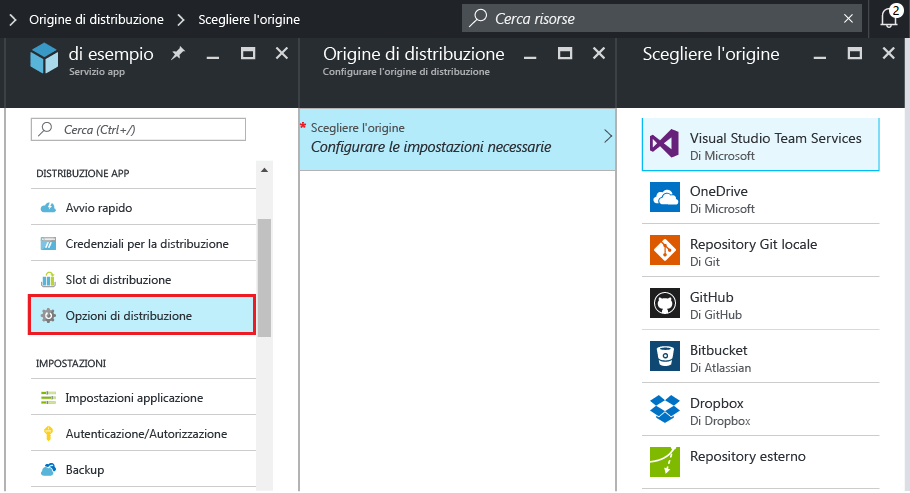
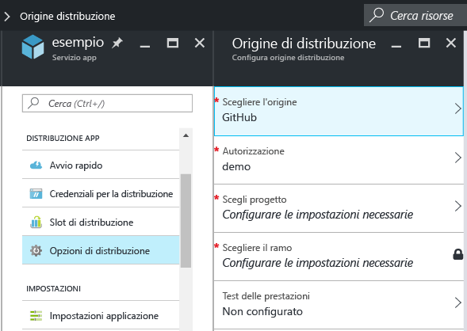
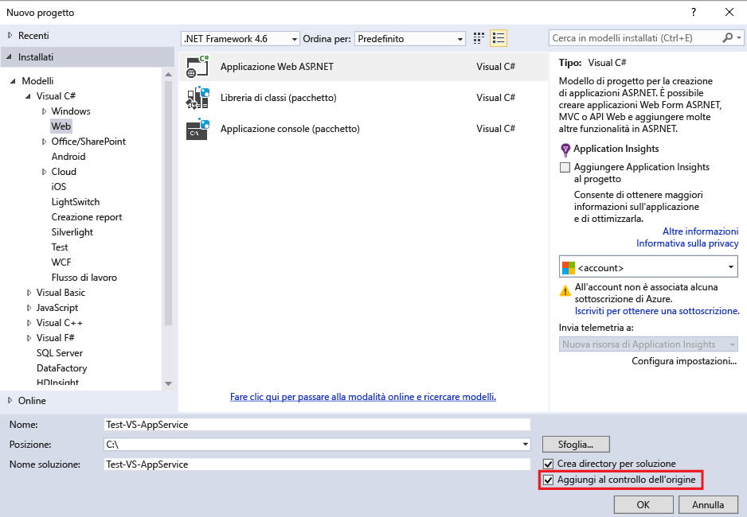
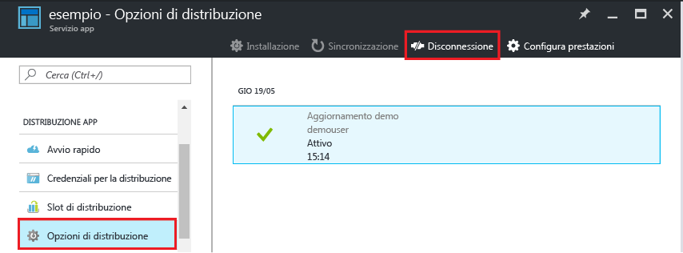

<properties
	pageTitle="Distribuzione continua nel servizio app di Azure | Microsoft Azure"
	description="Informazioni su come abilitare la distribuzione continua nel servizio app di Azure."
	services="app-service"
	documentationCenter=""
	authors="dariagrigoriu"
	manager="wpickett"
	editor="mollybos"/>

<tags
	ms.service="app-service"
	ms.workload="na"
	ms.tgt_pltfrm="na"
	ms.devlang="na"
	ms.topic="article"
	ms.date="07/23/2016"
	ms.author="dariagrigoriu"/>
    
# Distribuzione continua nel servizio app di Azure

Questa esercitazione illustra come configurare un flusso di lavoro di distribuzione continua per l'app del [servizio app di Azure]. L'integrazione del servizio app con BitBucket, GitHub e Visual Studio Team Services (VSTS) consente un flusso di lavoro di distribuzione continua in cui Azure effettua il pull degli aggiornamenti più recenti dal progetto pubblicato in uno di questi servizi. La distribuzione continua è un'ottima opzione per i progetti in cui vengono integrati contributi numerosi e frequenti.

## Abilitare la distribuzione continua

Per abilitare la distribuzione continua,

1. Pubblicare il contenuto dell'app nel repository che verrà utilizzato per la distribuzione continua. Per altre informazioni sulla pubblicazione di progetti in questi servizi, vedere gli articoli relativi a [creazione di repository (GitHub)], [creazione di repository (BitBucket)] e [introduzione a VSTS].

2. Nel pannello dell'app del [portale di Azure] fare clic su **Impostazioni > Origine distribuzione**. Fare clic su **Scegli origine** e quindi su **GitHub**, ad esempio.

	
	
    > [AZURE.NOTE] Per configurare un account VSTS per la distribuzione del servizio app, vedere questa [esercitazione](https://github.com/projectkudu/kudu/wiki/Setting-up-a-VSTS-account-so-it-can-deploy-to-a-Web-App).
    
3. Completare il flusso di lavoro di autorizzazione.

4. Nel pannello **Origine distribuzione** scegliere il progetto e il ramo da cui eseguire la distribuzione. Al termine, fare clic su **OK**.
  
	

	> [AZURE.NOTE] Se si abilita la distribuzione continua con GitHub o BitBucket, verranno visualizzati progetti sia pubblici che privati.

    Il servizio app crea un'associazione con il repository selezionato, effettua il pull in dei file dal ramo specificato e mantiene un clone del repository per l'applicazione del servizio app. Quando si configura la distribuzione continua VSTS dal portale di Azure, l'integrazione usa il [motore di distribuzione Kudu](https://github.com/projectkudu/kudu/wiki) del servizio app, che già automatizza le attività di compilazione e distribuzione in ogni `git push`. Non è necessario configurare separatamente la distribuzione continua in VSTS. Al termine del processo, nella sezione **Distribuzione** del pannello dell'app viene visualizzato un messaggio **Distribuzione attiva** che indica l'esito positivo della distribuzione.

5. Per verificare che l'applicazione sia distribuita correttamente, fare clic sull'**URL** nella parte superiore del pannello dell'app nel portale di Azure.

6. Per verificare che la distribuzione continua sia in corso dal repository scelto, eseguire il push di una modifica al repository. L'app dovrebbe aggiornarsi in base alle modifiche poco dopo il completamento del push nel repository. Per verificare che sia stato eseguito il pull nell'aggiornamento, esaminare il pannello **Distribuzioni** dell'app.

## Distribuzione continua di una soluzione di Visual Studio 

Il push di una soluzione di Visual Studio nel servizio app di Azure è paragonabile al push di un semplice file index.html. Il processo di distribuzione del servizio app semplifica tutti i dettagli, inclusi il ripristino delle dipendenze di NuGet e la compilazione dei file binari dell'applicazione. È possibile seguire le procedure consigliate per il controllo del codice sorgente riguardanti la gestione del codice solo nel repository Git, lasciando che tutte le altre operazioni siano effettuate tramite la distribuzione del servizio app.

La procedura per il push della soluzione di Visual Studio nel servizio app corrisponde a quella descritta nella [sezione precedente](#overview), purché la soluzione e il repository siano configurati come indicato di seguito:

-	Usare l'opzione di controllo del codice sorgente di Visual Studio per creare un file `.gitignore` come nell'immagine seguente oppure aggiungere manualmente il file `.gitignore` nella radice del repository con il contenuto simile a questo [esempio di file .gitignore](https://github.com/github/gitignore/blob/master/VisualStudio.gitignore).

    
 
-	Aggiungere al repository l'intero albero di directory della soluzione, con il file con estensione sln nella radice del repository.

Dopo avere impostato il repository come descritto e avere configurato l'app in Azure per la pubblicazione continua da uno dei repository Git online, sarà possibile sviluppare l'applicazione ASP.NET localmente in Visual Studio e distribuire continuamente il codice con il semplice push delle modifiche al repository Git online.

## Disabilitare la distribuzione continua

Per disabilitare la distribuzione continua,

1. Nel pannello dell'app del [portale di Azure] fare clic su **Impostazioni > Origine distribuzione**. Quindi fare clic su **Disconnetti** nel pannello **Distribuzioni**.

    

2. Dopo aver risposto **Sì** al messaggio di conferma, è possibile tornare al pannello dell'app e fare clic su **Impostazioni > Origine distribuzione** se si desidera impostare la pubblicazione da un'altra origine.

## Risorse aggiuntive

* [How to investigate common issues with continuous deployment](https://github.com/projectkudu/kudu/wiki/Investigating-continuous-deployment) (Come analizzare i problemi comuni di distribuzione continua)
* [Come usare PowerShell per Azure]
* [Come usare gli strumenti da riga di comando di Azure per Mac e Linux]
* [Documentazione su Git]
* [Progetto Kudu](https://github.com/projectkudu/kudu/wiki)

>[AZURE.NOTE] Per iniziare a usare il servizio app di Azure prima di registrarsi per ottenere un account Azure, andare a [Prova il servizio app](http://go.microsoft.com/fwlink/?LinkId=523751), dove è possibile creare un'app Web iniziale temporanea nel servizio app. Non è necessario fornire una carta di credito né impegnarsi in alcun modo.

[servizio app di Azure]: https://azure.microsoft.com/documentation/articles/app-service-changes-existing-services/
[portale di Azure]: https://portal.azure.com
[VSTS Portal]: https://www.visualstudio.com/it-IT/products/visual-studio-team-services-vs.aspx
[Installing Git]: http://git-scm.com/book/en/Getting-Started-Installing-Git
[Come usare PowerShell per Azure]: ../articles/powershell-install-configure.md
[Come usare gli strumenti da riga di comando di Azure per Mac e Linux]: ../articles/xplat-cli-install.md
[Documentazione su Git]: http://git-scm.com/documentation

[creazione di repository (GitHub)]: https://help.github.com/articles/create-a-repo
[creazione di repository (BitBucket)]: https://confluence.atlassian.com/display/BITBUCKET/Create+an+Account+and+a+Git+Repo
[introduzione a VSTS]: https://www.visualstudio.com/get-started/overview-of-get-started-tasks-vs
[Continuous delivery to Azure using Visual Studio Team Services]: ../articles/cloud-services/cloud-services-continuous-delivery-use-vso.md

<!---HONumber=AcomDC_0803_2016-->