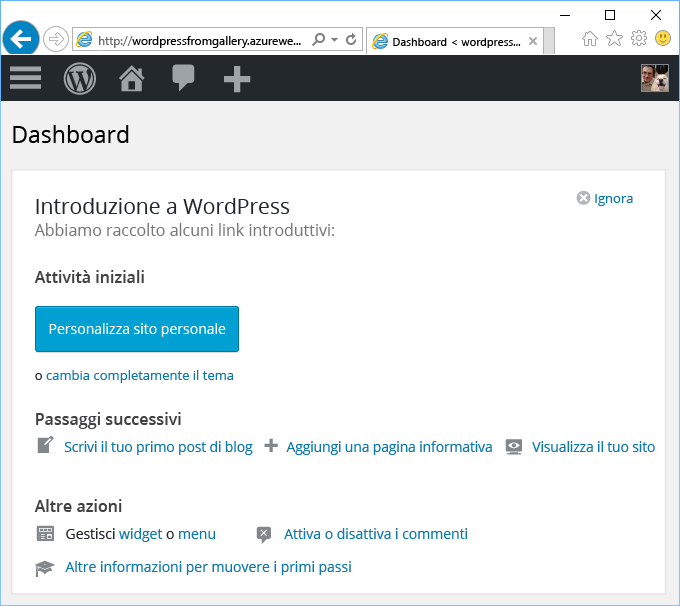

# Creare un'app Web da Azure Marketplace
<!-- Note: This article replaces web-sites-php-web-site-gallery.md -->

[!INCLUDE [tabs](../../includes/app-service-web-get-started-nav-tabs.md)]

Azure Marketplace offre un'ampia gamma di app Web popolari, sviluppate da community di software open source, ad esempio WordPress e Umbraco CMS. In questa esercitazione viene illustrato come creare l'app WordPress da Azure Marketplace,
che consente di creare un'app Web di Azure e un database MySQL. 

## Prima di iniziare 

Se non si ha una sottoscrizione di Azure, creare un [account gratuito](https://azure.microsoft.com/free/?WT.mc_id=A261C142F) prima di iniziare.

## Distribuire da Azure Marketplace
Attenersi alla procedura seguente per distribuire WordPress da Azure Marketplace.

### Accedere ad Azure
Accedere al [Portale di Azure](https://portal.azure.com).

### Distribuire il modello di WordPress
Azure Marketplace offre modelli per la configurazione di risorse. Configurare il modello di [WordPress](https://portal.azure.com/#create/WordPress.WordPress) per iniziare.
   
Immettere le informazioni seguenti per distribuire l'app WordPress e le relative risorse.

  

| Campo         | Valore consigliato           | Descrizione  |
| ------------- |-------------------------|-------------|
| Nome app      | mywordpressapp          | Immettere un nome univoco dell'app per il **nome dell'app Web**. Questo nome viene usato come parte del nome DNS predefinito per l'app `<app_name>.azurewebsites.net`, quindi deve essere univoco per tutte le app in Azure. In un secondo momento è possibile eseguire il mapping di un nome di dominio personalizzato all'app prima di esporla agli utenti |
| Sottoscrizione  | Pagamento in base al consumo             | Selezionare una **Sottoscrizione**. Se sono presenti più sottoscrizioni scegliere quella appropriata. |
| Gruppo di risorse| mywordpressappgroup                 |    Inserire un **gruppo di risorse**. Un gruppo di risorse è un contenitore logico in cui vengono distribuite e gestite risorse di Azure come app Web e database. È possibile creare un gruppo di risorse o usarne uno esistente |
| Piano di servizio app | myappplan          | I piani di servizio app rappresentano la raccolta di risorse fisiche usate per ospitare le app. Selezionare la **posizione** e il **piano tariffario**. Per altre informazioni sul prezzo, vedere il [piano tariffario del servizio app di Azure](https://azure.microsoft.com/pricing/details/app-service/) |
| Database      | mywordpressapp          | Selezionare il provider di database appropriato per MySQL. App Web supporta **ClearDB**, **Database di Azure per MySQL** e **MySQL in-app**. Per ulteriori informazioni, vedere la sezione [Configurazione del database](#database-config) riportata di seguito. |
| Application Insights | ON oppure OFF          | Facoltativo. [Application Insights](https://azure.microsoft.com/en-us/services/application-insights/) offre i servizi di monitoraggio per l'app web facendo clic su **ON**.|

### Configurazione del database
Attenersi alla procedura seguente in base alla scelta del provider del database MySQL.  È consigliabile che sia le App Web che il database MySQL si trovino nello stesso posto.

#### ClearDB 
[ClearDB](https://azuremarketplace.microsoft.com/en-us/marketplace/apps/SuccessBricksInc.ClearDBMySQLDatabase?tab=Overview) è una soluzione di terze parti per un servizio completamente integrato di MySQL in Azure. Per usare i database ClearDB, sarà necessario associare una carta di credito all'[account di Azure](http://account.windowsazure.com/subscriptions). Se si seleziona il provider del database ClearDB, è possibile visualizzare un elenco di database esistenti da cui scegliere o fare clic sul pulsante **Crea nuovo** per creare un database.

#### Database di Azure per MySQL (anteprima)
Il [Database di Azure per MySQL](https://azure.microsoft.com/en-us/services/mysql) offre un servizio di database gestito per lo sviluppo di app e la distribuzione che consente di introdurre un database MySQL in pochi minuti e di ridimensionare in tempo reale nel cloud che si considera più attendibile. Con modelli tariffari inclusivi, è possibile ottenere tutte le funzionalità desiderate come la disponibilità elevata, la protezione e ripristino, predefinito e senza costi aggiuntivi. Fare clic su **Piano tariffario** per scegliere un [piano tariffario](https://azure.microsoft.com/pricing/details/mysql) diverso. Per usare un database esistente o un server MySQL esistente, usare un gruppo di risorse in cui risiede il server. 

> [!NOTE]
>  Il database di Azure per MySQL (anteprima) e App Web su Linux (anteprima) non è disponibile in tutte le aree. Altre informazioni sulle restrizioni di [Database di Azure per MySQL (anteprima)](https://docs.microsoft.com/en-us/azure/mysql) e [App Web in Linux](./app-service-linux-intro.md). 

#### MySQL in-app
[MySQL in-app](https://blogs.msdn.microsoft.com/appserviceteam/2017/03/06/announcing-general-availability-for-mysql-in-app) è una funzionalità del servizio app che consente l'esecuzione di MySQL in modo nativo sulla piattaforma. Funzionalità di base supportate con la versione della funzione:

- Server MySQL in esecuzione nella stessa istanza del server Web che ospita il sito. Questo consente di migliorare le prestazioni dell'applicazione.
- L'archiviazione è condivisa tra i file di MySQL e quelli dell'app Web. Si noti che con piani gratuiti e condivisi, è possibile raggiungere i limiti di quota quando si usa il sito in base alle azioni eseguite. Verificare i [limiti di quota](https://azure.microsoft.com/en-us/pricing/details/app-service/plans/) per i piani gratuiti e condivisi.
- È possibile attivare la registrazione generale per MySQL e quella per le query lente. Si noti che questo può influire sulle prestazioni del sito e NON deve sempre essere ATTIVATO. La funzionalità di registrazione consente di esaminare eventuali problemi dell'applicazione. 

Per altri dettagli, vedere questo [articolo](https://blogs.msdn.microsoft.com/appserviceteam/2016/08/18/announcing-mysql-in-app-preview-for-web-apps/ )

È possibile verificare lo stato facendo clic sull'icona a forma di campana nella parte superiore della pagina del portale durante la distribuzione dell'app WordPress.    

## Gestire la nuova app Web di Azure

Passare al portale di Azure per esaminare l'app Web appena creata.

A tale scopo, accedere a [https://portal.azure.com](https://portal.azure.com).

Nel menu a sinistra fare clic su **Servizi app** e quindi sul nome dell'app Web di Azure.

Si accede così al _pannello_, ovvero una pagina del portale visualizzata in orizzontale, dell'app Web.

Per impostazione predefinita, nel pannello dell'app Web viene aperta la pagina **Panoramica**, che offre una visualizzazione dello stato dell'app. In questa pagina è anche possibile eseguire attività di gestione di base come esplorare, arrestare, avviare, riavviare ed eliminare. Le schede sul lato sinistro del pannello mostrano le diverse pagine di configurazione che è possibile aprire.

Queste schede del pannello mostrano le numerose utili funzionalità che è possibile aggiungere all'app Web. Nell'elenco seguente sono riportate solo alcune delle possibilità:

* Eseguire il mapping di un nome DNS personalizzato
* Associare un certificato SSL personalizzato
* Configurare la distribuzione continua
* Aumentare le prestazioni e il numero di istanze
* Aggiungere l'autenticazione utente

Completare l'installazione guidata di 5 minuti di WordPress per attivare l'app WordPress e consentirne l'esecuzione. Verificare la [documentazione di WordPress](https://codex.WordPress.org/) per sviluppare l'app Web.

## Configurazione dell'app 
Prima che l'app WordPress sia pronta per la produzione, è necessario seguire diversi passaggi. Seguire questa procedura per configurare e gestire l'app WordPress:

| Per | Opzione |
| --- | --- |
| **Caricare o archiviare file di grandi dimensioni** |[Plug-in di WordPress per l'uso dell'archiviazione BLOB](https://wordpress.org/plugins/windows-azure-storage/)|
| **Inviare posta elettronica** |Acquistare il sevizio di posta elettronica [SendGrid](https://azuremarketplace.microsoft.com/en-us/marketplace/apps/SendGrid.SendGrid?tab=Overview) e usare il [plug-in di WordPress per l'uso di SendGrid](https://wordpress.org/plugins/sendgrid-email-delivery-simplified/) per configurarlo|
| **Nomi di dominio personalizzati** |[Configurare un nome di dominio personalizzato nel servizio app di Azure](app-service-web-tutorial-custom-domain.md) |
| **HTTPS** |[Abilitare HTTPS per un'app Web nel Servizio app di Azure](app-service-web-tutorial-custom-ssl.md) |
| **Convalida di preproduzione** |[Configurare ambienti di staging e sviluppo per le app Web nel servizio app di Azure](web-sites-staged-publishing.md)|
| **Monitoraggio e risoluzione dei problemi** |[Abilitare la registrazione diagnostica per le app Web nel Servizio app di Azure](web-sites-enable-diagnostic-log.md) e [monitorare le app Web nel Servizio app di Azure](app-service-web-tutorial-monitoring.md) |
| **Distribuire il sito** |[Distribuire un'app Web nel Servizio app di Azure](app-service-deploy-local-git.md) |

## Proteggere la rete virtuale 
Prima che l'app WordPress sia pronta per la produzione, è necessario seguire diversi passaggi. Seguire questa procedura per configurare e gestire l'app WordPress:

| Per | Opzione |
| --- | --- |
| **Nome utente e password complessi**|  Modificare la password di frequente. Non usare nomi utente comuni come *admin* o *wordpress* e così via. Imporre a tutti gli utenti di WordPress di usare password complesse e nomi utente univoci. |
| **Mantenersi aggiornati** | Aggiornare plug-in, core e temi di WordPress. Usare il runtime PHP più recente disponibile nel Servizio app di Azure |
| **Aggiornare le chiavi di sicurezza di WordPress** | Aggiornare la [chiave di sicurezza di WordPress](https://codex.wordpress.org/Editing_wp-config.php#Security_Keys) per migliorare la crittografia memorizzata nei cookie|

## Migliorare le prestazioni
Le prestazioni nel cloud si ottengono prevalentemente tramite la memorizzazione nella cache e l'aumento delle istanze. È tuttavia necessario considerare anche la memoria, la larghezza di banda e altri attributi dell'hosting delle app Web.

| Per | Opzione |
| --- | --- |
| **Identificare le funzionalità delle istanze del servizio app** |[Dettagli sui prezzi, incluse le funzionalità dei livelli del Servizio app](https://azure.microsoft.com/en-us/pricing/details/app-service/)|
| **Memorizzare risorse nella cache** |Usare [Cache Redis di Azure](https://azure.microsoft.com/en-us/services/cache/) o una delle altre offerte di memorizzazione nella cache disponibili in [Azure Store](https://azuremarketplace.microsoft.com) |
| **Scalare l'applicazione** |È necessario ridimensionare [l'app Web nel Servizio app di Azure](web-sites-scale.md) e/o il database MySQL. MySQL in-app non supporta la scalabilità orizzontale, quindi scegliere ClearDB o il database di Azure per MySQL (anteprima). [Ridimensionare il database di Azure per MySQL (anteprima)](https://azure.microsoft.com/en-us/pricing/details/mysql/) se si usa il [routing a disponibilità elevata di ClearDB](http://w2.cleardb.net/faqs/) per aumentare le prestazioni del database |

## Disponibilità e ripristino di emergenza
La disponibilità elevata include l'aspetto del ripristino di emergenza per mantenere la continuità aziendale. Nei piani predisposti per gli errori e le emergenze nel cloud è necessario rilevare rapidamente gli errori. Queste soluzioni consentono di implementare una strategia di disponibilità elevata.

| Per | Opzione |
| --- | --- |
| **Bilanciare il carico dei siti** o **distribuire geograficamente i siti** |[Instradare il traffico con Gestione traffico di Azure](https://azure.microsoft.com/en-us/services/traffic-manager/) |
| **Backup e ripristino** |[Eseguire il backup di un'app Web nel Servizio app di Azure](web-sites-backup.md) e [ripristinare un'app Web nel Servizio app di Azure](web-sites-restore.md) |

## Passaggi successivi
Informazioni sulle diverse funzionalità di [servizio app per sviluppare e ridimensionare](/app-service-web/).
