# Aggiungere funzionalità alla prima app Web
In [Distribuire la prima app Web in Azure in cinque minuti](app-service-web-get-started-cli-nodejs.md) è stata distribuita un'app Web di esempio nel [Servizio app di Azure](../app-service/app-service-value-prop-what-is.md). In questo articolo viene illustrato come aggiungere rapidamente alcune funzionalità utili all'app Web distribuita. In pochi minuti sarà possibile eseguire queste operazioni:

* Applicare l'autenticazione per gli utenti
* Ridimensionare automaticamente l'app
* Ricevere avvisi sulle prestazioni dell'app

Indipendentemente dall'app di esempio distribuita nell'articolo precedente, è possibile eseguire le procedure riportate nell'esercitazione.

Le tre attività in questa esercitazione sono solo alcuni esempi delle molte funzionalità utili disponibili quando si inserisce l'app Web nel servizio app. Molte funzionalità sono disponibili nel livello **Gratuito** , ovvero il livello su cui è in esecuzione la prima app Web, ed è anche possibile usare i crediti della versione di valutazione per provare a usare altre funzionalità che richiedono piani tariffari superiori. L'app Web rimane nel livello **Gratuito** , a meno che non si scelga esplicitamente di passare a un piano tariffario diverso.

> [!NOTE]
> L'app Web creata con l'interfaccia della riga di comando di Azure è in esecuzione nel livello **Gratuito** , che consente solo un'istanza di macchina virtuale condivisa con quote di risorse. Per altre informazioni sulle risorse disponibili nel livello **Gratuito** , vedere [Limiti relativi al servizio app](../azure-subscription-service-limits.md#app-service-limits).
> 
> 

## Autenticare gli utenti
Come verrà illustrato, l'aggiunta di autenticazione all'app è molto semplice. Per altre informazioni, vedere il post di blog sull'[autenticazione/autorizzazione del servizio app](https://azure.microsoft.com/blog/announcing-app-service-authentication-authorization/).

1. Nel pannello del portale per l'app appena aperto fare clic su **Impostazioni** > **Autenticazione/Autorizzazione**.  
    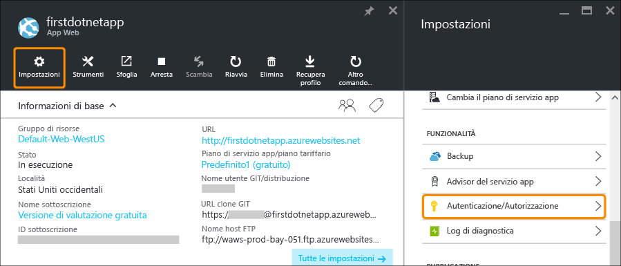
2. Fare clic su **Sì** per attivare l'autenticazione.  
3. In **Provider di autenticazione** fare clic su **Azure Active Directory**.  
    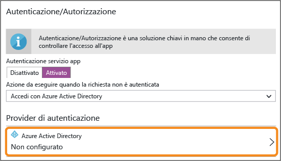
4. Nel pannello **Impostazioni di Azure Active Directory** fare clic su **Rapide**, quindi fare clic su **OK**. Le impostazioni predefinite creano una nuova applicazione Azure AD nella directory predefinita.  
    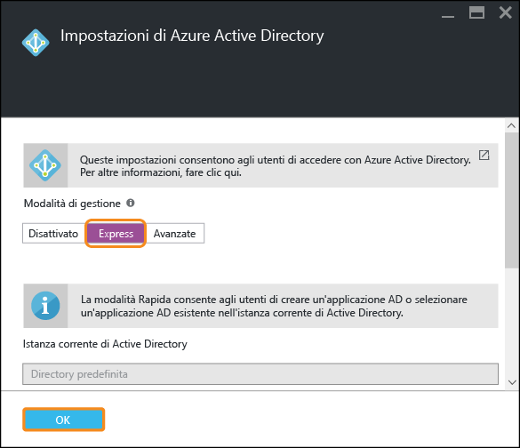
5. Fare clic su **Salva**.  
    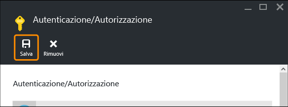
   
    Una volta applicata la modifica, l'icona a forma di campanella diventerà verde e verrà visualizzato un messaggio descrittivo.
6. Nel pannello del portale dell'app fare clic sul collegamento **URL** o su **Esplora** nella barra dei menu. Il collegamento è un indirizzo HTTP.  
    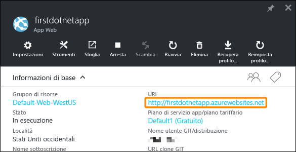  
    Dopo che l'app è stata aperta in una nuova scheda, nella casella URL vengono visualizzati diversi reindirizzamenti finché l'app passa infine a un indirizzo HTTPS. A questo punto si è già eseguito l'accesso alla sottoscrizione di Azure e si viene autenticati automaticamente nell'app.  
    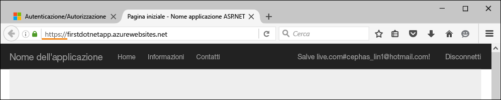  
    Se quindi si apre una sessione non autenticata in un browser diverso, verrà visualizzata una schermata di accesso quando si passa allo stesso URL.  
    <!-- 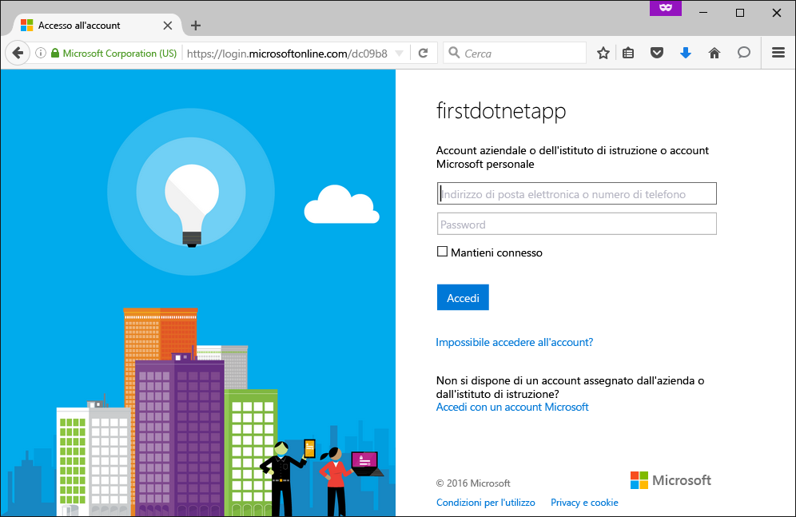  -->
    Se non si è mai usato Azure Active Directory, è possibile che la directory predefinita non includa utenti di Azure AD. In tal caso, l'unico account presente è probabilmente l'account Microsoft con la sottoscrizione di Azure. È per questo che prima è stato automaticamente eseguito l'accesso all'app nello stesso browser.
   È possibile usare lo stesso account Microsoft anche per accedere a questa pagina di accesso.

Verrà eseguita l'autenticazione di tutto il traffico diretto all'app Web.

Si sarà notato che nel pannello **Autenticazione/Autorizzazione** è possibile eseguire diverse altre operazioni, ad esempio:

* Abilitare l'accesso dai social network
* Abilitare più opzioni di accesso
* Modificare il comportamento predefinito quando gli utenti accedono per la prima volta all'app

Poiché il servizio app offre una soluzione pronta all'uso per alcune comuni esigenze di autenticazione, non è necessario fornire la logica di autenticazione.
Per altre informazioni, vedere la pagina relativa all' [autenticazione/autorizzazione del servizio app](https://azure.microsoft.com/blog/announcing-app-service-authentication-authorization/).

## Ridimensionare automaticamente l'app in base alla richiesta
È ora possibile ridimensionare automaticamente l'app in modo che la relativa capacità venga adeguata automaticamente alla richiesta degli utenti. Per altre informazioni, vedere [Aumentare le prestazioni di un'app in Azure](web-sites-scale.md) e [Ridimensionare il numero delle istanze manualmente o automaticamente](../monitoring-and-diagnostics/insights-how-to-scale.md).

In breve, è possibile ridimensionare l'app Web in due modi:

* [Aumentare le prestazioni](https://en.wikipedia.org/wiki/Scalability#Horizontal_and_vertical_scaling): è possibile ottenere più CPU, memoria, spazio su disco e altre funzionalità, ad esempio macchine virtuali dedicate, domini e certificati personalizzati, slot di staging, ridimensionamento automatico e altro ancora. È possibile aumentare le prestazioni cambiando il piano tariffario del piano di servizio app a cui appartiene l'app.
* [Aumentare il numero di istanze](https://en.wikipedia.org/wiki/Scalability#Horizontal_and_vertical_scaling): è possibile incrementare il numero di istanze di macchine virtuali che eseguono l'app.
  È possibile specificare al massimo 50 istanze, in base al piano tariffario.

Verrà ora configurato il ridimensionamento automatico.

1. Prima di tutto si passerà a un piano superiore per abilitare il ridimensionamento automatico. Nel pannello dell'app nel portale fare clic su **Impostazioni** > **Aumenta prestazioni (piano di servizio app)**.  
    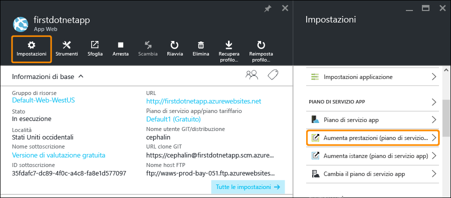
2. Scorrere e selezionare il piano **Standard S1**, ovvero il piano minimo che supporta il ridimensionamento automatico, cerchiato nello screenshot, quindi fare clic su **Seleziona**.  
    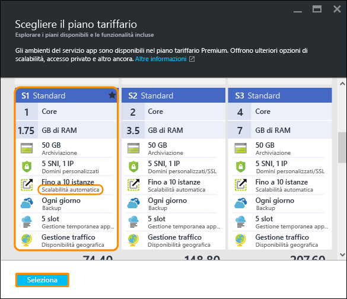
   
    Il passaggio a un piano superiore è stato completato.
   
   > [!IMPORTANT]
   > Questo piano esaurisce i crediti associati alla versione di valutazione gratuita. Se è disponibile un account a pagamento in base al consumo, la tariffa viene addebitata sull'account.
   > 
   > 
3. Ora verrà configurato il ridimensionamento automatico. Nel pannello dell'app nel portale fare clic su **Impostazioni** > **Aumenta istanze (piano di servizio app)**.  
    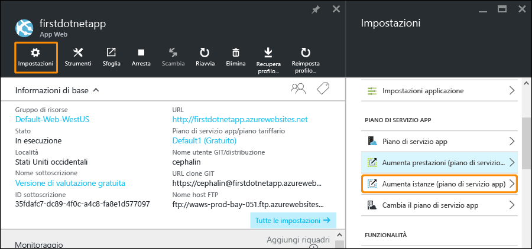
4. Impostare **Ridimensiona di** su **Percentuale CPU**. I dispositivi di scorrimento sotto l'elenco a discesa vengono aggiornati di conseguenza. Definire quindi un intervallo di **Istanze** compreso tra **1** e **2** e un **Intervallo di destinazione** compreso tra **40** e **80**. A questo scopo, digitare i valori nelle caselle o spostare i dispositivi di scorrimento.  
    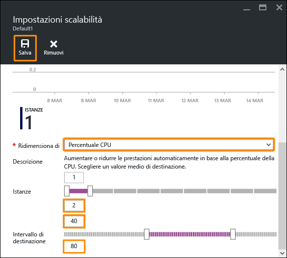
   
    In base a questa configurazione, l'app aumenta automaticamente il numero di istanze quando l'utilizzo della CPU supera l'80% e lo riduce quando l'utilizzo della CPU scende sotto il 40%.
5. Fare clic su **Salva** nella barra dei menu.

Il ridimensionamento automatico dell'app è stato completato.

Si sarà notato che nel pannello **Impostazioni scalabilità** è possibile eseguire diverse altre operazioni, ad esempio:

* Ridimensionare manualmente in base a un numero specifico di istanze
* Ridimensionare in base ad altre metriche delle prestazioni, ad esempio la percentuale di memoria o la coda del disco
* Personalizzare il comportamento del ridimensionamento quando viene attivata una regola per le prestazioni
* Ridimensionare automaticamente in base a una pianificazione
* Impostare il comportamento del ridimensionamento automatico per un evento futuro

Per altre informazioni sul passaggio dell'app a un piano superiore, vedere [Aumentare le prestazioni di un'app in Azure](web-sites-scale.md). Per altre informazioni sull'aumento del numero di istanze, vedere [Ridimensionare il conteggio delle istanze manualmente o automaticamente](../monitoring-and-diagnostics/insights-how-to-scale.md).

## Ricevere avvisi per l'app
Ora che l'app è configurata per il ridimensionamento automatico, che cosa accade quando raggiunge il numero massimo di istanze (2) e la CPU supera il livello di utilizzo impostato (80%)?
È possibile configurare un avviso che informi di questa situazione per poter passare a un piano ancora superiore per l'app, ad esempio. Per altre informazioni, vedere [Ricevere notifiche di avviso](../monitoring-and-diagnostics/insights-receive-alert-notifications.md). Ora verrà rapidamente configurato un avviso per questo scenario.

1. Nel pannello dell'app nel portale fare clic su **Strumenti** > **Avvisi**.  
    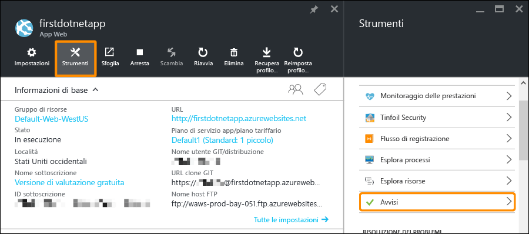
2. Fare clic su **Aggiungi avviso**. Quindi nella casella **Risorsa** selezionare la risorsa che termina con **(serverfarms)**. Questo è il piano di servizio app.  
    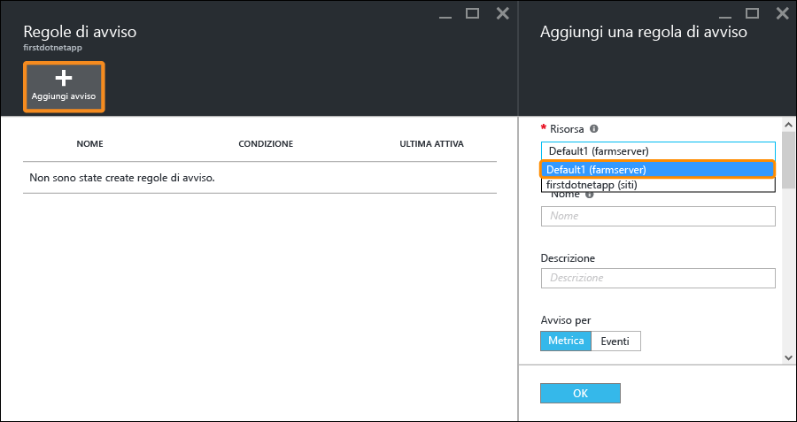
3. In **Nome** specificare `CPU Maxed`, in **Metrica** specificare **Percentuale CPU** e in **Soglia** specificare `90`, quindi selezionare **Invia messaggio di posta elettronica a proprietari, collaboratori e lettori** e infine fare clic su **OK**.   
    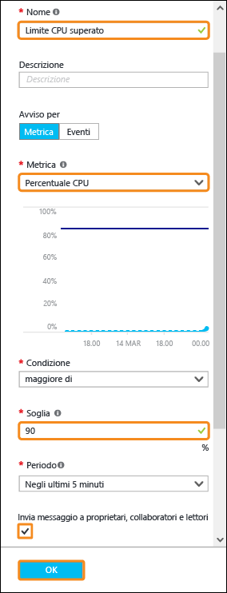
   
    Quando Azure termina di creare l'avviso, sarà possibile visualizzarlo nel pannello **Avvisi** .  
    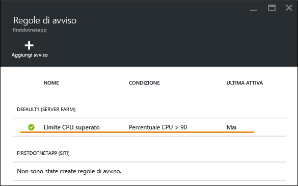

Ora è possibile ricevere gli avvisi.

Questa impostazione degli avvisi controlla l'utilizzo della CPU ogni cinque minuti. Se tale valore supera il 90%, si riceverà un avviso di posta elettronica, come chiunque altro sia autorizzato. Per visualizzare tutte le persone autorizzate a ricevere gli avvisi, tornare al pannello dell'app nel portale e fare clic sul pulsante **Accesso** .  
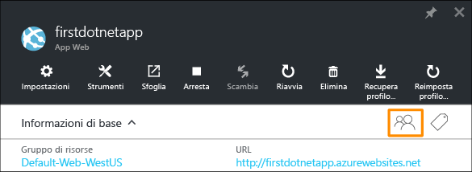

Verificare che gli **amministratori della sottoscrizione** siano già **proprietari** dell'app. Questo gruppo includerà anche l'amministratore account della sottoscrizione di Azure (ad esempio, la sottoscrizione di valutazione). Per altre informazioni sul controllo degli accessi in base al ruolo di Azure, vedere [Controllo degli accessi in base al ruolo di Azure](../active-directory/role-based-access-control-configure.md).

> [!NOTE]
> Regole di avviso è una funzionalità di Azure. Per altre informazioni, vedere [Ricevere notifiche di avviso](../monitoring-and-diagnostics/insights-receive-alert-notifications.md).
> 
> 

## Passaggi successivi
Durante la configurazione dell'avviso, nel pannello **Strumenti** è disponibile un set completo di strumenti, dove è possibile risolvere problemi, monitorare le prestazioni, testare le vulnerabilità, gestire le risorse, interagire con la console VM e aggiungere utili estensioni. Per scoprire quali funzionalità semplici, ma avanzate, siano disponibili, fare clic su ognuno di questi strumenti.

Con l'app distribuita è possibile eseguire altre operazioni. Ecco un elenco parziale:

* [Acquistare e configurare un nome di dominio personalizzato](custom-dns-web-site-buydomains-web-app.md) : è possibile acquistare un dominio accattivante per l'app Web invece del dominio *.azurewebsites.net. In alternativa, è possibile usare un dominio già disponibile.
* [Configurare gli ambienti di staging](web-sites-staged-publishing.md): è possibile distribuire l'app in un URL di staging prima del passaggio in produzione, aggiornare l'app Web live in modo affidabile e configurare una soluzione DevOps complessa con più slot di distribuzione.
* [Configurare la distribuzione continua](app-service-continuous-deployment.md): è possibile integrare lo sviluppo di app nel sistema di controllo del codice sorgente ed eseguire la distribuzione in Azure con ogni commit.
* [Accedere alle risorse locali](web-sites-hybrid-connection-get-started.md) : è possibile accedere a un database locale esistente o a un sistema CRM.
* [Eseguire il backup dell'app](web-sites-backup.md): è possibile configurare il backup e il ripristino per l'app Web e prepararsi a errori imprevisti ed eseguire il ripristino da tali errori.
* [Abilitare i log di diagnostica](web-sites-enable-diagnostic-log.md) : è possibile leggere i log IIS da tracce di Azure o dell'applicazione. È possibile leggerli in un flusso, scaricarli o trasferirli in [Application Insights](../application-insights/app-insights-overview.md) per un'analisi pronta all'uso.
* [Analizzare l'app per cercare vulnerabilità:](https://azure.microsoft.com/blog/web-vulnerability-scanning-for-azure-app-service-powered-by-tinfoil-security/) -
   è possibile analizzare l'app Web per cercare minacce attuali mediante il servizio fornito da [Tinfoil Security](https://www.tinfoilsecurity.com/).
* [Eseguire processi in background](../azure-functions/functions-overview.md) : è possibile eseguire processi per l'elaborazione di dati, la creazione di report e così via.
* [Conoscere il funzionamento del servizio app](../app-service/app-service-how-works-readme.md)

<!--HONumber=Jan17_HO4-->

