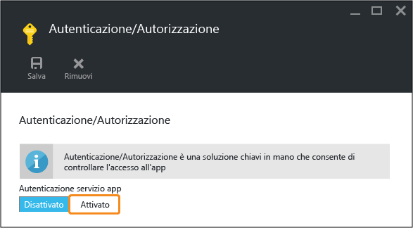

<properties 
	pageTitle="Introduzione alle app Web in Servizio app di Azure - Parte 2" 
	description="Aggiungere importanti funzionalità operative all'app Web nel servizio app con pochi clic." 
	services="app-service\web"
	documentationCenter=""
	authors="cephalin" 
	manager="wpickett" 
	editor="" 
/>

<tags 
	ms.service="app-service-web" 
	ms.workload="web" 
	ms.tgt_pltfrm="na" 
	ms.devlang="na" 
	ms.topic="hero-article"
	ms.date="03/17/2016" 
	ms.author="cephalin"
/>

# Introduzione a Servizio app di Azure - Parte 2

Nell'[introduzione al servizio app di Azure](app-service-web-get-started.md) è stata distribuita un'app Web nel servizio app di Azure. In questo articolo viene illustrato come aggiungere rapidamente alcune importanti funzionalità all'app distribuita. Il servizio app fornisce alle app di qualità funzionalità di livello aziendale che permettono di soddisfare esigenze pratiche di sicurezza, scalabilità, prestazioni, gestione e così via.

In pochi clic si apprenderà come:

- Applicare l'autenticazione per gli utenti
- Ridimensionare automaticamente l'app
- Ricevere avvisi sulle prestazioni dell'app

Indipendentemente dall'app di esempio distribuita nell'articolo precedente, è possibile eseguire le procedure riportate nell'esercitazione.

## Autenticare gli utenti

Verrà ora illustrato come sia facile aggiungere l'autenticazione all'app.

1. Nel pannello del portale per l'app appena aperto fare clic su **Impostazioni** > **Autenticazione/Autorizzazione**. 
    
2. Fare clic su **Attiva** per attivare l'autenticazione. 
    
4. In **Provider di autenticazione** fare clic su **Azure Active Directory**. 

5. Nel pannello **Impostazioni di Azure Active Directory** fare clic su **Rapide**, quindi fare clic su **OK**. Le impostazioni predefinite creano una nuova applicazione Azure AD nella directory predefinita. 

6. Fare clic su **Salva**. 

    Una volta applicata la modifica, l'icona a forma di campanella diventerà verde e verrà visualizzato un messaggio descrittivo.

7. Nel pannello del portale dell'app fare clic sul collegamento **URL** (o su **Esplora** nella barra dei menu). Il collegamento è un indirizzo HTTP.  Dopo che l'app è stata aperta in una nuova scheda, nella casella URL vengono visualizzati diversi reindirizzamenti finché l'app passa infine a un indirizzo HTTPS. A questo punto si è già eseguito l'accesso alla sottoscrizione di Azure e si viene autenticati automaticamente nell'app.  Se quindi ora si apre una sessione non autenticata in un altro browser, quando si passa allo stesso URL, verrà visualizzata una schermata di accesso:  Se non è mai stata eseguita alcuna operazione con Azure Active Directory, è possibile che la directory predefinita non includa alcun utente di Azure AD. In tal caso, l'unico account presente è probabilmente l'account Microsoft con la sottoscrizione di Azure. È per questo che prima è stato automaticamente eseguito l'accesso all'app nello stesso browser. È possibile usare lo stesso account Microsoft anche per accedere a questa pagina di accesso.

Verrà eseguita l'autenticazione di tutto il traffico diretto al sito.

Si sarà notato che nel pannello **Autenticazione/Autorizzazione** è possibile eseguire diverse altre operazioni, ad esempio:

- Abilitare l'accesso dai social network
- Abilitare più opzioni di accesso
- Modificare il comportamento predefinito quando gli utenti accedono per la prima volta all'app

Poiché il servizio app offre una soluzione pronta all'uso per alcune comuni esigenze di autenticazione, non è necessario fornire la logica di autenticazione. Per altre informazioni, vedere la pagina relativa all'[autenticazione/autorizzazione del servizio app](/blog/announcing-app-service-authentication-authorization/).

## Passare a un piano superiore e aumentare il numero di istanze per l'app

Ora l'app verrà ridimensionata. È possibile ridimensionare l'app del servizio app in due modi:

- [Passare a un piano superiore](https://en.wikipedia.org/wiki/Scalability#Horizontal_and_vertical_scaling): quando si passa a un piano superiore per un'app del servizio app, si modifica il piano tariffario. Il passaggio a un piano superiore offre più CPU, più memoria e più spazio su disco. Offre anche funzionalità aggiuntive, come macchine virtuali dedicate, ridimensionamento automatico, disponibilità pari al 99,95%, certificati e domini personalizzati, slot di distribuzione, backup e così via. I piani di livello superiore offrono altre funzionalità all'app del servizio app.  
- [Aumentare il numero di istanze](https://en.wikipedia.org/wiki/Scalability#Horizontal_and_vertical_scaling): quando si aumenta il numero di istanze di un'app del servizio app, si modifica il numero di istanze di VM in cui viene eseguita l'app (o le app nello stesso piano di servizio app). Con il piano Standard o superiore, è possibile abilitare il ridimensionamento automatico delle istanze di VM in base alla metrica delle prestazioni. 

Verrà ora configurato il ridimensionamento automatico per l'app.

1. Prima di tutto si passerà a un piano superiore per abilitare il ridimensionamento automatico. Nel pannello dell'app nel portale fare clic su **Impostazioni** > **Aumenta prestazioni**. 

2. Scorrere e selezionare il piano **S1 Standard**, ovvero il piano minimo che supporta il ridimensionamento automatico (cerchiato nello screenshot), quindi fare clic su **Seleziona**. 

    Il passaggio a un piano superiore è stato completato.
    
    >[AZURE.IMPORTANT] Questo piano esaurisce i crediti associati alla versione di valutazione gratuita. Se è disponibile un account a pagamento in base al consumo, la tariffa viene addebitata sull'account.
    
3. Ora verrà configurato il ridimensionamento automatico. Nel pannello dell'app nel portale fare clic su **Impostazioni** > **Aumenta istanze**. 

4. Impostare **Ridimensiona di** su **Percentuale CPU**. I dispositivi di scorrimento sotto l'elenco a discesa vengono aggiornati di conseguenza. Definire quindi un intervallo di **Istanze** compreso tra **1** e **2** e un **Intervallo di destinazione** compreso tra **40** e **80**. A questo scopo, digitare i valori nelle caselle o spostare i dispositivi di scorrimento. 
    
    In base a questa configurazione, l'app aumenta automaticamente il numero di istanze quando l'utilizzo della CPU supera l'80% e lo riduce quando l'utilizzo della CPU scende sotto il 40%.
    
5. Fare clic su **Salva** nella barra dei menu.

Il ridimensionamento automatico dell'app è stato completato.

Si sarà notato che nel pannello **Impostazioni scalabilità** è possibile eseguire diverse altre operazioni, ad esempio:

- Ridimensionare manualmente in base a un numero specifico di istanze
- Ridimensionare in base ad altre metriche delle prestazioni, ad esempio la percentuale di memoria o la coda del disco
- Personalizzare il comportamento del ridimensionamento quando viene attivata una regola per le prestazioni
- Ridimensionare automaticamente in base a una pianificazione
- Impostare il comportamento del ridimensionamento automatico per un evento futuro

Per altre informazioni sul passaggio dell'app a un piano superiore, vedere [Ridimensionare il piano tariffario nel servizio app di Azure](../app-service/app-service-scale.md). Per altre informazioni sull'aumento del numero di istanze, vedere [Ridimensionare il conteggio delle istanze manualmente o automaticamente](../azure-portal/insights-how-to-scale.md).

## Ricevere avvisi per l'app

Ora che l'app è configurata per il ridimensionamento automatico, che cosa accade quando raggiunge il numero massimo di istanze (2) e la CPU supera il livello di utilizzo impostato (80%)? È possibile configurare un avviso che informi di questa situazione per poter passare a un piano ancora superiore per l'app, ad esempio. Ora verrà rapidamente configurato un avviso per questo scenario.

1. Nel pannello dell'app nel portale fare clic su **Strumenti** > **Avvisi**. 

2. Fare clic su **Aggiungi avviso**. Quindi nella casella **Risorsa** selezionare la risorsa che termina con **(serverfarms)**. Questo è il piano di servizio app. 

3. In **Nome** specificare `CPU Maxed`, in **Metrica** specificare **Percentuale CPU** e in **Soglia** specificare `90`, quindi selezionare **Invia messaggio a proprietari, collaboratori e lettori** e infine fare clic su **OK**. 
    
    Quando Azure termina di creare l'avviso, sarà possibile visualizzarlo nel pannello **Avvisi**. 

Ora è possibile ricevere gli avvisi.

Questa impostazione degli avvisi controlla l'utilizzo della CPU ogni cinque minuti. Se tale valore supera il 90%, si riceverà un avviso di posta elettronica, come chiunque altro sia autorizzato. Per visualizzare tutte le persone autorizzate a ricevere gli avvisi, tornare al pannello dell'app nel portale e fare clic sul pulsante **Accesso**. 

Si noterà che **Amministratori della sottoscrizione** è già impostato come **Proprietario** dell'app. Questo gruppo includerà anche l'amministratore account della sottoscrizione di Azure (ad esempio, la sottoscrizione di valutazione). Per altre informazioni sul controllo degli accessi in base al ruolo di Azure, vedere [Controllo degli accessi in base al ruolo di Azure](../active-directory/role-based-access-control-configure.md).

## Passaggi successivi

Durante la configurazione dell'avviso, è possibile che nel pannello **Strumenti** si sia notato un set completo di strumenti, dove è possibile risolvere problemi, monitorare le prestazioni, testare le vulnerabilità, gestire le risorse, interagire con la console VM e aggiungere utili estensioni. Per scoprire quali funzionalità semplici, ma avanzate, siano disponibili, fare clic su ognuno di questi strumenti.

Con l'app distribuita è possibile eseguire altre operazioni. Ecco un elenco parziale:

- [Acquistare e configurare un nome di dominio personalizzato](custom-dns-web-site-buydomains-web-app.md)
- [Configurare ambienti di staging](web-sites-staged-publishing.md)
- [Configurare la distribuzione continua](web-sites-publish-source-control.md)
- [Eseguire il backup dell'app](web-sites-backup.md)
- [Abilitare i log di diagnostica](web-sites-enable-diagnostic-log.md)
- [Accedere alle risorse locali](web-sites-hybrid-connection-get-started.md)
- [Conoscere il funzionamento del servizio app](../app-service/app-service-how-works-readme.md) 

<!----HONumber=AcomDC_0420_2016-->