# <a name="create-your-first-aspnet-web-app-in-azure-in-five-minutes"></a>Creare la prima app Web ASP.NET in Azure in cinque minuti

[!INCLUDE [app-service-web-selector-get-started](../../includes/app-service-web-selector-get-started.md)] 

Questa guida introduttiva illustra come distribuire la prima app Web ASP.NET nel [servizio app di Azure](../app-service/app-service-value-prop-what-is.md) in pochi minuti. Al termine, sarà disponibile una semplice app Web in esecuzione nel cloud.

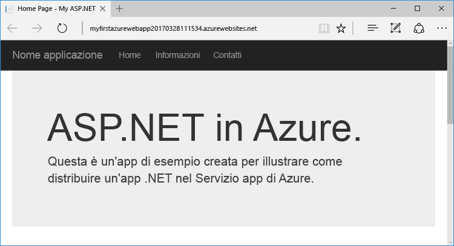

## <a name="before-you-begin"></a>Prima di iniziare

Questa esercitazione illustra come usare Visual Studio 2017 per compilare e distribuire un'app Web ASP.NET in Azure. Se Visual Studio 2017 non è ancora installato, è possibile scaricare e usare la versione **gratuita** [Visual Studio 2017 Community Edition](https://www.visualstudio.com/downloads/). Durante l'installazione di Visual Studio abilitare **Sviluppo di Azure**.

[!INCLUDE [quickstarts-free-trial-note](../../includes/quickstarts-free-trial-note.md)]

## <a name="create-an-aspnet-web-app"></a>Creare un'app Web ASP.NET

In Visual Studio creare un nuovo progetto con `Ctrl`+`Shift`+`N`.

Nella finestra di dialogo **Nuovo progetto** fare clic su **Visual C# > Web > Applicazione Web ASP.NET (.NET Framework)**.

Assegnare all'applicazione il nome **myFirstAzureWebApp** e fare clic su **OK**.
   
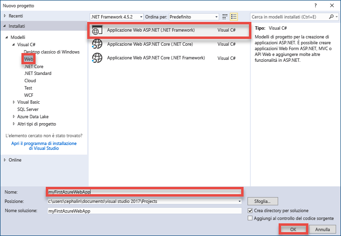

È possibile distribuire qualsiasi tipo di app Web ASP.NET in Azure. Per questa esercitazione, selezionare il modello **MVC** e verificare che l'autenticazione sia impostata su **Nessuna autenticazione**.
      
Fare clic su **OK**.

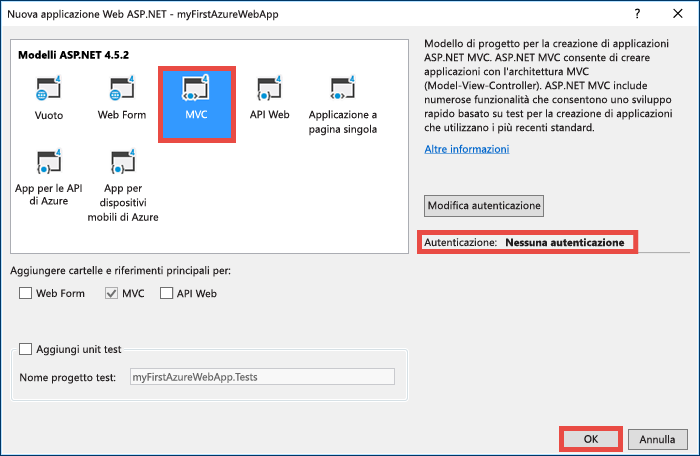

## <a name="publish-to-azure"></a>Pubblicazione in Azure

In **Esplora soluzioni** fare clic con il pulsante destro del mouse sul progetto **myFirstAzureWebApp** e scegliere **Pubblica**.

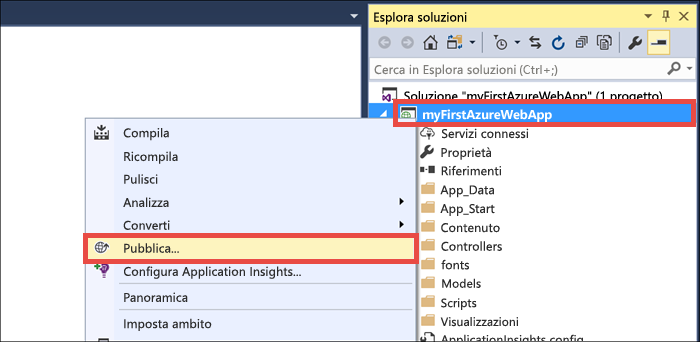

Verificare che **Servizio app di Microsoft Azure** sia selezionato e fare clic su **Pubblica**.

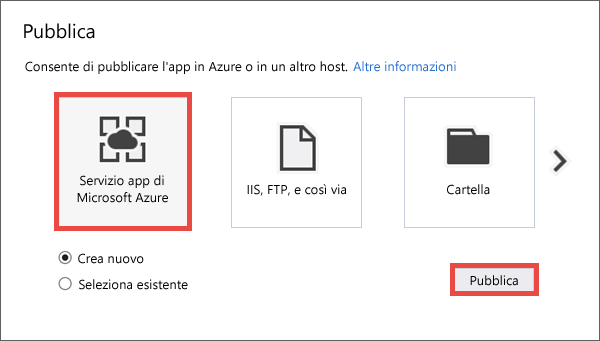

Si apre la finestra di dialogo **Crea servizio app**, che consente di creare tutte le risorse di Azure necessarie per eseguire l'app Web ASP.NET in Azure.

## <a name="sign-in-to-azure"></a>Accedere ad Azure

Nella finestra di dialogo **Crea servizio App** fare clic su **Aggiungi un account** e quindi accedere alla sottoscrizione di Azure. Se si è già connessi a un account Microsoft, verificare che l'account contenga la sottoscrizione di Azure. Se l'account Microsoft a cui si è connessi non include la sottoscrizione di Azure, fare clic su di esso per aggiungere l'account corretto.
   
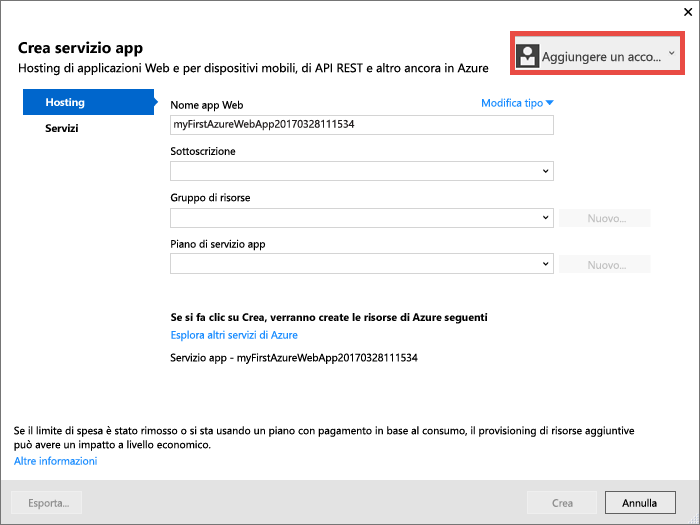

Dopo avere eseguito l'accesso, è possibile creare tutte le risorse necessarie per l'app Web di Azure in questa finestra di dialogo.

## <a name="create-a-resource-group"></a>Creare un gruppo di risorse

Per prima cosa, è necessario un _gruppo di risorse_. 

> [!NOTE] 
> Un gruppo di risorse è un contenitore logico in cui vengono distribuite e gestite risorse di Azure come app Web, database e account di archiviazione.
>
>

Accanto a **Gruppo di risorse** fare clic su **Nuovo**.

Assegnare al gruppo di risorse il nome **myResourceGroup** e fare clic su **OK**.

## <a name="create-an-app-service-plan"></a>Creare un piano di servizio app

Per l'app Web di Azure è necessario anche un _piano di servizio app_. 

> [!NOTE]
> Un piano di servizio app rappresenta la raccolta delle risorse fisiche usate per ospitare le app. Tutte le app assegnate a un piano di servizio app condividono le risorse definite dal piano, che consente di risparmiare sui costi quando si ospitano più app. 
>
> I piani di servizio app definiscono:
>
> - Area (Europa settentrionale, Stati Uniti orientali, Asia sud-orientale)
> - Dimensioni delle istanze (Small, Medium, Large)
> - Numero di scala (una, due o tre istanze e così via) 
> - SKU (Gratuito, Condiviso, Basic, Standard, Premium)
>
>

Accanto a **Piano di servizio app** fare clic su **Nuovo**. 

Nella finestra di dialogo **Configura piano di servizio app** configurare il nuovo piano di servizio app con le impostazioni seguenti:

- **Piano di servizio app**: digitare **myAppServicePlan**. 
- **Località**: scegliere **Europa occidentale** o un'altra area.
- **Dimensioni**: scegliere **Gratuito** o un altro [piano tariffario](https://azure.microsoft.com/pricing/details/app-service/).

Fare clic su **OK**.

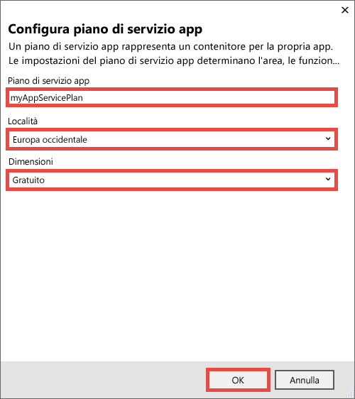

## <a name="create-and-publish-the-web-app"></a>Creare e pubblicare l'app Web

Ora resta solo da assegnare un nome all'app Web. In **Nome app Web** digitare un nome univoco per l'app. Questo nome verrà usato come parte del nome DNS predefinito per l'app (`<app_name>.azurewebsites.net`), quindi deve essere univoco tra tutte le app in Azure. In un secondo momento è possibile eseguire il mapping di un nome di dominio personalizzato all'app prima di esporla agli utenti.

È anche possibile accettare il nome generato automaticamente, che è già univoco.

Fare clic su **Crea** per avviare la creazione delle risorse di Azure.

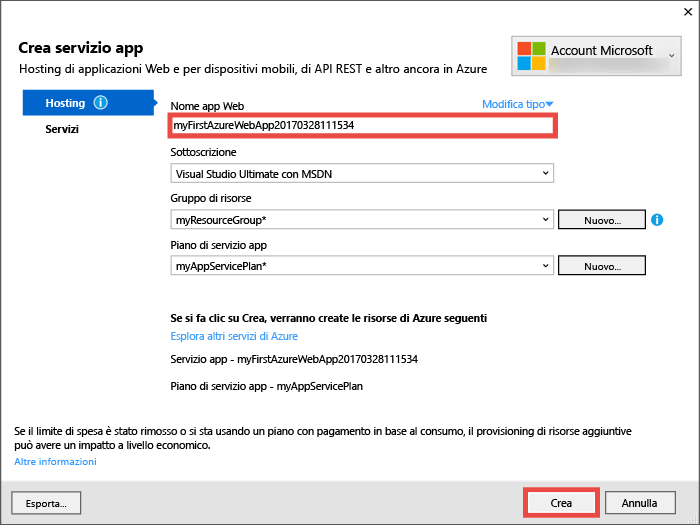

Dopo che la procedura guidata ha terminato la creazione delle risorse di Azure, pubblica automaticamente l'app Web ASP.NET in Azure per la prima volta e quindi avvia l'app Web pubblicata nel browser predefinito.

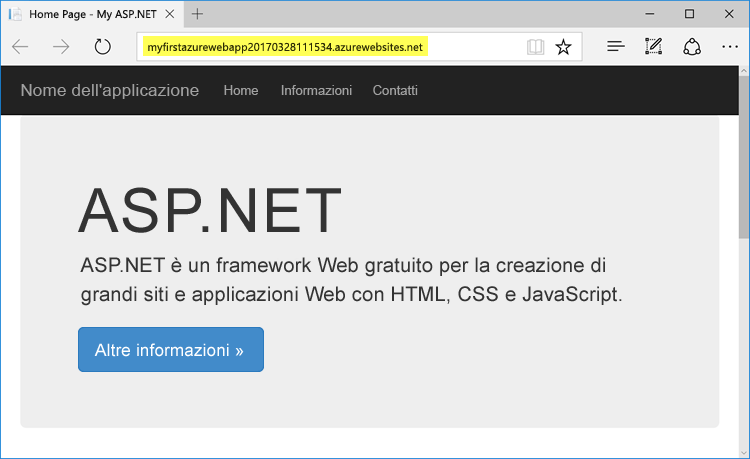

L'URL usa il nome dell'app Web specificato prima, con il formato `http://<app_name>.azurewebsites.net`. 

La prima app Web ASP.NET è ora in esecuzione nel servizio app di Azure.

## <a name="update-the-app-and-redeploy"></a>Aggiornare e ridistribuire l'app

È molto semplice ridistribuire un aggiornamento in Azure. Verrà ora eseguito un aggiornamento della home page.

Da **Esplora soluzioni** aprire **Views\Home\Index.cshtml**.

Trovare il tag HTML `<div class="jumbotron">` in alto e sostituire l'intero tag con il codice seguente:

```HTML
<div class="jumbotron">
    <h1>ASP.NET in Azure!</h1>
    <p class="lead">This is a simple app that we’ve built that demonstrates how to deploy a .NET app to Azure App Service.</p>
</div>
```

Per la ridistribuzione in Azure, fare clic con il pulsante destro del mouse sul progetto **myFirstAzureWebApp** in **Esplora soluzioni** e scegliere **Pubblica**.

Nella pagina di pubblicazione fare clic su **Pubblica**.

Quando Visual Studio ha terminato, avvia l'app Web di Azure aggiornata nel browser.


## <a name="manage-your-new-azure-web-app"></a>Gestire la nuova app Web di Azure

Passare al portale di Azure per esaminare l'app Web appena creata. 

A tale scopo, accedere a [https://portal.azure.com](https://portal.azure.com).

Nel menu a sinistra fare clic su **Servizi app** e quindi sul nome dell'app Web di Azure.

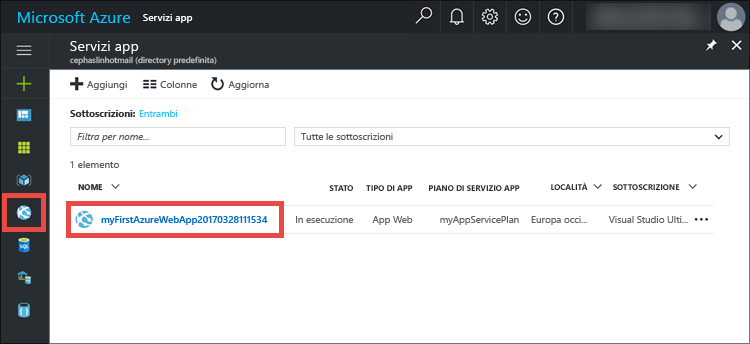

Si accede così al _pannello_, ovvero una pagina del portale visualizzata in orizzontale, dell'app Web. 

Per impostazione predefinita, nel pannello dell'app Web viene aperta la pagina **Panoramica**, che offre una visualizzazione dello stato dell'app. In questa pagina è anche possibile eseguire attività di gestione di base come esplorare, arrestare, avviare, riavviare ed eliminare. Le schede sul lato sinistro del pannello mostrano le diverse pagine di configurazione che è possibile aprire. 

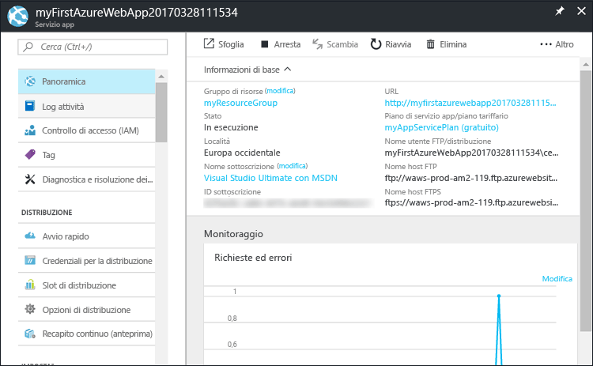

Queste schede del pannello mostrano le numerose utili funzionalità che è possibile aggiungere all'app Web. Nell'elenco seguente sono riportate solo alcune delle possibilità:

- Eseguire il mapping di un nome DNS personalizzato
- Associare un certificato SSL personalizzato
- Configurare la distribuzione continua
- Aumentare le prestazioni e il numero di istanze
- Aggiungere l'autenticazione utente

## <a name="clean-up-resources"></a>Pulire le risorse

Per eliminare la prima App Web di Azure, è possibile fare clic su **Elimina** nella pagina **Panoramica**. Esiste tuttavia un modo migliore per eliminare tutti gli elementi creati in questa guida introduttiva. Dalla pagina **Panoramica** dell'app Web fare clic sul gruppo di risorse per aprirne il pannello. 


Nel pannello del gruppo di risorse è possibile visualizzare sia il piano di servizio app che l'app del servizio app che Visual Studio ha creato. 

Nella parte superiore del pannello fare clic su **Elimina**. 

<!---->

Nel pannello di conferma eseguire una verifica digitando il nome del gruppo di risorse **myResourceGroup** nella casella di testo e fare clic su **Elimina**.

## <a name="next-steps"></a>Passaggi successivi

Esplorare gli [script di PowerShell per le app Web](app-service-powershell-samples.md) già creati.

