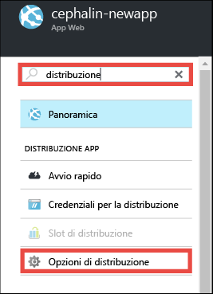
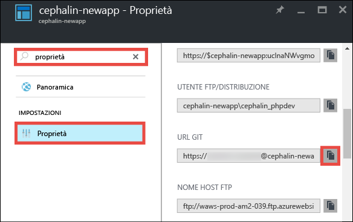
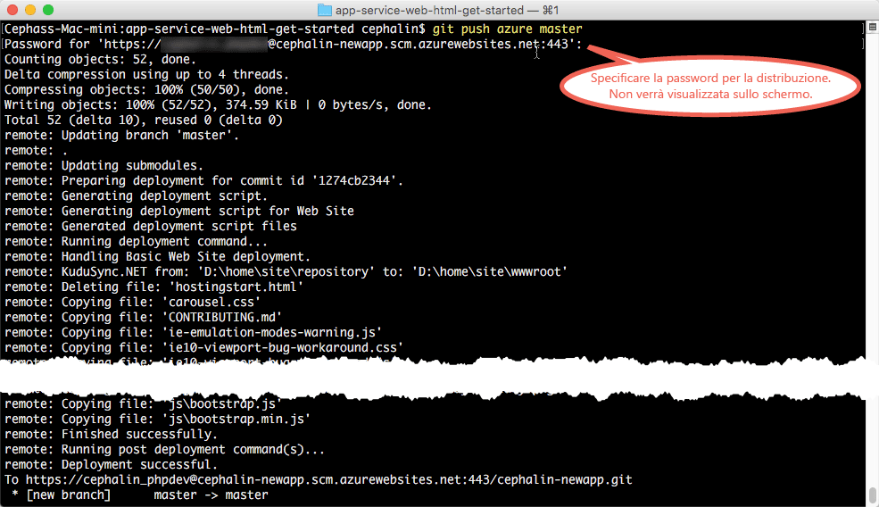

<properties 
	pageTitle="Distribuire la prima app Web in Azure in cinque minuti | Microsoft Azure" 
	description="Informazioni su come eseguire facilmente app Web nel servizio app mediante la distribuzione di un'app di esempio. È possibile eseguire rapidamente vere e proprie attività di sviluppo con risultati immediati." 
	services="app-service\web"
	documentationCenter=""
	authors="cephalin"
	manager="wpickett"
	editor=""
/>

<tags
	ms.service="app-service-web"
	ms.workload="web"
	ms.tgt_pltfrm="na"
	ms.devlang="na"
	ms.topic="hero-article"
	ms.date="09/16/2016" 
	ms.author="cephalin"
/>
	
# Distribuire la prima app Web in Azure in cinque minuti

Questa esercitazione illustra come distribuire una semplice app Web HTML e CSS nel [servizio app di Azure](../app-service/app-service-value-prop-what-is.md). Il servizio app consente di creare app Web, [back-end di app per dispositivi mobili](/documentation/learning-paths/appservice-mobileapps/) e [app per le API](../app-service-api/app-service-api-apps-why-best-platform.md).

Si apprenderà come:

- Creare un'app Web nel servizio app di Azure.
- Distribuirvi HTML e CSS.
- Osservare le pagine in esecuzione nell'ambiente di produzione.
- Aggiornare il contenuto nello stesso modo in cui si effettua il [push dei commit Git](https://git-scm.com/docs/git-push).

## Prerequisiti

- [Installare Git](http://www.git-scm.com/downloads). Verificare l'esito positivo dell'installazione eseguendo `git --version` da un nuovo prompt dei comandi di Windows, una finestra di PowerShell, una shell di Linux o un terminale OS X.
- Ottenere un account Microsoft Azure. Se non si ha un account, è possibile [iscriversi per ottenere una versione di valutazione gratuita](/pricing/free-trial/?WT.mc_id=A261C142F) oppure [attivare i vantaggi della sottoscrizione di Visual Studio](/pricing/member-offers/msdn-benefits-details/?WT.mc_id=A261C142F).

>[AZURE.NOTE] È possibile [provare il servizio app](http://go.microsoft.com/fwlink/?LinkId=523751) senza avere un account Azure. Creare un'app iniziale e provarla per un'ora, senza impegno e senza dover usare la carta di credito.

## Creare un'app Web

1. Accedere al [portale di Azure](https://portal.azure.com) con il proprio account Azure.

2. Nel menu a sinistra fare clic su **Nuovo** > **Web e dispositivi mobili** > **App Web**.

    

3. Nel pannello di creazione dell'app usare le impostazioni seguenti per la nuova app:

    - **Nome dell'app**: digitare un nome univoco.
    - **Gruppo di risorse**: selezionare **Crea nuovo** e assegnare un nome al gruppo di risorse.
    - **Piano di servizio app/Località**: fare clic per configurare e quindi scegliere **Crea nuovo** per impostare il nome, la località e il piano tariffario del piano di servizio app. È possibile usare il piano tariffario **Gratuito**.

    Al termine, il pannello di creazione dell'app dovrebbe avere un aspetto simile al seguente:

    

3. Fare clic su **Crea** nella parte inferiore della schermata. È possibile fare clic sull'icona delle **notifiche** in alto per visualizzare lo stato di avanzamento.

    

4. Al termine della distribuzione dovrebbe essere visualizzato il messaggio di notifica seguente. Fare clic sul messaggio per aprire il pannello della distribuzione.

    

5. Nel pannello **La distribuzione è riuscita** fare clic sul collegamento **Risorsa** per aprire il pannello della nuova app Web.

    

## Distribuire contenuto nell'app Web

Verrà ora illustrato come distribuire contenuto in Azure con Git.

5. Nel pannello dell'app Web scorrere verso il basso fino alla voce **Opzioni di distribuzione** oppure cercarla e quindi fare clic su di essa.

    

6. Fare clic su **Scegliere l'origine** > **Repository Git locale** > **OK**.

7. Tornare al pannello dell'app Web e fare clic su **Credenziali per la distribuzione**.

8. Impostare le credenziali per la distribuzione e fare clic su **Salva**.

7. Tornare al pannello dell'app Web e scorrere verso il basso fino alla voce **Proprietà** oppure cercarla e quindi fare clic su di essa. Fare clic sul pulsante **Copia** accanto a **URL GIT**.

    

    A questo punto è possibile distribuire il contenuto con Git.

1. Nel terminale della riga di comando passare a una directory di lavoro (`CD`) e clonare l'app di esempio come segue:

        git clone https://github.com/Azure-Samples/app-service-web-html-get-started.git

    

2. Passare al repository dell'app di esempio. Ad esempio:

        cd app-service-web-html-get-started

3. Configurare l'URL GIT copiato dal portale in uno dei passaggi precedenti come Git remoto per l'app Azure.

        git remote add azure <giturlfromportal>

4. Distribuire il codice di esempio nell'app Azure nello stesso modo in cui si effettua il push di qualsiasi codice con Git:

        git push azure master

    

La procedura è terminata. A questo punto il codice è in esecuzione in Azure. Nel browser passare a http://*&lt;appname>*.azurewebsites.net per verificarne il funzionamento.

## Eseguire aggiornamenti dell'app

Ora è possibile usare Git per effettuare in qualsiasi momento il push dalla radice del progetto (repository) per eseguire un aggiornamento del sito live. La procedura è simile a quella usata per la prima distribuzione del contenuto. Quando si vuole effettuare il push di una nuova modifica testata in locale, ad esempio, è sufficiente eseguire i comandi seguenti dalla radice del progetto (repository):

    git add .
    git commit -m "<your_message>"
    git push azure master

## Passaggi successivi

Trovare la procedura di sviluppo e distribuzione più adatta al framework del linguaggio:

> [AZURE.SELECTOR]
- [.NET](web-sites-dotnet-get-started.md)
- [PHP](app-service-web-php-get-started.md)
- [Node.js](app-service-web-nodejs-get-started.md)
- [Python](web-sites-python-ptvs-django-mysql.md)
- [Java](web-sites-java-get-started.md)

In alternativa, è possibile fare altre prove con la prima app Web, ad esempio:

- Provare [altri modi per distribuire il codice in Azure](../app-service-web/web-sites-deploy.md). Per eseguire la distribuzione da un repository GitHub, ad esempio, è sufficiente selezionare **GitHub** anziché **Repository Git locale** in **Opzioni di distribuzione**.
- Ottimizzare l'app Azure: autenticare gli utenti, ridimensionare l'app in base alla richiesta e configurare alcuni avvisi sulle prestazioni, tutto con pochi clic. Vedere [Aggiungere funzionalità alla prima app Web](app-service-web-get-started-2.md).

<!---HONumber=AcomDC_0920_2016-->