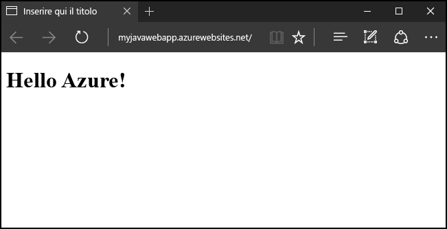
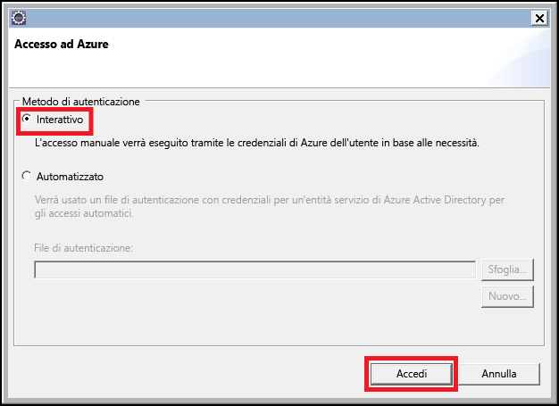
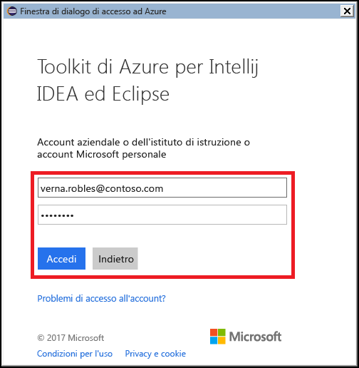
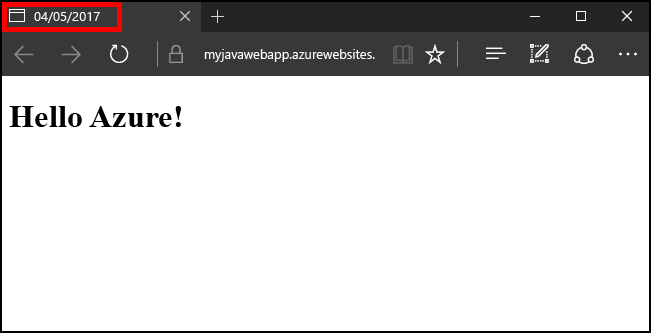

# <a name="create-your-first-java-web-app-in-azure-in-five-minutes"></a>Creare la prima app Web Java in Azure in cinque minuti

[!INCLUDE [app-service-web-selector-get-started](../../includes/app-service-web-selector-get-started.md)] 

Questa guida introduttiva illustra come distribuire la prima app Web Java nel [servizio app di Azure](../app-service/app-service-value-prop-what-is.md) in pochi minuti. Al termine di questa esercitazione, sarà disponibile una semplice app Web basata su Java in esecuzione nel cloud.



## <a name="before-you-begin"></a>Prima di iniziare

Questa esercitazione illustra come usare l'IDE di Eclipse per sviluppatori Java EE per compilare e distribuire un'app Web Java in Azure. Se Eclipse non è già installato, è possibile scaricarlo gratuitamente all'indirizzo http://www.eclipse.org/.

Per semplificare il processo di pubblicazione di app Web Java in Azure, per i passaggi di questa esercitazione verrà usato [Azure Toolkit for Eclipse](/azure/azure-toolkit-for-eclipse). Per istruzioni su come installare il toolkit, vedere [Installazione di Azure Toolkit for Eclipse](/azure/azure-toolkit-for-eclipse-installation).

> [!NOTE]
>
> È anche possibile usare [IntelliJ IDEA](https://www.jetbrains.com/idea/) di JetBrains per completare i passaggi di questa esercitazione. Alcuni passaggi potrebbero essere leggermente diversi per questo ambiente di sviluppo, ma è disponibile [Azure Toolkit for IntelliJ](/azure/azure-toolkit-for-intellij) che consente di semplificare il processo di pubblicazione per tale IDE.
>

Sarà anche necessaria una sottoscrizione di Azure per completare i passaggi di questa esercitazione. Se non si ha una sottoscrizione di Azure, è possibile attivare i [vantaggi per i sottoscrittori di MSDN](https://azure.microsoft.com/pricing/member-offers/msdn-benefits-details/) oppure iscriversi per ottenere un [account Azure gratuito](https://azure.microsoft.com/pricing/free-trial/).

## <a name="create-a-dynamic-web-project-in-eclipse"></a>Creare un progetto Web dinamico in Eclipse

Nell'IDE di Eclipse fare clic su **File**, quindi su **New** (Nuovo) e infine su **Dynamic Web Project** (Progetto Web dinamico).


Quando viene visualizzata la finestra di dialogo Dynamic Web Project (Progetto Web dinamico), assegnare all'applicazione il nome **MyFirstJavaOnAzureWebApp** e quindi fare clic su **Finish** (Fine).
   


> [!NOTE]
>
> Se è installato un ambiente di runtime locale, ad esempio [Apache Tomcat](https://tomcat.apache.org/), è possibile specificarlo nel campo **Target runtime** (Runtime di destinazione).
>

Dopo avere creato il progetto Web dinamico, aggiungere una nuova pagina JSP espandendo il progetto in Project Explorer (Esplora progetti), facendo clic con il pulsante destro del mouse sulla cartella **WebContent**, scegliendo **New** (Nuovo) e quindi **JSP File** (File JSP).


Quando viene visualizzata la finestra di dialogo New JSP File (Nuovo file JSP) denominare il file **index.jsp**, mantenere il nome **MyFirstJavaOnAzureWebApp/WebContent** per la cartella padre, quindi fare clic su **Next** (Avanti).


Quando viene visualizzata la finestra di dialogo New JSP File (Nuovo file JSP) denominare il file **index.jsp**, mantenere il nome **MyFirstJavaOnAzureWebApp/WebContent** per la cartella padre, quindi fare clic su **Finish** (Fine).


Quando la nuova pagina si apre in Eclipse, sostituire la sezione `<body></body>` esistente con il codice seguente:

```jsp
<body>
<h1><% out.println("Java on Azure!"); %></h1>
</body>
```

Salvare le modifiche alla pagina.


## <a name="publish-your-web-app-to-azure"></a>Pubblicare l'app Web in Azure

Per distribuire l'app Web in Azure, si sfruttano diverse funzionalità offerte da Azure Toolkit for Eclipse.

Per iniziare il processo di pubblicazione, usare uno dei metodi seguenti:

* Fare clic con il pulsante destro del mouse sul progetto in **Project Explorer** (Esplora progetti) di Eclipse, quindi scegliere **Azure** e infine **Publish as Azure Web App** (Pubblica come app Web di Azure).

   

* Fare clic sull'icona **Publish** (Pubblica) sulla barra degli strumenti di Eclipse e quindi fare clic su **Publish as Azure Web App** (Pubblica come app Web di Azure).

   

Se non si è già eseguito l'accesso all'account Azure, verrà richiesto di accedere. A tale scopo, seguire questa procedura:

1. Sono disponibili due opzioni diverse per accedere all'account Azure. Per questa esercitazione, scegliere **Interactive** (Interattiva).

   

1. Immettere le credenziali di Azure e fare clic su **Sign in** (Accedi).

   

1. Scegliere le sottoscrizioni di Azure e quindi fare clic su **Select** (Seleziona).

   

> [!NOTE]
>
> Istruzioni dettagliate sugli accessi **interattivi** e **automatizzati** sono disponibili nell'articolo [Azure Sign In Instructions for the Azure Toolkit for Eclipse](https://go.microsoft.com/fwlink/?linkid=846174) (Istruzioni di accesso ad Azure per Azure Toolkit for Eclipse).
>

Dopo avere effettuato l'accesso all'account Azure, verrà visualizzata la finestra di dialogo **Deploy Web App** (Distribuisci app Web). Non verranno visualizzati servizi app se è la prima volta che si pubblica un'app Web in Azure. In tal caso o se si vuole creare un nuovo servizio app, il passaggio successivo sarà la creazione di un nuovo servizio app. A tale scopo, fare clic su **Create** (Crea).


Quando viene visualizzata la finestra di dialogo **Create App Service** (Crea servizio app), i dati iniziali da immettere sono:

* Un nome univoco per l'app Web, che diventerà l'indirizzo DNS per l'app Web, ad esempio: **MyJavaWebApp** sarà *myjavawebapp.azurewebsites.net*.

* Il contenitore Web che verrà usato dall'app Web, ad esempio: **Newest Tomcat 8.5**.

* La sottoscrizione di Azure.

   

Se non esistono già piani di servizio app o si vuole creare un nuovo piano di servizio app, sarà necessario specificare le informazioni seguenti:

* Un nome univoco per il nuovo piano di servizio app, che verrà visualizzato quando si pubblicheranno app Web in futuro usando Azure Toolkit e che verrà elencato nel [portale di Azure](https://portal.azure.com) quando si gestisce l'account.

* La località geografica in cui verrà creato il piano di servizio.

* Il piano tariffario per il piano di servizio.

   

Fare quindi clic sulla scheda **Resource group** (Gruppo di risorse) per aprirla. Se non esistono già gruppi di risorse o se ne vuole creare uno nuovo, sarà necessario specificare un nome univoco per il nuovo gruppo di risorse. In caso contrario, scegliere un gruppo di risorse esistente dal menu a discesa.


Fare infine clic sulla scheda **JDK**. Sono elencate diverse opzioni che consentono agli sviluppatori di specificare Java Developer Kit (JDK) di terze parti o personalizzati, ma per questa esercitazione è consigliabile scegliere quello **personalizzato** e quindi fare clic su **Create** (Crea).


Azure Toolkit inizierà a creare il nuovo servizio app e visualizzerà una finestra di dialogo di stato durante l'elaborazione.


Dopo che il nuovo servizio app è stato creato, l'ultima opzione da scegliere è se distribuire l'app Web nella radice del nuovo sito Web. Se ad esempio si ha un servizio app all'indirizzo *wingtiptoys.azurewebsites.net* e non si esegue la distribuzione nella radice, l'app Web denominata **MyFirstJavaOnAzureWebApp** verrà distribuita *wingtiptoys.azurewebsites.net/MyFirstJavaOnAzureWebApp*.


Dopo avere completato tutti i passaggi precedenti, fare clic su **Deploy** (Distribuisci) per pubblicare l'app Web in Azure.


Congratulazioni. L'app Web è stata distribuita in Azure. Ora è possibile visualizzare l'app Web in anteprima nel sito Web di Azure:


## <a name="updating-your-web-app"></a>Aggiornamento dell'app Web

Dopo avere pubblicato l'app Web in Azure, l'aggiornamento dell'app Web è un processo molto più semplice. La procedura seguente illustra il processo di pubblicazione delle modifiche all'app Web.

Modificare prima di tutto il codice JSP di esempio precedente, sostituendo il titolo con la data di oggi:

```jsp
<%@ page
    language="java"
    contentType="text/html; charset=ISO-8859-1"
    pageEncoding="ISO-8859-1"
    import="java.text.SimpleDateFormat"
    import="java.util.Date" %>
<!DOCTYPE html PUBLIC "-//W3C//DTD HTML 4.01 Transitional//EN" "http://www.w3.org/TR/html4/loose.dtd">
<html>
<head>
<meta http-equiv="Content-Type" content="text/html; charset=ISO-8859-1">
<% SimpleDateFormat date = new SimpleDateFormat("yyyy/MM/dd"); %>
<title><% out.println(date.format(new Date())); %></title>
</head>
<body>
<h1><% out.println("Java on Azure!"); %></h1>
</body>
</html>
```


Dopo avere salvato le modifiche alla pagina, fare clic con il pulsante destro del mouse sul progetto in **Project Explorer** (Esplora progetti) di Eclipse, quindi scegliere **Azure** e infine **Publish as Azure Web App** (Pubblica come app Web di Azure).


Quando viene visualizzata la finestra di dialogo **Deploy Web App** (Distribuisci app Web), risulterà elencato il servizio app di prima. Per aggiornare l'app Web, è sufficiente evidenziare il servizio app e fare clic su **Deploy** (Distribuisci) per pubblicare le modifiche.


> [!NOTE]
>
> Se si distribuisce l'app Web nella radice del servizio app, sarà necessario riselezionare **Deploy to root** (Distribuisci nella radice) ogni volta che si pubblicano le modifiche.
>

Dopo avere pubblicato le modifiche, si noterà che il titolo della pagina è stato sostituito con la data di oggi nel browser.



## <a name="deleting-your-web-app"></a>Eliminazione dell'app Web

Per eliminare un'app Web, è possibile usare **Azure Explorer**, che fa parte di Azure Toolkit. Se la visualizzazione **Azure Explorer** non è già visibile in Eclipse, seguire questa procedura per aprirla:

1. Fare clic su **Window** (Finestra), quindi su **Show View** (Mostra visualizzazione) e infine su **Other** (Altro).

   

2. Quando viene visualizzata la finestra di dialogo **Show View** (Mostra visualizzazione), selezionare **Azure Explorer** e fare clic su **OK**.

   

Per eliminare l'app Web da Azure Explorer, è necessario espandere il nodo **Web Apps** (App Web), quindi fare clic con il pulsante destro del mouse sull'app Web e scegliere **Delete** (Elimina).


Quando viene richiesto di eliminare l'app Web, fare clic su **OK**.

## <a name="next-steps"></a>Passaggi successivi

Per ulteriori informazioni sui Toolkit di Azure per gli IDE di Java, consultare i seguenti collegamenti:

* [Azure Toolkit per Eclipse (questo articolo)](../azure-toolkit-for-eclipse.md)
  * [Novità di Azure Toolkit per Eclipse](../azure-toolkit-for-eclipse-whats-new.md)
  * [Installare il Toolkit di Azure per Eclipse.](../azure-toolkit-for-eclipse-installation.md)
  * [Sign In Instructions for the Azure Toolkit for Eclipse](https://go.microsoft.com/fwlink/?linkid=846174) (Istruzioni di accesso ad Azure per Azure Toolkit for Eclipse)
* [Toolkit di Azure per IntelliJ](../azure-toolkit-for-intellij.md)
  * [Novità del Toolkit di Azure per IntelliJ](../azure-toolkit-for-intellij-whats-new.md)
  * [Installazione del Toolkit di Azure per IntelliJ](../azure-toolkit-for-intellij-installation.md)
  * [Sign In Instructions for the Azure Toolkit for IntelliJ](https://go.microsoft.com/fwlink/?linkid=846179) (Istruzioni di accesso ad Azure per Azure Toolkit for IntelliJ)

Per altre informazioni su come usare Azure con Java, vedere il [Centro per sviluppatori Java di Azure](https://azure.microsoft.com/develop/java/) e gli [strumenti Java per Visual Studio Team Services](https://java.visualstudio.com/).

