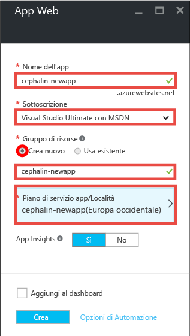
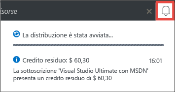
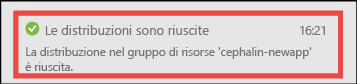
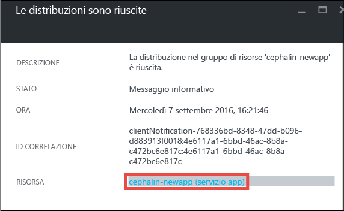
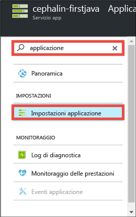
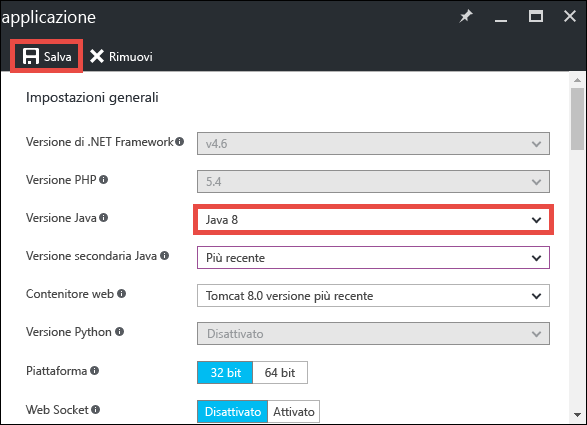
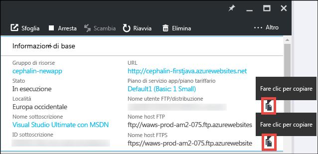
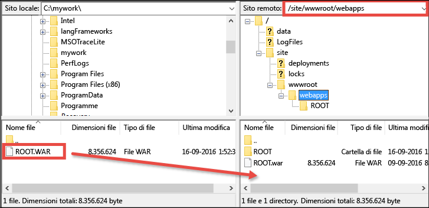

# Distribuire la prima app Web Java in Azure in cinque minuti (anteprima dell'interfaccia della riga di comando 2.0)

> [!div class="op_single_selector"]
> * [Primo sito HTML](app-service-web-get-started-html-cli-nodejs.md)
> * [Prima app .NET](app-service-web-get-started-dotnet-cli-nodejs.md)
> * [Prima app PHP](app-service-web-get-started-php-cli-nodejs.md)
> * [Prima app Node.js](app-service-web-get-started-nodejs-cli-nodejs.md)
> * [Prima app Python](app-service-web-get-started-python-cli-nodejs.md)
> * [Prima app Java](app-service-web-get-started-java.md)
> 
> 

Questa esercitazione illustra come distribuire una semplice app Web Java nel [servizio app di Azure](../app-service/app-service-value-prop-what-is.md).
Il servizio app consente di creare app Web, [back-end di app per dispositivi mobili](/documentation/learning-paths/appservice-mobileapps/) e [app per le API](../app-service-api/app-service-api-apps-why-best-platform.md).

Si apprenderà come: 

* Creare un'app Web nel servizio app di Azure.
* Distribuire un'app Java di esempio.
* Osservare il codice in esecuzione nell'ambiente di produzione.

## Prerequisiti
* Ottenere un client FTP/FTPS, ad esempio [FileZilla](https://filezilla-project.org/).
* Ottenere un account Microsoft Azure. Se non si ha un account, è possibile [iscriversi per ottenere una versione di valutazione gratuita](https://azure.microsoft.com/pricing/free-trial/?WT.mc_id=A261C142F) oppure [attivare i vantaggi per i sottoscrittori di Visual Studio](https://azure.microsoft.com/pricing/member-offers/msdn-benefits-details/?WT.mc_id=A261C142F).

> [!NOTE]
> È possibile [provare il servizio app](https://azure.microsoft.com/try/app-service/) senza avere un account Azure. Creare un'app iniziale e provarla per un'ora, senza impegno e senza dover usare la carta di credito.
> 
> 

## Creare un'app Web
1. Accedere al [portale di Azure](https://portal.azure.com) con il proprio account Azure.
2. Nel menu a sinistra fare clic su **Nuovo** > **Web e dispositivi mobili** > **App Web**.
   
    
3. Nel pannello di creazione dell'app usare le impostazioni seguenti per la nuova app:
   
   * **Nome dell'app**: digitare un nome univoco.
   * **Gruppo di risorse**: selezionare **Crea nuovo** e assegnare un nome al gruppo di risorse.
   * **Piano di servizio app/Località**: fare clic per configurare e quindi scegliere **Crea nuovo** per impostare il nome, la località e il piano tariffario del piano di servizio app. È possibile usare il piano tariffario **Gratuito** .
     
     Al termine, il pannello di creazione dell'app dovrebbe avere un aspetto simile al seguente:
     
     
4. Fare clic su **Crea** nella parte inferiore della schermata. È possibile fare clic sull'icona delle **notifiche** in alto per visualizzare lo stato di avanzamento.
   
    
5. Al termine della distribuzione dovrebbe essere visualizzato il messaggio di notifica seguente. Fare clic sul messaggio per aprire il pannello della distribuzione.
   
    
6. Nel pannello **La distribuzione è riuscita** fare clic sul collegamento **Risorsa** per aprire il pannello della nuova app Web.
   
    

## Distribuire un'app Java nell'app Web
Verrà ora illustrato come distribuire un'app Java in Azure con FTPS.

1. Nel pannello dell'app Web scorrere verso il basso fino alla voce **Impostazioni dell'applicazione** oppure cercarla e quindi fare clic su di essa. 
   
    
2. In **Versione Java** selezionare **Java 8** e fare clic su **Salva**.
   
    
   
    Quando viene visualizzata la notifica **Le impostazioni dell'app Web sono state aggiornate**, passare a http://*&lt;nomeapp>*.azurewebsites.net per osservare il funzionamento del servlet JSP predefinito.
3. Tornare al pannello dell'app Web e scorrere verso il basso fino alla voce **Credenziali per la distribuzione** oppure cercarla e quindi fare clic su di essa.
4. Impostare le credenziali per la distribuzione e fare clic su **Salva**.
5. Tornare al pannello dell'app Web e fare clic su **Panoramica**. Fare clic sul pulsante **Copia** accanto a **Nome utente FTP/distribuzione** e **Nome host FTPS** per copiare tali valori.
   
    
   
    A questo punto è possibile distribuire l'app Java con FTPS.
6. Nel client FTP/FTPS accedere al server FTP dell'app Web di Azure usando i valori copiati nell'ultimo passaggio. Usare la password per la distribuzione creata in precedenza.
   
    Lo screenshot seguente mostra l'accesso con FileZilla.
   
    
   
    Potrebbero essere visualizzati avvisi di sicurezza per il certificato SSL non riconosciuto di Azure. Continuare.
7. Fare clic su [questo collegamento](https://github.com/Azure-Samples/app-service-web-java-get-started/raw/master/webapps/ROOT.war) per scaricare il file WAR nel computer locale.
8. Nel client FTP/FTPS passare a **/site/wwwroot/webapps** nel sito remoto e trascinare in tale directory remota il file WAR scaricato nel computer locale.
   
    
   
    Fare clic su **OK** per sostituire il file in Azure.
   
   > [!NOTE]
   > In conformità al comportamento predefinito di Tomcat, il nome file **ROOT.war** in /site/wwwroot/webapps indica l'app Web radice (http://*&lt;nomeapp>*.azurewebsites.net) e il nome file ***&lt;nome>*.war** indica un'app Web denominata (http://*&lt;nomeapp>*.azurewebsites.net/*&lt;nome>*).
   > 
   > 

La procedura è terminata. A questo punto l'app Java è in esecuzione in Azure. Nel browser passare a http://*&lt;nomeapp>*.azurewebsites.net per verificarne il funzionamento. 

## Eseguire aggiornamenti dell'app
Ogni volta che è necessario eseguire un aggiornamento, è sufficiente caricare il nuovo file WAR nella stessa directory remota con il client FTP/FTPS.

## Passaggi successivi
[Creare un'app Web Java da un modello in Azure Marketplace](web-sites-java-get-started.md#marketplace). È possibile ottenere un contenitore Tomcat completamente personalizzabile e usare la familiare interfaccia utente di gestione. 

Eseguire il debug dell'app Web di Azure direttamente in [IntelliJ](app-service-web-debug-java-web-app-in-intellij.md) o in [Eclipse](app-service-web-debug-java-web-app-in-eclipse.md).

In alternativa, è possibile fare altre prove con la prima app Web, ad esempio:

* Provare [altri modi per distribuire il codice in Azure](web-sites-deploy.md). 
* Ottimizzare l'app Azure: autenticare gli utenti, ridimensionare l'app in base alla richiesta e configurare alcuni avvisi sulle prestazioni, tutto con pochi clic. Vedere [Aggiungere funzionalità alla prima app Web](app-service-web-get-started-2.md).

<!--HONumber=Feb17_HO2-->

