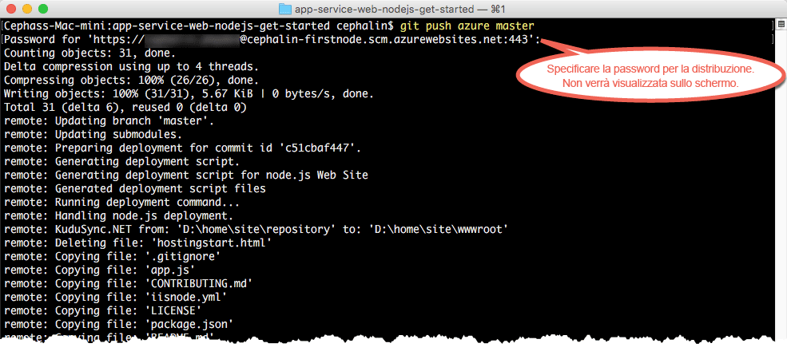

# Distribuire la prima app Web Node.js in Azure in cinque minuti (anteprima dell'interfaccia della riga di comando 2.0)

> [!div class="op_single_selector"]
> * [Primo sito HTML](app-service-web-get-started-html.md)
> * [Prima app .NET](app-service-web-get-started-dotnet.md)
> * [Prima app PHP](app-service-web-get-started-php.md)
> * [Prima app Node.js](app-service-web-get-started-nodejs.md)
> * [Prima app Python](app-service-web-get-started-python.md)
> * [Prima app Java](app-service-web-get-started-java.md)
> 
> 

Questa esercitazione illustra come distribuire la prima app Web Node.js nel [servizio app di Azure](../app-service/app-service-value-prop-what-is.md).
Il servizio app consente di creare app Web, [back-end di app per dispositivi mobili](/documentation/learning-paths/appservice-mobileapps/) e [app per le API](../app-service-api/app-service-api-apps-why-best-platform.md).

Si apprenderà come: 

* Creare un'app Web nel servizio app di Azure.
* Distribuire codice Node.js di esempio.
* Osservare il codice in esecuzione nell'ambiente di produzione.
* Aggiornare l'app Web nello stesso modo in cui si effettua il [push dei commit Git](https://git-scm.com/docs/git-push).

[!INCLUDE [app-service-linux](../../includes/app-service-linux.md)]

## Versioni dell'interfaccia della riga di comando per completare l'attività

È possibile completare l'attività usando una delle versioni seguenti dell'interfaccia della riga di comando:

- [Interfaccia della riga di comando di Azure 1.0](app-service-web-get-started-nodejs-cli-nodejs.md): l'interfaccia della riga di comando per i modelli di distribuzione classici e di gestione delle risorse
- [Interfaccia della riga di comando di Azure 2.0 (anteprima)](app-service-web-get-started-nodejs.md): l'interfaccia della riga di comando di nuova generazione per il modello di distribuzione di gestione delle risorse

## Prerequisiti
* [Git](http://www.git-scm.com/downloads).
* [Interfaccia della riga di comando di Azure 2.0 (anteprima)](/cli/azure/install-az-cli2).
* Un account Microsoft Azure. Se non si ha un account, è possibile [iscriversi per ottenere una versione di valutazione gratuita](https://azure.microsoft.com/pricing/free-trial/?WT.mc_id=A261C142F) oppure [attivare i vantaggi per i sottoscrittori di Visual Studio](https://azure.microsoft.com/pricing/member-offers/msdn-benefits-details/?WT.mc_id=A261C142F).

> [!NOTE]
> È possibile [provare il servizio app](https://azure.microsoft.com/try/app-service/) senza avere un account Azure. Creare un'app iniziale e provarla per un'ora, senza impegno e senza dover usare la carta di credito.
> 
> 

## Distribuire un'app Web Node.js
1. Aprire un nuovo prompt dei comandi di Windows, una finestra di PowerShell, una shell di Linux o un terminale di OS X. Eseguire `git --version` e `azure --version` per verificare che Git e l'interfaccia della riga di comando di Azure siano installati nel computer.
   
    
   
    Se gli strumenti non sono stati installati, vedere i collegamenti di download nella sezione [Prerequisiti](#Prerequisites) .
2. Accedere ad Azure come segue:
   
        az login
   
    Seguire le istruzioni del messaggio della Guida per continuare il processo di accesso.
   
    

3. Impostare l'utente di distribuzione per il servizio app. Si distribuirà il codice usando queste credenziali in un secondo momento.
   
        az appservice web deployment user set --user-name <username> --password <password>

3. Creare un nuovo [gruppo di risorse](../azure-resource-manager/resource-group-overview.md). Per questa prima esercitazione di servizio app, non è strettamente necessario conoscerne tutte le caratteristiche e funzioni.

        az group create --location "<location>" --name my-first-app-group

    Per visualizzare i possibili valori utilizzabili per `<location>`, usare il comando `az appservice list-locations` nell'interfaccia della riga di comando.

3. Creare un nuovo [piano di servizio app](../app-service/azure-web-sites-web-hosting-plans-in-depth-overview.md) "GRATUITO". Per questa prima esercitazione di servizio app, è sufficiente sapere che non sono previsti costi per le app Web in questo piano.

        az appservice plan create --name my-free-appservice-plan --resource-group my-first-app-group --sku FREE

4. Creare una nuova app Web con un nome univoco in `<app_name>`.

        az appservice web create --name <app_name> --resource-group my-first-app-group --plan my-free-appservice-plan

4. Successivamente, verrà fornito il codice Node.js di esempio da distribuire. Passare alla directory di lavoro `CD` e clonare l'app di esempio come segue:
   
        cd <working_directory>
        git clone https://github.com/Azure-Samples/app-service-web-nodejs-get-started.git

5. Passare al repository dell'app di esempio.
   
        cd app-service-web-nodejs-get-started
5. Configurare la distribuzione Git locale pe l'app Web del servizio app con il comando seguente:

        az appservice web source-control config-local-git --name <app_name> --resource-group my-first-app-group

    Si otterrà un output JSON come questo, a indicare la configurazione del repository Git remoto:

        {
        "url": "https://<deployment_user>@<app_name>.scm.azurewebsites.net/<app_name>.git"
        }

6. Aggiungere l'URL in JSON come Git remoto per il repository locale (chiamato `azure` per motivi di semplicità).

        git remote add azure https://<deployment_user>@<app_name>.scm.azurewebsites.net/<app_name>.git
   
7. Distribuire il codice di esempio nell'app Azure nello stesso modo in cui si effettua il push di qualsiasi codice con Git. Quando richiesto, usare la password configurata prima.
   
        git push azure master
   
    
   
    `git push` non solo inserisce il codice in Azure, ma attiva anche le attività di distribuzione nel motore di distribuzione. 
    Se nella radice del progetto (repository) è presente un file package.json, lo script di distribuzione ripristina automaticamente i pacchetti necessari. 

La distribuzione dell'app in Servizio app di Azure è stata completata.

## Visualizzare l'app eseguita dinamicamente
Per visualizzare l'app eseguita dinamicamente in Azure, eseguire questo comando da qualsiasi directory del repository:

    azure site browse

## Eseguire aggiornamenti dell'app
Ora è possibile usare Git per effettuare in qualsiasi momento il push dalla radice del progetto (repository) per eseguire un aggiornamento del sito live. La procedura è simile a quella usata per la prima distribuzione del codice. Quando si vuole effettuare il push di una nuova modifica testata in locale, ad esempio, è sufficiente eseguire i comandi seguenti dalla radice del progetto (repository):

    git add .
    git commit -m "<your_message>"
    git push azure master

## Passaggi successivi
[Creare, configurare e distribuire un'app Web Node.js Express in Azure](app-service-web-nodejs-get-started.md). Seguendo questa esercitazione è possibile acquisire le competenze di base necessarie per eseguire qualsiasi app Web Node.js in Azure, ad esempio:

* Creare e configurare app in Azure da PowerShell/Bash.
* Impostare la versione di Node.js.
* Usare un file di avvio che non si trova nella directory dell'applicazione radice.
* Automatizzare con NPM.
* Ottenere log di output e degli errori.

In alternativa, è possibile fare altre prove con la prima app Web, ad esempio:

* Provare [altri modi per distribuire il codice in Azure](web-sites-deploy.md). Per eseguire la distribuzione da un repository GitHub, ad esempio, è sufficiente selezionare **GitHub** anziché **Repository Git locale** in **Opzioni di distribuzione**.
* Ottimizzare l'app Azure: autenticare gli utenti, ridimensionare l'app in base alla richiesta e configurare alcuni avvisi sulle prestazioni, tutto con pochi clic. Vedere [Aggiungere funzionalità alla prima app Web](app-service-web-get-started-2.md).

<!--HONumber=Feb17_HO2-->

