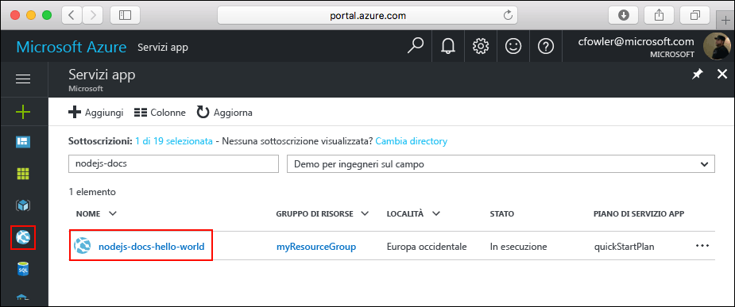

<a id="create-a-python-web-app-in-azure" class="xliff"></a>

# Creare un'app Web Python in Azure

Le [app Web di Azure](https://docs.microsoft.com/azure/app-service-web/app-service-web-overview) forniscono un servizio di hosting Web ad alta scalabilità e con funzioni di auto-correzione.  Questa guida introduttiva illustra come sviluppare e distribuire un'app Python in un'app Web di Azure. Si creerà l'app Web usando l'[interfaccia della riga di comando di Azure](https://docs.microsoft.com/cli/azure/get-started-with-azure-cli) e si userà Git per distribuire il codice Python di esempio nell'app Web.


È possibile eseguire queste procedure con un computer Mac, Windows o Linux. Una volta installati i prerequisiti, sono necessari circa cinque minuti per completare la procedura.
<a id="prerequisites" class="xliff"></a>

## Prerequisiti

Per completare questa esercitazione:

1. [Installare Git](https://git-scm.com/)
1. [Installare Python](https://www.python.org/downloads/)

[!INCLUDE [quickstarts-free-trial-note](../../includes/quickstarts-free-trial-note.md)]

[!INCLUDE [cloud-shell-try-it.md](../../includes/cloud-shell-try-it.md)]

Se si sceglie di installare e usare l'interfaccia della riga di comando in locale, per questo argomento è necessario eseguire la versione 2.0 o successiva dell'interfaccia della riga di comando di Azure. Eseguire `az --version` per trovare la versione. Se è necessario eseguire l'installazione o l'aggiornamento, vedere [Installare l'interfaccia della riga di comando di Azure 2.0]( /cli/azure/install-azure-cli). 

<a id="download-the-sample" class="xliff"></a>

## Scaricare l'esempio

In una finestra del terminale eseguire il comando seguente per clonare il repository dell'app di esempio nel computer locale.

```bash
git clone https://github.com/Azure-Samples/python-docs-hello-world
```

Questa finestra del terminale dovrà essere usata per eseguire tutti i comandi presenti in questa guida introduttiva.

Passare alla directory contenente il codice di esempio.

```bash
cd Python-docs-hello-world
```

<a id="run-the-app-locally" class="xliff"></a>

## Eseguire l'app in locale

Per eseguire l'applicazione in locale, aprire una finestra del terminale e usare il comando `Python` per avviare il server Web Python predefinito.

```bash
python main.py
```

Aprire un Web browser e passare all'app di esempio all'indirizzo http://localhost:5000.

Nella pagina verrà visualizzato il messaggio **Hello World** dell'app di esempio.


Nella finestra del terminale premere **CTRL+C** per uscire dal server Web.

[!INCLUDE [Log in to Azure](../../includes/login-to-azure.md)] 

[!INCLUDE [Configure deployment user](../../includes/configure-deployment-user.md)] 

[!INCLUDE [Create resource group](../../includes/app-service-web-create-resource-group.md)] 

[!INCLUDE [Create app service plan](../../includes/app-service-web-create-app-service-plan.md)] 

[!INCLUDE [Create web app](../../includes/app-service-web-create-web-app.md)] 


È stata creata una nuova app Web vuota in Azure.

<a id="configure-to-use-python" class="xliff"></a>

## Eseguire la configurazione per usare Python

Usare il comando [az webapp config set](/cli/azure/webapp/config#set) per configurare l'app Web per l'uso di Python versione `3.4`.

```azurecli-interactive
az webapp config set --python-version 3.4 --name <app_name> --resource-group myResourceGroup
```


Per impostare la versione Python in questo modo viene usato un contenitore predefinito fornito dalla piattaforma. Per usare un contenitore personalizzato, vedere il riferimento sull'interfaccia della riga di comando per il comando [az webapp config container set](/cli/azure/webapp/config/container#set).

[!INCLUDE [Configure local git](../../includes/app-service-web-configure-local-git.md)] 

[!INCLUDE [Push to Azure](../../includes/app-service-web-git-push-to-azure.md)] 

```bash
Counting objects: 18, done.
Delta compression using up to 4 threads.
Compressing objects: 100% (16/16), done.
Writing objects: 100% (18/18), 4.31 KiB | 0 bytes/s, done.
Total 18 (delta 4), reused 0 (delta 0)
remote: Updating branch 'master'.
remote: Updating submodules.
remote: Preparing deployment for commit id '44e74fe7dd'.
remote: Generating deployment script.
remote: Generating deployment script for python Web Site
remote: Generated deployment script files
remote: Running deployment command...
remote: Handling python deployment.
remote: KuduSync.NET from: 'D:\home\site\repository' to: 'D:\home\site\wwwroot'
remote: Deleting file: 'hostingstart.html'
remote: Copying file: '.gitignore'
remote: Copying file: 'LICENSE'
remote: Copying file: 'main.py'
remote: Copying file: 'README.md'
remote: Copying file: 'requirements.txt'
remote: Copying file: 'virtualenv_proxy.py'
remote: Copying file: 'web.2.7.config'
remote: Copying file: 'web.3.4.config'
remote: Detected requirements.txt.  You can skip Python specific steps with a .skipPythonDeployment file.
remote: Detecting Python runtime from site configuration
remote: Detected python-3.4
remote: Creating python-3.4 virtual environment.
remote: .................................
remote: Pip install requirements.
remote: Successfully installed Flask click itsdangerous Jinja2 Werkzeug MarkupSafe
remote: Cleaning up...
remote: .
remote: Overwriting web.config with web.3.4.config
remote:         1 file(s) copied.
remote: Finished successfully.
remote: Running post deployment command(s)...
remote: Deployment successful.
To https://<app_name>.scm.azurewebsites.net/<app_name>.git
 * [new branch]      master -> master
```

<a id="browse-to-the-app" class="xliff"></a>

## Passare all'app

Passare all'applicazione distribuita con il Web browser.

```bash
http://<app_name>.azurewebsites.net
```

Il codice di esempio Python è in esecuzione in un'app Web del servizio app di Azure.


**Congratulazioni.** La distribuzione della prima app Python nel servizio app è stata completata.

<a id="update-and-redeploy-the-code" class="xliff"></a>

## Aggiornare e ridistribuire il codice

Usando un editor di testo locale, aprire il file `main.py` nell'app Python e apportare una piccola modifica al testo accanto all'istruzione `return`:

```python
return 'Hello, Azure!'
```

Eseguire il commit delle modifiche in Git e quindi effettuare il push delle modifiche al codice in Azure.

```bash
git commit -am "updated output"
git push azure master
```

Al termine della distribuzione, tornare alla finestra del browser aperta nel passaggio [Passare all'app](#browse-to-the-app) e aggiornare la pagina.


<a id="manage-your-new-azure-web-app" class="xliff"></a>

## Gestire la nuova app Web di Azure

Accedere al <a href="https://portal.azure.com" target="_blank">portale di Azure</a> per gestire l'app Web creata.

Nel menu a sinistra fare clic su **Servizi app** e quindi sul nome dell'app Web di Azure.



Verrà visualizzata la pagina di panoramica dell'app Web. Qui è possibile eseguire attività di gestione di base come l'esplorazione, l'arresto, l'avvio, il riavvio e l'eliminazione dell'app. 


Il menu a sinistra fornisce varie pagine per la configurazione dell'app. 

[!INCLUDE [cli-samples-clean-up](../../includes/cli-samples-clean-up.md)]

<a id="next-steps" class="xliff"></a>

## Passaggi successivi

> [!div class="nextstepaction"]
> [Python con PostgreSQL](app-service-web-tutorial-docker-python-postgresql-app.md)

