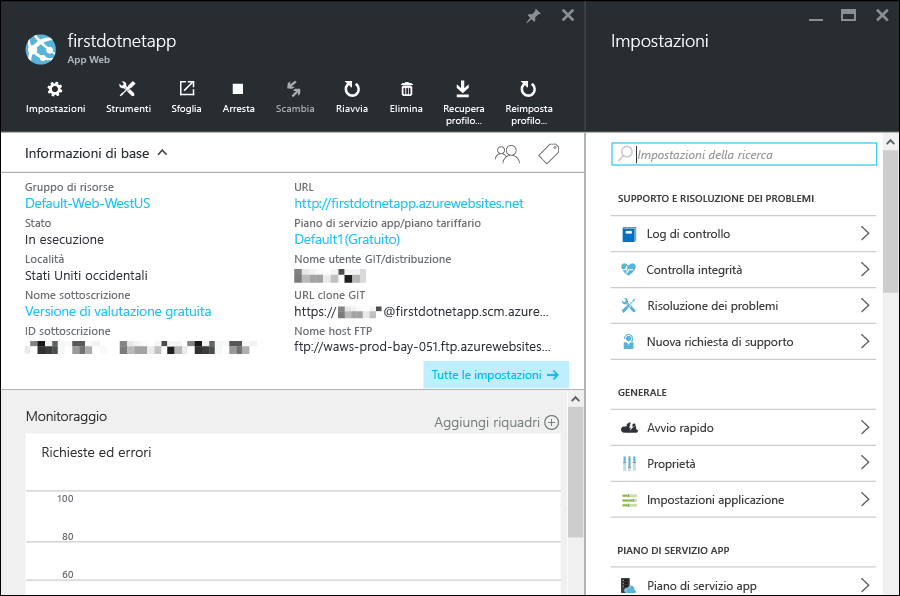

<properties 
	pageTitle="Introduzione alle app Web in Servizio app di Azure" 
	description="Informazioni su come eseguire facilmente l'app Web in modo dinamico nel servizio app. In 5 minuti sarà possibile eseguire vere e proprie attività di sviluppo con risultati immediati." 
	services="app-service\web"
	documentationCenter=""
	authors="cephalin" 
	manager="wpickett" 
	editor="" 
/>

<tags 
	ms.service="app-service-web" 
	ms.workload="web" 
	ms.tgt_pltfrm="na" 
	ms.devlang="na" 
	ms.topic="hero-article"
	ms.date="03/17/2016" 
	ms.author="cephalin"
/>
	
# Introduzione alle app Web in Servizio app di Azure

Questa esercitazione illustra come iniziare rapidamente a distribuire app Web in [Servizio app di Azure](../app-service/app-service-value-prop-what-is.md). Con poche operazioni sarà possibile:

- Distribuire un'app Web di esempio (scegliere tra ASP.NET, PHP, Node.js, Java o Python).
- Visualizzare l'app eseguita dinamicamente in pochi secondi.
- Aggiornare l'app Web nello stesso modo in cui si effettua il push dei commit [Git](http://www.git-scm.com/).

Verrà anche fornita una panoramica del [portale di Azure](https://portal.azure.com) e si esamineranno le funzionalità disponibili nel portale.

## Prerequisiti

Per completare questa esercitazione, sono necessari:

- Git. È possibile scaricare il file di installazione binario [qui](http://www.git-scm.com/downloads). Sarà possibile eseguire `git --version` dal terminale della riga di comando scelto. 
- Conoscenze di base di Git.
- Interfaccia della riga di comando di Azure. Le istruzioni per l'installazione sono disponibili [qui](../xplat-cli-install.md). Sarà possibile eseguire `azure --version` dal terminale della riga di comando scelto.
- Un account Microsoft Azure. Se non è disponibile un account, è possibile [iscriversi per ottenere una versione di valutazione gratuita](/pricing/free-trial/?WT.mc_id=A261C142F) oppure [attivare i benefici della sottoscrizione Visual Studio](/pricing/member-offers/msdn-benefits-details/?WT.mc_id=A261C142F).

>[AZURE.NOTE] Per provare Servizio app di Azure prima di iscriversi per ottenere un account Azure, vedere [Prova il servizio app](http://go.microsoft.com/fwlink/?LinkId=523751). In questa pagina è possibile creare immediatamente un'app iniziale temporanea nel servizio app. Non è richiesta una carta di credito né occorre impegnarsi in alcun modo.

## Distribuire un'app Web

Verrà ora distribuita un'app Web in Servizio app di Azure.

1. Aprire un nuovo prompt dei comandi di Windows, una shell di Linux o un terminale di OS X, eseguire `CD` in una directory di lavoro e clonare l'app di esempio in questo modo:

        git clone <github_sample_url>

    Per *&lt;github\_sample\_url>*, usare uno degli URL seguenti, a seconda del framework preferito:

    - ASP.NET: [https://github.com/Azure-Samples/app-service-web-dotnet-get-started.git](https://github.com/Azure-Samples/app-service-web-dotnet-get-started.git)
    - PHP (CodeIgniter): [https://github.com/Azure-Samples/app-service-web-php-get-started.git](https://github.com/Azure-Samples/app-service-web-php-get-started.git)
    - Node.js (Express): [https://github.com/Azure-Samples/app-service-web-nodejs-get-started.git](https://github.com/Azure-Samples/app-service-web-nodejs-get-started.git) 
    - Java: [https://github.com/Azure-Samples/app-service-web-java-get-started.git](https://github.com/Azure-Samples/app-service-web-java-get-started.git)
    - Python (Django): [https://github.com/Azure-Samples/app-service-web-python-get-started.git](https://github.com/Azure-Samples/app-service-web-python-get-started.git)

2. Eseguire il comando `CD` nella directory radice dell'app di esempio. Ad esempio,

        cd app-service-web-dotnet-get-started

3. Accedere ad Azure in questo modo:

        azure login
    
    Seguire le istruzioni per continuare l'accesso in un browser usando un account con la sottoscrizione di Azure.

4. Creare la risorsa dell'app del servizio app in Azure con un nome app univoco con il comando successivo. L'URL dell'app Web sarà http://&lt;app_name>.azurewebsites.net.

        azure site create --git <app_name> 
      
    >[AZURE.NOTE] Se non sono mai state configurate credenziali di distribuzione per la sottoscrizione di Azure, verrà chiesto di crearle. Queste credenziali, e non le credenziali dell'account Azure, vengono usate dal servizio app solo per le distribuzioni Git e gli accessi FTP.
    
    Non solo l'app viene creata in Azure ora, ma anche la directory corrente viene inizializzata da Git e connessa alla nuova app del servizio app come Git remoto. È possibile passare all'URL dell'app per visualizzare la pagina HTML predefinita, ma ora si inserirà invece il codice.

4. Distribuire il codice di esempio nella nuova app del servizio app nello stesso modo in cui si effettua il push del codice con Git:

        git push azure master 
    
    >[AZURE.NOTE] Verrà chiesta la password di distribuzione. Se non si ha familiarità con il servizio app, specificare la password di distribuzione appena creata.
    
    `git push` non solo inserisce il codice in Azure, ma attiva anche le attività di distribuzione nel motore di distribuzione. Se nella radice del progetto (repository) è presente un file package.json (Node.js) o requirements.txt (Python) o se nel progetto ASP.NET è presente un file packages.config, gli script di distribuzione ripristineranno automaticamente i pacchetti necessari. È anche possibile [abilitare l'estensione Composer](web-sites-php-mysql-deploy-use-git.md#composer) per elaborare automaticamente i file composer.json nell'app PHP.

La distribuzione dell'app in Servizio app di Azure è stata completata.

## Visualizzare l'app eseguita dinamicamente

Per visualizzare l'app in esecuzione dinamicamente in Azure, eseguire questo comando:

    azure site browse <app_name>

Se viene visualizzato il messaggio di errore `Site <app_name> does not exist or has no hostnames`, provare a eseguire di nuovo il comando dopo qualche secondo. Alcune app, ad esempio le app Java, impiegano più tempo per eseguire il wrapping della distribuzione.

## Eseguire aggiornamenti dell'app

Ora è possibile usare Git per effettuare il push dalla radice del progetto (repository) in qualsiasi momento per poter eseguire un aggiornamento del sito attivo. La procedura è uguale alla prima distribuzione dell'app in Azure. Ad esempio, quando si vuole effettuare il push di una nuova modifica testata in locale, è sufficiente eseguire i comandi seguenti dalla radice del progetto (repository):
    
    git add .
    git commit -m "<your_message>"
    git push azure master

## Altri modi per eseguire la distribuzione

Esistono svariati modi per distribuire l'app Web. La distribuzione Git da un repository locale è solo uno dei tanti. È possibile eseguire la distribuzione direttamente da Visual Studio, eseguire la distribuzione continua da GitHub, sincronizzare da DropBox o OneDrive, caricare file tramite FTP e così via. Per altre informazioni sulle opzioni di distribuzione, vedere [Distribuire l'app nel servizio app di Azure](../app-service-web/web-sites-deploy.md).

## Visualizzare l'app nel portale di Azure

Ora si accederà al portale di Azure per visualizzare ciò che è stato creato:

1. Accedere al [portale di Azure](https://portal.azure.com) con un account Microsoft a cui è associata la sottoscrizione di Azure.

2. Nella barra a sinistra fare clic su **Servizi app**.

3. Fare clic sull'app del servizio app appena creata per aprirne il pannello nel portale. Si noterà che per praticità anche il pannello **Impostazioni** viene aperto per impostazione predefinita.

    

Il pannello del portale dell'app del servizio app include un set completo di impostazioni e strumenti per la configurazione, il monitoraggio, la protezione e la risoluzione dei problemi dell'app. Per acquisire rapidamente familiarità con questa interfaccia, è possibile eseguire alcune semplici attività:

- Arrestare l'app
- Riavviare l'app
- Fare clic sul collegamento **Gruppo di risorse** per visualizzare tutte le risorse distribuite nel gruppo di risorse
- Fare clic su **Impostazioni** > **Proprietà** per visualizzare altre informazioni sull'app
- Fare clic su **Strumenti** per accedere a utili strumenti per il monitoraggio e la risoluzione dei problemi  

## Passaggi successivi

Portare l'app distribuita al livello successivo. Proteggerla con l'autenticazione. Ridimensionarla in base alla richiesta. Configurare alcuni avvisi sulle prestazioni. Tutto con pochi clic. Vedere [Introduzione a Servizio app di Azure - Parte 2](app-service-web-get-started-2.md).

Oppure continuare a esplorare la creazione di un'app Web per il servizio app con un framework di linguaggio specifico:

- [Creazione di un'app Web ASP.NET nel servizio app di Azure](web-sites-dotnet-get-started.md)
- [Creare un'app Web PHP nel servizio app di Azure](web-sites-php-mysql-deploy-use-git.md)
- [Creare un'app Web Node.js nel servizio app di Azure](web-sites-nodejs-develop-deploy-mac.md)
- [Creazione di un'app Web Java nel servizio app di Azure](web-sites-java-get-started.md)
- [Creare un'app Web Python nel servizio app di Azure](web-sites-python-ptvs-django-mysql.md)

In alternativa, è possibile trovare altri contenuti sull'intervallo di app che è possibile sviluppare nel Servizio app di Azure, incluse app Web, back-end per app per dispositivi mobili e app per le API.

- [Creare app Web](/documentation/learning-paths/appservice-webapps/)
- [Creare App per dispositivi mobili](/documentation/learning-paths/appservice-mobileapps/)
- [Creare app per le API](../app-service-api/app-service-api-apps-why-best-platform.md)

<!---HONumber=AcomDC_0323_2016-->