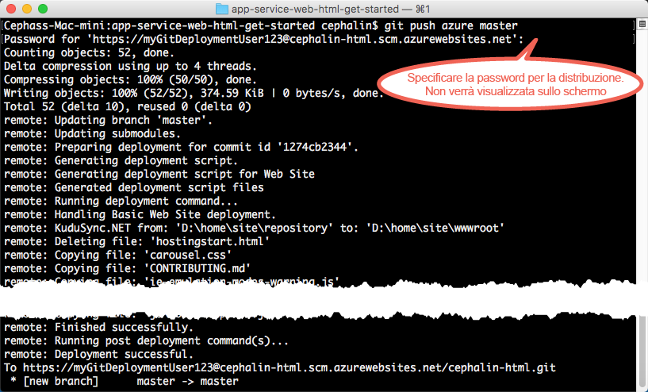

# Distribuire la prima app Web in Azure in cinque minuti
Questa esercitazione illustra come distribuire la prima app Web nel [servizio app di Azure](../app-service/app-service-value-prop-what-is.md).
Il servizio app consente di creare app Web, [back-end di app per dispositivi mobili](/documentation/learning-paths/appservice-mobileapps/) e [app per le API](../app-service-api/app-service-api-apps-why-best-platform.md).

Si apprenderà come: 

* Creare un'app Web nel servizio app di Azure.
* Distribuire codice di esempio, scegliendo tra ASP.NET, PHP, Node.js, Java o Python.
* Osservare il codice in esecuzione nell'ambiente di produzione.
* Aggiornare l'app Web nello stesso modo in cui si effettua il [push dei commit Git](https://git-scm.com/docs/git-push).

> [!INCLUDE [app-service-linux](../../includes/app-service-linux.md)]
> 
> 

## Prerequisiti
* [Git](http://www.git-scm.com/downloads).
* [Interfaccia della riga di comando di Azure](../xplat-cli-install.md).
* Un account Microsoft Azure. Se non si ha un account, è possibile [iscriversi per ottenere una versione di valutazione gratuita](/pricing/free-trial/?WT.mc_id=A261C142F) oppure [attivare i vantaggi per i sottoscrittori di Visual Studio](/pricing/member-offers/msdn-benefits-details/?WT.mc_id=A261C142F).

> [!NOTE]
> È possibile [provare il servizio app](http://go.microsoft.com/fwlink/?LinkId=523751) senza avere un account Azure. Creare un'app iniziale e provarla per un'ora, senza impegno e senza dover usare la carta di credito.
> 
> 

## Distribuire un'app Web
Verrà ora distribuita un'app Web in Servizio app di Azure.

1. Aprire un nuovo prompt dei comandi di Windows, una finestra di PowerShell, una shell di Linux o un terminale di OS X. Eseguire `git --version` e `azure --version` per verificare che Git e l'interfaccia della riga di comando di Azure siano installati nel computer.
   
    
   
    Se gli strumenti non sono stati installati, vedere i collegamenti di download nella sezione [Prerequisiti](#Prerequisites) .
2. Accedere ad Azure come segue:
   
        azure login
   
    Seguire le istruzioni del messaggio della Guida per continuare il processo di accesso.
   
    
3. Impostare l'interfaccia della riga di comando di Azure sulla modalità Azure Service Management, quindi impostare l'utente della distribuzione per il servizio app. Si distribuirà il codice usando le credenziali in un secondo momento.
   
        azure config mode asm
        azure site deployment user set --username <username> --pass <password>
4. Passare alla directory di lavoro `CD` e clonare l'app di esempio come segue:
   
        git clone <github_sample_url>
   
    
   
    Per *&lt;github_sample_url>* usare uno degli URL seguenti, a seconda del framework preferito.
   
   * HTML+CSS+JS: [https://github.com/Azure-Samples/app-service-web-html-get-started.git](https://github.com/Azure-Samples/app-service-web-html-get-started.git)
   * ASP.NET: [https://github.com/Azure-Samples/app-service-web-dotnet-get-started.git](https://github.com/Azure-Samples/app-service-web-dotnet-get-started.git)
   * PHP (CodeIgniter): [https://github.com/Azure-Samples/app-service-web-php-get-started.git](https://github.com/Azure-Samples/app-service-web-php-get-started.git)
   * Node.js (Express): [https://github.com/Azure-Samples/app-service-web-nodejs-get-started.git](https://github.com/Azure-Samples/app-service-web-nodejs-get-started.git)
   * Java: [https://github.com/Azure-Samples/app-service-web-java-get-started.git](https://github.com/Azure-Samples/app-service-web-java-get-started.git)
   * Python (Django): [https://github.com/Azure-Samples/app-service-web-python-get-started.git](https://github.com/Azure-Samples/app-service-web-python-get-started.git)
5. Passare al repository dell'app di esempio. ad esempio:
   
        cd app-service-web-html-get-started
6. Creare la risorsa app del servizio app in Azure con un nome app univoco e l'utente della distribuzione configurato prima. Quando richiesto, specificare il numero dell'area desiderata.
   
        azure site create <app_name> --git --gitusername <username>
   
    
   
    Ora l'app viene creata in Azure. La directory corrente viene inizializzata da Git e connessa alla nuova app del servizio app come Git remoto.
    È possibile passare all'URL dell'app (http://&lt;app_name>.azurewebsites.net) per visualizzare la pagina HTML predefinita. A questo punto, inserire il codice.
7. Distribuire il codice di esempio nell'app Azure nello stesso modo in cui si effettua il push di qualsiasi codice con Git. Quando richiesto, usare la password configurata prima.
   
        git push azure master
   
    
   
    Se è stato usato uno dei framework di linguaggio, verrà visualizzato un output diverso. `git push` non solo inserisce il codice in Azure, ma attiva anche le attività di distribuzione nel motore di distribuzione. Se nella radice del progetto (repository) sono presenti file package.json (Node.js) o requirements.txt (Python) o se nel progetto ASP.NET è presente un file packages.config, lo script di distribuzione ripristina automaticamente i pacchetti necessari. È anche possibile [abilitare l'estensione Composer](web-sites-php-mysql-deploy-use-git.md#composer) per elaborare automaticamente i file composer.json nell'app PHP.

La distribuzione dell'app in Servizio app di Azure è stata completata.

## Visualizzare l'app eseguita dinamicamente
Per visualizzare l'app eseguita dinamicamente in Azure, eseguire questo comando da qualsiasi directory del repository:

    azure site browse

## Eseguire aggiornamenti dell'app
Ora è possibile usare Git per effettuare in qualsiasi momento il push dalla radice del progetto (repository) per eseguire un aggiornamento del sito live. La procedura è simile a quella usata per la prima distribuzione del codice. Quando si vuole effettuare il push di una nuova modifica testata in locale, ad esempio, è sufficiente eseguire i comandi seguenti dalla radice del progetto (repository):

    git add .
    git commit -m "<your_message>"
    git push azure master

## Passaggi successivi
Trovare la procedura di sviluppo e distribuzione più adatta al framework del linguaggio:

> [!div class="op_single_selector"]
> * [.NET](web-sites-dotnet-get-started.md)
> * [PHP](app-service-web-php-get-started.md)
> * [Node.js](app-service-web-nodejs-get-started.md)
> * [Python](web-sites-python-ptvs-django-mysql.md)
> * [Java](web-sites-java-get-started.md)
> 
> 

In alternativa, è possibile fare altre prove con la prima app Web, Ad esempio:

* Provare [altri modi per distribuire il codice in Azure](web-sites-deploy.md). Per eseguire la distribuzione da un repository GitHub, ad esempio, è sufficiente selezionare **GitHub** anziché **Repository Git locale** in **Opzioni di distribuzione**.
* Ottimizzare l'app Azure: autenticare gli utenti, ridimensionare l'app in base alla richiesta e configurare alcuni avvisi sulle prestazioni, tutto con pochi clic. Vedere [Aggiungere funzionalità alla prima app Web](app-service-web-get-started-2.md).

<!----HONumber=Nov16_HO2-->

