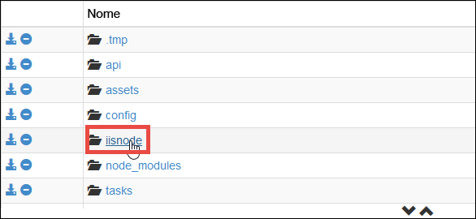
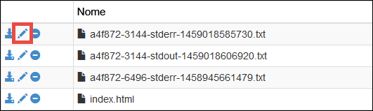
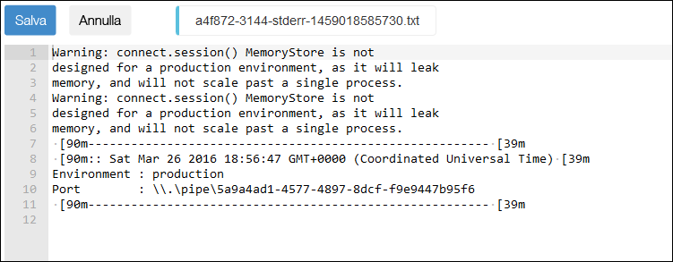

<properties
	pageTitle="Introduzione alle app Web Node.js nel servizio app di Azure"
	description="Informazioni su come distribuire un'applicazione Node.js in un'app Web nel servizio app di Azure."
	services="app-service\web"
	documentationCenter="nodejs"
	authors="rmcmurray"
	manager="wpickett"
	editor=""/>

<tags
	ms.service="app-service-web"
	ms.workload="web"
	ms.tgt_pltfrm="na"
	ms.devlang="nodejs"
	ms.topic="get-started-article"
	ms.date="03/31/2016"
	ms.author="cephalin;robmcm"/>

# Introduzione alle app Web Node.js nel servizio app di Azure

> [AZURE.SELECTOR]
- [.Net](web-sites-dotnet-get-started.md)
- [Node.JS](app-service-web-nodejs-get-started.md)
- [Java](web-sites-java-get-started.md)
- [PHP - Git](web-sites-php-mysql-deploy-use-git.md)
- [PHP - FTP](web-sites-php-mysql-deploy-use-ftp.md)
- [Python](web-sites-python-ptvs-django-mysql.md)

Questa esercitazione illustra come creare una semplice applicazione [Node.js](http://nodejs.org) e distribuirla in un'[app Web](app-service-web-overview.md) nel [servizio app di Azure](../app-service/app-service-value-prop-what-is.md) da una riga di comando come cmd.exe o bash. Le istruzioni di questa esercitazione possono essere eseguite in qualsiasi sistema operativo in grado di eseguire Node.js.

[App Web del servizio app di Azure](/services/app-service/web/)

<a name="prereq"/>
## Prerequisiti

- Node.js. I file binari per l'installazione sono disponibili [qui](https://nodejs.org/).
- Yoeman. Le istruzioni per l'installazione sono disponibili [qui](http://yeoman.io/).
- Git. I file binari per l'installazione sono disponibili [qui](http://www.git-scm.com/downloads).
- Interfaccia della riga di comando di Azure. Le istruzioni per l'installazione sono disponibili [qui](../xplat-cli-install.md).
- Un account Microsoft Azure. Se non è disponibile un account, è possibile [iscriversi per ottenere una versione di valutazione gratuita](/pricing/free-trial/?WT.mc_id=A261C142F) oppure [attivare i benefici della sottoscrizione di Visual Studio](/pricing/member-offers/msdn-benefits-details/?WT.mc_id=A261C142F).

## Creare e distribuire una semplice app Web Node.js

1. Aprire il terminale della riga di comando che si è scelto di usare e installare il [generatore di Express per Yoeman](https://github.com/petecoop/generator-express).

        npm install -g generator-express

2. Eseguire `CD` in una directory di lavoro e generare un'app Express come indicato di seguito:

        yo express
        
    Scegliere le opzioni seguenti quando richiesto:

    `? Would you like to create a new directory for your project?` **Yes** `? Enter directory name` **&lt;appname>** `? Select a version to install:` **MVC** `? Select a view engine to use:` **Jade** `? Select a css preprocessor to use (Sass Requires Ruby):` **None** `? Select a database to use:` **None** `? Select a build tool to use:` **Grunt**

3. Eseguire `CD` nella directory radice della nuova app e avviarla per assicurarsi che venga eseguita nell'ambiente di sviluppo:

        npm start

    Nel browser passare a [http://localhost:3000](http://localhost:3000) per assicurarsi che sia possibile visualizzare la home page di Express. Dopo aver verificato la corretta esecuzione dell'app, usare `Ctrl-C` per arrestarla.
    
1. Accedere ad Azure come indicato di seguito, per farlo è necessaria [l'interfaccia della riga di comando di Azure](#prereq):

        azure login

    Seguire le istruzioni per continuare l'accesso in un browser usando un account con la sottoscrizione di Azure.

2. Assicurarsi di essere ancora nella directory radice dell'app. Creare la risorsa dell'app del servizio app in Azure con un nome app univoco con il comando successivo. L'URL dell'app Web sarà http://&lt;appname>.azurewebsites.net.

        azure site create --git <appname>

    Seguire le istruzioni e selezionare un'area di Azure in cui eseguire la distribuzione. Se non sono mai state configurate credenziali di distribuzione Git/FTP per la sottoscrizione di Azure, verrà chiesto di crearle.

3. Aprire config/config.js e modificare la porta di produzione in `process.env.port`. L'oggetto JSON di produzione dovrebbe essere simile al seguente:

        production: {
            root: rootPath,
            app: {
                name: 'express1'
            },
            port: process.env.port,
        }

    In questo modo l'app Node.js può rispondere alle richieste Web inviate alla porta predefinita su cui iisnode è in ascolto.
    
4. Salvare le modifiche e usare Git per distribuire l'app in Azure:

        git add .
        git commit -m "<your commit message>"
        git push azure master

    Il generatore di Express fornisce già un file con estensione gitignore, quindi il tentativo di caricare la directory node\_modules/ da parte di `git push` non occupa larghezza di banda.

5. Infine, avviare l'app Azure attiva nel browser:

        azure site browse

    Dovrebbe essere possibile visualizzare l'app Web Node.js in esecuzione nel servizio app di Azure.
    
    

## Aggiornare l'app Web Node.js

Per aggiornare l'app Web Node.js in esecuzione nel servizio app, è sufficiente eseguire `git add`, `git commit` e `git push` come per la distribuzione iniziale.
     
## Distribuzione dell'app Node.js da parte del servizio app

Il servizio app di Azure usa [iisnode](https://github.com/tjanczuk/iisnode/wiki) per eseguire le app Node.js. L'interfaccia della riga di comando di Azure e il motore Kudu (distribuzione Git) collaborano per semplificare l'esperienza di sviluppo e distribuzione di app Node.js dalla riga di comando.

- `azure site create --git` riconosce il modello di Node.js comune di server.js o app.js e nella directory radice crea un file iisnode.yml, che può essere usato per personalizzare iisnode.
- In corrispondenza di `git push azure master` Kudu consente di automatizzare le attività di distribuzione seguenti:

    - Se il file package.json si trova nella radice del repository, eseguire `npm install --production`.
    - Generare un file Web.config per iisnode che punta al proprio nello script di avvio in package.json, ad esempio server.js o app.js.
    - Personalizzare Web.config per preparare l'app per il debug con Node-Inspector.
    
## Usare un framework di Node.js

Le app sviluppate usando i framework di Node.js più diffusi, ad esempio [Sails.js](http://sailsjs.org/) o [MEAN.js](http://meanjs.org/), possono essere distribuite nel servizio app. I framework di Node.js più diffusi hanno caratteristiche non standard specifiche e le relative dipendenze dei pacchetti vengono aggiornate continuamente. Tuttavia, nel servizio app sono disponibili i log stdout e stderr che permettono di capire esattamente cosa sta facendo l'app e apportare le modifiche necessarie. Per altre informazioni, vedere la sezione [Ottenere log stdout e stderr da iisnode](#iisnodelog).

Le esercitazioni seguenti mostrano come usare un framework specifico nel servizio app:

- [Distribuire un'app Web Sails.js nel servizio app di Azure](app-service-web-nodejs-sails.md)
- [Creazione di un'applicazione di chat Node.js con Socket.IO in Servizio app di Azure](web-sites-nodejs-chat-app-socketio.md)
- [Come utilizzare io.js con Azure applicazione servizio Web App](web-sites-nodejs-iojs.md)

## Usare un motore Node.js specifico

In un normale flusso di lavoro è possibile fare in modo che il servizio app usi un motore Node.js specifico, come accade in package.json. Ad esempio:

    "engines": {
        "node": "5.5.0"
    }, 

Il motore di distribuzione Kudu determina quale motore Node.js usare nell'ordine seguente:

- Vedere prima di tutto in iisnode.yml se viene specificato `nodeProcessCommandLine`. Se viene specificato, è possibile usarlo.
- Vedere poi in package.json se viene specificato `"node": "..."` nell'oggetto `engines`. Se viene specificato, è possibile usarlo.
- Scegliere una versione predefinita di Node.js per impostazione predefinita.

<a name="iisnodelog" />
## Ottenere log stdout e stderr da iisnode

Per leggere i log di iisnode, seguire questa procedura:

1. Aprire il file iisnode.yml indicato nell'interfaccia della riga di comando di Azure.

2. Impostare i due parametri seguenti:

        loggingEnabled: true
        logDirectory: iisnode
    
    Questi due parametri indicano a iisnode nel servizio app di inserire l'output di stdout e stderr nella directory D:\\home\\site\\wwwroot**iisnode**.

3. Salvare le modifiche ed eseguirne il push in Azure con i comandi Git seguenti:

        git add .
        git commit -m "<your commit message>"
        git push azure master
   
   Ora iisnode è configurato. I passaggi successivi illustrano come accedere a tali log.
     
4. Nel browser, accedere alla console di debug di Kudu per l'app, che si trova in:

        https://<appname>.scm.azurewebsites.net/DebugConsole 

5. Passare a D:\\home\\site\\wwwroot\\iisnode

    

6. Fare clic sull'icona di **modifica** del log che si vuole leggere. È anche possibile fare clic sulle icone di **download** o di **eliminazione**.

    

    Ora è possibile visualizzare il log per eseguire il debug della distribuzione del servizio app.
    
    

## Eseguire il debug dell'app con Node-Inspector

Se si usa Node-Inspector per eseguire il debug delle app Node.js, è possibile usarlo anche per l'app del servizio app attiva. Node-Inspector è preinstallato nell'installazione di iisnode per il servizio app. Se si esegue la distribuzione tramite Git, il file Web.config generato automaticamente da Kudu contiene già tutta la configurazione necessaria per abilitare Node-Inspector.

Per abilitare Node-Inspector, seguire questa procedura:

1. Aprire iisnode.yml nella radice del repository e specificare i parametri seguenti: 

        debuggingEnabled: true
        debuggerExtensionDll: iisnode-inspector.dll

3. Salvare le modifiche ed eseguirne il push in Azure con i comandi Git seguenti:

        git add .
        git commit -m "<your commit message>"
        git push azure master
   
4. A questo punto è sufficiente passare al file di avvio dell'app specificato dallo script di avvio in package.json, aggiungendo /debug all'URL. Ad esempio,

        http://<appname>.azurewebsites.net/server.js/debug
    
    Oppure
    
        http://<appname>.azurewebsites.net/app.js/debug

## Altre risorse

- [Specifica di una versione di Node.js in un'applicazione Azure](../nodejs-specify-node-version-azure-apps.md)
- [Come eseguire il debug di un'app Web Node.js nel servizio app di Azure](web-sites-nodejs-debug.md)
- [Utilizzo di moduli Node.js con le applicazioni Azure](../nodejs-use-node-modules-azure-apps.md)
- [Blog sulle app Web del servizio app di Azure: Node.js](http://blogs.msdn.com/b/silverlining/archive/2012/06/14/windows-azure-websites-node-js.aspx)
- [Centro per sviluppatori di Node. js](/develop/nodejs/)
- [Introduzione alle app Web in Servizio app di Azure](app-service-web-get-started.md)

<!---HONumber=AcomDC_0406_2016-->