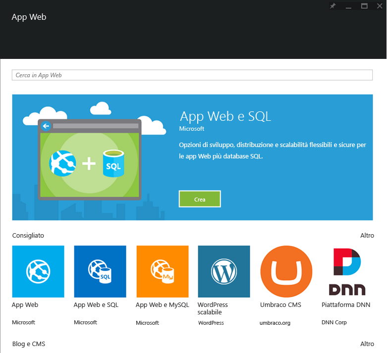

<properties
	pageTitle="Panoramica di App Web"
	description="Informazioni su App Web del servizio app"
	services="app-service\web"
	documentationCenter=""
	authors="jaime-espinosa"
	manager="wpickett"
	editor="jimbe"/>

<tags
	ms.service="app-service-web"
	ms.workload="web"
	ms.tgt_pltfrm="na"
	ms.devlang="na"
	ms.topic="article"
	ms.date="07/17/2015"
	ms.author="jaime.espinosa"/>

#Panoramica di App Web

Il [servizio app](http://go.microsoft.com/fwlink/?LinkId=529714) è una piattaforma completamente gestita per sviluppatori professionali che offre un set completo di funzionalità per scenari Web, mobili e di integrazione. Grazie a questo servizio, sarà possibile creare e distribuire app Web di importanza strategica scalabili in base alle esigenze aziendali tramite il servizio app di Azure.

È possibile sfruttare la potenza di [App Web del servizio app](http://go.microsoft.com/fwlink/?LinkId=529714) per usare i linguaggi e i framework che si conoscono meglio e su cui si basa il proprio lavoro, per distribuire velocemente le applicazioni nel cloud di Azure e per migliorare continuamente il codice senza doversi mai più preoccupare delle tematiche legate all'infrastruttura.

## Molto più di semplici siti Web##

Le aziende moderne interagiscono con i propri clienti in modi sempre più sofisticati. Imprese di ogni tipo considerano la propria presenza sul Web un aspetto critico della propria attività, nonché un componente principale del proprio business plan. Per adeguarsi a questa priorità, le aziende hanno bisogno di una piattaforma che fornisca loro l'agilità, la sicurezza e la scalabilità necessarie. Inoltre, devono essere in grado di collegarsi al proprio sistema aziendale esistente, di distribuire nuovo codice e avviare nuove istanze rapidamente e a livello globale. Con il servizio app di Azure e le app Web, le organizzazioni sono finalmente in grado di soddisfare i propri clienti in modo rapido ed economico.

## Perché passare al servizio app Web? ##

App Web del servizio app di Azure è una piattaforma completamente gestita che consente di creare, distribuire e ridimensionare app Web aziendali nel giro di pochi secondi. Il servizio consente di concentrarsi sul codice dell'applicazione, lasciando che sia Azure occuparsi dell'infrastruttura per il ridimensionamento e l'esecuzione in sicurezza. App Web offre:

- **Familiarità e rapidità**: è possibile sfruttare le proprie conoscenze esistenti e scrivere codice nel linguaggio, framework e IDE di propria scelta. Con pochi clic è possibile aggiungere il controllo delle versioni, aggiornamenti, single sign-on, broker identità, spazio di memorizzazione isolato e monitoraggio delle prestazioni alle app Web esistenti. Accesso a una raccolta completa da usare come base per accelerare le attività di sviluppo. Produttività degli sviluppatori senza eguali grazie a funzionalità di eccellenza quali integrazione continua, debug live e IDE di Visual Studio leader del settore.
- **Applicazioni aziendali**: il servizio app Web è stato ideato per creare e ospitare applicazioni di importanza strategica in tutta sicurezza. È possibile creare app aziendali integrate con Active Directory che si connettono in modo sicuro a risorse locali, quindi ospitarle in una piattaforma cloud sicura conforme agli standard ISO, SOC2 e PCI. Il tutto con i vantaggi offerti da contratti di servizio di livello enterprise.
- **Scalabilità globale**: il servizio app Web è ottimizzato per fornire disponibilità e scalabilità automatica per infrastrutture di data center globali. Le dimensioni delle applicazioni possono essere aumentate o ridotte su richiesta. La disponibilità elevata è fornita sia all'interno che all'esterno delle specifiche aree geografiche. La replica dei dati e l'hosting dei servizi in più aree sono attività semplici e rapide e l'espansione in nuove aree geografiche è ottenibile con un semplice clic del mouse.  

## Concetti del servizio app Web ##

- **Raccolta app Web**: è possibile scegliere da un elenco in continua crescita di modelli di applicazione esistenti. È possibile sfruttare le migliori offerte della community di app OSS per installare in un singolo clic pacchetti come Wordpress, Joomla e Drupal. Avviare il proprio processo di sviluppo delle applicazioni nel modo migliore sfruttando framework come .NET MVC, Django e CakePHP.
- **Scalabilità automatica**: il servizio app Web consente di aumentare o scalare orizzontalmente le app in modo rapido, per gestire qualsiasi carico di lavoro proveniente dalla clientela. Selezionare manualmente il numero e le dimensioni delle macchine virtuali o configurare la scalabilità automatica per adattare i server in base al carico o alla pianificazione.
- **Integrazione continua**: configurare l'integrazione continua e i flussi di lavoro di distribuzione con VSO, GitHub, TeamCity, Hudson o BitBucket, per compilare, testare e distribuire automaticamente l'app Web dopo ogni archiviazione di codice o test di integrazione eseguito con esito positivo.
- **Slot di distribuzione**: implementare la [distribuzione di gestione temporanea][Slots] e per verificare il codice in un ambiente pre-produzione identico a quello dell'app Web di produzione nel servizio app di Azure. Una volta soddisfatti, rilasciare una nuova versione dell'app con tempo di inattività pari a zero eseguendo un'operazione di scambio. 
- **Test in produzione**: portare la pre-distribuzione al livello successivo ed eseguire il test A/B per verificare il nuovo codice con una frazione configurabile del proprio traffico live. 
- **Webjobs**: eseguire qualsiasi programma o script nelle VM del servizio app Web. È possibile eseguire i processi in modo continuo o in base a una pianificazione e ridimensionarli per essere eseguiti in più VM. Usare [WebJobs SDK][Webjobs] di Azure per eseguire l'integrazione con l'archiviazione o con il bus di servizio di Azure.
- **Connessioni ibride** - - Accedere ai dati locali tramite [connessioni ibride](../integration-hybrid-connection-overview.md) e [VNET](../app-service-web/web-sites-integrate-with-vnet.md).

## Introduzione ##
Per iniziare a usare App Web, seguire l'esercitazione [Creare un'app Web ASP.NET][create].

Per altre informazioni sulla piattaforma del servizio app di Azure, vedere [Servizio app di Azure][appservice].

>[AZURE.NOTE]Per iniziare a usare il servizio app di Azure prima di registrarsi per ottenere un account Azure, andare a [Prova il servizio app](http://go.microsoft.com/fwlink/?LinkId=523751), dove è possibile creare un'app Web iniziale temporanea nel servizio app. Non è necessario fornire una carta di credito né impegnarsi in alcun modo.

## Modifiche apportate
* Per una guida relativa al passaggio da Siti Web al servizio app, vedere [Servizio app di Azure e impatto sui servizi di Azure esistenti](http://go.microsoft.com/fwlink/?LinkId=529714)
* Per una guida relativa al passaggio dal portale precedente al nuovo portale, vedere [Informazioni di riferimento per l'esplorazione del portale di anteprima](http://go.microsoft.com/fwlink/?LinkId=529715)

[appservice]: ../app-service/app-service-value-prop-what-is.md
[create]: web-sites-dotnet-get-started.md
[Webjobs]: websites-dotnet-webjobs-sdk-get-started.md
[Slots]: web-sites-staged-publishing.md

 

<!---HONumber=Oct15_HO3-->