<properties
	pageTitle="Creazione di un'app Web ASP.NET nel servizio app di Azure"
	description="In questa esercitazione viene illustrato come creare un progetto Web ASP.NET in Visual Studio 2013 e distribuirlo in un'app Web nel servizio app di Azure. Consente di creare ed eseguire un'app nel cloud in meno di 15 minuti."
	services="app-service\web"
	documentationCenter=".net"
	authors="tdykstra"
	manager="wpickett"
	editor="mollybos"/>

<tags
	ms.service="app-service-web"
	ms.workload="web"
	ms.tgt_pltfrm="na"
	ms.devlang="dotnet"
	ms.topic="get-started-article" 
	ms.date="03/24/2015"
	ms.author="tdykstra"/>

# Creazione di un'app Web ASP.NET nel servizio app di Azure

## Panoramica

In questa esercitazione viene illustrato come creare un'applicazione Web ASP.NET e distribuirla nel [Servizio app per app Web](http://go.microsoft.com/fwlink/?LinkId=529714) tramite Visual Studio 2013 o Visual Studio 2013 Express per Web. Nell'esercitazione si presuppone che l'utente non abbia mai usato Azure o ASP.NET. Al termine dell'esercitazione, si avrà un'applicazione Web semplice in esecuzione nel cloud.

Si apprenderà come:

* Abilitare il sistema per lo sviluppo in Azure installando Azure SDK.
* Come creare un progetto Web ASP.NET di Visual Studio e distribuirlo in un'app Web di Azure.
* Apportare una modifica al progetto Web e ridistribuire l'applicazione.
* Come usare il [Portale di Azure](http://go.microsoft.com/fwlink/?LinkId=529715) per monitorare e gestire la propria app Web.

Per completare l'esercitazione, è necessario un account Azure.

* È possibile [aprire un account Azure gratuitamente](/pricing/free-trial/?WT.mc_id=A261C142F) . Si riceveranno dei crediti da usare per provare i servizi di Azure a pagamento e anche dopo avere esaurito i crediti, è possibile mantenere l'account per usare i servizi di Azure gratuiti, ad esempio il servizio app per app Web.
* È possibile [attivare i benefici della sottoscrizione MSDN](/pricing/member-offers/msdn-benefits-details/?WT.mc_id=A261C142F). Con la sottoscrizione MSDN ogni mese si accumulano crediti che è possibile usare per i servizi di Azure a pagamento.</li>

Nella figura seguente è illustrata l'applicazione completata:

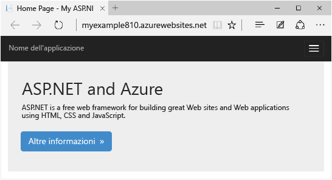

##Iscrizione a Microsoft Azure (video)

In questo video, Scott Hanselman illustra la facilità di iscrizione a una versione di valutazione gratuita di Microsoft Azure. (Durata: 1:58)

> [AZURE.VIDEO sign-up-for-microsoft-azure]

[AZURE.INCLUDE [install-sdk-2013-only](../../includes/install-sdk-2013-only.md)]

## Creazione di un'applicazione Web ASP.NET

Il primo passaggio consiste nel creare un progetto di applicazione Web. L'app Web di Azure in cui distribuire in seguito il progetto verrà creata automaticamente in Visual Studio.

1. Aprire Visual Studio 2013 o Visual Studio 2013 Express per il Web.

2. Scegliere **Nuovo progetto** dal menu **File**.

3. Nella finestra di dialogo **Nuovo progetto** fare clic su **C#** > **Web** > **Applicazione Web ASP.NET**. Se si preferisce, è possibile scegliere **Visual Basic**.

3. Assicurarsi che come framework di destinazione sia selezionata l'opzione **.NET Framework 4.5**.

4. Cancella il **aggiungere Application Insights al progetto** casella di controllo.

4. Assegnare all'applicazione il nome **Esempio** e fare clic su **OK**.

	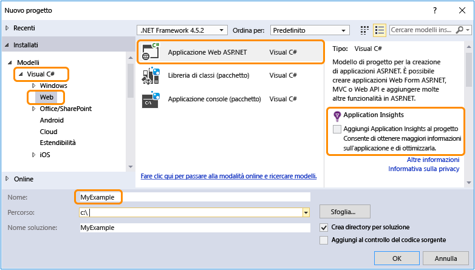

5. Nella finestra di dialogo **Nuovo progetto ASP.NET** selezionare il modello **MVC**. Se si preferisce usare Web Form ASP.NET, è possibile selezionare il modello **Web Form**.

	[MVC e Web Form](http://www.asp.net/get-started/websites) sono framework di ASP.NET per lo sviluppo di app Web. Per questa esercitazione è possibile scegliere l'uno o l'altro, ma se si sceglie Web Form, in seguito sarà necessario modificare *Default.aspx* nel punto in cui l'esercitazione indica di modificare il file *Index.cshtml*.

7. Fare clic su **Modifica autenticazione**.

	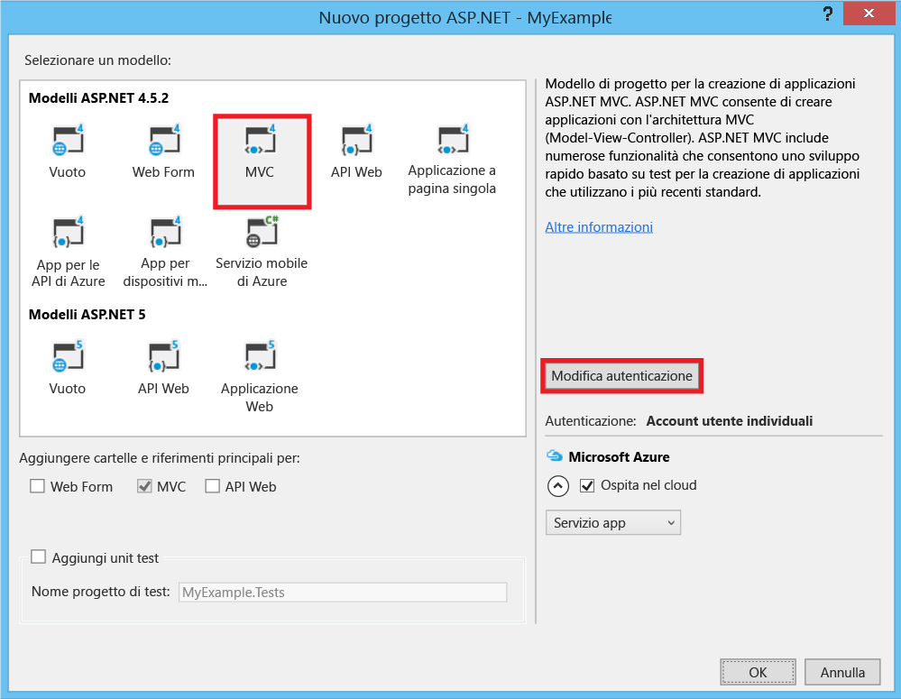

6. Nella finestra di dialogo **Modifica autenticazione** fare clic su **Nessuna autenticazione**, quindi fare clic su **OK**.

	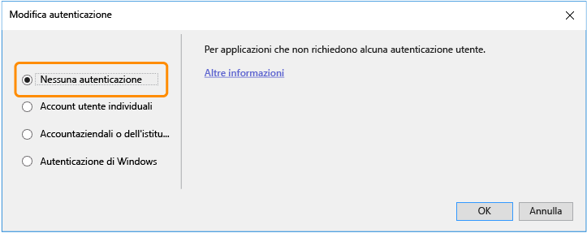

	L'applicazione di esempio che verrà creata non consente agli utenti di effettuare l'accesso. Nella sezione [Passaggi successivi](#next-steps) sono riportati collegamenti a un'esercitazione che consente di implementare l'autenticazione e l'autorizzazione.

5. Nella finestra di dialogo **Nuovo progetto ASP.NET**, lasciare invariate le impostazioni in **MicrosoftAzure**, quindi fare clic su **OK**.

	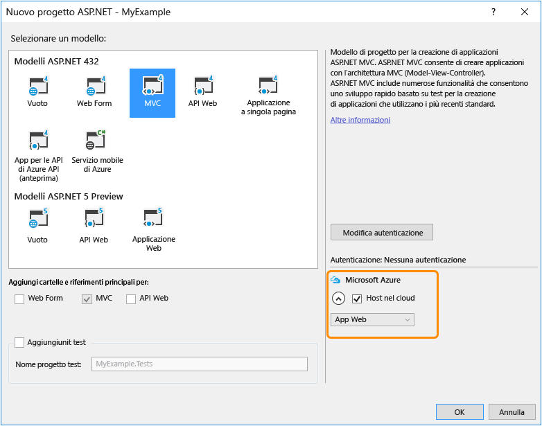

	Con le impostazioni predefinite in Visual Studio verrà creata un'app Web di Azure per il progetto Web. Nella sezione successiva dell'esercitazione il progetto Web verrà quindi distribuito nell'app Web appena creata.

5. Se non è già stato effettuato l'accesso ad Azure, verrà chiesto di farlo. Accedere con l'ID e la password dell'account che si utilizza per gestire la sottoscrizione Azure.

	Dopo aver effettuato l'accesso, nella finestra di dialogo **Configurazione impostazioni app Web di Microsoft Azure** viene chiesto di indicare le risorse che si desidera creare.

	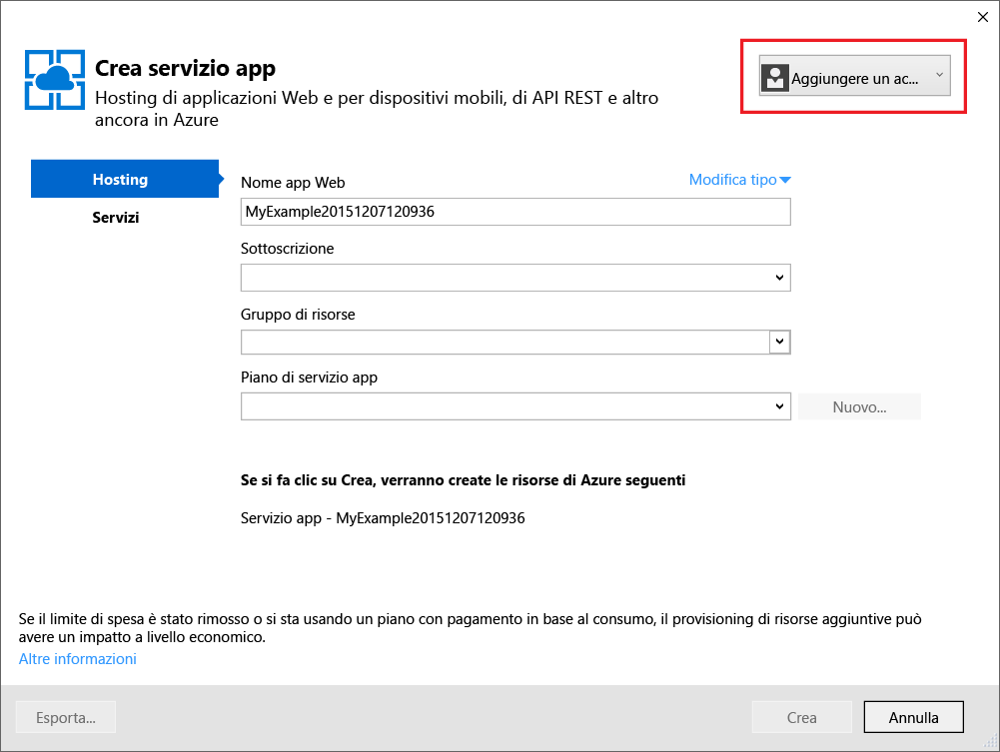

3. Nel **configurare impostazioni di Microsoft Azure Web App** finestra di dialogo, lasciare il valore predefinito.

	È possibile immettere un altro **nome dell'applicazione Web** se si preferisce, ma il nome deve essere univoco nel *azurewebsites.net* dominio. Il nome predefinito fornite da Visual Studio è univoco.

	Azure utilizzerà questo nome come prefisso per l'URL dell'applicazione. L'URL completo sarà costituito da quanto immesso in questa casella e da *.azurewebsites.net* (come mostrato accanto alla casella di testo **Nome app Web**). Ad esempio, se il nome del sito è `MyExample6442`, l'URL sarà `MyExample6442.azurewebsites.net`. L'URL deve essere univoco. Se l'URL immesso è già stato usato da un altro utente, a destra, invece di un segno di spunta verde, verrà visualizzato un punto esclamativo rosso e sarà necessario specificare un nome diverso.

4. Nel **piano di servizio App** elenco a discesa, selezionare **Crea nuovo piano di servizio App**.

	Il [passaggi successivi](#next-steps) alla fine dell'esercitazione include collegamenti a informazioni sui piani di servizio dell'applicazione.

5. Immettere *MyExamplePlan*, o un altro nome se si preferisce, il nome del piano.

6. Nel **gruppo di risorse** elenco a discesa, selezionare **Crea nuovo gruppo di risorse**.

	Il [passaggi successivi](#next-steps) include collegamenti a informazioni sui gruppi di risorse.

5. Immettere *MyExampleResourceGroup*, o un altro nome se si preferisce, il nome del gruppo di risorse.

5. Nell'elenco a discesa **Region** scegliere la posizione più vicina.

	Questa impostazione consente di specificare il data center di Azure in cui verrà eseguito il sito Web. Questa impostazione consente di specificare il data center di Azure in cui verrà eseguita l'app Web. Per questa esercitazione è possibile selezionare qualsiasi area senza riscontrare differenze evidenti, ma per un'app Web di produzione è consigliabile che il server Web sia il più vicino possibile ai browser che accedono al sito in modo da ridurre al minimo la [latenza](http://www.bing.com/search?q=web%20latency%20introduction&qs=n&form=QBRE&pq=web%20latency%20introduction&sc=1-24&sp=-1&sk=&cvid=eefff99dfc864d25a75a83740f1e0090).

5. Lasciare inalterati i campi relativi al database.

	Per questa esercitazione non verrà utilizzato un database. Nella sezione [Passaggi successivi](#next-steps) alla fine dell'esercitazione è riportato un collegamento a un'esercitazione in cui viene illustrato l'utilizzo di un database.

6. Fare clic su **OK**.

	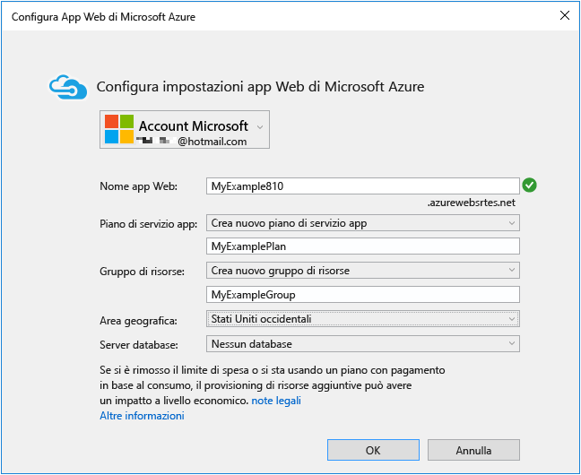

	Dopo pochi secondi il progetto Web verrà creato nella cartella specificata in Visual Studio e l'app Web verrà creata nell'area di Azure specificata.

	Nella finestra **Esplora soluzioni** sono visualizzati i file e le cartelle presenti nel nuovo progetto.

	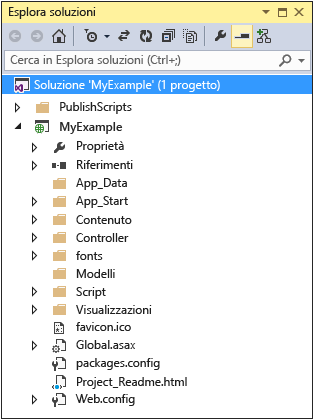

	Nella finestra **Attività di pubblicazione sito Web** viene visualizzato un messaggio per indicare che l'app Web è stato creata.

	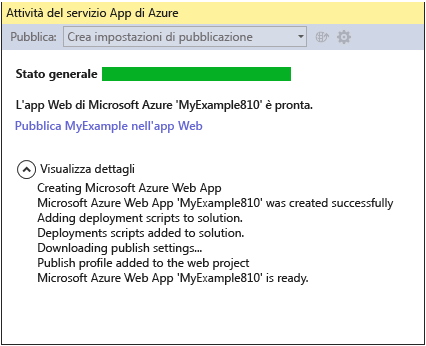

	L'app Web viene visualizzata in Esplora server.

	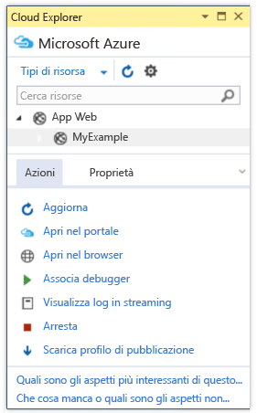

## Distribuzione dell'applicazione in Azure

7. Nella finestra **Attività di pubblicazione sito Web** fare clic su **Pubblica MyExample in questa app Web ora**.

	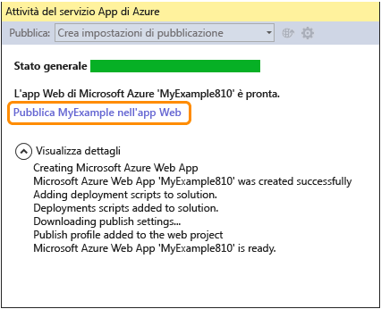

	Dopo pochi secondi verrà visualizzata la procedura guidata **Publish Web**

	Le impostazioni di cui Visual Studio ha bisogno per distribuire il progetto in Azure sono state salvate in un *profilo di pubblicazione*. La procedura guidata consente di esaminarle e modificarle.

8. Nella scheda **Connection** della procedura guidata **Publish Web** fare clic su **Validate Connection** per assicurarsi che Visual Studio sia in grado di connettersi ad Azure per distribuire il progetto Web.

	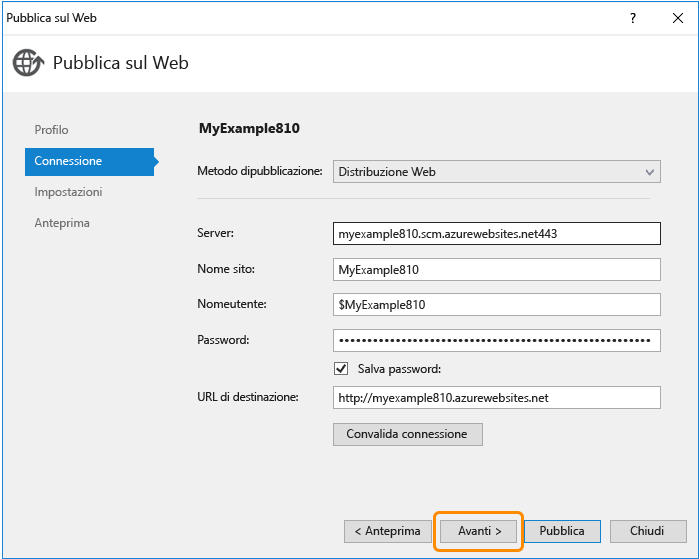

	Dopo la convalida della connessione, accanto al pulsante **Validate Connection** verrà visualizzato un segno di spunta verde.

9. Fare clic su **Avanti**.

	

10. Nella scheda **Impostazioni** fare clic su **Avanti**.

	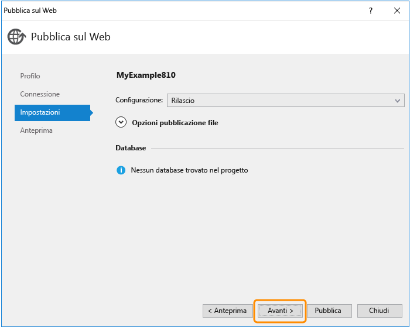

	È possibile accettare i valori predefiniti per **Configurazione** e **Opzioni di pubblicazione file**.

	L'elenco a discesa **Configurazione** consente di distribuire una build di debug per il debug remoto. Nella sezione [Passaggi successivi](#next-steps) è incluso il collegamento a un'esercitazione che illustra come eseguire Visual Studio in modalità di debug in remoto.

	Se si espande **Opzioni di pubblicazione file**, appariranno diverse impostazioni che consentono di gestire scenari non applicabili a questa esercitazione:

	* Rimuovi i file aggiuntivi nella destinazione.

		Elimina eventuali file nel server che non sono presenti nel progetto. Può essere utile se si intende distribuire un progetto in un'app Web in cui in precedenza è stato distribuito un progetto diverso.

	* Precompila durante la pubblicazione.

		Consente di ridurre i tempi di preparazione della prima richiesta per le applicazioni di grandi dimensioni.

	* Escludi file dalla cartella App_Data.

		Per eseguire test, è talvolta necessario disporre in App_Data di un file di database SQL Server da non distribuire in produzione.

11. Nella scheda **Preview** fare clic su **Start Preview**.

	

	Nella scheda viene visualizzato un elenco dei file che verranno copiati nel server. La visualizzazione dell'anteprima non è necessaria per pubblicare l'applicazione, ma è una funzione utile da conoscere.

12. Fare clic su **Pubblica**.

	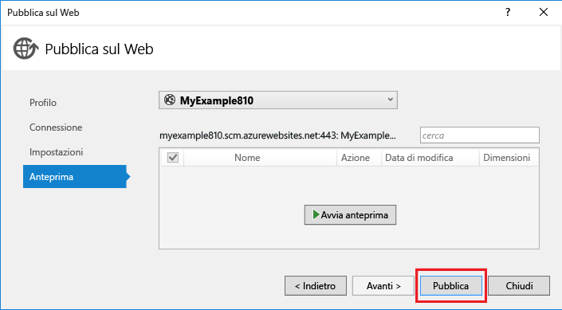

	In Visual Studio verrà avviato il processo di copia dei file nel server Azure.

	Nelle finestre **Output** e **Web Publish Activity** vengono indicate le azioni effettuate e viene segnalato il corretto completamento della distribuzione.

	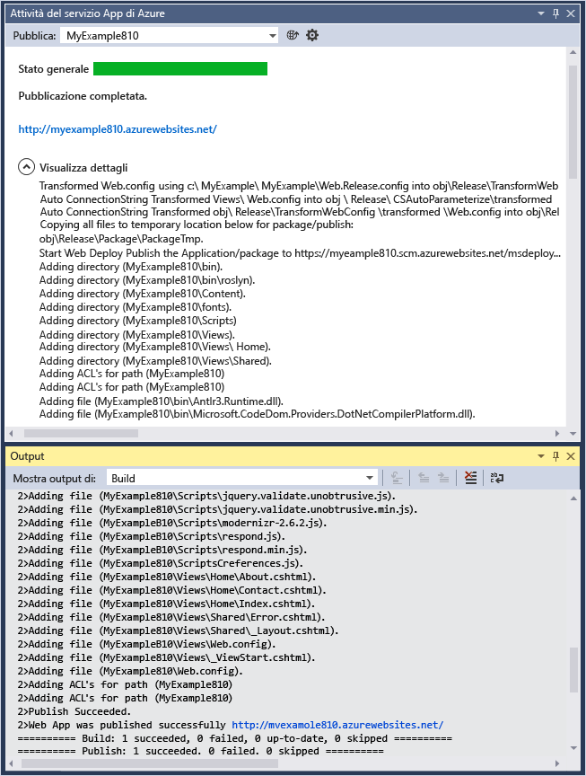

	Dopo la corretta distribuzione, verrà automaticamente aperto il browser predefinito all'URL dell'app Web distribuita e l'applicazione creata risulterà in esecuzione nel cloud. L'URL nella barra degli indirizzi del browser indica che l'app Web viene caricata da Internet.

	

13. Chiudere il browser.

## Inserire una modifica e ridistribuire

In questa sezione dell'esercitazione si modificherà l'intestazione **h1** della home page, quindi si eseguirà il progetto in locale nel computer di sviluppo per verificare la modifica e infine si distribuirà la modifica in Azure.

2. Aprire il file *Views/Home/Index.cshtml* o *.vbhtml* in **Esplora soluzioni**, modificare l'intestazione **h1** da "ASP.NET" in "ASP.NET and Azure", quindi salvare il file.

	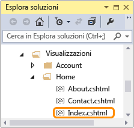

	

1. Premere CTRL+F5 per visualizzare l'intestazione aggiornata eseguendo l'app Web nel computer locale.

	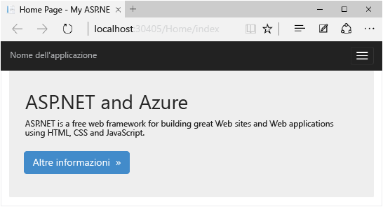

	L'URL `http://localhost` indica che l'applicazione viene eseguita nel computer locale. Per impostazione predefinita, viene eseguita in IIS Express, una versione semplificata di IIS progettata per l'utilizzo durante lo sviluppo di applicazioni Web.

1. Chiudere il browser.

1. In **Esplora soluzioni** fare clic con il pulsante destro del mouse sul progetto, quindi scegliere **Pubblica**.

	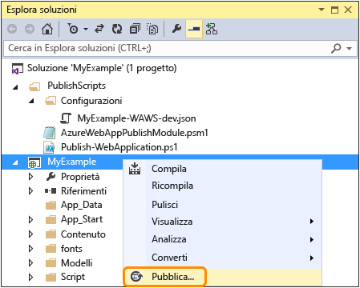

	Verrà visualizzata la scheda Anteprima della procedura guidata **Pubblica sito Web**. Se è necessario modificare una qualsiasi impostazione di pubblicazione, è possibile scegliere una scheda diversa, tuttavia in questo caso si desidera solo eseguire la ridistribuzione con le stesse impostazioni.

2. Nella procedura guidata **Pubblica sito Web** fare clic su **Pubblica**.

	

	Il progetto verrà distribuito in Azure e l'app Web verrà aperta nel browser predefinito.

	

**Nota:** è possibile abilitare la barra degli strumenti **Sito Web - Pubblicazione con un clic** per una distribuzione ancora più rapida. Fare clic su **Visualizza** > **Barre degli strumenti**, quindi selezionare **Sito Web - Pubblicazione con un clic**. La barra degli strumenti consente di selezionare un profilo, fare clic su un pulsante per pubblicare oppure per aprire la procedura guidata **Pubblica sito Web**.

## Monitorare e gestire l'app Web nel portale di gestione

Il [portale di gestione di Azure](/services/management-portal/) è un'interfaccia Web che consente di gestire e monitorare i servizi di Azure, ad esempio l'app Web appena creata. In questa sezione dell'esercitazione verranno esaminate alcune delle operazioni che è possibile eseguire nel portale.

1. Nel browser passare a [https://portal.azure.com]() e accedere con le credenziali di Azure.

2. Fare clic su **Sfoglia > App Web**, quindi fare clic sul nome dell'app Web.

	Nel pannello **App Web** dell'app Web viene visualizzata una panoramica delle statistiche di utilizzo e dei collegamenti per le funzioni di gestione dell'app Web utilizzate.

	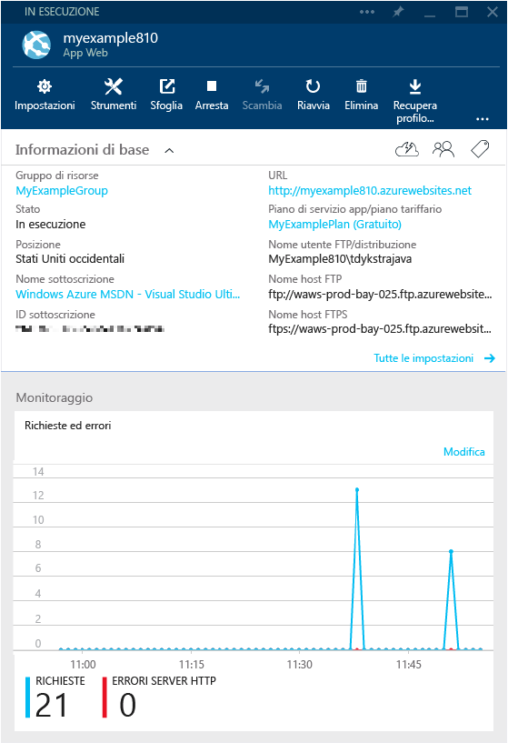-->

	A questo punto il traffico dell'app Web è poco rilevante ed è quindi possibile che il grafico non visualizzi nulla. Se si passa all'applicazione, si aggiorna la pagina alcune volte; pertanto si aggiorna la pagina del portale e vengono visualizzate alcune statistiche.

3. Fare clic su **Tutte le impostazioni** per visualizzare ulteriori opzioni di configurazione dell'app Web.

	Viene visualizzato un elenco di tipi di impostazioni.

	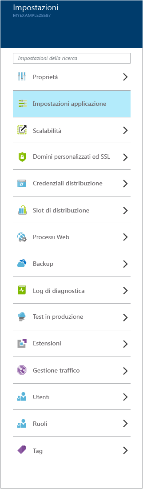-->

4. Fare clic su **Impostazioni applicazione** per visualizzare un esempio dei tipi di impostazioni che è possibile configurare nel portale.

	Ad esempio, è possibile controllare la versione di .NET utilizzata per l'app Web, attivare funzionalità quali [WebSockets](/blog/2013/11/14/introduction-to-websockets-on-windows-azure-web-sites/), impostare [valori della stringa di connessione](/blog/2013/07/17/windows-azure-web-sites-how-application-strings-and-connection-strings-work/) e altro ancora.

	

Queste sono solo alcune delle funzionalità del portale di gestione. È possibile creare nuove app Web, eliminare app Web esistenti, arrestare e riavviare app Web, nonché gestire altri tipi di servizi di Azure, come database e macchine virtuali.

>[AZURE.NOTE]Per iniziare a usare Servizio app di Azure prima di registrarsi per ottenere un account Azure, andare a [Prova il servizio app](http://go.microsoft.com/fwlink/?LinkId=523751), dove è possibile creare un'app Web iniziale temporanea nel servizio app. Non è necessario fornire una carta di credito né impegnarsi in alcun modo.

## Passaggi successivi

In questa esercitazione sono state illustrate le procedure per creare una semplice applicazione Web e distribuirla in un'app Web di Azure. Di seguito sono elencati alcuni argomenti e risorse correlate cui fare riferimento per altre informazioni su queste procedure:

* Altri modi per distribuire un progetto Web

	In questa esercitazione è stata illustrata la procedura più rapida per creare un'app Web e distribuirla con un'unica operazione. Per una panoramica su altre modalità di distribuzione, tramite Visual Studio o [automatizzando la distribuzione](http://www.asp.net/aspnet/overview/developing-apps-with-windows-azure/building-real-world-cloud-apps-with-windows-azure/continuous-integration-and-continuous-delivery) da un [sistema di controllo del codice](http://www.asp.net/aspnet/overview/developing-apps-with-windows-azure/building-real-world-cloud-apps-with-windows-azure/source-control), vedere [Come distribuire un'app Web di Azure](web-sites-deploy.md).

	Visual Studio è anche in grado di generare script di Windows PowerShell per automatizzare la distribuzione. Per ulteriori informazioni, vedere l'articolo relativo a come [automatizzare tutto e creare app per cloud reali con Azure](http://www.asp.net/aspnet/overview/developing-apps-with-windows-azure/building-real-world-cloud-apps-with-windows-azure/automate-everything).

* Come gestire un'app Web in Visual Studio

	Per informazioni sulle funzioni di gestione delle app Web che è possibile eseguire in **Esplora server**, vedere [Risoluzione dei problemi delle app Web di Azure in Visual Studio](web-sites-dotnet-troubleshoot-visual-studio.md).

* Come risolvere i problemi di un'app Web

	In Visual Studio sono disponibili funzionalità che consentono di visualizzare facilmente i log di Azure in tempo reale, mentre vengono generati. È inoltre possibile attivare la modalità di debug in remoto. Per altre informazioni, vedere [Risoluzione dei problemi delle app Web di Azure in Visual Studio](web-sites-dotnet-troubleshoot-visual-studio.md).

* Come aggiungere funzionalità di database e autorizzazione

	Per un'esercitazione che mostra come accedere a un database e limitare alcune funzioni dell'applicazione a utenti autorizzati, vedere [Distribuzione di un'app ASP.NET MVC sicura con appartenenza, OAuth e database SQL in un'app Web di Azure](/develop/net/tutorials/web-site-with-sql-database/).

* Come aggiungere un nome di dominio personalizzato e SSL

	Per informazioni su come usare SSL e il dominio personalizzato (ad esempio www.contoso.com invece di contoso.azurewebsites.net), vedere le risorse seguenti:

	* [Configurazione di un nome di dominio personalizzato per un sito Web di Azure](web-sites-custom-domain-name.md).
	* [Abilitare HTTPS per un sito Web di Azure](web-sites-configure-ssl-certificate.md)

* Come evitare tempi di attesa per la riattivazione dopo timeout di inattività

	Per impostazione predefinita, le app Web vengono scaricate se sono rimaste inattive per un determinato periodo di tempo. La prima richiesta dopo tale periodo deve attendere il ricaricamento dell'app Web. Per evitare tempi di attesa, è possibile abilitare la funzionalità AlwaysOn. Per altre informazioni, vedere le opzioni di configurazione in [Come configurare un'app Web](web-sites-configure.md).

* Come aggiungere funzionalità in tempo reale come la chat

	Se l'app Web includerà funzionalità in tempo reale, come un servizio chat, un gioco o le quotazioni di borsa, è possibile ottenere prestazioni ottimali usando [ASP.NET SignalR](http://www.asp.net/signalr) con il metodo di trasporto [WebSockets](/blog/2013/11/14/introduction-to-websockets-on-windows-azure-web-sites/). Per altre informazioni, vedere [Utilizzo di SignalR con le app Web di Azure](http://www.asp.net/signalr/overview/signalr-20/getting-started-with-signalr-20/using-signalr-with-windows-azure-web-sites).

* Come scegliere tra Servizio app, Servizi cloud e Macchine virtuali per le applicazioni Web

	In Azure è possibile eseguire applicazioni Web nel servizio app per app Web come descritto in questa esercitazione oppure in Servizi cloud o Macchine virtuali. Per ulteriori informazioni, vedere [Modelli di esecuzione di Azure](/develop/net/fundamentals/compute/) e [Confronto tra Siti Web, Servizi cloud e Macchine virtuali di Azure](/manage/services/web-sites/choose-web-app-service/).

* [Come scegliere o creare un piano di servizio App](../app-service/azure-web-sites-web-hosting-plans-in-depth-overview.md)

* [Come scegliere o creare un gruppo di risorse](../azure-preview-portal-using-resource-groups.md)

## Modifiche apportate
* Per una Guida per la modifica di siti Web al servizio App vedere: [servizio App Azure e il relativo impatto sui servizi di Azure esistente](http://go.microsoft.com/fwlink/?LinkId=529714)
* Per una Guida per la modifica del portale precedente per il nuovo portale, vedere: [riferimento per lo spostamento tra il portale di anteprima](http://go.microsoft.com/fwlink/?LinkId=529715)
 

<!---HONumber=62-->