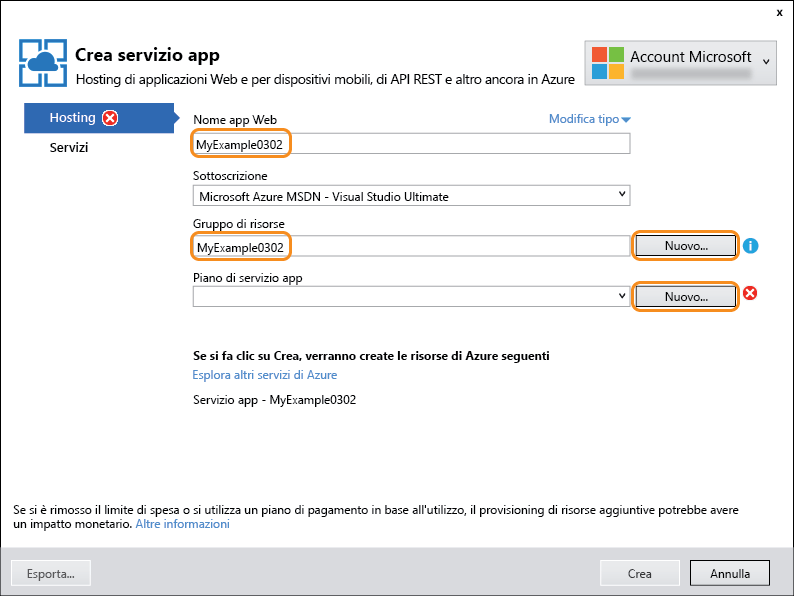
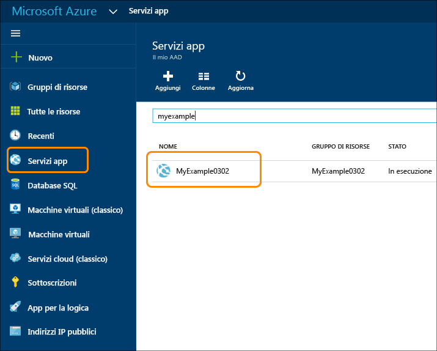

<properties
	pageTitle="Creare un'app Web ASP.NET nel servizio app di Azure | Microsoft Azure"
	description="In questa esercitazione viene illustrato come creare un progetto Web ASP.NET in Visual Studio 2013 e distribuirlo in un'app Web nel servizio app di Azure."
	services="app-service\web"
	documentationCenter=".net"
	authors="tdykstra"
	manager="wpickett"
	editor="jimbe"/>

<tags
	ms.service="app-service-web"
	ms.workload="web"
	ms.tgt_pltfrm="na"
	ms.devlang="dotnet"
	ms.topic="hero-article"
	ms.date="03/02/2015"
	ms.author="tdykstra"/>

# Creazione di un'app Web ASP.NET nel servizio app di Azure

> [AZURE.SELECTOR]
- [.Net](web-sites-dotnet-get-started.md)
- [Node.JS](web-sites-nodejs-develop-deploy-mac.md)
- [Java](web-sites-java-get-started.md)
- [PHP - Git](web-sites-php-mysql-deploy-use-git.md)
- [PHP - FTP](web-sites-php-mysql-deploy-use-ftp.md)
- [Python](web-sites-python-ptvs-django-mysql.md)

## Panoramica

Questa esercitazione illustra come distribuire un'applicazione Web ASP.NET in un'[app Web del servizio app di Azure](app-service-web-overview.md) usando Visual Studio 2015. Nell'esercitazione si presuppone che l'utente sia uno sviluppatore ASP.NET che non abbia mai usato Azure. Al termine dell'esercitazione, si avrà un'applicazione Web semplice in esecuzione nel cloud.

Nella figura seguente è illustrata l'applicazione completata:

Si apprenderà come:

* Creare una nuova app Web del servizio app durante la creazione di un nuovo progetto Web in Visual Studio.
* Distribuire un progetto Web in un'app Web del servizio app usando Visual Studio.
* Usare il [portale di Azure](/overview/preview-portal/) per monitorare e gestire la propria app Web.

Nella sezione [Passaggi successivi](#next-steps) alla fine dell'esercitazione sono disponibili collegamenti ad altre esercitazioni che approfondiscono i concetti relativi all'uso del servizio app di Azure.

> [AZURE.NOTE] Per contribuire a migliorare l'ambito e l'approccio di questa organizzazione e chiedere l'aggiunta di altri argomenti a questa esercitazione introduttiva, è possibile lasciare un [commento](#comments) alla fine dell'esercitazione.

[AZURE.INCLUDE [prerequisiti](../../includes/app-service-web-dotnet-get-started-prereqs.md)]

## Creare un progetto e un'app Web

Il primo passaggio consiste nel creare un progetto web in Visual Studio e un'app web nel servizio di App di Azure. Una volta effettuata questa operazione, il progetto verrà distribuito in app web per renderlo disponibile su Internet.

Il diagramma illustra le operazioni eseguite nei passaggi di creazione e di distribuzione.

1. Aprire Visual Studio 2015.

2. Fare clic su **File > Nuovo > Progetto**.

3. Nella finestra di dialogo **Nuovo progetto** fare clic su **Visual C# > Web > Applicazione Web ASP.NET**. Se si preferisce, è possibile scegliere **Visual Basic**.

3. Assicurarsi che come framework di destinazione sia selezionata l'opzione **.NET Framework 4.5.2**.

4.  [Azure Application Insights](../application-insights/app-insights-overview.md) monitora disponibilità, prestazioni e utilizzo delle app Web. La casella di controllo **Aggiungi Application Insights al progetto** è selezionata per impostazione predefinita la prima volta che si crea un progetto Web dopo aver installato Visual Studio. Deselezionare la casella di controllo Aggiungi Application Insights al progetto se non si vuole provare questa funzionalità.

4. Assegnare all'applicazione il nome **MyExample**.

5. Fare clic su **OK**.

	

5. Nella finestra di dialogo **Nuovo progetto ASP.NET** selezionare il modello **MVC**.

7. Fare clic su **Modifica autenticazione**.

	

6. Nella finestra di dialogo **Modifica autenticazione** fare clic su **Nessuna autenticazione** e quindi fare clic su **OK**.

	

	Per questa esercitazione verrà creata un'applicazione semplice che non supporta l'accesso utente.

5. Nella sezione **Microsoft Azure** della finestra di dialogo **Nuovo progetto ASP.NET** verificare che **Host nel cloud** e **Servizio app** siano selezionati nell'elenco a discesa.

	

	Con queste impostazioni in Visual Studio verrà creata un'app Web di Azure per il progetto Web.

6. Fare clic su **OK**.

5. Se non è già stato effettuato l'accesso ad Azure, verrà chiesto di farlo. Accedere con l'ID e la password dell'account che si utilizza per gestire la sottoscrizione Azure.

	Dopo aver eseguito l'accesso, nella finestra di dialogo **Crea servizio app** viene chiesto di indicare le risorse da creare.

	

3. Nella finestra di dialogo **Crea servizio app** immettere un **Nome app Web** che sia univoco nel dominio *azurewebsites.net*. Ad esempio, è possibile denominarlo MyExample con numeri a destra per renderlo univoco, come MyExample810. Se viene creato un nome web predefinito, è univoco e sarà possibile utilizzarlo.

	Se il nome immesso è già stato usato da un altro utente, a destra, invece di un segno di spunta verde, verrà visualizzato un punto esclamativo rosso e sarà necessario specificare un nome diverso.

	Azure utilizzerà questo nome come prefisso per l'URL dell'applicazione. L'URL completo sarà costituito da quanto immesso in questa casella e da *.azurewebsites.net* (come mostrato accanto alla casella di testo **Nome app Web**). Ad esempio, se il nome del sito è `MyExample810`, l'URL sarà `myexample810.azurewebsites.net`. L'URL deve essere univoco.

6. Accanto alla casella **Gruppo di risorse** fare clic su **Nuovo** e quindi immettere "MyExample" o un altro nome, se si preferisce.

	Questa casella combinata consente di selezionare un gruppo di risorse esistente o crearne uno nuovo digitando un nome diverso da qualsiasi gruppo di risorse esistente nella sottoscrizione.

	Un gruppo di risorse è una raccolta di risorse di Azure, ad esempio app per le api, database, VM e così via. Per un'esercitazione in genere è consigliabile creare un nuovo gruppo di risorse, per eliminare facilmente tutte le risorse di Azure create per l'esercitazione in un unico passaggio. Per altre informazioni, vedere [Panoramica di Azure Resource Manager](../resource-group-overview.md)

4. Fare clic sul pulsante **Nuovo** accanto all'elenco a discesa **Piano di servizio app**.

	

	Lo screenshot mostra i valori di esempio per **Nome app Web**, **Sottoscrizione** e **Gruppo di risorse**. I valori dell'utente saranno diversi.

	Nei passaggi seguenti si crea un piano di servizio app per il nuovo gruppo di risorse. Un piano di servizio app specifica le risorse di calcolo in cui viene eseguita l'app per le API. Se, ad esempio, si sceglie il livello gratuito, l'app per le API viene eseguita in VM condivise, mentre con alcuni livelli a pagamento viene eseguita in VM dedicate. Per altre informazioni, vedere [Panoramica approfondita dei piani del servizio app di Azure](../app-service/azure-web-sites-web-hosting-plans-in-depth-overview.md).

5. Nella finestra di dialogo **Configura piano di servizio app** immettere "MyExamplePlan" o un altro nome, se si preferisce.

5. Nell'elenco a discesa **Località** scegliere la località più vicina.

	Questa impostazione specifica il data center di Azure in cui verrà eseguita l'app. Per questa esercitazione, è possibile selezionare qualsiasi area senza riscontrare differenze evidenti, ma per un'app di produzione è consigliabile che il server sia il più vicino possibile ai client che accedono al server per ridurre al minimo la [latenza](http://www.bing.com/search?q=web%20latency%20introduction&qs=n&form=QBRE&pq=web%20latency%20introduction&sc=1-24&sp=-1&sk=&cvid=eefff99dfc864d25a75a83740f1e0090).

5. Nell'elenco a discesa **Dimensioni** fare clic su **Gratuito**.

	Per questa esercitazione il piano tariffario gratuito fornirà prestazioni sufficienti.

6. Nella finestra di dialogo **Configura piano di servizio app** fare clic su **OK**.

	

7. Nella finestra di dialogo **Crea servizio App** fare clic su **Crea**.

	

	In breve tempo, in genere meno di un minuto, Visual Studio crea il progetto Web e l'app Web.

	Nella finestra **Esplora soluzioni** sono visualizzati i file e le cartelle presenti nel nuovo progetto.

	

	Nella finestra **Attività di pubblicazione sito Web** viene visualizzato un messaggio per indicare che l'app Web è stato creata.

	

	L'app Web verrà visualizzata in **Cloud Explorer**.

	

## Distribuire il progetto nell'app Web

In questa sezione si distribuisce il progetto Web nell'app Web, come illustrato nel passaggio 2 del diagramma.

1. In **Esplora soluzioni** fare clic con il pulsante destro del mouse sul progetto, quindi scegliere **Pubblica**.

	

	Dopo pochi secondi verrà visualizzata la procedura guidata **Pubblica sul Web** che visualizza un *profilo di pubblicazione* con le impostazioni per la distribuzione del progetto Web nella nuova app Web. Per eseguire la distribuzione in un'app Web diversa, è possibile scegliere la scheda **Profilo** per creare un altro profilo. Per questa esercitazione, verranno accettate le impostazioni per la distribuzione nell'applicazione Web creata in precedenza.

8. Nella scheda **Connessione** della procedura guidata **Pubblica sul Web** fare clic su **Avanti**.

	

	La scheda successiva è la scheda **Impostazioni**, dove è possibile modificare la scheda di configurazione della build per distribuire una build di debug per il [debug remoto](../app-service-web/web-sites-dotnet-troubleshoot-visual-studio.md#remotedebug). La scheda include anche alcune **Opzioni pubblicazione file**:

	* Rimuovi i file aggiuntivi nella destinazione
	* Precompila durante la pubblicazione
	* Escludi file dalla cartella App\_Data

	Per questa esercitazione non ne è necessaria nessuna. Per informazioni dettagliate su come funzionano, vedere [Procedura: Distribuire un progetto di applicazione Web tramite la pubblicazione con un clic in Visual Studio](https://msdn.microsoft.com/library/dd465337.aspx).

10. Nella scheda **Impostazioni** fare clic su **Avanti**.

	

	La scheda successiva è **Anteprima**, che consente di visualizzare quali file verranno copiati dal progetto all'app per le API. Quando si distribuisce un progetto in un'app per le API che è già stato distribuito prima, vengono copiati solo i file modificati. Per visualizzare un elenco di quelli che verranno copiati, è possibile fare clic sul pulsante **Avvia anteprima**.

11. Nella scheda **Anteprima** fare clic su **Pubblica**.

	

	Quando si fa clic su **Pubblica**, Visual Studio avvierà il processo di copia dei file nel server Azure. L'operazione potrebbe richiedere un paio di minuti.

	Nelle finestre **Output** e **Attività del servizio app di Azure** vengono elencate le azioni eseguite e viene segnalato il corretto completamento della distribuzione.

	

	Dopo la corretta distribuzione, verrà automaticamente aperto il browser predefinito all'URL dell'app Web distribuita e l'applicazione creata risulterà in esecuzione nel cloud. L'URL nella barra degli indirizzi del browser indica che l'app Web viene caricata da Internet.

	

> [AZURE.TIP] È possibile abilitare la barra degli strumenti **Sito Web - Pubblicazione con un clic** per una distribuzione ancora più rapida. Fare clic su **Visualizza > Barre degli strumenti** e quindi selezionare **Sito Web - Pubblicazione con un clic**. È possibile usare la barra degli strumenti per selezionare un profilo, fare clic su un pulsante per procedere alla pubblicazione o aprire la procedura guidata **Pubblica sul Web**.

## Monitorare e gestire l'app Web nel portale di Azure

Il [portale di Azure](/services/management-portal/) è un'interfaccia Web che consente di gestire e monitorare i servizi di Azure, ad esempio l'app Web appena creata. Questa sezione dell'esercitazione illustra alcune delle operazioni che è possibile eseguire nel portale.

1. Nel browser passare a [https://portal.azure.com](https://portal.azure.com) e accedere con le credenziali usate per gestire l'account di Azure.

2. Fare clic su **Servizi app** e quindi fare clic sul nome dell'app Web.

	

	Il pannello **App Web** consente di visualizzare una panoramica delle impostazioni e le statistiche di utilizzo per l'app Web. Le finestre che si aprono sulla destra del portale vengono chiamate *pannelli*.

	

	A questo punto il traffico dell'app Web è poco rilevante ed è quindi possibile che il grafico non visualizzi nulla. Se si passa all'applicazione, aggiornare la pagina alcune volte e quindi aggiornare la pagina del portale, verranno visualizzate alcune statistiche.

3. Fare clic sul pannello **Impostazioni** per visualizzare altre opzioni di configurazione per l'app Web.

	

	Le sezioni del pannello sono molte di più di quelle visualizzate in questo screenshot.

4. Fare clic su **Impostazioni applicazione** dalla sezione **Generale** del pannello **Impostazioni** per visualizzare un esempio dei tipi di impostazioni che è possibile configurare nel portale.

	Ad esempio, è possibile controllare la versione di .NET usata per l'app Web, attivare funzionalità quali [WebSocket](/blog/2013/11/14/introduction-to-websockets-on-windows-azure-web-sites/) e impostare [valori della stringa di connessione](/blog/2013/07/17/windows-azure-web-sites-how-application-strings-and-connection-strings-work/).

	

Queste sono solo alcune delle funzionalità disponibili nel portale. È possibile creare nuove app Web, eliminare app Web esistenti, arrestare e riavviare app Web, nonché gestire altri tipi di servizi di Azure, come database e macchine virtuali.

## Passaggi successivi

In questa esercitazione sono state illustrate le procedure per creare una semplice applicazione Web e distribuirla in un'app Web di Azure. Di seguito sono elencati alcuni argomenti e risorse correlati cui fare riferimento per altre informazioni sul servizio app di Azure:

* Altri modi per creare app Web

	È stato illustrato come creare un'app Web durante la creazione di un progetto di Visual Studio. È anche possibile creare risorse di Azure per il processo di distribuzione in Visual Studio con la stessa procedura usata durante la creazione del progetto. È anche possibile creare app Web usando il [portale di Azure](https://portal.azure.com/), i [cmdlet di Azure per Windows PowerShell](../powershell-install-configure.md) o l'[interfaccia della riga di comando multipiattaforma](../xplat-cli.md).

* Come creare app per le API

	È stato illustrato come creare un'istanza del servizio app di Azure progettata principalmente per ospitare un sito Web. Il servizio app include anche funzionalità progettate per rendere più semplice sviluppare, testare e ospitare le API. Per altre informazioni, vedere [Introduzione alle app per le API e ad ASP.NET nel servizio app di Azure](../app-service-api/app-service-api-dotnet-get-started.md).

* Altri modi per distribuire un progetto Web

	Per informazioni su altre modalità di distribuzione di progetti Web in app Web tramite Visual Studio o [automatizzando la distribuzione](http://www.asp.net/aspnet/overview/developing-apps-with-windows-azure/building-real-world-cloud-apps-with-windows-azure/continuous-integration-and-continuous-delivery) da un [sistema di controllo del codice](http://www.asp.net/aspnet/overview/developing-apps-with-windows-azure/building-real-world-cloud-apps-with-windows-azure/source-control), vedere [Come distribuire un'app Web di Azure](web-sites-deploy.md).

	Visual Studio consente anche di generare script di Windows PowerShell per automatizzare la distribuzione. Per ulteriori informazioni, vedere l'articolo relativo a come [automatizzare tutto e creare app per cloud reali con Azure](http://www.asp.net/aspnet/overview/developing-apps-with-windows-azure/building-real-world-cloud-apps-with-windows-azure/automate-everything).

* Come risolvere i problemi di un'app Web

	In Visual Studio sono disponibili funzionalità che consentono di visualizzare facilmente i log di Azure in tempo reale, mentre vengono generati. È inoltre possibile attivare la modalità di debug in remoto. Per altre informazioni, vedere [Risoluzione dei problemi delle app Web di Azure in Visual Studio](web-sites-dotnet-troubleshoot-visual-studio.md).

* Come aggiungere un nome di dominio personalizzato e SSL

	Per informazioni su come usare SSL e il dominio personalizzato (ad esempio www.contoso.com invece di contoso.azurewebsites.net), vedere le risorse seguenti:

	* [Configurare un nome di dominio personalizzato nel servizio app di Azure](web-sites-custom-domain-name.md)
	* [Abilitare HTTPS per un sito Web di Azure](web-sites-configure-ssl-certificate.md)

* Come aggiungere funzionalità in tempo reale come la chat

	Se l'app Web includerà funzionalità in tempo reale, ad esempio un servizio chat, un gioco o le quotazioni di borsa, è possibile ottenere prestazioni ottimali usando [ASP.NET SignalR](http://www.asp.net/signalr) con il metodo di trasporto [WebSocket](/blog/2013/11/14/introduction-to-websockets-on-windows-azure-web-sites/). Per altre informazioni, vedere [Utilizzo di SignalR con le app Web di Azure](http://www.asp.net/signalr/overview/signalr-20/getting-started-with-signalr-20/using-signalr-with-windows-azure-web-sites).

* Come scegliere tra Servizio app, Servizi cloud di Azure e Macchine virtuali di Azure per le applicazioni Web

	In Azure è possibile eseguire applicazioni Web in app Web del servizio app, come descritto in questa esercitazione, oppure in Servizi cloud o Macchine virtuali. Per altre informazioni, vedere [Confronto tra app Web, servizi cloud e VM di Azure](/manage/services/web-sites/choose-web-app-service/).

<!---HONumber=AcomDC_0309_2016-->