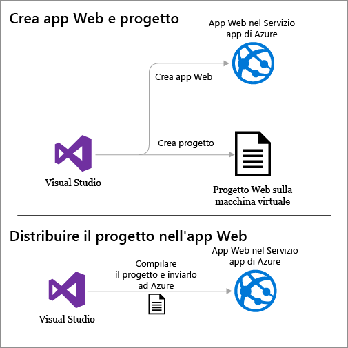

<properties
	pageTitle="Creare un'app Web ASP.NET nel servizio app di Azure | Microsoft Azure"
	description="In questa esercitazione viene illustrato come creare un progetto Web ASP.NET in Visual Studio 2013 e distribuirlo in un'app Web nel servizio app di Azure."
	services="app-service\web"
	documentationCenter=".net"
	authors="tdykstra"
	manager="wpickett"
	editor="jimbe"/>

<tags
	ms.service="app-service-web"
	ms.workload="web"
	ms.tgt_pltfrm="na"
	ms.devlang="dotnet"
	ms.topic="hero-article"
	ms.date="08/10/2015"
	ms.author="tdykstra"/>

# Creare un'app Web ASP.NET nel servizio app di Azure

## Panoramica

Questa esercitazione illustra come creare un'applicazione Web ASP.NET e distribuirla in un'[app Web del servizio app di Azure](app-service-web-overview.md) usando Studio 2015 o Visual Studio 2013. Nell'esercitazione si presuppone che l'utente non abbia mai usato Azure o ASP.NET. Al termine dell'esercitazione, si avrà un'applicazione Web semplice in esecuzione nel cloud.

Nella figura seguente è illustrata l'applicazione completata:

Si apprenderà come:

* Abilitare il sistema per lo sviluppo in Azure installando Azure SDK.
* Creare un progetto Web ASP.NET di Visual Studio e distribuirlo in un'app Web di Azure.
* Apportare una modifica al progetto Web e ridistribuire l'applicazione.
* Usare il [portale di Azure](/overview/preview-portal/) per monitorare e gestire la propria app Web.

##Iscrizione a Microsoft Azure

Per completare l'esercitazione, è necessario un account Azure. È possibile:

* [Aprire un account Azure gratuitamente](/pricing/free-trial/?WT.mc_id=A261C142F): sono inclusi crediti da usare per provare i servizi di Azure a pagamento. Una volta esauriti i crediti, è possibile mantenere l'account e usare le funzionalità e i servizi di Azure gratuiti, ad esempio la funzionalità App Web nel servizio app di Azure.
* [Attivare i benefici dell'abbonamento MSDN](/pricing/member-offers/msdn-benefits-details/?WT.mc_id=A261C142F): con la sottoscrizione MSDN ogni mese si accumulano crediti che è possibile usare per i servizi di Azure a pagamento.

> [AZURE.NOTE]Per iniziare a usare il servizio app di Azure prima di effettuare l'iscrizione e creare un account Azure, passare alla pagina [Prova il servizio app](http://go.microsoft.com/fwlink/?LinkId=523751). In questa pagina è possibile creare immediatamente un'app Web iniziale temporanea in App Service. Non è necessario fornire una carta di credito né impegnarsi in alcun modo.

In questo video Scott Hanselman illustra la procedura di iscrizione per ottenere la versione di valutazione gratuita di Microsoft Azure. (Durata: 1:58)

> [AZURE.VIDEO sign-up-for-microsoft-azure]

[AZURE.INCLUDE [installare-sdk-2015 2013](../../includes/install-sdk-2015-2013.md)]

## Creazione di un'applicazione Web ASP.NET

Il primo passaggio consiste nel creare un progetto web in Visual Studio e un'app web nel servizio di App di Azure. Una volta effettuata questa operazione, il progetto verrà distribuito in app web per renderlo disponibile su Internet.

Il diagramma illustra le operazioni eseguite nei passaggi di creazione e di distribuzione.

1. Avviare Visual Studio 2015 o Visual Studio 2013.

	Se si utilizza Visual Studio 2013, gli schermi saranno leggermente diversi dalle schermate, ma le procedure sono sostanzialmente le stesse.

2. Scegliere **Nuovo > Progetto** dal menu **File**.

3. Nella finestra di dialogo **Nuovo progetto** fare clic su **C# > Web > Applicazione Web ASP.NET**. Se si preferisce, è possibile scegliere **Visual Basic**.

3. Assicurarsi che come framework di destinazione sia selezionata l'opzione **.NET Framework 4.5.2**.

4.  [Azure Application Insights](app-insights-overview.md) monitora disponibilità, prestazioni e utilizzo delle app Web. Deselezionare la casella di controllo **Aggiungi Application Insights al progetto** se non si vuole provare questa funzionalità.

4. Assegnare all'applicazione il nome **MyExample**.

5. Fare clic su **OK**.

	

5. Nella finestra di dialogo **Nuovo progetto ASP.NET** selezionare il modello **MVC**.

	[MVC](http://www.asp.net/mvc) è un framework di ASP.NET per lo sviluppo di app Web.

7. Fare clic su **Modifica autenticazione**.

	

6. Nella finestra di dialogo **Modifica autenticazione** fare clic su **Nessuna autenticazione**, quindi fare clic su **OK**.

	

	L'applicazione di esempio che verrà creata non consente agli utenti di effettuare l'accesso. Nella sezione [Passaggi successivi](#next-steps) sono riportati i collegamenti a un'esercitazione che implementa l'autenticazione e l'autorizzazione.

5. Nella finestra di dialogo **Nuovo progetto ASP.NET** lasciare invariate le impostazioni in **Microsoft Azure** e quindi fare clic su **OK**.

	

	Con le impostazioni predefinite in Visual Studio verrà creata un'app Web di Azure per il progetto Web. Nella sezione successiva dell'esercitazione il progetto Web verrà quindi distribuito nell'app Web appena creata.

5. Se non è già stato effettuato l'accesso ad Azure, verrà chiesto di farlo. Accedere con l'ID e la password dell'account che si utilizza per gestire la sottoscrizione Azure.

	Dopo aver effettuato l'accesso, nella finestra di dialogo **Configurazione impostazioni app Web di Microsoft Azure** viene chiesto di indicare le risorse che si desidera creare.

	

3. Nella finestra di dialogo **Configura impostazioni app Web di Microsoft Azure** immettere un **Nome app Web** che sia univoco nel dominio *azurewebsites.net*. Ad esempio, è possibile denominarlo MyExample con numeri a destra per renderlo univoco, come MyExample810. Se viene creato un nome web predefinito, è univoco e sarà possibile utilizzarlo.

	Se il nome immesso è già stato usato da un altro utente, a destra, invece di un segno di spunta verde, verrà visualizzato un punto esclamativo rosso e sarà necessario specificare un nome diverso.

	Azure utilizzerà questo nome come prefisso per l'URL dell'applicazione. L'URL completo sarà costituito da quanto immesso in questa casella e da *.azurewebsites.net* (come mostrato accanto alla casella di testo **Nome app Web**). Ad esempio, se il nome del sito è `MyExample810`, l'URL sarà `MyExample810.azurewebsites.net`. L'URL deve essere univoco.

4. Nel **piano di servizio App** elenco a discesa, selezionare **Crea nuovo piano di servizio App**.

	Nella sezione [Passaggi successivi](#next-steps) sono inclusi collegamenti a informazioni sui piani del servizio app.

5. Immettere **MyExamplePlan**, o un altro nome se si preferisce, il nome del piano.

6. Nel **gruppo di risorse** elenco a discesa, selezionare **Crea nuovo gruppo di risorse**.

	Il [passaggi successivi](#next-steps) include collegamenti a informazioni sui gruppi di risorse.

5. Immettere **MyExampleGroup**, o un altro nome se si preferisce, come nome del gruppo di risorse.

5. Nell'elenco a discesa **Region** scegliere la posizione più vicina.

	Questa impostazione consente di specificare il data center di Azure in cui verrà eseguito il sito Web. Per questa esercitazione, è possibile selezionare qualsiasi area senza riscontrare differenze evidenti, ma per un'app Web di produzione è consigliabile che il server Web sia il più vicino possibile ai browser che accedono al sito in modo da ridurre al minimo la [latenza](http://www.bing.com/search?q=web%20latency%20introduction&qs=n&form=QBRE&pq=web%20latency%20introduction&sc=1-24&sp=-1&sk=&cvid=eefff99dfc864d25a75a83740f1e0090).

5. Lasciare inalterati i campi relativi al database.

	Per questa esercitazione non verrà usato un database. Nella sezione [Passaggi successivi](#next-steps) sono inclusi collegamenti a un'esercitazione che illustra come usare un database.

6. Fare clic su **OK**.

	

	Dopo pochi secondi il progetto Web verrà creato nella cartella specificata in Visual Studio e l'app Web verrà creata nell'area di Azure specificata.

	Nella finestra **Esplora soluzioni** sono visualizzati i file e le cartelle presenti nel nuovo progetto.

	

	Nella finestra **Attività di pubblicazione sito Web** viene visualizzato un messaggio per indicare che l'app Web è stato creata.

	

	L'app Web verrà visualizzata in **Esplora server**.

	

## Distribuire l'applicazione in Azure

7. Nella finestra **Attività di pubblicazione sito Web** fare clic su **Pubblica MyExample in questa app Web ora**.

	

	Dopo pochi secondi verrà visualizzata la procedura guidata **Pubblica sul Web**.

	Le impostazioni di cui Visual Studio ha bisogno per distribuire il progetto in Azure sono state salvate in un *profilo di pubblicazione*. La procedura guidata consente di esaminarle e modificarle.

8. Nella scheda **Connessione** della procedura guidata **Pubblica sul Web** fare clic su **Avanti**.

	Visual Studio fornisce tutte le impostazioni necessarie per distribuire l'applicazione web di Azure.

	

10. Nella scheda **Impostazioni** fare clic su **Avanti**.

	È possibile accettare i valori predefiniti per **Configurazione** e **Opzioni di pubblicazione file**.

	L'elenco a discesa **Configurazione** consente di distribuire una build di debug per il debug remoto. Nella sezione [Passaggi successivi](#next-steps) è incluso il collegamento a un'esercitazione che illustra come eseguire Visual Studio in modalità di debug in remoto.

	

11. Nella scheda **Anteprima** fare clic su**Pubblica**.

	Per visualizzare i file che verranno copiati in Azure, è possibile scegliere **Avvia anteprima** prima di fare clic su **Pubblica**.

	

	In Visual Studio verrà avviato il processo di copia dei file nel server Azure.

	Nelle finestre **Output** e **Attività del servizio app di Azure** vengono elencate le azioni eseguite e viene segnalato il corretto completamento della distribuzione.

	

	Dopo la corretta distribuzione, verrà automaticamente aperto il browser predefinito all'URL dell'app Web distribuita e l'applicazione creata risulterà in esecuzione nel cloud. L'URL nella barra degli indirizzi del browser indica che l'app Web viene caricata da Internet.

	

13. Chiudere il browser.

## Inserire una modifica e ridistribuire

Questa sezione dell'esercitazione è facoltativa. Si modificherà l'intestazione **h1** della home page, quindi si eseguirà il progetto in locale nel computer di sviluppo per verificare la modifica e infine si distribuirà la modifica in Azure.

2. Aprire il file **Views/Home/Index.cshtml** o **.vbhtml** in **Esplora soluzioni**, modificare l'intestazione **h1** da "ASP.NET" in "ASP.NET and Azure", quindi salvare il file.

	

	

1. Premere CTRL+F5 per visualizzare l'intestazione aggiornata eseguendo l'app Web nel computer locale.

	

	L'URL `localhost` indica che l'applicazione viene eseguita nel computer locale. Per impostazione predefinita, viene eseguita in IIS Express, una versione semplificata di IIS progettata per l'utilizzo durante lo sviluppo di applicazioni Web.

1. Chiudere il browser.

1. In **Esplora soluzioni** fare clic con il pulsante destro del mouse sul progetto, quindi scegliere **Pubblica**.

	

	Verrà visualizzata la scheda **Anteprima** della procedura guidata **Pubblica sul Web**. Se è necessario modificare una qualsiasi impostazione di pubblicazione, è possibile scegliere una scheda diversa, tuttavia in questo caso si vuole solo eseguire la ridistribuzione con le stesse impostazioni.

2. Nella procedura guidata **Pubblica sito Web** fare clic su **Pubblica**.

	

	Il progetto verrà distribuito in Azure e l'app Web verrà aperta nel browser predefinito.

	

**Nota:** è possibile abilitare la barra degli strumenti **Sito Web - Pubblicazione con un clic** per una distribuzione ancora più rapida. Fare clic su **Visualizza > Barre degli strumenti** e quindi selezionare **Sito Web - Pubblicazione con un clic**. È possibile usare la barra degli strumenti per selezionare un profilo, fare clic su un pulsante per procedere alla pubblicazione oppure per aprire la procedura guidata **Pubblica sul Web**.

## Monitorare e gestire l'app Web nel portale di Azure

Il [portale di Azure](/services/management-portal/) è un'interfaccia Web che consente di gestire e monitorare i servizi di Azure, ad esempio l'app Web appena creata. Questa sezione dell'esercitazione illustra alcune delle operazioni che è possibile eseguire nel portale.

1. Nel browser passare a [https://portal.azure.com](https://portal.azure.com) e accedere con le credenziali di Azure.

2. Fare clic su **Esplora tutto > App Web**, quindi fare clic sul nome dell'app Web.

	Il pannello **App Web** consente di visualizzare una panoramica delle impostazioni e le statistiche di utilizzo per l'app Web.

	

	A questo punto il traffico dell'app Web è poco rilevante ed è quindi possibile che il grafico non visualizzi nulla. Se si passa all'applicazione, si aggiorna la pagina alcune volte; pertanto si aggiorna la pagina del portale e vengono visualizzate alcune statistiche.

3. Fare clic su **Impostazioni** per visualizzare altre opzioni di configurazione per l'app Web.

	Viene visualizzato un elenco di tipi di impostazioni.

	

4. Fare clic su **Impostazioni applicazione** per visualizzare un esempio dei tipi di impostazioni che è possibile configurare nel portale.

	Ad esempio, è possibile controllare la versione di .NET usata per l'app Web, attivare funzionalità quali [WebSocket](/blog/2013/11/14/introduction-to-websockets-on-windows-azure-web-sites/) e impostare [valori della stringa di connessione](/blog/2013/07/17/windows-azure-web-sites-how-application-strings-and-connection-strings-work/).

	

Queste sono solo alcune delle funzionalità disponibili nel portale. È possibile creare nuove app Web, eliminare app Web esistenti, arrestare e riavviare app Web, nonché gestire altri tipi di servizi di Azure, come database e macchine virtuali.

## Passaggi successivi

In questa esercitazione sono state illustrate le procedure per creare una semplice applicazione Web e distribuirla in un'app Web di Azure. Di seguito sono elencati alcuni argomenti e risorse correlati cui fare riferimento per altre informazioni sulle app Web nel servizio app di Azure:

* Altri modi per distribuire un progetto Web

	In questa esercitazione è stata illustrata la procedura più rapida per creare un'app Web e distribuirla con un'unica operazione. Per una panoramica su altre modalità di distribuzione, tramite Visual Studio o [automatizzando la distribuzione](http://www.asp.net/aspnet/overview/developing-apps-with-windows-azure/building-real-world-cloud-apps-with-windows-azure/continuous-integration-and-continuous-delivery) da un [sistema di controllo del codice](http://www.asp.net/aspnet/overview/developing-apps-with-windows-azure/building-real-world-cloud-apps-with-windows-azure/source-control), vedere [Come distribuire un'app Web di Azure](web-sites-deploy.md).

	Visual Studio consente anche di generare script di Windows PowerShell per automatizzare la distribuzione. Per ulteriori informazioni, vedere l'articolo relativo a come [automatizzare tutto e creare app per cloud reali con Azure](http://www.asp.net/aspnet/overview/developing-apps-with-windows-azure/building-real-world-cloud-apps-with-windows-azure/automate-everything).

* Come gestire un'app Web in Visual Studio

	Per informazioni sulle funzioni di gestione delle app Web che è possibile eseguire in **Esplora server**, vedere [Risoluzione dei problemi delle app Web di Azure in Visual Studio](web-sites-dotnet-troubleshoot-visual-studio.md).

* Come risolvere i problemi di un'app Web

	In Visual Studio sono disponibili funzionalità che consentono di visualizzare facilmente i log di Azure in tempo reale, mentre vengono generati. È inoltre possibile attivare la modalità di debug in remoto. Per altre informazioni, vedere [Risoluzione dei problemi delle app Web di Azure in Visual Studio](web-sites-dotnet-troubleshoot-visual-studio.md).

* Come aggiungere funzionalità di database e autorizzazione

	Per un'esercitazione che mostra come accedere a un database e limitare alcune funzioni dell'applicazione a utenti autorizzati, vedere [Distribuzione di un'app ASP.NET MVC sicura con appartenenza, OAuth e database SQL in un'app Web di Azure](/develop/net/tutorials/web-site-with-sql-database/).

* Come aggiungere un nome di dominio personalizzato e SSL

	Per informazioni su come usare SSL e il dominio personalizzato (ad esempio www.contoso.com invece di contoso.azurewebsites.net), vedere le risorse seguenti:

	* [Configurare un nome di dominio personalizzato nel servizio app di Azure](web-sites-custom-domain-name.md)
	* [Abilitare HTTPS per un sito Web di Azure](web-sites-configure-ssl-certificate.md)

* Come evitare tempi di attesa per la riattivazione dopo timeout di inattività

	Per impostazione predefinita, le app Web vengono scaricate se sono rimaste inattive per un determinato periodo di tempo. La prima richiesta dopo che un'applicazione web è stata è di rimanere in attesa che l'app web venga ricaricata. Per evitare tempi di attesa, è possibile abilitare la funzionalità Sempre online. Per altre informazioni, vedere le opzioni di configurazione in [Come configurare le app Web](web-sites-configure.md).

* Come aggiungere funzionalità in tempo reale come la chat

	Se l'app Web includerà funzionalità in tempo reale, come un servizio chat, un gioco o le quotazioni di borsa, è possibile ottenere prestazioni ottimali usando [ASP.NET SignalR](http://www.asp.net/signalr) con il metodo di trasporto [WebSocket](/blog/2013/11/14/introduction-to-websockets-on-windows-azure-web-sites/). Per altre informazioni, vedere [Utilizzo di SignalR con le app Web di Azure](http://www.asp.net/signalr/overview/signalr-20/getting-started-with-signalr-20/using-signalr-with-windows-azure-web-sites).

* Come scegliere tra Servizio app, Servizi cloud di Azure e Macchine virtuali di Azure per le applicazioni Web

	In Azure è possibile eseguire applicazioni Web in app Web del servizio app, come descritto in questa esercitazione, oppure in Servizi cloud o Macchine virtuali. Per altre informazioni, vedere [Confronto tra app Web, servizi cloud e macchine virtuali di Azure](/manage/services/web-sites/choose-web-app-service/).

* [Come scegliere o creare un piano di servizio App](../app-service/azure-web-sites-web-hosting-plans-in-depth-overview.md)

* [Come scegliere o creare un gruppo di risorse](../azure-preview-portal-using-resource-groups.md)

## Modifiche apportate
* Per una guida relativa al passaggio da Siti Web al servizio app, vedere [Servizio app di Azure e servizi di Azure esistenti](http://go.microsoft.com/fwlink/?LinkId=529714).
* Per una guida relativa al passaggio dal portale precedente al nuovo portale, vedere [Informazioni di riferimento per l'esplorazione del portale di Azure](http://go.microsoft.com/fwlink/?LinkId=529715).

<!---HONumber=September15_HO1-->