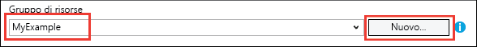
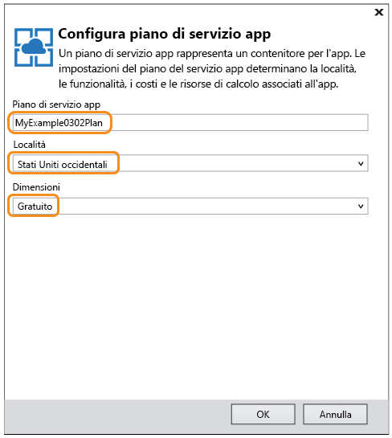

<properties
	pageTitle="Distribuire un'app ASP.NET nel servizio app di Azure con Visual Studio | Microsoft Azure"
	description="Informazioni su come distribuire un progetto Web ASP.NET in una nuova app Web nel servizio app di Azure con Visual Studio."
	services="app-service\web"
	documentationCenter=".net"
	authors="tdykstra"
	manager="wpickett"
	editor=""/>

<tags
	ms.service="app-service-web"
	ms.workload="web"
	ms.tgt_pltfrm="na"
	ms.devlang="dotnet"
	ms.topic="get-started-article"
	ms.date="04/22/2016"
	ms.author="tdykstra"/>

# Distribuire un'app Web ASP.NET nel servizio app di Azure con Visual Studio

[AZURE.INCLUDE [schede](../../includes/app-service-web-get-started-nav-tabs.md)]

## Panoramica

Questa esercitazione illustra come distribuire un'applicazione Web ASP.NET in un'[app Web del servizio app di Azure](app-service-web-overview.md) tramite Visual Studio 2015.

Nell'esercitazione si presuppone che l'utente sia uno sviluppatore ASP.NET che non abbia mai usato Azure. Al termine, sarà disponibile una semplice applicazione Web in esecuzione nel cloud.

Si apprenderà come:

* Creare una nuova app Web del servizio app durante la creazione di un nuovo progetto Web in Visual Studio.
* Distribuire un progetto Web in un'app Web del servizio app usando Visual Studio.

Il diagramma illustra le operazioni eseguite nell'esercitazione.

La sezione [Risoluzione dei problemi](#troubleshooting) alla fine dell'esercitazione fornisce indicazioni su come procedere in caso di problemi, mentre la sezione [Passaggi successivi](#next-steps) include i collegamenti ad altre esercitazioni che approfondiscono i concetti relativi all'uso del servizio app di Azure.

Poiché si tratta di un'esercitazione introduttiva, viene illustrata la distribuzione di un progetto Web semplice che non usa un database e non esegue operazioni di autenticazione o autorizzazione. Per i collegamenti ad argomenti di distribuzione più avanzati, vedere [Distribuire l'app nel servizio app di Azure](web-sites-deploy.md).

Oltre al tempo necessario per installare Azure SDK per .NET, il completamento di questa esercitazione richiederà circa 10-15 minuti.

## Prerequisiti

* Nell'esercitazione si presuppone che l'utente abbia familiarità con ASP.NET MVC e Visual Studio. Se sono necessarie informazioni introduttive, vedere l'articolo relativo all'[introduzione ad ASP.NET MVC 5](http://www.asp.net/mvc/overview/getting-started/introduction/getting-started).

* È necessario un account Azure. È possibile [aprire un account Azure gratuito](/pricing/free-trial/?WT.mc_id=A261C142F) o [attivare i benefici della sottoscrizione di Visual Studio](/pricing/member-offers/msdn-benefits-details/?WT.mc_id=A261C142F).

	Per iniziare a usare il servizio app di Azure prima di registrarsi per ottenere un account Azure, passare alla pagina [Prova il servizio app](http://go.microsoft.com/fwlink/?LinkId=523751). In questa pagina è possibile creare un'app di base temporanea nel servizio app. Non è richiesta una carta di credito, né alcun tipo di impegno.

## Configurare l'ambiente di sviluppo

L'esercitazione è stata scritta per Visual Studio 2015 con [Azure SDK per .NET](../dotnet-sdk.md) 2.9 o versione successiva.

* [Scaricare la versione più recente di Azure SDK per Visual Studio 2015](http://go.microsoft.com/fwlink/?linkid=518003). L'SDK installa Visual Studio 2015, se non è già stato installato.

	>[AZURE.NOTE] In base al numero di dipendenze da SDK già presenti nel computer, l'installazione dell'SDK può richiedere tempi lunghi, da alcuni minuti ad almeno mezz'ora.

Se è disponibile Visual Studio 2013 e si preferisce usarlo, [scaricare la versione più recente di Azure SDK per Visual Studio 2013](http://go.microsoft.com/fwlink/?LinkID=324322). Alcune schermate potrebbero essere diverse da quelle illustrate.

## Configurare un nuovo progetto Web

Il prossimo passaggio consiste nel creare un progetto Web in Visual Studio e un'app Web nel servizio app di Azure. In questa sezione dell'esercitazione si configurerà il nuovo progetto Web.

1. Aprire Visual Studio 2015.

2. Fare clic su **File > Nuovo > Progetto**.

3. Nella finestra di dialogo **Nuovo progetto** fare clic su **Visual C# > Web > Applicazione Web ASP.NET**.

3. Assicurarsi che come framework di destinazione sia selezionata l'opzione **.NET Framework 4.5.2**.

4.  [Azure Application Insights](../application-insights/app-insights-overview.md) monitora disponibilità, prestazioni e utilizzo delle app Web. La casella di controllo **Aggiungi Application Insights al progetto** viene selezionata, per impostazione predefinita, la prima volta che si crea un progetto Web dopo l'installazione di Visual Studio. Deselezionare la casella di controllo Aggiungi Application Insights al progetto se non si vuole provare questa funzionalità.

4. Assegnare all'applicazione il nome **MyExample** e fare clic su **OK**.

	

5. Nella finestra di dialogo **Nuovo progetto ASP.NET** selezionare il modello **MVC** e quindi fare clic su **Modifica autenticazione**.

	Per questa esercitazione si distribuirà un progetto Web ASP.NET MVC. Se occorrono informazioni su come distribuire un progetto API Web ASP.NET, vedere la sezione [Passaggi successivi](#next-steps).

	

6. Nella finestra di dialogo **Modifica autenticazione** fare clic su **Nessuna autenticazione** e quindi fare clic su **OK**.

	

	Per questa esercitazione introduttiva si distribuirà un'applicazione semplice che non richiede l'accesso utente.

5. Nella sezione **Microsoft Azure** della finestra di dialogo **Nuovo progetto ASP.NET** assicurarsi che sia selezionata la casella **Ospita nel cloud** e che nell'elenco a discesa sia selezionato **Servizio app**.

	

	Con queste impostazioni Visual Studio crea un'app Web di Azure per il progetto Web.

6. Fare clic su **OK**.

## Configurare le risorse di Azure per una nuova app Web

Ora si specificheranno le risorse di Azure che Visual Studio dovrà creare.

5. Nella finestra di dialogo **Crea servizio app** fare clic su **Aggiungi un account** e quindi accedere ad Azure con l'ID e la password dell'account che si usa per gestire la sottoscrizione Azure.

	

	Se l'accesso è già stato eseguito in precedenza nello stesso computer, è possibile che il pulsante **Aggiungi un account** non venga visualizzato. In questo caso, è possibile ignorare questo passaggio o potrebbe essere necessario immettere di nuovo le credenziali.
 
3. Immettere un **Nome app Web** che sia univoco nel dominio *azurewebsites.net*. Ad esempio, è possibile denominarlo MyExample con numeri a destra per renderlo univoco, come MyExample810. Se viene creato un nome web predefinito, è univoco e sarà possibile utilizzarlo.

	Se il nome immesso è già stato usato da un altro utente, a destra verrà visualizzato un punto esclamativo rosso, invece di un segno di spunta verde, e si dovrà immettere un nome diverso.

	L'URL per l'applicazione è questo nome più *. azurewebsites.net*. Ad esempio, se il nome è `MyExample810`, l'URL sarà `myexample810.azurewebsites.net`.

	Con un'app Web di Azure è anche possibile usare un dominio personalizzato. Per altre informazioni, vedere [Configurare un nome di dominio personalizzato nel servizio app di Azure](web-sites-custom-domain-name.md).

6. Fare clic sul pulsante **Nuovo** Accanto alla casella **Gruppo di risorse** e quindi immettere "MyExample" o un altro nome, se si preferisce.

	

	Un gruppo di risorse è una raccolta di risorse di Azure, ad esempio app Web, database e macchine virtuali. Per un'esercitazione in genere è consigliabile creare un nuovo gruppo di risorse. In questo modo sarà possibile eliminare facilmente tutte le risorse di Azure create per l'esercitazione in un unico passaggio. Per altre informazioni, vedere [Panoramica di Azure Resource Manager](../resource-group-overview.md).

4. Fare clic sul pulsante **Nuovo** accanto all'elenco a discesa **Piano di servizio app**.

	

	Verrà visualizzata la finestra di dialogo **Configura piano di servizio app**.

	

	Nei passaggi seguenti si configurerà un piano di servizio app per il nuovo gruppo di risorse. Un piano di servizio app specifica le risorse di calcolo in cui viene eseguita l'app Web. Se, ad esempio, si sceglie il livello gratuito, l'app per le API viene eseguita in VM condivise, mentre con alcuni livelli a pagamento viene eseguita in VM dedicate. Per altre informazioni, vedere [Panoramica approfondita dei piani del servizio app di Azure](../app-service/azure-web-sites-web-hosting-plans-in-depth-overview.md).

5. Nella finestra di dialogo **Configura piano di servizio app** immettere "MyExamplePlan" o un altro nome, se si preferisce.

5. Nell'elenco a discesa **Località** scegliere la località più vicina.

	Questa impostazione specifica il data center di Azure in cui verrà eseguita l'app. Per questa esercitazione, è possibile selezionare qualsiasi area senza riscontrare differenze evidenti, ma per un'app di produzione è consigliabile che il server sia il più vicino possibile ai client che vi accedono per ridurre al minimo la [latenza](http://www.bing.com/search?q=web%20latency%20introduction&qs=n&form=QBRE&pq=web%20latency%20introduction&sc=1-24&sp=-1&sk=&cvid=eefff99dfc864d25a75a83740f1e0090).

5. Nell'elenco a discesa **Dimensioni** fare clic su **Gratuito**.

	Per questa esercitazione il piano tariffario gratuito fornirà prestazioni adeguate.

6. Nella finestra di dialogo **Configura piano di servizio app** fare clic su **OK**.

7. Nella finestra di dialogo **Crea servizio App** fare clic su **Crea**.

## Visual Studio crea il progetto e l'app Web

In breve tempo, in genere meno di un minuto, Visual Studio crea il progetto Web e l'app Web.

Nella finestra **Esplora soluzioni** sono visualizzati i file e le cartelle presenti nel nuovo progetto.

Nella finestra **Attività di pubblicazione sito Web** viene visualizzato un messaggio per indicare che l'app Web è stato creata.

La finestra **Cloud Explorer** consente di visualizzare e gestire le risorse di Azure, inclusa la nuova app Web appena creata.

	
## Distribuire il progetto Web nell'app Web di Azure

In questa sezione si distribuirà il progetto Web nell'app Web.

1. In **Esplora soluzioni** fare clic con il pulsante destro del mouse sul progetto, quindi scegliere **Pubblica**.

	

	Dopo pochi secondi verrà visualizzata la procedura guidata **Pubblica sul Web** che visualizza un *profilo di pubblicazione* con le impostazioni per la distribuzione del progetto Web nella nuova app Web.

	Il profilo di pubblicazione include un nome utente e una password per la distribuzione. Queste credenziali sono state generate automaticamente e non è necessario immetterle. La password viene crittografata in un file nascosto specifico dell'utente nella cartella `Properties\PublishProfiles`.
 
8. Nella scheda **Connessione** della procedura guidata **Pubblica sul Web** fare clic su **Avanti**.

	

	La scheda successiva è **Impostazioni**, in cui è possibile modificare la configurazione della build per distribuire una build di debug per il [debug remoto](../app-service-web/web-sites-dotnet-troubleshoot-visual-studio.md#remotedebug). La scheda include anche numerose [Opzioni pubblicazione file](https://msdn.microsoft.com/library/dd465337.aspx#Anchor_2).

10. Nella scheda **Impostazioni** fare clic su **Avanti**.

	

	La scheda successiva è **Anteprima**, che consente di visualizzare quali file verranno copiati dal progetto all'app per le API. Quando si distribuisce un progetto in un'app per le API che è già stato distribuito prima, vengono copiati solo i file modificati. Per visualizzare un elenco di quelli che verranno copiati, è possibile fare clic sul pulsante **Avvia anteprima**.

11. Nella scheda **Anteprima** fare clic su **Pubblica**.

	

	Quando si fa clic su **Pubblica**, Visual Studio avvia il processo di copia dei file nel server Azure. L'operazione potrebbe richiedere un paio di minuti.

	Nelle finestre **Output** e **Attività del servizio app di Azure** vengono elencate le azioni eseguite e viene segnalato il corretto completamento della distribuzione.

	

	Dopo la corretta distribuzione, verrà automaticamente aperto il browser predefinito all'URL dell'app Web distribuita e l'applicazione creata risulterà in esecuzione nel cloud. L'URL nella barra degli indirizzi del browser indica che l'app Web viene caricata da Internet.

	

	> [AZURE.TIP] È possibile abilitare la barra degli strumenti **Sito Web - Pubblicazione con un clic** per una distribuzione ancora più rapida. Fare clic su **Visualizza > Barre degli strumenti** e quindi selezionare **Sito Web - Pubblicazione con un clic**. È possibile usare la barra degli strumenti per selezionare un profilo, fare clic su un pulsante per procedere alla pubblicazione o aprire la procedura guidata **Pubblica sul Web**. 
	

## Risoluzione dei problemi

Se si verifica un problema durante l'esecuzione di questa esercitazione, assicurarsi che sia in uso la versione più recente di Azure SDK per .NET. Il modo più semplice per farlo consiste nel procedere al [download di Azure SDK per Visual Studio 2015](http://go.microsoft.com/fwlink/?linkid=518003). Se è installata la versione corrente, l'Installazione guidata piattaforma Web informa che non è necessaria alcuna installazione.

Se si ha una rete aziendale e si prova a eseguire la distribuzione nel servizio app di Azure tramite un firewall, assicurarsi che le porte 443 e 8172 siano aperte per la distribuzione Web. Se non è possibile aprire queste porte, vedere la sezione Passaggi successivi seguente per altre opzioni di distribuzione.

Una volta che l'app Web ASP.NET è in esecuzione nel servizio app di Azure, è consigliabile approfondire la conoscenza delle funzionalità di Visual Studio che semplificano la risoluzione dei problemi. Per informazioni sulla registrazione, il debug remoto e altro ancora, vedere [Risoluzione dei problemi di un'app Web nel servizio app di Azure tramite Visual Studio](web-sites-dotnet-troubleshoot-visual-studio.md).

## Passaggi successivi

In questa esercitazione sono state illustrate le procedure per creare una semplice applicazione Web e distribuirla in un'app Web di Azure. Di seguito sono elencati alcuni argomenti e risorse correlati cui fare riferimento per altre informazioni sul servizio app di Azure:

* Monitorare e gestire l'app Web nel [portale di Azure](https://portal.azure.com/). 

	Per altre informazioni, vedere [una panoramica del portale di Azure](/services/management-portal/) e [Configurare le app Web nel servizio app di Azure](web-sites-configure.md).

* Distribuire un progetto Web esistente in una nuova app Web con Visual Studio.

	Fare clic con il pulsante destro del mouse sul progetto in **Esplora soluzioni** e quindi scegliere **Pubblica**. Scegliere **Servizio app di Microsoft Azure** come destinazione di pubblicazione e quindi fare clic su **Nuovo**. Le finestre di dialogo saranno quindi le stesse illustrate in questa esercitazione.

* Distribuire un progetto Web dal controllo del codice sorgente

	Per informazioni sull'[automazione della distribuzione](http://www.asp.net/aspnet/overview/developing-apps-with-windows-azure/building-real-world-cloud-apps-with-windows-azure/continuous-integration-and-continuous-delivery) da un [sistema di controllo del codice sorgente](http://www.asp.net/aspnet/overview/developing-apps-with-windows-azure/building-real-world-cloud-apps-with-windows-azure/source-control), vedere [Introduzione alle app Web nel servizio app di Azure](app-service-web-get-started.md) e [Distribuire l'app nel servizio app di Azure](web-sites-deploy.md).

* Distribuire un'API Web ASP.NET in un'app per le API nel servizio app di Azure

	È stato illustrato come creare un'istanza del servizio app di Azure progettata principalmente per ospitare un sito Web. Il servizio app offre anche funzionalità per l'hosting di API Web, ad esempio il supporto di CORS e il supporto dei metadati dell'API per la generazione del codice client. Si possono usare le funzionalità delle API in un'app Web, ma se principalmente si vuole ospitare un'API in un'istanza del servizio app, un'**app per le API** è la scelta migliore. Per altre informazioni, vedere [Introduzione alle app per le API e ad ASP.NET nel servizio app di Azure](../app-service-api/app-service-api-dotnet-get-started.md).

* Aggiungere un nome di dominio personalizzato e SSL

	Per informazioni su come usare SSL e il dominio personalizzato (ad esempio www.contoso.com invece di contoso.azurewebsites.net), vedere le risorse seguenti:

	* [Configurare un nome di dominio personalizzato nel servizio app di Azure](web-sites-custom-domain-name.md)
	* [Abilitare HTTPS per un sito Web di Azure](web-sites-configure-ssl-certificate.md)

* Una volta completate le attività, eliminare il gruppo di risorse che contiene l'app Web e le eventuali risorse di Azure correlate.

	Per informazioni sull'utilizzo dei gruppi di risorse nel portale di Azure, vedere [Uso del portale di Azure per distribuire e gestire le risorse di Azure](../resource-group-portal.md).

<!---HONumber=AcomDC_0504_2016-->