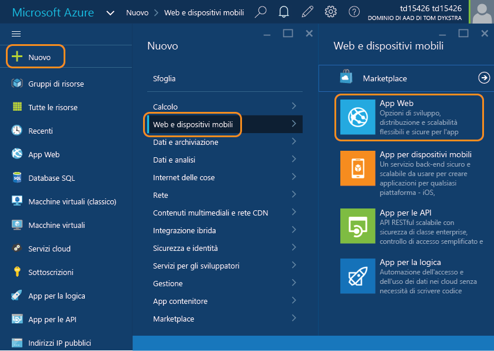
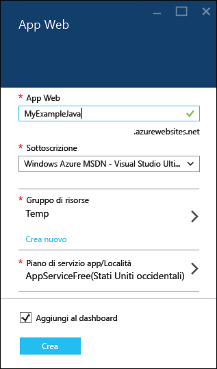
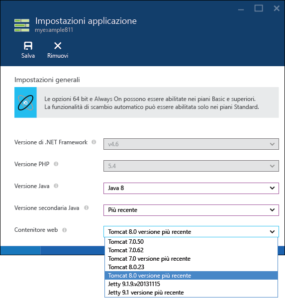
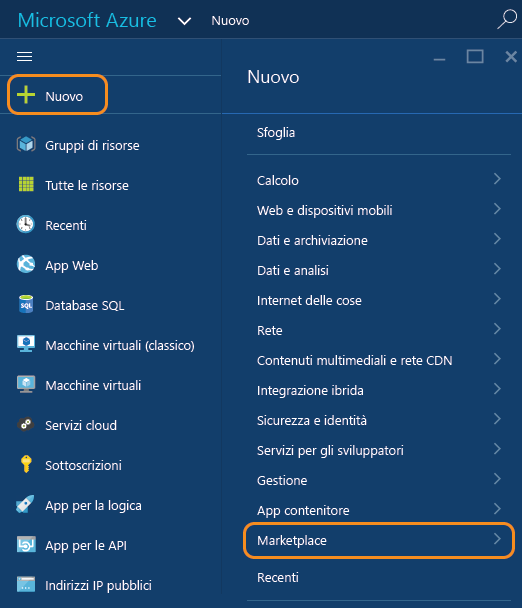
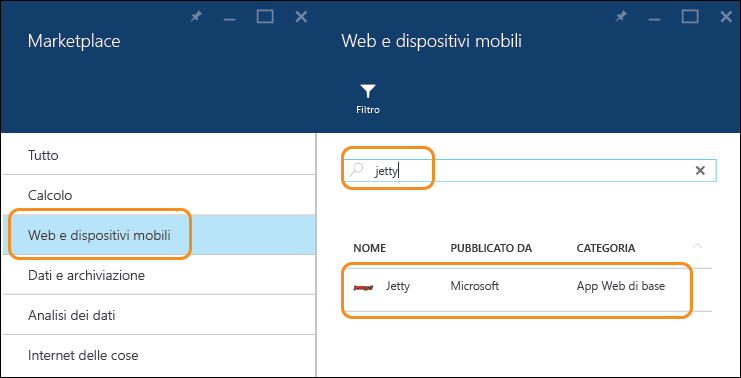
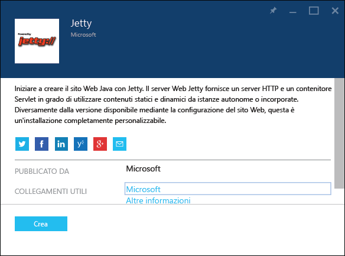
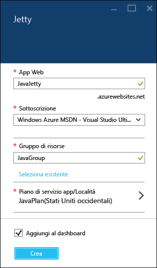
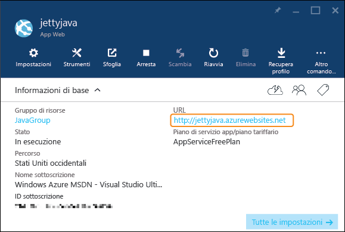

<properties
	pageTitle="Creare un'app Web Java in Azure App Service | Microsoft Azure"
	description="Questa esercitazione illustra come distribuire un'app Web Java nel servizio app di Azure."
	services="app-service\web"
	documentationCenter="java"
	authors="rmcmurray"
	manager="wpickett"
	editor=""/>
<tags
	ms.service="app-service-web"
	ms.workload="web"
	ms.tgt_pltfrm="na"
	ms.devlang="Java"
	ms.topic="hero-article"
	ms.date="03/04/2016"
	ms.author="robmcm"/>

# Creazione di un'app Web Java nel servizio app di Azure

> [AZURE.SELECTOR]
- [.Net](web-sites-dotnet-get-started.md)
- [Node.JS](web-sites-nodejs-develop-deploy-mac.md)
- [Java](web-sites-java-get-started.md)
- [PHP - Git](web-sites-php-mysql-deploy-use-git.md)
- [PHP - FTP](web-sites-php-mysql-deploy-use-ftp.md)
- [Python](web-sites-python-ptvs-django-mysql.md)

Questa esercitazione illustra come creare un'[app Web Java nel servizio app di Azure](http://go.microsoft.com/fwlink/?LinkId=529714) tramite il [portale di Azure](https://portal.azure.com/). Il portale di Azure è un'interfaccia Web che si può usare per gestire le risorse di Azure.

> [AZURE.NOTE] Per completare l'esercitazione, è necessario un account Microsoft Azure. Se non si dispone di un account, è possibile [attivare i benefici della sottoscrizione Visual Studio] oppure [iscriversi per ottenere una versione di valutazione gratuita].
>
> Per iniziare a usare il servizio app di Azure prima di registrarsi per ottenere un account Azure, passare alla pagina [Prova il servizio app]. In questa pagina è possibile creare immediatamente un'app Web iniziale temporanea nel servizio app. Non è necessario fornire una carta di credito né impegnarsi in alcun modo.

## Opzioni dell'applicazione Java

Si possono usare diversi modi per configurare un'applicazione Java in un'app Web del servizio app.

1. Creare un'app e quindi configurare l'opzione **Impostazioni dell'applicazione**.

	Il servizio App fornisce diverse versioni di Tomcat e Jetty con una configurazione predefinita. Se l'applicazione che si ospiterà funziona con una delle versioni predefinite, questo metodo di configurazione di un contenitore Web è il più semplice e appropriato quando si vuole solo caricare un file WAR in un contenitore Web. Per questo metodo, creare un'app nel portale di Azure e quindi passare al pannello **Impostazioni applicazione** dell'app per scegliere la versione di Java con il contenitore Web Java preferito. Quando si usa questo metodo, sia Java che il contenitore Web vengono eseguiti da Programmi. Gli altri metodi inseriscono il contenitore Web e potenzialmente la JVM sul disco usandone lo spazio. Quando si usa questo modello, non è possibile accedere per apportare modifiche ai file in questa parte del file system, vale a dire che non si possono eseguire operazioni come configurare il file *server. XML* o inserire file di libreria nella cartella */lib*. Per altre informazioni, vedere la sezione [Creare e configurare un'app Web Java](#appsettings) più avanti in questa esercitazione.
	
2. Usare un modello da Azure Marketplace.

	In Azure Marketplace sono disponibili modelli per i creare e configurare automaticamente app Web Java con Tomcat o contenitori Web Jetty. I contenitori Web creati con i modelli sono configurabili. Per altre informazioni, vedere la sezione [Usare un modello Java da Azure Marketplace](#marketplace) di questa esercitazione.
 
  
3. Creare un'app e quindi copiare e modificare manualmente i file di configurazione

	È possibile ospitare un'applicazione Java personalizzata che non viene distribuita in uno dei contenitori Web forniti dal servizio App. Ecco, ad esempio, alcuni motivi per eseguire questa operazione:
	
	* L'applicazione Java richiede una versione di Tomcat o Jetty che non è direttamente supportata dal servizio app o fornita nella raccolta.
	* L'applicazione Java accetta richieste HTTP e non viene distribuita come file WAR in un contenitore Web preesistente.
	* Si vuole configurare manualmente da zero il contenitore Web. 
	* Si vuole usare una versione di Java non supportata nel servizio app e caricarla manualmente.

	Per casi come questi è possibile creare un'app tramite il portale di Azure e quindi mettere a disposizione manualmente i file di runtime appropriati. In questo caso i file verranno conteggiati a fronte delle quote di spazio di archiviazione per il piano di servizio app. Per altre informazioni, vedere [Caricare un'app Web Java personalizzata in Azure](web-sites-java-custom-upload.md).

## Creare e configurare un'app Web Java

Questa sezione illustra come creare un'app Web e configurarla per l'uso del pannello **Impostazioni applicazione** nel portale in Java.

1. Accedere al [portale di Azure](https://portal.azure.com/).

2. Fare clic su **Nuovo > Web e dispositivi mobili > App Web**.

	

4. Immettere un nome per l'app Web nella casella **App Web**.

	Il nome deve essere univoco nel dominio azurewebsites.net perché l'URL dell'app Web sarà {nome}.azurewebsites.net. Se il nome immesso non è univoco, nella casella di testo verrà visualizzato un punto esclamativo rosso.

5. Selezionare un **Gruppo di risorse** o crearne uno nuovo.

	Per altre informazioni sui gruppi di risorse, vedere [Uso del portale di Azure per gestire le risorse di Azure](../resource-group-portal.md).

6. Selezionare un **Piano di servizio app/Posizione** o crearne uno nuovo.

	Per altre informazioni sui piani del servizio app, vedere [Panoramica approfondita dei piani del servizio app di Azure](../azure-web-sites-web-hosting-plans-in-depth-overview.md).

7. Fare clic su **Crea**.

	
 
8. Una volta creata l'app Web, fare clic su **App Web > {app Web personale}**.
 
	

9. Nel pannello **App Web** fare clic su **Impostazioni**.

10. Fare clic su **Impostazioni applicazione**.

11. Scegliere la **Versione Java** desiderata.

12. Scegliere la **Versione secondaria Java** desiderata. Se si seleziona **Più recente**, l'app userà la versione secondaria più recente disponibile nel servizio app per quella versione Java principale. L'elemento **Più recente** è univoco per le app Java create dalle **Impostazioni dell'applicazione**. Se si crea l''app Java dalla raccolta, si dovranno gestire il proprio contenitore e modifiche alla JVM.

12. Scegliere il **Contenitore Web** desiderato. Se si seleziona un nome di contenitore che inizia con **Più recente**, verrà mantenuta la versione dell'app che corrisponde alla versione più recente della versione principale del contenitore Web disponibile nel servizio app.

	

13. Fare clic su **Save**.

	Dopo alcuni secondi, l'app Web diventerà basata su Java e sarà configurata per l'uso del contenitore Web selezionato.

14. Fare clic su **App Web > {nuova app Web personale}**.

15. Fare clic su **URL** per passare al nuovo sito.

	La pagina Web conferma che è stata creata un'app Web basata su Java.

## Usare un modello Java da Azure Marketplace

Questa sezione illustra come usare Azure Marketplace per creare un'app Web Java. Lo stesso flusso generale può essere usato anche per creare un'app per dispositivi mobili o un'app per le API basata su Java.

1. Accedere al [portale di Azure](https://portal.azure.com/).

2. Fare clic su **Nuovo > Marketplace**.

	

3. Fare clic su **Web e dispositivi mobili**.

	Potrebbe essere necessario scorrere verso sinistra per vedere il pannello **Marketplace** dove è possibile selezionare **Web e dispositivi mobili**.

4. Nella casella di testo di ricerca immettere il nome di un server applicazioni Java, ad esempio **Apache Tomcat** o **Jetty** e quindi premere INVIO.

5. Nei risultati della ricerca fare clic sul server applicazioni Java.

	

6. Nel primo pannello **Apache Tomcat** o **Jetty** fare clic su **Crea**.

	

7. Nel pannello successivo **Apache Tomcat** o **Jetty** immettere un nome per l'app Web nella casella **App Web**.

	Il nome deve essere univoco nel dominio azurewebsites.net perché l'URL dell'app Web sarà {nome}.azurewebsites.net. Se il nome immesso non è univoco, nella casella di testo verrà visualizzato un punto esclamativo rosso.

8. Selezionare un **Gruppo di risorse** o crearne uno nuovo.

	Per altre informazioni sui gruppi di risorse, vedere [Uso del portale di Azure per gestire le risorse di Azure](../resource-group-portal.md).

9. Selezionare un **Piano di servizio app/Posizione** o crearne uno nuovo.

	Per altre informazioni sui piani del servizio app, vedere [Panoramica approfondita dei piani del servizio app di Azure](../azure-web-sites-web-hosting-plans-in-depth-overview.md).

10. Fare clic su **Crea**.

	

	In meno di un minuto Azure completa la creazione della nuova app Web.

11. Fare clic su **App Web > {nuova app Web personale}**.

12. Fare clic su **URL** per passare al nuovo sito.

	

	Tomcat viene fornito con un set di pagine predefinito quindi, se si è scelto Tomcat, viene visualizzata una pagina simile all'esempio seguente.

	

	Se si è scelto Jetty, viene visualizzata una pagina simile all'esempio seguente. Jetty non include un set di pagine predefinito, quindi viene riutilizzato lo stesso JSP usato per un sito vuoto Java.

	

Una volta creata un'app Web con un contenitore di app, vedere la sezione [Passaggi successivi](#next-steps) per informazioni su come caricare l'applicazione nell'app Web.

## Passaggi successivi

A questo punto è disponibile un server applicazioni Java in esecuzione nell'app Web nel servizio app di Azure. Per distribuire il codice personalizzato all'app Web, vedere [Aggiungere un'applicazione o una pagina Web a un'app Web Java](web-sites-java-add-app.md).

Per altre informazioni sullo sviluppo di applicazioni Java in Azure, visitare la pagina [Java Developer Center](/develop/java/).

<!-- External Links -->
[attivare i benefici della sottoscrizione Visual Studio]: http://go.microsoft.com/fwlink/?LinkId=623901
[iscriversi per ottenere una versione di valutazione gratuita]: http://go.microsoft.com/fwlink/?LinkId=623901
[Prova il servizio app]: http://go.microsoft.com/fwlink/?LinkId=523751

<!----HONumber=AcomDC_0309_2016-->