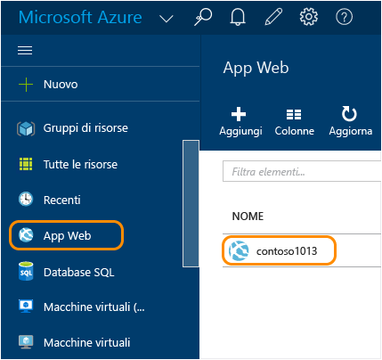
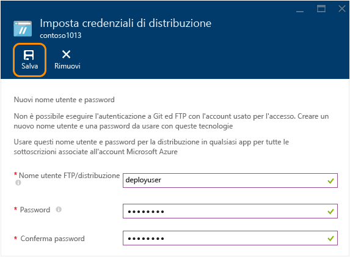
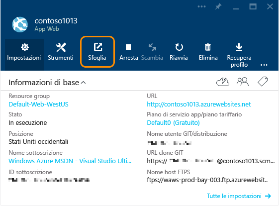
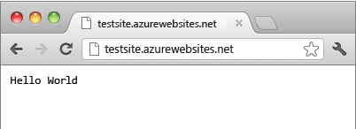

<properties
	pageTitle="Creare un'app Web Node.js in Azure App Service | Microsoft Azure"
	description="Informazioni su come distribuire un'applicazione Node.js in un'app Web nel servizio app di Azure."
	services="app-service\web"
	documentationCenter="nodejs"
	authors="rmcmurray"
	manager="wpickett"
	editor=""/>

<tags
	ms.service="app-service-web"
	ms.workload="web"
	ms.tgt_pltfrm="na"
	ms.devlang="nodejs"
	ms.topic="hero-article"
	ms.date="11/20/2015"
	ms.author="robmcm"/>

# Creare un'app Web Node.js nel servizio app di Azure

> [AZURE.SELECTOR]
- [.Net](web-sites-dotnet-get-started.md)
- [Node.js](web-sites-nodejs-develop-deploy-mac.md)
- [Java](web-sites-java-get-started.md)
- [PHP - Git](web-sites-php-mysql-deploy-use-git.md)
- [PHP - FTP](web-sites-php-mysql-deploy-use-ftp.md)
- [Python](web-sites-python-ptvs-django-mysql.md)

Questa esercitazione illustra come creare una semplice applicazione [Node.js](http://nodejs.org) e distribuirla in un'[app Web](app-service-web-overview.md) nel [servizio app di Azure](../app-service/app-service-value-prop-what-is.md) mediante [Git](http://git-scm.com). Le istruzioni di questa esercitazione possono essere eseguite in qualsiasi sistema operativo in grado di eseguire Node.js.

Si apprenderà come:

* Come creare un'app Web nel servizio app di Azure mediante il portale di Azure.
* Come distribuire un'applicazione Node.js nell'app Web mediante la pubblicazione nel repository Git dell'app Web.

L'applicazione completata scrive una breve stringa "hello world" nel browser.

![Finestra del browser con il messaggio 'Hello World' visualizzato.][helloworld-completed]

Per esercitazioni ed esempi di codice con applicazioni Node.js più complesse o per altri argomenti relativi all'uso di Node.js in Azure, vedere il [centro per sviluppatori Node.js](/develop/nodejs/).

> [AZURE.NOTE]Per completare l'esercitazione, è necessario un account Microsoft Azure. Se non è disponibile un account, è possibile [attivare i benefici della sottoscrizione Visual Studio](/it-IT/pricing/member-offers/msdn-benefits-details/?WT.mc_id=A261C142F) oppure [iscriversi per ottenere una versione di valutazione gratuita](/it-IT/pricing/free-trial/?WT.mc_id=A261C142F).
>
> Per iniziare a usare il servizio app di Azure prima di registrarsi per ottenere un account Azure, passare alla pagina [Prova il servizio app](http://go.microsoft.com/fwlink/?LinkId=523751). In questa pagina è possibile creare immediatamente un'app Web iniziale temporanea in App Service. Non è necessario fornire una carta di credito né impegnarsi in alcun modo.

## Creare un'app Web di Azure e abilitare la pubblicazione Git

Seguire questa procedura per creare un'app Web nel servizio app di Azure e abilitare la pubblicazione Git.

[Git](http://git-scm.com/) è un sistema di controllo delle versioni distribuite che è possibile usare per distribuire il sito Web di Azure. Il codice scritto per l'app Web verrà archiviato in un repository Git locale e verrà distribuito in Azure tramite il push in un repository remoto. Questo metodo di distribuzione è una funzionalità delle app Web del servizio app.

1. Accedere al [portale di Azure](https://portal.azure.com).

2. Fare clic sull'icona **+ NUOVO** nella parte superiore sinistra del portale di Azure.

3. Fare clic su **Web e dispositivi mobili** e quindi su **App Web**.

    ![][portal-quick-create]

4. Immettere un nome per l'app Web nella casella **App Web**.

	Il nome deve essere univoco nel dominio azurewebsites.net perché l'URL dell'app Web sarà {nome}.azurewebsites.net. Se il nome immesso non è univoco, nella casella di testo verrà visualizzato un punto esclamativo rosso.

5. Selezionare una **sottoscrizione**.

6. Selezionare un **Gruppo di risorse** o crearne uno nuovo.

	Per altre informazioni sui gruppi di risorse, vedere [Uso del portale di Azure per gestire le risorse di Azure](../resource-group-portal.md).

7. Selezionare un **Piano di servizio app/Località** o crearne uno nuovo.

	Per altre informazioni sui piani del servizio app, vedere [Panoramica approfondita dei piani del servizio app di Azure](../azure-web-sites-web-hosting-plans-in-depth-overview.md).

8. Fare clic su **Crea**.
   
	![][portal-quick-create2]

	In meno di un minuto Azure completa la creazione della nuova app Web.

9. Fare clic su **App Web > {nuova app Web personale}**.

	

10. Nel pannello **App Web** fare clic sulla parte **Distribuzione**.

	![][deployment-part]

11. Nel pannello **Distribuzione continua** fare clic su **Scegliere l'origine**.

12. Fare clic su **Repository Git locale** e quindi su **OK**.

	![][setup-git-publishing]

13. Configurare le credenziali di distribuzione, se non è stato ancora fatto.

	a. Nel pannello dell'app Web fare clic su **Impostazioni > Credenziali di distribuzione**.

	![][deployment-credentials]
 
	b. Creare un nome utente e una password.
	
	

14. Nel pannello dell'app Web fare clic su **Impostazioni** e quindi su **Proprietà**.
 
	Per pubblicare occorre effettuare il push in un repository Git remoto. L'URL del repository viene visualizzato in **URL GIT**. Questo URL verrà usato più avanti nell'esercitazione.

	![][git-url]

## Creazione e test dell'applicazione in locale

In questa sezione verrà creato un file **server.js** contenente una versione leggermente modificata dell'esempio 'Hello World' di [nodejs.org]. Il codice aggiunge process.env.PORT come porta su cui rimanere in ascolto durante l'esecuzione in un'app Web di Azure.

1. Creare una directory denominata *helloworld*.

2. Usare un editor di testo per creare un nuovo fine denominato **server.js** nella directory *helloworld*.

2. Copiare il codice seguente nel file **server.js** e quindi salvare il file:

        var http = require('http')
        var port = process.env.PORT || 1337;
        http.createServer(function(req, res) {
          res.writeHead(200, { 'Content-Type': 'text/plain' });
          res.end('Hello World\n');
        }).listen(port);

3. Aprire la riga di comando e usare il comando seguente per avviare l'app Web in locale.

        node server.js

4. Aprire un Web browser e passare all'indirizzo http://localhost:1337.

	Verrà visualizzata una pagina Web che mostra "Hello World", come illustrato nella schermata seguente.

    ![Finestra del browser con il messaggio 'Hello World' visualizzato.][helloworld-localhost]

## Pubblicare l'applicazione

1. Se non è già stato fatto, installare Git.

	Per le istruzioni di installazione in una specifica piattaforma, vedere la [pagina di download di Git](http://git-scm.com/download).

1. Dalla riga di comando passare alla directory **helloworld** e immettere il comando seguente per inizializzare un repository Git locale.

		git init

2. Utilizzare i comandi seguenti per aggiungere file all'archivio:

		git add .
		git commit -m "initial commit"

3. Aggiungere un sito Git remoto per effettuare il push degli aggiornamenti nell'app Web creata in precedenza, usando il comando seguente:

		git remote add azure [URL for remote repository]

4. Effettuare il push delle modifiche in Azure usando il comando seguente:

		git push azure master

	Verrà richiesto di specificare la password creata in precedenza. L'output è simile all'esempio seguente:

		Counting objects: 3, done.
		Delta compression using up to 8 threads.
		Compressing objects: 100% (2/2), done.
		Writing objects: 100% (3/3), 374 bytes, done.
		Total 3 (delta 0), reused 0 (delta 0)
		remote: New deployment received.
		remote: Updating branch 'master'.
		remote: Preparing deployment for commit id '5ebbe250c9'.
		remote: Preparing files for deployment.
		remote: Deploying Web.config to enable Node.js activation.
		remote: Deployment successful.
		To https://user@testsite.scm.azurewebsites.net/testsite.git
		 * [new branch]      master -> master

5. Per visualizzare l'app, fare clic sul pulsante **Sfoglia** nella parte **App Web** del portale di Azure.

	

	

## Pubblicazione delle modifiche apportate all'applicazione

1. Aprire il file **server.js** in un editor di testo e sostituire 'Hello World\\n' con 'Hello Azure\\n'. 

2. Salvare il file.

2. Dalla riga di comando passare alla directory **helloworld** ed eseguire i comandi seguenti:

		git add .
		git commit -m "changing to hello azure"
		git push azure master

	Verrà richiesta di nuovo la password.

3. Aggiornare la finestra del browser usato per passare all'URL del'app Web.

	![Pagina Web in cui è visualizzato il messaggio 'Hello Azure'][helloworld-completed]

## Eseguire il rollback di una distribuzione

Dal pannello **App Web** è possibile fare clic su **Impostazioni > Distribuzione continua** per visualizzare la cronologia di distribuzione nel pannello **Distribuzioni**. Se occorre eseguire il rollback a una distribuzione precedente, è possibile selezionarla e quindi fare clic su **Ridistribuisci** nel pannello **Dettagli distribuzione**.

## Passaggi successivi

È stata distribuita un'applicazione Node.js in un'app Web nel servizio app di Azure. Per altre informazioni su come le app Web del servizio app eseguono le applicazioni Node.js, vedere [App Web del servizio app di Azure: Node.js](http://blogs.msdn.com/b/silverlining/archive/2012/06/14/windows-azure-websites-node-js.aspx) e [Specifica di una versione Node.js in un'applicazione Azure](../nodejs-specify-node-version-azure-apps.md).

Node.js fornisce un ecosistema completo di moduli che è possibile usare nelle applicazioni. Per informazioni su come usare le app Web con i moduli, vedere [Uso di moduli Node.js con applicazioni Azure](../nodejs-use-node-modules-azure-apps.md).

Se si verificano problemi con l'applicazione dopo la distribuzione in Azure, vedere [Come eseguire il debug di un'app Web Node.js nel servizio app di Azure](web-sites-nodejs-debug.md) per informazioni su come diagnosticare l'errore.

Questo articolo usa il portale di Azure per creare un'app Web. Per eseguire le stesse operazioni, è anche possibile usare l'[interfaccia della riga di comando di Azure](../xplat-cli-install.md) o [Azure PowerShell](../install-configure-powershell.md).

Per altre informazioni su come sviluppare applicazioni Node.js in Azure, vedere il [Centro per sviluppatori Node.js](/develop/nodejs/).

[helloworld-completed]: ./media/web-sites-nodejs-develop-deploy-mac/helloazure.png
[helloworld-localhost]: ./media/web-sites-nodejs-develop-deploy-mac/helloworldlocal.png
[portal-quick-create]: ./media/web-sites-nodejs-develop-deploy-mac/create-quick-website.png
[portal-quick-create2]: ./media/web-sites-nodejs-develop-deploy-mac/create-quick-website2.png
[setup-git-publishing]: ./media/web-sites-nodejs-develop-deploy-mac/setup_git_publishing.png
[go-to-dashboard]: ./media/web-sites-nodejs-develop-deploy-mac/go_to_dashboard.png
[deployment-part]: ./media/web-sites-nodejs-develop-deploy-mac/deployment-part.png
[deployment-credentials]: ./media/web-sites-nodejs-develop-deploy-mac/deployment-credentials.png
[git-url]: ./media/web-sites-nodejs-develop-deploy-mac/git-url.png

<!---HONumber=AcomDC_1217_2015-->