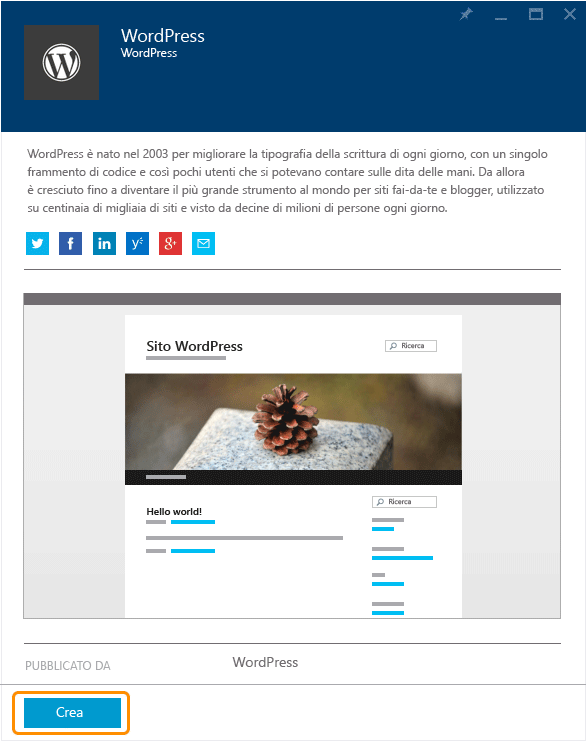
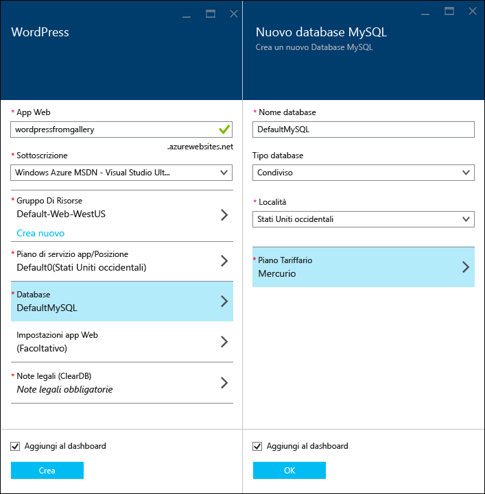
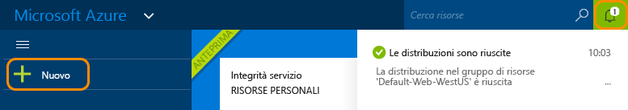
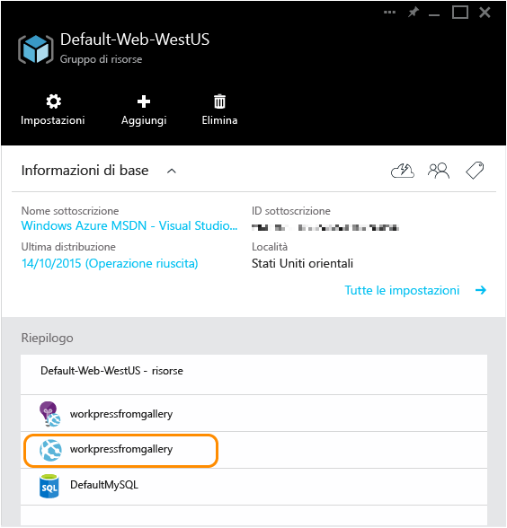

# Creare un'app WordPress nel servizio app di Azure
[!INCLUDE [tabs](../../includes/app-service-web-get-started-nav-tabs.md)]

Questa esercitazione illustra come distribuire un sito blog di WordPress da Azure Marketplace.

Al termine dell'esercitazione si otterrà un sito di blog WordPress attivo e in esecuzione sul cloud.

Si apprenderà come:

* Come trovare un modello di applicazione in Azure Marketplace.
* Come creare un'app Web basata sul modello nel servizio app di Azure.
* Come configurare le impostazioni del servizio app di Azure per la nuova app Web e il database.

Azure Marketplace rende disponibile un'ampia varietà di applicazioni Web ampiamente diffuse, sviluppate da Microsoft, da terze parti e tramite iniziative software open source. Le app Web si basano su una vasta gamma di framework noti, come [PHP](/develop/nodejs/) in questo esempio di WordPress, [.NET](/develop/net/), [Node.js](/develop/nodejs/), [Java](/develop/java/) e [Python](/develop/python/), per citarne alcuni. Per creare un'app Web da Azure Marketplace, l'unico software necessario è il browser usato per il [portale di Azure](https://portal.azure.com/). 

Il sito WordPress distribuito in questa esercitazione usa MySQL come database. Se invece si vuole usare il database SQL come database, vedere [progetto Nami](http://projectnami.org/). **Progetto Nami** è disponibile anche tramite il Marketplace.

> [!NOTE]
> Per completare l'esercitazione, è necessario un account Microsoft Azure. Se non si dispone di un account, è possibile [attivare i benefici della sottoscrizione Visual Studio](https://azure.microsoft.com/pricing/member-offers/msdn-benefits-details/?WT.mc_id=A261C142F) oppure [iscriversi per ottenere una versione di valutazione gratuita](https://azure.microsoft.com/pricing/free-trial/?WT.mc_id=A261C142F).
> 
> Per iniziare a usare il servizio app di Azure prima di registrarsi per ottenere un account Azure, passare alla pagina [Prova il servizio app](https://azure.microsoft.com/try/app-service/). In questa pagina è possibile creare immediatamente un'app Web iniziale temporanea nel servizio app. Non è necessario fornire una carta di credito né impegnarsi in alcun modo.
> 
> 

## Selezionare WordPress ed eseguire la configurazione per il servizio app di Azure
1. Accedere al [Portale di Azure](https://portal.azure.com/).
2. Fare clic su **New**.
   
    ![Creazione di un nuovo sito][5]
3. Cercare **WordPress** e quindi fare clic su **WordPress**. Se si vuole usare il database SQL invece di MySQL, cercare **progetto Nami**.
   
    ![WordPress nell'elenco][7]
4. Dopo aver letto la descrizione dell'app WordPress, fare clic su **Crea**.
   
    
5. Immettere un nome per l'app Web nella casella **App Web** .
   
    Il nome deve essere univoco nel dominio azurewebsites.net perché l'URL dell'app Web sarà {nome}.azurewebsites.net. Se il nome immesso non è univoco, nella casella di testo verrà visualizzato un punto esclamativo rosso.
6. Se sono disponibili più sottoscrizioni, scegliere quella che si vuole usare. 
7. Selezionare un **Gruppo di risorse** o crearne uno nuovo.
   
    Per altre informazioni sui gruppi di risorse, vedere [Panoramica di Azure Resource Manager](../azure-resource-manager/resource-group-overview.md).
8. Selezionare un **Piano di servizio app/Posizione** o crearne uno nuovo.
   
    Per altre informazioni sui piani del servizio app, vedere [Panoramica approfondita dei piani del servizio app di Azure](../app-service/azure-web-sites-web-hosting-plans-in-depth-overview.md)    
9. Fare clic su **Database**, quindi nel pannello **Nuovo database MySQL** specificare i valori necessari per configurare il database MySQL.
   
    a. Immettere un nuovo nome o lasciare il nome predefinito.
   
    b. Lasciare **Tipo database** impostato su **Condiviso**.
   
    c. Scegliere la stessa posizione usata per l'app Web.
   
    d. Scegliere un piano tariffario. Mercury (gratuito con quantità minima di connessioni consentite e di spazio su disco) è ottimale per questa esercitazione.
10. Nel pannello **Nuovo database MySQL** fare clic su **OK**. 
11. Nel pannello **WordPress** accettare le condizioni legali, quindi fare clic su **Crea**. 
    
     
    
     Il servizio app di Azure crea l'app Web, in genere in meno di un minuto. È possibile verificare lo stato facendo clic sull'icona a forma di campana nella parte superiore della pagina del portale.
    
     

## Avviare e gestire l'app Web WordPress
1. Al termine della creazione dell'app Web, nel portale di Azure passare al gruppo di risorse in cui è stata creata l'applicazione. L'app Web e il database saranno visualizzati nel gruppo.
   
    La risorsa aggiuntiva con l'icona a forma di lampadina è [Application Insights](/services/application-insights/), che fornisce servizi di monitoraggio per l'app Web.
2. Nel pannello **Gruppo di risorse** fare clic sulla riga dell'app Web.
   
    
3. Nel pannello dell'app Web fare clic su **Sfoglia**.
   
    ![URL sito][browse]
4. Nella **pagina iniziale** di WordPress immettere le informazioni di configurazione richieste da WordPress, quindi fare clic su **Install WordPress** (Installa WordPress).
   
    
5. Accedere usando le credenziali create nella pagina **iniziale** .  
6. Verrà visualizzata la pagina del dashboard del sito.    
   
    

## Passaggi successivi
Si è appreso come creare e distribuire un'app Web PHP dalla raccolta. Per altre informazioni sull'uso di PHP in Azure, vedere il [centro per sviluppatori PHP](/develop/php/).

Per altre informazioni su come utilizzare le app Web del servizio app, vedere i collegamenti nel lato sinistro della pagina (nelle finestre del browser di grandi dimensioni) o nella parte superiore della pagina (per le finestre del browser ridotte). 

## Modifiche apportate
* Per indicazioni sul passaggio dai Siti Web al servizio app, vedere [Servizio app di Azure e i servizi di Azure esistenti](http://go.microsoft.com/fwlink/?LinkId=529714).

[5]: ./media/web-sites-php-web-site-gallery/startmarketplace.png
[7]: ./media/web-sites-php-web-site-gallery/search-web-app.png
[browse]: ./media/web-sites-php-web-site-gallery/browse-web.png

<!--HONumber=Jan17_HO3-->

