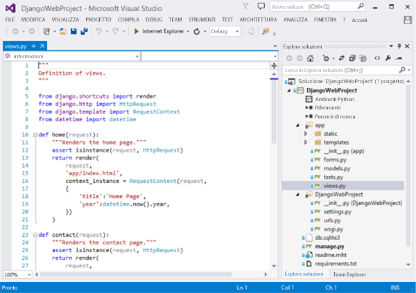
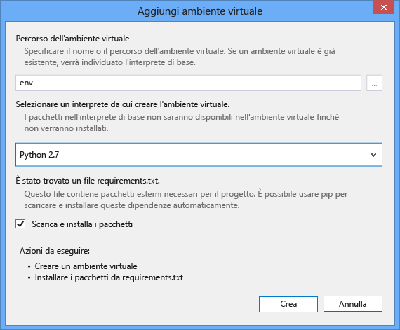
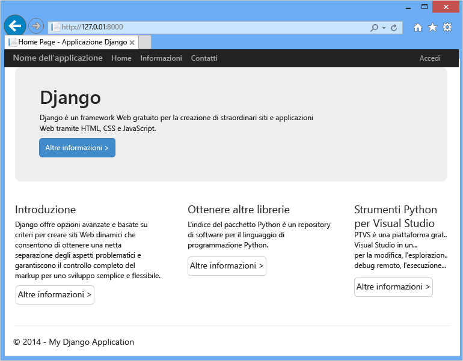
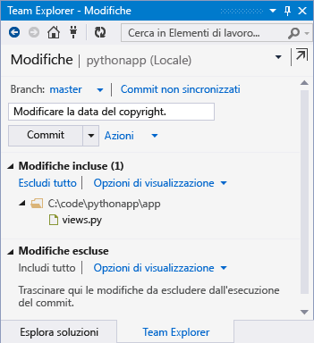
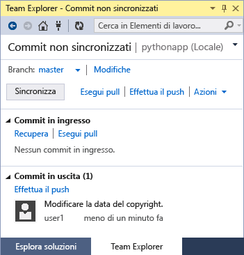

# Creazione di app Web con Django
In questa esercitazione vengono illustrate le operazioni iniziali per l'esecuzione di Python nelle [app Web di Azure](http://go.microsoft.com/fwlink/?LinkId=529714). Le app Web di Azure offrono hosting gratuito limitato e capacità di distribuzione rapida, oltre alla possibilità di utilizzare Python! Se la crescita dell'applicazione lo richiede, è possibile passare all'hosting a pagamento e avvalersi dell'integrazione con tutti gli altri servizi di Azure.

Verrà creata un'applicazione usando il framework Web di Django (vedere le versioni alternative di questa esercitazione per [Flask](web-sites-python-create-deploy-flask-app.md) e [Bottle](web-sites-python-create-deploy-bottle-app.md)). Verrà creato il sito Web dalla raccolta di Azure, sarà configurata la distribuzione Git e si procederà alla clonazione locale del repository. Quindi verrà eseguita l'applicazione localmente, si apporteranno le modifiche, e queste verranno successivamente sottoposte al commit e al push in Azure. Nell'esercitazione viene illustrato come eseguire queste operazioni da Windows o Mac/Linux.

[!INCLUDE [create-account-and-websites-note](../../includes/create-account-and-websites-note.md)]

> [!NOTE]
> Per iniziare a usare Servizio app di Azure prima di registrarsi per ottenere un account Azure, andare a [Prova il servizio app](http://go.microsoft.com/fwlink/?LinkId=523751), dove è possibile creare un'app Web iniziale temporanea nel servizio app. Non è necessario fornire una carta di credito né impegnarsi in alcun modo.
> 
> 

## Prerequisiti
* Windows, Mac o Linux
* Python 2.7 o 3.4
* setuptools, pip, virtualenv (solo Python 2.7)
* Git
* [Python Tools per Visual Studio][Python Tools per Visual Studio] (PTVS) - Nota: non è obbligatorio

**Nota**: la pubblicazione TFS non è attualmente supportata per progetti Python.

###  Windows
Se non è già installato Python 2.7 o 3.4 (32 bit), si consiglia di installare [Azure SDK per Python 2.7] o [Azure SDK per Python 3.4] mediante Installazione guidata piattaforma Web. In tal modo viene installata la versione a 32 bit di Python, setuptools, pip, virtualenv e così via (Python a 32 bit è la versione installata sui computer host di Azure). In alternativa, è possibile ottenere Python da [python.org].

Per Git, è consigliabile [Git per Windows] o [GitHub per Windows]. Se si utilizza Visual Studio, è possibile utilizzare il supporto Git integrato.

È inoltre consigliabile installare [Python Tools 2.2 per Visual Studio]. Si tratta di un'operazione facoltativa, ma se si dispone di [Visual Studio], inclusa la versione gratuita di Visual Studio Community 2013 o Visual Studio Express 2013 per il Web, si otterrà anche l'IDE Python.

### Mac/Linux
È necessario avere già installato Python e Git, ma assicurarsi di disporre di Python 2.7 o 3.4.

## Creazione delle app Web sul portale
Il primo passaggio per la creazione di un'app consiste nella creazione dell'app Web tramite il [portale di Azure](https://portal.azure.com).

1. Accedere al portale di Azure e scegliere il **nuovo** pulsante nell'angolo inferiore sinistro.
2. Nella casella di ricerca digitare "python".
3. Nei risultati della ricerca selezionare **Django** (pubblicata da PTVS), quindi fare clic su **Crea**.
4. Configurare la nuova applicazione Django, come la creazione di un nuovo piano di servizio dell'applicazione e un nuovo gruppo di risorse per esso. Fare quindi clic su **Crea**.
5. Configurare la pubblicazione Git per l'app Web appena creata seguendo le istruzioni disponibili in [Distribuzione del repository Git locale nel servizio app di Azure](app-service-deploy-local-git.md).

## Informazioni generali sull'applicazione
### Contenuti del repository Git
Di seguito viene fornita una panoramica dei file contenuti nel repository Git iniziale, che saranno clonati nella sezione successiva.

    \app\__init__.py
    \app\forms.py
    \app\models.py
    \app\tests.py
    \app\views.py
    \app\static\content\
    \app\static\fonts\
    \app\static\scripts\
    \app\templates\about.html
    \app\templates\contact.html
    \app\templates\index.html
    \app\templates\layout.html
    \app\templates\login.html
    \app\templates\loginpartial.html
    \DjangoWebProject\__init__.py
    \DjangoWebProject\settings.py
    \DjangoWebProject\urls.py
    \DjangoWebProject\wsgi.py

Fonti principali per l'applicazione. È composta da 3 pagine (indice, informazioni su, contatti) con un layout master. Il contenuto statico e gli script includono bootstrap, jquery, modernizr e respond.

    \manage.py

Gestione locale e supporto serve di sviluppo. Da utilizzare per eseguire l'applicazione localmente, sincronizzare il database e così via.

    \db.sqlite3

Database predefinito. Include le tabelle necessarie per l'applicazione da eseguire, ma non contiene utenti (sincronizzare il database per creare un utente).

    \DjangoWebProject.pyproj
    \DjangoWebProject.sln

File di progetto da utilizzare con [Python Tools per Visual Studio].

    \ptvs_virtualenv_proxy.py

Proxy IIS per ambienti virtuali e supporto del debug remoto PTVS.

    \requirements.txt

Pacchetti esterni necessari da parte di questa applicazione. Lo script di distribuzione eseguirà l'installazione di pip dei pacchetti elencati in questo file.

    \web.2.7.config
    \web.3.4.config

File di configurazione IIS. Lo script di distribuzione utilizzerà il file appropriato web.x.y.config e lo copierà come web.config.

### File facoltativi - Personalizzazione della distribuzione
[!INCLUDE [web-sites-python-django-customizing-deployment](../../includes/web-sites-python-django-customizing-deployment.md)]

### File facoltativi - Runtime Python
[!INCLUDE [web-sites-python-customizing-runtime](../../includes/web-sites-python-customizing-runtime.md)]

### Altri file sul server
Alcuni file sono presenti sul server ma non vengono aggiunti al repository Git. Si tratta di file creati dallo script di distribuzione.

    \web.config

File di configurazione IIS. Creato da web.x.y.config per ogni distribuzione.

    \env\

Ambiente virtuale Python. Creato durante la distribuzione se sul sito non esiste già un ambiente virtuale compatibile. I pacchetti elencati in requirements.txt vengono installati con pip. Tuttavia, se i pacchetti sono installati, l'installazione di pip non verrà eseguita.

Nelle tre sezioni successive viene descritto come procedere con lo sviluppo dei siti Web in tre ambienti diversi:

* Windows, con Python Tools per Visual Studio
* Windows, con la riga di comando
* Mac/Linux, con la riga di comando

## Sviluppo di siti Web - Windows - Python Tools per Visual Studio
### Clonare il repository
Innanzitutto, clonare il repository utilizzando l'URL fornito sul portale di Azure. Per altre informazioni, vedere [Distribuzione del repository Git locale nel servizio app di Azure](app-service-deploy-local-git.md).

Aprire il file della soluzione (.sln) incluso nella radice del repository.

### Creare l'ambiente virtuale
A questo punto verrà creato un ambiente virtuale per lo sviluppo locale. Fare clic con il pulsante destro del mouse su **Python Environments** (Ambienti Python) e selezionare **Add Virtual Environment...** (Aggiungi ambiente virtuale...).

* Assicurarsi che il nome dell'ambiente sia `env`.
* Selezionare l'interprete di base. Assicurarsi di utilizzare la stessa versione di Python è selezionata per l'applicazione web (in runtime.txt o **le impostazioni dell'applicazione** blade dell'applicazione web nel portale di Azure).
* Assicurarsi che l'opzione per scaricare e installare i pacchetti sia selezionata.

Fare clic su **Create**. In tal modo verrà creato l'ambiente virtuale e verranno installate le dipendenze elencate in requirements.txt.

### Creare un superuser
Il database incluso con l'applicazione non dispone di un superuser definito. Per utilizzare la funzionalità di accesso nell'applicazione o l'interfaccia di amministrazione Django (se si decide di abilitarla), sarà necessario creare un superuser.

Eseguire questo comando dalla riga di comando dalla cartella del progetto:

    env\scripts\python manage.py createsuperuser

Seguire i prompt per impostare il nome utente, la password e così via.

### Eseguire mediante il server di sviluppo
Premere F5 per avviare il debug. Il Web browser si aprirà automaticamente sulla pagina in esecuzione locale.

È possibile impostare punti di interruzione nelle origini, utilizzare le finestre Espressioni di controllo e così via. Per altre informazioni sulle varie funzionalità, vedere la [documentazione di Python Tools per Visual Studio].

### Apportare modifiche
È possibile sperimentare apportando modifiche alle origini applicazioni e/o ai modelli.

Dopo aver testato le modifiche, eseguirne il commit al repository Git:

### Installare altri pacchetti
È possibile che l'applicazione disponga di dipendenze oltre a Python e Django.

È possibile installare altri pacchetti utilizzando pip. Per installare un pacchetto, fare clic con il pulsante destro del mouse e selezionare **Installa pacchetto Python**.

Ad esempio, per installare Azure SDK per Python, che fornisce l'accesso all'archivio Azure, al bus di servizio e ad altri servizi Azure, immettere `azure`:

Fare clic con il pulsante destro del mouse sull'ambiente virtuale e selezionare **Genera requirements.txt** per aggiornare requirements.txt.

Quindi, eseguire il commit delle modifiche a requirements.txt al repository Git.

### Distribuzione in Azure
Per attivare una distribuzione, fare clic su **Sincronizza** o su **Push**. La sincronizzazione esegue sia il push che il pull.

La prima distribuzione richiederà un po' di tempo, in quanto verrà creato un ambiente virtuale, si installeranno i pacchetti e così via.

In Visual Studio non viene visualizzato l'avanzamento della distribuzione. Se si desidera rivedere l'output, vedere la sezione in [Risoluzione dei problemi- Distribuzione](#troubleshooting-deployment).

Passare all'URL di Azure per visualizzare le modifiche.

## Sviluppo di siti Web - Windows - Riga di comando
### Clonare il repository
Innanzitutto, clonare il repository utilizzando l'URL fornito sul portale di Azure e aggiungere il repository di Azure come remoto. Per altre informazioni, vedere [Distribuzione del repository Git locale nel servizio app di Azure](app-service-deploy-local-git.md).

    git clone <repo-url>
    cd <repo-folder>
    git remote add azure <repo-url>

### Creare l'ambiente virtuale
Verrà creato un nuovo ambiente virtuale per lo sviluppo (non aggiungerlo al repository). Non è possibile cambiare la posizione degli ambienti virtuali in Python, pertanto, ciascuno sviluppatore che lavora all'applicazione ne creerà una locale.

Assicurarsi di utilizzare la stessa versione di Python è selezionata per l'applicazione web (in runtime.txt o blade le impostazioni dell'applicazione dell'applicazione web nel portale di Azure).

Per Python 2.7:

    c:\python27\python.exe -m virtualenv env

Per Python 3.4:

    c:\python34\python.exe -m venv env

Installare tutti i pacchetti esterni richiesti dall'applicazione. È possibile utilizzare il file requirements.txt nella radice del repository per installare i pacchetti nell'ambiente virtuale:

    env\scripts\pip install -r requirements.txt

### Creare un superuser
Il database incluso con l'applicazione non dispone di un superuser definito. Per utilizzare la funzionalità di accesso nell'applicazione o l'interfaccia di amministrazione Django (se si decide di abilitarla), sarà necessario creare un superuser.

Eseguire questo comando dalla riga di comando dalla cartella del progetto:

    env\scripts\python manage.py createsuperuser

Seguire i prompt per impostare il nome utente, la password e così via.

### Eseguire mediante il server di sviluppo
È possibile avviare l'applicazione in un server di sviluppo con il seguente comando:

    env\scripts\python manage.py runserver

Sulla console verranno visualizzati l'URL e la porta su cui è in ascolto il server:

Quindi, aprire il Web browser su tale URL.

### Apportare modifiche
È possibile sperimentare apportando modifiche alle origini applicazioni e/o ai modelli.

Dopo aver testato le modifiche, eseguirne il commit al repository Git:

    git add <modified-file>
    git commit -m "<commit-comment>"

### Installare altri pacchetti
È possibile che l'applicazione disponga di dipendenze oltre a Python e Django.

È possibile installare altri pacchetti utilizzando pip. Ad esempio, per installare Azure SDK per Python,che fornisce l'accesso all'archivio Azure, al bus di servizio e ad altri servizi Azure, digitare:

    env\scripts\pip install azure

Assicurarsi di aggiornare requirements.txt:

    env\scripts\pip freeze > requirements.txt

Eseguire il commit delle modifiche:

    git add requirements.txt
    git commit -m "Added azure package"

### Distribuzione in Azure
Per attivare una distribuzione, eseguire il push delle modifiche in Azure:

    git push azure master

Verrà visualizzato l'output dello script di distribuzione, inclusa la creazione dell'ambiente virtuale, l'installazione di pacchetti, la creazione di web.config.

Passare all'URL di Azure per visualizzare le modifiche.

## Sviluppo del sito Web - Mac/Linux - Riga di comando
### Clonare il repository
Innanzitutto, clonare il repository utilizzando l'URL fornito sul portale di Azure e aggiungere il repository di Azure come remoto. Per altre informazioni, vedere [Distribuzione del repository Git locale nel servizio app di Azure](app-service-deploy-local-git.md).

    git clone <repo-url>
    cd <repo-folder>
    git remote add azure <repo-url>

### Creare l'ambiente virtuale
Verrà creato un nuovo ambiente virtuale per lo sviluppo (non aggiungerlo al repository). Non è possibile cambiare la posizione degli ambienti virtuali in Python, pertanto, ciascuno sviluppatore che lavora all'applicazione ne creerà una locale.

Assicurarsi di utilizzare la stessa versione di Python è selezionata per l'applicazione web (in runtime.txt o blade le impostazioni dell'applicazione dell'applicazione web nel portale di Azure).

Per Python 2.7:

    python -m virtualenv env

Per Python 3.4:

    python -m venv env

oppure

    pyvenv env

Installare tutti i pacchetti esterni richiesti dall'applicazione. È possibile utilizzare il file requirements.txt nella radice del repository per installare i pacchetti nell'ambiente virtuale:

    env/bin/pip install -r requirements.txt

### Creare un superuser
Il database incluso con l'applicazione non dispone di un superuser definito. Per utilizzare la funzionalità di accesso nell'applicazione o l'interfaccia di amministrazione Django (se si decide di abilitarla), sarà necessario creare un superuser.

Eseguire questo comando dalla riga di comando dalla cartella del progetto:

    env/bin/python manage.py createsuperuser

Seguire i prompt per impostare il nome utente, la password e così via.

### Eseguire mediante il server di sviluppo
È possibile avviare l'applicazione in un server di sviluppo con il seguente comando:

    env/bin/python manage.py runserver

Sulla console verranno visualizzati l'URL e la porta su cui è in ascolto il server:

Quindi, aprire il Web browser su tale URL.

### Apportare modifiche
È possibile sperimentare apportando modifiche alle origini applicazioni e/o ai modelli.

Dopo aver testato le modifiche, eseguirne il commit al repository Git:

    git add <modified-file>
    git commit -m "<commit-comment>"

### Installare altri pacchetti
È possibile che l'applicazione disponga di dipendenze oltre a Python e Django.

È possibile installare altri pacchetti utilizzando pip. Ad esempio, per installare Azure SDK per Python,che fornisce l'accesso all'archivio Azure, al bus di servizio e ad altri servizi Azure, digitare:

    env/bin/pip install azure

Assicurarsi di aggiornare requirements.txt:

    env/bin/pip freeze > requirements.txt

Eseguire il commit delle modifiche:

    git add requirements.txt
    git commit -m "Added azure package"

### Distribuzione in Azure
Per attivare una distribuzione, eseguire il push delle modifiche in Azure:

    git push azure master

Verrà visualizzato l'output dello script di distribuzione, inclusa la creazione dell'ambiente virtuale, l'installazione di pacchetti, la creazione di web.config.

Passare all'URL di Azure per visualizzare le modifiche.

## Risoluzione dei problemi - Installazione dei pacchetti
[!INCLUDE [web-sites-python-troubleshooting-package-installation](../../includes/web-sites-python-troubleshooting-package-installation.md)]

## Risoluzione dei problemi - Ambiente virtuale
[!INCLUDE [web-sites-python-troubleshooting-virtual-environment](../../includes/web-sites-python-troubleshooting-virtual-environment.md)]

## Risoluzione dei problemi - File statici
Django dispone del concetto della raccolta dei file statici. Tutti i file statici vengono copiati dal percorso originale in una sola cartella. Per questa applicazione, i file statici vengono copiati in `/static`.

Tale operazione viene eseguita perché i file statici possono provenire da Django diversi. Ad esempio, i file statici delle interfacce di amministrazione di Django si trovano in una sottocartella di una libreria Django nell'ambiente virtuale. I file statici definiti da questa applicazione si trovano in `/app/static`. Quando si usano più framework Django, i file statici saranno ubicati in più punti.

Quando si esegue l'applicazione in modalità debug, l'applicazione utilizza i file statici dalla posizione originale.

Quando si esegue l'applicazione in modalità di rilascio, i file statici **non** vengono utilizzati. L'utilizzo dei file è responsabilità del server Web. Per questa applicazione, IIS utilizzerà i file statici da `/static`.

La raccolta dei file statici viene eseguita automaticamente come parte dello script di distribuzione, eliminando i file raccolti in precedenza. Ciò significa che la raccolta si verifica ogni volta che si esegue la distribuzione, rallentando leggermente la distribuzione, ma garantendo che i file obsoleti non siano disponibili, evitando un potenziale problema di sicurezza.

Per ignorare la raccolta dei file statici per l'applicazione Django:

    \.skipDjango

Sarà quindi necessario eseguire manualmente la raccolta nel computer locale:

    env\scripts\python manage.py collectstatic

Quindi rimuovere la cartella `\static` da `.gitignore` e aggiungerla al repository Git.

## Risoluzione dei problemi - Impostazioni
In `DjangoWebProject/settings.py`è possibile modificare diverse impostazioni.

La modalità di debug è abilitata per la comodità dello sviluppatore. Un simpatico effetto secondario di questa situazione sta nel fatto che sarà possibile vedere immagini e altro contenuto statico durante l'esecuzione locale, senza dover raccogliere i file statici.

Per disabilitare la modalità di debug:

    DEBUG = False

Quando il debug è disabilitato, il valore per `ALLOWED_HOSTS` deve essere aggiornato in modo da includere il nome host di Azure. ad esempio:

    ALLOWED_HOSTS = (
        'pythonapp.azurewebsites.net',
    )

o per abilitare qualsiasi host:

    ALLOWED_HOSTS = (
        '*',
    )

In pratica, è possibile decidere di svolgere operazioni più complesse per gestire il cambio tra la modalità di debug e di rilascio e l'acquisizione del nome host.

È possibile impostare variabili di ambiente mediante la pagina **CONFIGURA** del portale di Azure, nella sezione di **impostazioni delle app**.  Ciò può essere utile per impostare i valori che è possibile non si desideri visualizzare nelle origini (stringhe di connessione, password e così via), o che si desidera impostare in modo diverso tra Azure e il computer locale. In `settings.py`, è possibile eseguire una query delle variabili di ambiente tramite `os.getenv`.

## Utilizzo di un database
Il database incluso con l'applicazione è un database sqlite. Si tratta di un comodo e utile database predefinito da utilizzare per lo sviluppo, in quanto richiede una configurazione minima. Il database è archiviato nel file db.sqlite3 nella cartella del progetto.

Azure fornisce servizi di database semplici da utilizzare da un'applicazione Django. Nelle esercitazioni per l'uso di [Database SQL] e [MySQL] da un'applicazione Django vengono mostrati i passaggi necessari per creare il servizio di database, modificare le impostazioni del database in `DjangoWebProject/settings.py`e le librerie richieste per l'installazione.

È ovvio che se si preferisce gestire server di database personalizzati, è possibile farlo utilizzando macchine virtuali Windows o Linux in esecuzione in Azure.

## Interfaccia di amministrazione di Django
Una volta avviata la creazione dei modelli, è possibile decidere di popolare il database con alcuni dati. Un modo semplice per aggiungere e modificare il contenuto in maniera interattiva, consiste nell'utilizzare l'interfaccia di amministrazione di Django.

Il codice per l'interfaccia di amministrazione è commentato nelle origini applicazioni, ma è contrassegnato in modo chiaro, così da poter essere abilitato facilmente (cercare).

Una volta abilitato, sincronizzare il database, eseguire l'applicazione e navigare fino a `/admin`.

## Passaggi successivi
Per ulteriori informazioni su Django e Python Tools per Visual Studio, seguire i collegamenti forniti di seguito:

* [Documentazione di Django]
* [Documentazione di Python Tools per Visual Studio]

Per informazioni sull'utilizzo di Database SQL e MySQL:

* [Django e MySQL in Azure con Python Tools per Visual Studio]
* [Django e database SQL in Azure con Python Tools per Visual Studio]

Per ulteriori informazioni, vedere il [Centro per sviluppatori di Python](/develop/python/).

## Modifiche apportate
* Per una guida relativa al passaggio da Siti Web al servizio app, vedere [Servizio app di Azure e impatto sui servizi di Azure esistenti](http://go.microsoft.com/fwlink/?LinkId=529714)

<!--Link references-->
[Django e MySQL in Azure con Python Tools per Visual Studio]: web-sites-python-ptvs-django-mysql.md
[Django e database SQL in Azure con Python Tools per Visual Studio]: web-sites-python-ptvs-django-sql.md
[Database SQL]: web-sites-python-ptvs-django-sql.md
[MySQL]: web-sites-python-ptvs-django-mysql.md

<!--External Link references-->
[Azure SDK per Python 2.7]: http://go.microsoft.com/fwlink/?linkid=254281
[Azure SDK per Python 3.4]: http://go.microsoft.com/fwlink/?linkid=516990
[python.org]: http://www.python.org/
[Git per Windows]: http://msysgit.github.io/
[GitHub per Windows]: https://windows.github.com/
[Python Tools per Visual Studio]: http://aka.ms/ptvs
[Python Tools 2.2 per Visual Studio]: http://go.microsoft.com/fwlink/?LinkID=624025
[Visual Studio]: http://www.visualstudio.com/
[Documentazione di Python Tools per Visual Studio]: http://aka.ms/ptvsdocs
[Documentazione di Django]: https://www.djangoproject.com/

<!--HONumber=Nov16_HO2-->

