<properties 
	pageTitle="Django e MySQL in Azure con Python Tools 2.1 per Visual Studio" 
	description="Informazioni su come usare Python Tools per Visual Studio per creare un'app Web Django che archivia i dati in un'istanza di database MySQL e per distribuirla in App Web del servizio app di Azure." 
	services="app-service\web" 
	documentationCenter="python" 
	authors="huguesv" 
	manager="wpickett" 
	editor=""/>

<tags 
	ms.service="app-service-web" 
	ms.workload="web" 
	ms.tgt_pltfrm="na" 
	ms.devlang="python" 
	ms.topic="article" 
	ms.date="04/16/2015" 
	ms.author="huguesv"/>

# Django e MySQL in Azure con Python Tools 2.1 per Visual Studio 

In questa esercitazione si userà [Python Tools per Visual Studio] al fine di creare una semplice app Web per sondaggi con uno dei modelli di esempio PTVS. Questa esercitazione è anche disponibile in formato [video](https://www.youtube.com/watch?v=oKCApIrS0Lo).

Si apprenderà come usare un servizio MySQL ospitato in Azure, come configurare l'app Web per l'uso di MySQL e come pubblicare l'app Web in [App Web del servizio app di Azure](http://go.microsoft.com/fwlink/?LinkId=529714).

Vedere il [Centro per sviluppatori Python] per consultare altri articoli che trattano lo sviluppo di app Web del servizio app di Azure con PTVS usando i framework Web di Bottle, Flask e Django con i servizi di MongoDB, archiviazione tabelle di Azure, MySQL e Database SQL. Sebbene questo articolo sia incentrato sul servizio app, i passaggi sono simili a quelli previsti per lo sviluppo dei [servizi cloud di Azure].

## Prerequisiti

 - Visual Studio 2012 o 2013
 - [Python Tools 2.1 per Visual Studio]
 - [VSIX degli esempi di Python Tools 2.1 per Visual Studio]
 - [Strumenti di Azure SDK per VS 2013] o [Strumenti di Azure SDK per VS 2012]
 - [Python 2.7 a 32 bit]

[AZURE.INCLUDE [create-account-and-websites-note](../../includes/create-account-and-websites-note.md)]

>[AZURE.NOTE]Per iniziare a usare Servizio app di Azure prima di registrarsi per ottenere un account Azure, andare a [Prova il servizio app](http://go.microsoft.com/fwlink/?LinkId=523751), dove è possibile creare un'app Web iniziale temporanea nel servizio app. Non è necessario fornire una carta di credito né impegnarsi in alcun modo.

## Creare il progetto

In questa sezione verrà creato un progetto di Visual Studio usando un modello di esempio. Verrà creato un ambiente virtuale e verranno installati i pacchetti necessari. Si creerà un database locale usando sqlite, quindi verrà eseguita l'applicazione in locale.

1.  In Visual Studio selezionare **File**, **Nuovo progetto**.

1.  I modelli di progetto del pacchetto PTVS Samples VSIX sono disponibili in **Python**, **Esempi**. Selezionare **Polls Django Web Project** e fare clic su OK per creare il progetto.

  	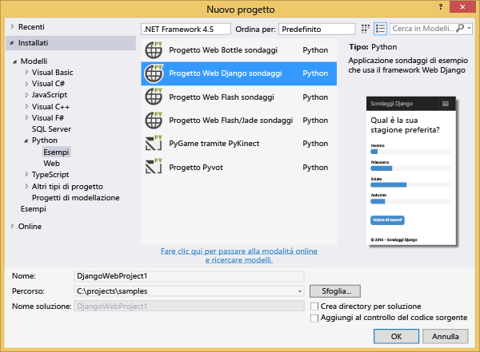

1.  Verrà richiesto di installare pacchetti esterni. Selezionare **Installa in un ambiente virtuale**.

  	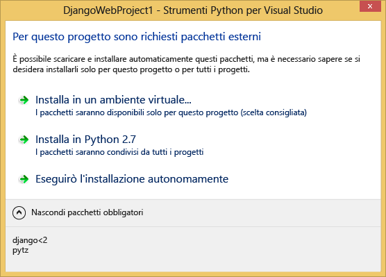

1.  Selezionare **Python 2.7** come interprete di base.

  	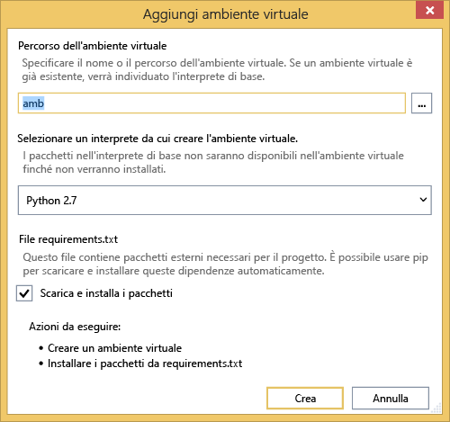

1.  Fare clic con il pulsante destro del mouse sul nodo del progetto e scegliere **Python**, **Django Sync DB**.

  	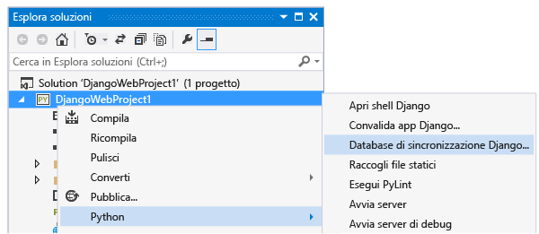

1.  Verrà aperta la console di gestione di Django. Seguire le istruzioni visualizzate per creare un utente.

    Verrà creato un database sqlite nella cartella di progetto.

  	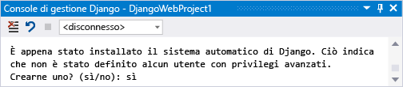

1.  Verificare che l'applicazione funzioni premendo <kbd>F5</kbd>.

1.  Fare clic su **Log in** sulla barra di spostamento in alto.

  	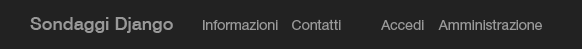

1.  Immettere le credenziali per l'utente creato al momento della sincronizzazione del database.

  	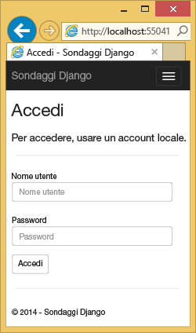

1.  Fare clic su **Create Sample Polls**.

  	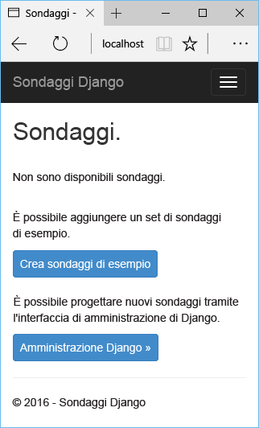

1.  Fare clic su un sondaggio e votare.

  	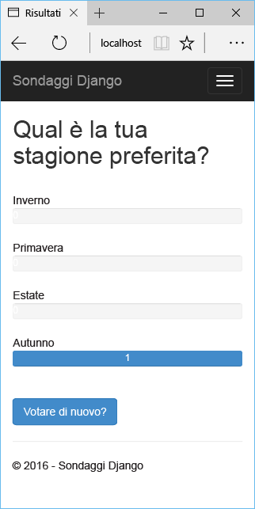

## Creare un database MySQL

Per il database verrà creato un database ospitato MySQL di ClearDB in Azure.

In alternativa, è possibile creare una propria macchina virtuale in esecuzione in Azure, quindi installare e amministrare MySQL manualmente.

Per creare un database con un piano gratuito, attenersi alla procedura seguente.

1.  Accedere al [Portale di Azure].

1.  Nella parte inferiore del pannello di navigazione fare clic su **NEW**. Fare clic su **Dati + archiviazione** > **Azure Marketplace**.

  	<!-- -->

1.  Digitare "**mysql**" nella casella di ricerca e quindi fare clic su **Database MySQL** e su **Crea**.

  	<!-- 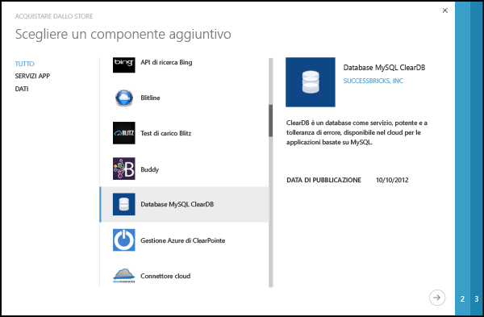 -->

1.  Configurare il nuovo database MySQL creando un nuovo gruppo di risorse e selezionare il percorso appropriato.

  	<!-- 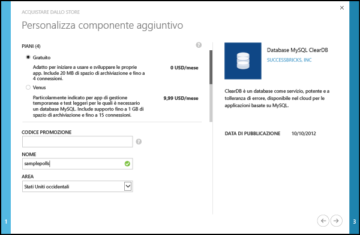 -->

1.  Dopo aver creato il database MySQL, fare clic su **Proprietà** nel pannello del database.
2.  Usare il pulsante Copia per inserire il valore della **STRINGA DI CONNESSIONE** negli Appunti.

## Configurare il progetto

In questa sezione verrà configurata l'app Web per usare il database MySQL appena creato. Verranno inoltre installati i pacchetti Python aggiuntivi necessari per usare i database MySQL con Django, Quindi, l'app Web verrà eseguita in locale.

1.  In Visual Studio aprire **settings.py** dalla cartella *NomeProgetto*. Incollare temporaneamente la stringa di connessione nell'editor. La stringa di connessione è nel formato seguente:

        Database=<NAME>;Data Source=<HOST>;User Id=<USER>;Password=<PASSWORD>

    Modificare il database predefinito **ENGINE** in modo che usi MySQL e impostare i valori relativi a **NOME**, **UTENTE**, **PASSWORD** e **HOST** dalla **STRINGA DI CONNESSIONE**.

        DATABASES = {
            'default': {
                'ENGINE': 'django.db.backends.mysql',
                'NAME': '<Database>',
                'USER': '<User Id>',
                'PASSWORD': '<Password>',
                'HOST': '<Data Source>',
                'PORT': '',
            }
        }

1.  In Esplora soluzioni, in **Python Environments** fare clic con il pulsante destro del mouse sull'ambiente virtuale e scegliere **Install Python Package**.

1. Installare il pacchetto `mysql-python` usando **easy_install**.

  	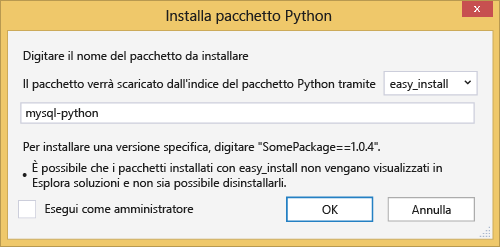

1.  Fare clic con il pulsante destro del mouse sul nodo del progetto e scegliere **Python**, **Django Sync DB**.

    Verranno in tal modo create le tabelle per il database MySQL creato nella sezione precedente. Seguire le istruzioni per creare un utente, che non deve necessariamente corrispondere all'utente nel database sqlite creato nella prima sezione.

  	

1.  Eseguire l'applicazione con `F5`. I sondaggi creati con **Create Sample Polls** e i dati inviati mediante voto verranno serializzati nel database MySQL.

## Pubblicare l'app Web nel servizio app di Azure

L'SDK .NET di Azure offre un modo semplice di distribuire l'app Web nel servizio app di Azure.

1.  In **Esplora soluzioni**, fare clic con il pulsante destro del mouse sul nodo del progetto e scegliere **Pubblica**.

  	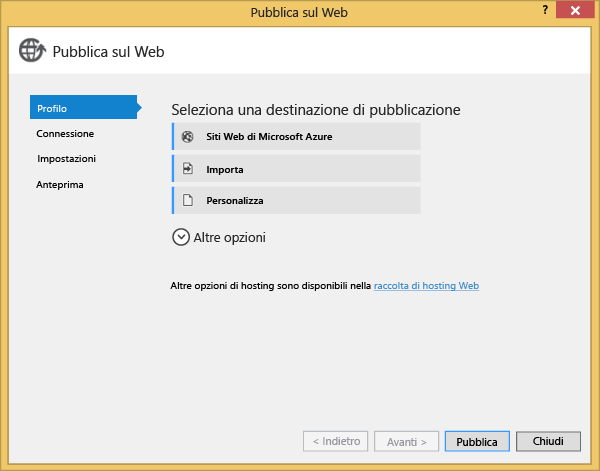

1.  Fare clic su **App Web di Microsoft Azure**.

1.  Fare clic su **Nuovo** per creare una nuova app Web.

1.  Compilare i campi seguenti, quindi fare clic su **Crea**.
	-	**Nome dell'app Web**
	-	**Piano di servizio app**
	-	**Gruppo di risorse**
	-	**Area**
	-	Lasciare **Server database** impostato su **Nessun database**

  	<!-- 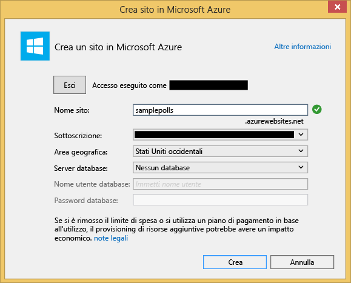 -->

1.  Accettare tutte le altre impostazioni predefinite e fare clic su **Pubblica**.

1.  L'app Web pubblicata verrà aperto automaticamente nel Web browser. L'app Web dovrebbe funzionare come previsto, usando il database **MySQL** ospitato in Azure.

    Congratulazioni.

  	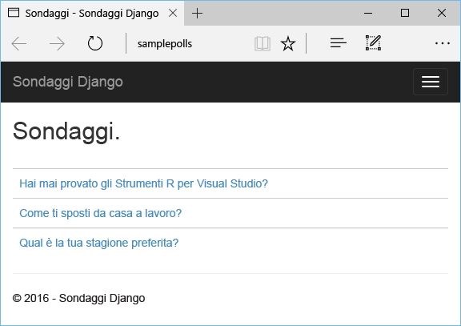

## Passaggi successivi

Usare i collegamenti seguenti per altre informazioni su Python Tools per Visual Studio, Django e MySQL.

- [Documentazione di Python Tools per Visual Studio]
  - [Progetti Web]
  - [Progetti servizio cloud]
  - [Debug remoto in Microsoft Azure]
- [Documentazione di Django]
- [MySQL]

## Modifiche apportate
* Per una guida relativa al passaggio da Siti Web al servizio app, vedere [Servizio app di Azure e impatto sui servizi di Azure esistenti](http://go.microsoft.com/fwlink/?LinkId=529714)
* Per una Guida per la modifica del portale precedente per il nuovo portale, vedere: [riferimento per lo spostamento tra il portale di anteprima](http://go.microsoft.com/fwlink/?LinkId=529715)

<!--Link references-->
[Centro per sviluppatori Python]: /develop/python/
[servizi cloud di Azure]: ../cloud-services-python-ptvs.md

<!--External Link references-->
[Portale di Azure]: https://portal.azure.com
[Python Tools per Visual Studio]: http://aka.ms/ptvs
[Python Tools 2.1 per Visual Studio]: http://go.microsoft.com/fwlink/?LinkId=517189
[VSIX degli esempi di Python Tools 2.1 per Visual Studio]: http://go.microsoft.com/fwlink/?LinkId=517189
[Strumenti di Azure SDK per VS 2013]: http://go.microsoft.com/fwlink/?LinkId=323510
[Strumenti di Azure SDK per VS 2012]: http://go.microsoft.com/fwlink/?LinkId=323511
[Python 2.7 a 32 bit]: http://go.microsoft.com/fwlink/?LinkId=517190
[Documentazione di Python Tools per Visual Studio]: http://pytools.codeplex.com/documentation
[Debug remoto in Microsoft Azure]: http://pytools.codeplex.com/wikipage?title=Features%20Azure%20Remote%20Debugging
[Progetti Web]: http://pytools.codeplex.com/wikipage?title=Features%20Web%20Project
[Progetti servizio cloud]: http://pytools.codeplex.com/wikipage?title=Features%20Cloud%20Project
[Documentazione di Django]: https://www.djangoproject.com/
[MySQL]: http://www.mysql.com/
 

<!---HONumber=July15_HO3-->