<properties
	pageTitle="Creare un processo Web .NET nel servizio app di Azure | Microsoft Azure"
	description="Informazioni sulla creazione di un app a più livelli con ASP.NET MVC e Azure. Il front-end viene eseguito in un'app Web nel servizio app di Azure e il back-end viene eseguito come processo Web. L'app usa Entity Framework, il database SQL e i BLOB e le code di archiviazione di Azure."
	services="app-service"
	documentationCenter=".net"
	authors="tdykstra"
	manager="wpickett"
	editor="mollybos"/>

<tags
	ms.service="app-service"
	ms.workload="na"
	ms.tgt_pltfrm="na"
	ms.devlang="na"
	ms.topic="get-started-article"
	ms.date="10/22/2015"
	ms.author="tdykstra"/>

# Creare un processo Web .NET nel servizio app di Azure

Questa esercitazione illustra come scrivere codice per una semplice applicazione ASP.NET MVC 5 multilivello che usa [WebJobs SDK](websites-dotnet-webjobs-sdk.md) per l'interazione con le [code di Azure](http://www.asp.net/aspnet/overview/developing-apps-with-windows-azure/building-real-world-cloud-apps-with-windows-azure/queue-centric-work-pattern) e i [BLOB di Azure](http://www.asp.net/aspnet/overview/developing-apps-with-windows-azure/building-real-world-cloud-apps-with-windows-azure/unstructured-blob-storage). L'esercitazione illustra come distribuire l'applicazione nel [servizio app di Azure](http://go.microsoft.com/fwlink/?LinkId=529714) e nel [database SQL di Azure](http://msdn.microsoft.com/library/azure/ee336279).

Questa applicazione di esempio è un BBS pubblicitario. Gli utenti possono caricare immagini per le inserzioni e un processo back-end converte le immagini in anteprime. La pagina di elenco di inserzioni illustra le anteprime e la pagina di dettagli delle inserzioni mostra l'immagini con le dimensioni originali. Di seguito è riportata una schermata:

## Prerequisiti

L'esercitazione presuppone che si sia in grado di usare progetti [ASP.NET MVC 5](http://www.asp.net/mvc/tutorials/mvc-5/introduction/getting-started) in Visual Studio.

L'esercitazione è stata scritta per Visual Studio 2013. Se Visual Studio non è già disponibile, verrà installato automaticamente quando si installa Azure SDK per .NET.

L'esercitazione può essere usata con Visual Studio 2015, ma prima di eseguire localmente l'applicazione sarà necessario cambiare la parte `Data Source` della stringa di connessione LocalDB di SQL Server nei file Web.config e App.config da `Data Source=(localdb)\v11.0` a `Data Source=(LocalDb)\MSSQLLocalDB`.

[AZURE.INCLUDE [free-trial-note](../../includes/free-trial-note2.md)]

## Contenuto dell'esercitazione

L'esercitazione mostra come eseguire le attività seguenti:

* Abilitare il sistema per lo sviluppo in Azure installando Azure SDK.
* Creare un progetto di applicazione console che esegue automaticamente l'implementazione come processo Web di Azure quando si implementa il progetto Web associato.
* Testare un back-end di WebJobs SDK localmente sul computer di sviluppo.
* Pubblicare un'applicazione con un back-end di processi Web in un'app Web nel servizio app.
* Caricare file e archiviarli nel servizio BLOB di Azure.
* Usare Azure WebJobs SDK per lavorare con code e BLOB di archiviazione di Azure.

## Architettura dell'applicazione

L'applicazione di esempio usa il [modello di lavoro incentrato sulle code](http://www.asp.net/aspnet/overview/developing-apps-with-windows-azure/building-real-world-cloud-apps-with-windows-azure/queue-centric-work-pattern) per delegare a un processo back-end il lavoro di creazione delle anteprime, che comporta un utilizzo elevato della CPU.

L'app archivia inserzioni pubblicitarie in un database SQL usando Code First di Entity Framework per creare le tabelle e accedere ai dati. Il database archivia due URL per ogni inserzione, uno per l'immagine con dimensioni normali e uno per l'anteprima.

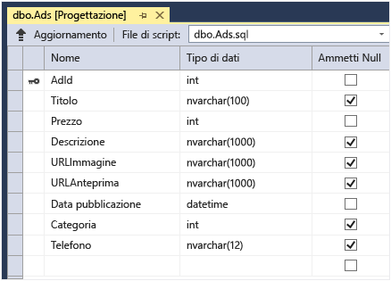

Quando un utente carica un'immagine, l'app Web archivia l'immagine in un [BLOB di Azure](http://www.asp.net/aspnet/overview/developing-apps-with-windows-azure/building-real-world-cloud-apps-with-windows-azure/unstructured-blob-storage), quindi archivia le informazioni sulle inserzioni nel database con un URL che fa riferimento al BLOB e, al tempo stesso, scrive un messaggio in una coda di Azure. In un processo back-end in esecuzione come processo Web di Azure, WebJobs SDK esegue il polling della coda alla ricerca di nuovi messaggi. Quando compare un nuovo messaggio, il processo Web crea un'anteprima per quell'immagine e aggiorna il campo di database relativo all'URL dell'anteprima per quell'inserzione. Il diagramma seguente mostra l'interazione tra le parti dell'applicazione:

[AZURE.INCLUDE [install-sdk](../../includes/install-sdk-2015-2013.md)]

Le istruzioni dell'esercitazione si applicano ad Azure SDK per .NET 2.7.1 o versioni successive.

## Creare un account di archiviazione di Azure

Un account di archiviazione di Azure offre risorse per l'archiviazione di dati di code e BLOB nel cloud. Viene anche usato da WebJobs SDK per archiviare i dati di registrazione per il dashboard.

In un'applicazione effettiva si creano in genere account separati per i dati dell'applicazione rispetto ai dati di registrazione e account separati per i dati di test rispetto ai dati di produzione. In questa esercitazione sarà usato un solo account.

1. Aprire la finestra **Esplora server** in Visual Studio.

2. Fare clic con il pulsante destro del mouse sul nodo **Azure** e quindi scegliere **Connetti a Microsoft Azure**.
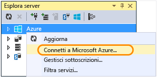

3. Accedere con le credenziali di Azure.

5. Fare clic con il pulsante destro del mouse su **Archiviazione** sotto il nodo Azure e quindi scegliere **Crea account di archiviazione**.
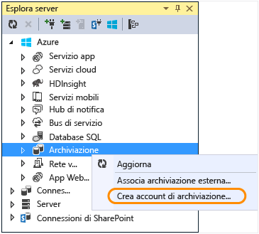

3. Nella finestra di dialogo **Crea account di archiviazione** immettere un nome per l'account di archiviazione.

	Il nome deve essere univoco. Nessun altro account di archiviazione di Azure può avere lo stesso nome. Se il nome immesso è già in uso, sarà possibile cambiarlo.

	L'URL per accedere all'account di archiviazione sarà *{nome}*.core.windows.net.

5. Nell'elenco a discesa **Regione o gruppo di affinità** impostare l'area geografica più vicina.

	Questa impostazione specifica il data center di Azure che ospiterà l'account di archiviazione. Per questa esercitazione è possibile selezionare qualsiasi area senza riscontrare differenze evidenti. Tuttavia, per un'app Web di produzione è consigliabile che il server Web e l'account di archiviazione siano nella stessa area geografica per poter ridurre al minimo la latenza e il costo per l'uscita dei dati. Il data center dell'app Web (che si creerà più avanti) deve essere eseguito il più vicino possibile ai browser che accedono all'app Web per poter da ridurre al minimo la latenza.

6. Nell'elenco a discesa **Replica** scegliere **Localmente ridondante**.

	Quando per un account di archiviazione è abilitata la replica geografica, il contenuto archiviato è replicato in un data center secondario per permettere il failover in tale posizione in caso di errore grave nella posizione primaria. La replica geografica può comportare costi aggiuntivi. Per gli account di test e di sviluppo si preferisce in genere non pagare per la replica geografica. Per altre informazioni, vedere la pagina relativa alla [creazione, gestione o eliminazione di un account di archiviazione](../storage-create-storage-account/#replication-options).

5. Fare clic su **Crea**.

	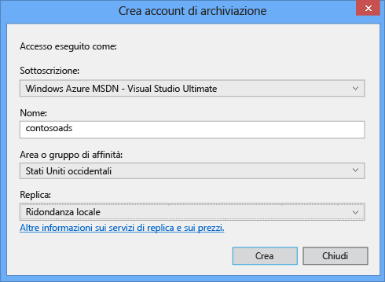

## Scaricare l'applicazione

1. Scaricare e decomprimere la [soluzione completata](http://code.msdn.microsoft.com/Simple-Azure-Website-with-b4391eeb).

2. Avviare Visual Studio.

3. Nel menu **File** scegliere **Apri > Progetto/Soluzione**, passare alla cartella in cui è stata scaricata la soluzione, quindi aprire il file di soluzione.

4. Premere CTRL+MAIUSC+B per compilare la soluzione.

	Per impostazione predefinita, Visual Studio ripristina automaticamente il contenuto del pacchetto NuGet, che non era incluso nel file con estensione *zip*. In caso di mancato ripristino dei pacchetti, installarli manualmente passando alla finestra di dialogo **Gestisci pacchetti NuGet** per la soluzione, quindi facendo clic sul pulsante **Ripristina** in alto a destra.

5. In **Esplora soluzioni** verificare che come progetto di avvio sia selezionato **ContosoAdsWeb**.

## Configurare l'applicazione per l'uso dell'account di archiviazione

1. Aprire il file *Web.config* dell'applicazione nel progetto ContosoAdsWeb.

	Il file contiene una stringa di connessione di SQL e una stringa di connessione di archiviazione di Azure per usare i BLOB e le code.

	La stringa di connessione di SQL punta a un database [SQL Server Express LocalDB](http://msdn.microsoft.com/library/hh510202.aspx).

	La stringa di connessione di archiviazione è un esempio contenente i segnaposto per il nome dell'account di archiviazione e la chiave di accesso. La si sostituirà con una stringa di connessione contenente il nome e la chiave dell'account di archiviazione.

	<pre class="prettyprint">&lt;connectionStrings&gt;
	  &lt;add name="ContosoAdsContext" connectionString="Data Source=(localdb)\v11.0; Initial Catalog=ContosoAds; Integrated Security=True; MultipleActiveResultSets=True;" providerName="System.Data.SqlClient" /&gt;
	  &lt;add name="AzureWebJobsStorage" connectionString="DefaultEndpointsProtocol=https;AccountName=<mark>[accountname]</mark>;AccountKey=<mark>[accesskey]</mark>"/&gt;
	&lt;/connectionStrings&gt;</pre>

	La stringa di connessione di archiviazione si chiama AzureWebJobsStorage perché questo è il nome usato da WebJobs SDK per impostazione predefinita. Poiché qui viene usato lo stesso nome, è necessario impostare solo un valore della stringa di connessione nell'ambiente di Azure.

2. In **Esplora server** fare clic con il pulsante destro del mouse sull'account di archiviazione sotto il nodo **Archiviazione** e quindi scegliere **Proprietà**.

	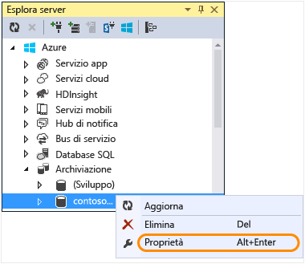

3. Nella finestra **Proprietà** fare clic su **Chiavi account di archiviazione** e quindi sui puntini di sospensione.

	

4. Copiare la **stringa di connessione**.

	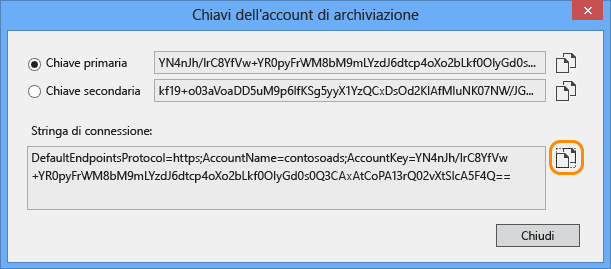

5. Sostituire la stringa di connessione di archiviazione nel file *Web.config* con la stringa di connessione appena copiata. Assicurarsi di selezionare tutti gli elementi nelle virgolette, ma di non includere le virgolette prima di incollare.

6. Aprire il file *App.config* nel progetto ContosoAdsWebJob.

	Questo file ha due stringhe di connessione di archiviazione, una per i dati dell'applicazione e l'altra per la registrazione. In questa esercitazione sarà usato lo stesso account per entrambe. Le stringhe di connessione sono segnaposto per le chiavi dell'account di archiviazione.
  	<pre class="prettyprint">&lt;configuration&gt;
    &lt;connectionStrings&gt;
        &lt;add name="AzureWebJobsDashboard" connectionString="DefaultEndpointsProtocol=https;AccountName=<mark>[accountname]</mark>;AccountKey=<mark>[accesskey]</mark>"/&gt;
        &lt;add name="AzureWebJobsStorage" connectionString="DefaultEndpointsProtocol=https;AccountName=<mark>[accountname]</mark>;AccountKey=<mark>[accesskey]</mark>"/&gt;
        &lt;add name="ContosoAdsContext" connectionString="Data Source=(localdb)\v11.0; Initial Catalog=ContosoAds; Integrated Security=True; MultipleActiveResultSets=True;"/&gt;
    &lt;/connectionStrings&gt;
        &lt;startup&gt;
            &lt;supportedRuntime version="v4.0" sku=".NETFramework,Version=v4.5" /&gt;
    &lt;/startup&gt;
&lt;/configuration&gt;</pre>

	Per impostazione predefinita, WebJobs SDK cerca le stringhe di connessione denominate AzureWebJobsStorage e AzureWebJobsDashboard. Come alternativa, è possibile archiviare la stringa di connessione come si preferisce e passarla in modo esplicito all'oggetto [`JobHost`](websites-dotnet-webjobs-sdk-storage-queues-how-to.md#config).

7. Sostituire entrambe le stringhe di connessione di archiviazione con la stringa di connessione copiata in precedenza.

8. Salvare le modifiche.

## Eseguire l'applicazione in locale

1. Per avviare il front-end Web dell'applicazione, premere CTRL+F5.

	Nel browser predefinito verrà aperta la home page. Viene eseguito il progetto Web perché è stato impostato come progetto di avvio.

	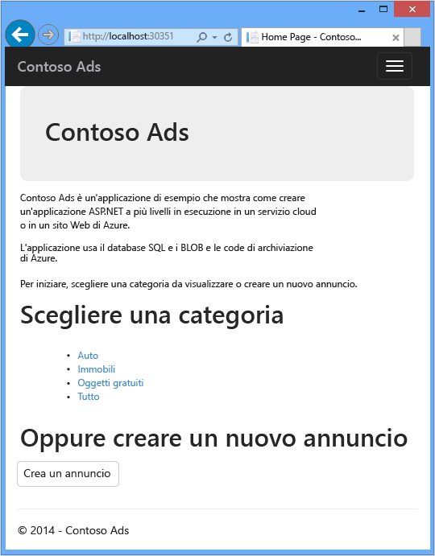

2. Per avviare il back-end processo Web dell'applicazione, fare clic con il pulsante destro del mouse sul progetto ContosoAdsWebJob in **Esplora soluzioni** e scegliere **Debug** > **Avvia nuova istanza**.

	Si apre una finestra dell'applicazione console in cui sono visualizzati messaggi di registrazione indicanti che l'esecuzione dell'oggetto JobHost di WebJobs SDK è iniziata.

	

3. Nel browser fare clic su **Create an Ad**.

4. Immettere alcuni dati di prova e selezionare un'immagine da caricare, quindi fare clic su **Create**.

	

	L'app passa alla pagina di indice, ma non mostra alcuna anteprima per la nuova inserzione, poiché l'elaborazione non è stata ancora eseguita.

	Intanto, dopo una breve attesa un messaggio di registrazione nella finestra dell'applicazione console mostra che una coda di messaggi è stata ricevuta ed elaborata.

	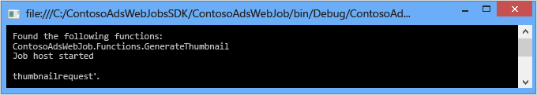

5. Dopo aver letto i messaggi di registrazione nella finestra dell'applicazione console, aggiornare la pagina di indice per visualizzare le anteprime.

	

6. Fare clic su **Details** per visualizzare l'immagine con dimensioni normali per l'inserzione.

	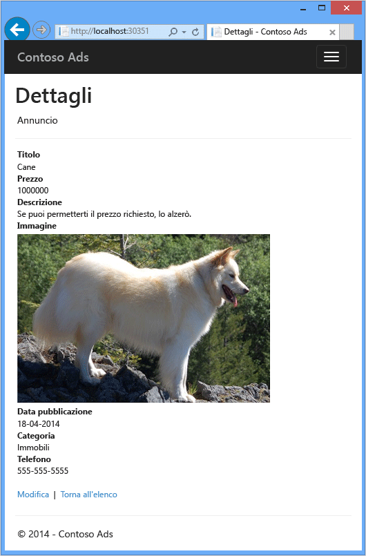

L'applicazione è stata eseguita sul computer locale e usa un database di SQL Server sul computer, ma lavora con le code e i BLOB nel cloud. Nella sezione seguente si eseguirà l'applicazione nel cloud, usando un database cloud e BLOB e code cloud.

## Eseguire l'applicazione nel cloud

Per eseguire l'applicazione nel cloud, eseguire i passaggi seguenti:

* Distribuire su App Web. Visual Studio creerà automaticamente una nuova app Web in servizio app e un'istanza di database SQL.
* Configurare l'app Web per l'uso del database SQL e dell'account di archiviazione di Azure.

Dopo aver creato alcuni annunci durante l'esecuzione nel cloud, verrà visualizzato il dashboard di WebJobs SDK con le funzionalità di monitoraggio complete disponibili.

### Distribuire in App Web

1. Chiudere il browser e la finestra dell'applicazione console.

2. In **Esplora soluzioni** fare clic con il pulsante destro del mouse sul progetto ContosoAdsWeb, quindi scegliere **Pubblica**.

3. Nel passaggio **Profilo** della procedura guidata **Pubblica sito Web** fare clic su **App Web di Microsoft Azure**.

	

4. Accedere ad Azure se non si è già connessi.

5. Fare clic su **Nuovo**.

	L'aspetto della finestra di dialogo dipende dalla versione di Azure SDK per .NET installata.

	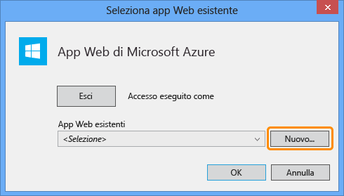

6. Nella finestra di dialogo **Crea app Web in Microsoft Azure** immettere un nome univoco nella casella **Nome app Web**.

	L'URL completo sarà costituito da quanto immesso in questa casella e da .azurewebsites.net (come mostrato accanto alla casella di testo **Nome app Web**). Se, ad esempio, il nome dell'app Web è ContosoAds, l'URL sarà ContosoAds.azurewebsites.net.

7. Nell'elenco a discesa [Piano di servizio app](../app-service/azure-web-sites-web-hosting-plans-in-depth-overview.md) selezionare **Crea nuovo piano di servizio app**. Immettere un nome per il piano di servizio app, ad esempio ContosoAdsPlan.

8. Nell'elenco a discesa [Gruppo di risorse](../resource-group-overview.md) selezionare **Crea nuovo gruppo di risorse**.

9. Immettere un nome per il gruppo di risorse, ad esempio ContosoAdsGroup.

10. Nell'elenco a discesa **Area** selezionare la stessa area scelta per l'account di archiviazione.

	Questa impostazione consente di specificare il data center di Azure in cui verrà eseguito il sito Web. Mantenere l'account di archiviazione e di applicazione web nello stesso datacenter riduce al minimo i costi di uscita di latenza e dati.

11. Nell'elenco a discesa **Server di database** scegliere **Crea nuovo server**.

12. Immettere un nome per il server di database, ad esempio contosoadsserver e un numero o il proprio nome per rendere univoco il nome del server.

	Il nome del server deve essere univoco. Può contenere lettere minuscole, numeri e trattini, Non può contenere un trattino finale.

	In alternativa, se la sottoscrizione è già associata a un server, sarà possibile selezionare quel server dall'elenco a discesa.

12. Immettere un **Nome utente database** e una **Password database** di amministratore.

	Se è stata selezionata l'opzione **Nuovo server di database SQL**, in questo passaggio non sarà necessario immettere un nome e una password esistenti, ma un nuovo nome e una nuova password, definiti ora e da usare in seguito per l'accesso al database. Se è stato selezionato un server creato in precedenza, sarà richiesta la password dell'account utente di amministrazione già creato.

13. Fare clic su **Crea**.

	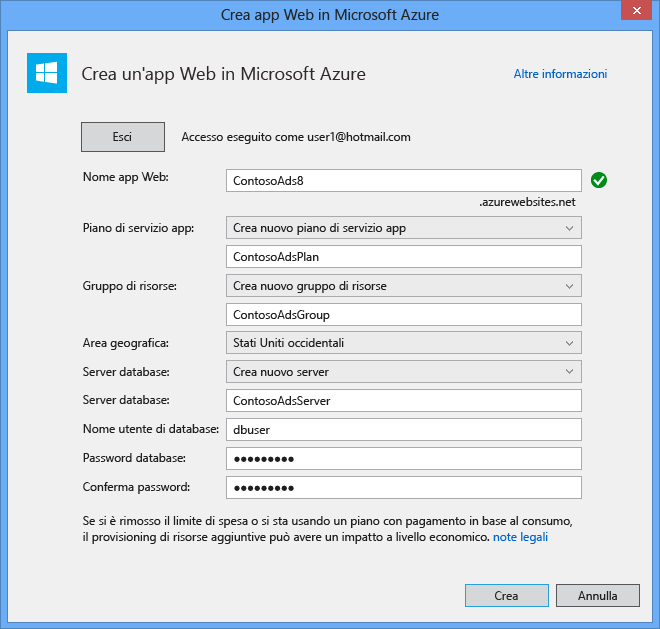

	Visual Studio crea la soluzione, il progetto Web, l'app Web in Azure e l'istanza di database SQL di Azure.

14. Nel passaggio **Connessione** della procedura guidata **Pubblica sito Web** fare clic su **Avanti**.

	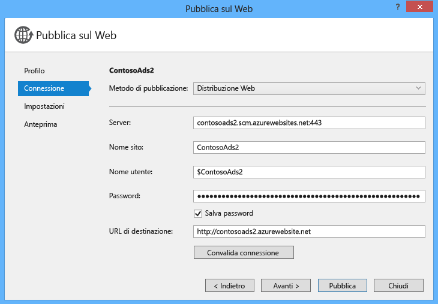

15. Nel passaggio **Impostazioni** deselezionare la casella di controllo **Usa la stringa di connessione in fase di runtime** e quindi fare clic su **Avanti**.

	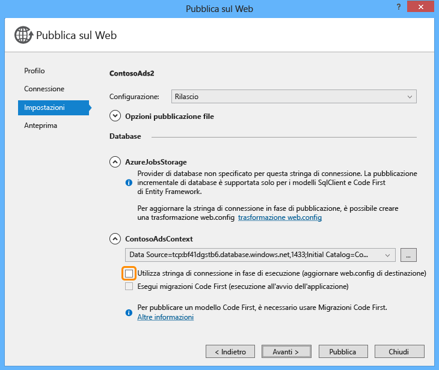

	Non è necessario usare la finestra di dialogo di pubblicazione per impostare la stringa di connessione di SQL perché si imposterà tale valore in seguito nell'ambiente di Azure.

	È possibile ignorare gli avvisi in questa pagina.

	* Normalmente l'account di archiviazione usato durante l'esecuzione in Azure è diverso da quello usato durante l'esecuzione in locale, ma per questa esercitazione si userà lo stesso in entrambi gli ambienti. In questo modo non è necessario trasformare la stringa di connessione AzureWebJobsStorage. Anche se si volesse usare un account di archiviazione diverso nel cloud, non sarebbe necessario trasformare la stringa di connessione perché l'app userà un'impostazione dell'ambiente di Azure quando verrà eseguita in Azure. Questo verrà illustrato successivamente in questa esercitazione.

	* Per questa esercitazione non si apporteranno modifiche al modello di dati usato per il database ContosoAdsContext, quindi non è necessario usare Migrazioni Code First di Entity Framework per la distribuzione. Code First creerà automaticamente un nuovo database la prima volta che l'app cercherà di accedere ai dati di SQL.

	Per questa esercitazione, vanno bene i valori predefiniti delle opzioni in **Opzioni pubblicazione file**.

16. Nel passaggio **Anteprima** fare clic su **Avvia anteprima**.

	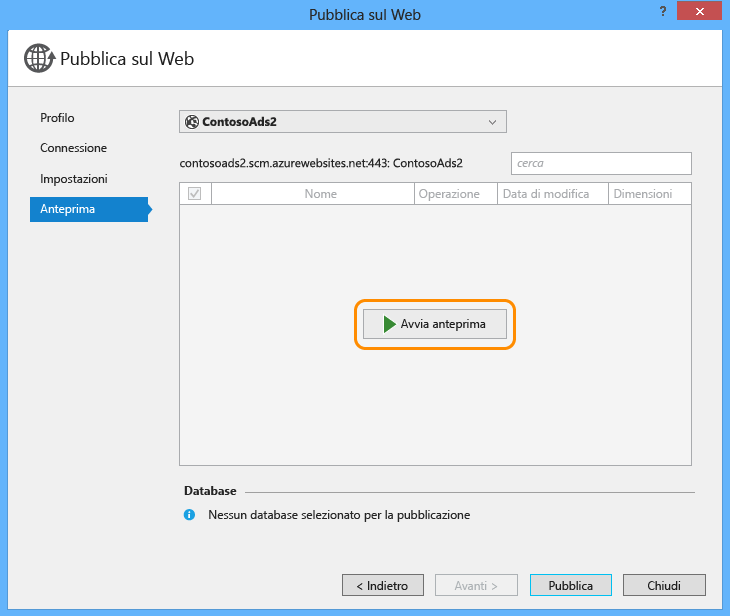

	È possibile ignorare l'avviso che informa che non ci sono database da pubblicare. Code First di Entity Framework creerà il database che non è necessario pubblicare.

	La finestra di anteprima mostra che i file binari e i file di configurazione del progetto processo Web verranno copiati nella cartella *app\_data\\jobs\\continuous* dell'app Web.

	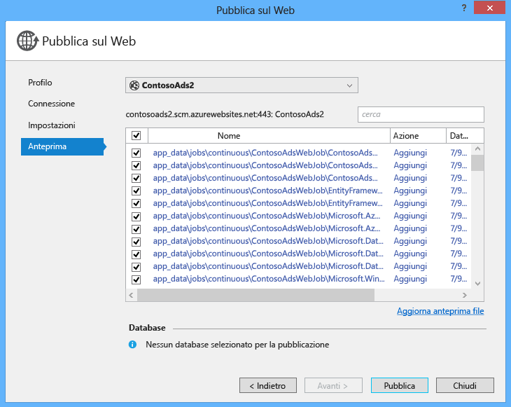

17. Fare clic su **Pubblica**.

	Visual Studio implementa l'applicazione e apre l'URL della home page URL nel browser.

	Sarà possibile usare l'app Web solo dopo aver impostato le stringhe di connessione nell'ambiente di Azure nella sezione successiva. Verrà visualizzata una pagina di errore oppure la home page a seconda delle opzioni di creazione dell'app Web e del database scelte in precedenza.

### Configurare l'app Web per l'uso del database SQL e dell'account di archiviazione di Azure.

Come procedura consigliata per la sicurezza, [evitare di inserire informazioni sensibili, come le stringhe di connessione, in file archiviati repository di codice sorgente](http://www.asp.net/aspnet/overview/developing-apps-with-windows-azure/building-real-world-cloud-apps-with-windows-azure/source-control#secrets). è possibile impostare i valori delle stringhe di connessione e di altre impostazioni nell'ambiente di Azure. Le API di configurazione di ASP.NET rilevano automaticamente questi valori quando l'app viene eseguita in Azure. È possibile impostare questi valori in Azure con **Esplora Server**, il portale, Windows PowerShell o l'interfaccia della riga di comando multipiattaforma. Per altre informazioni, vedere il blog sul [funzionamento delle stringhe di applicazione e di connessione](/blog/2013/07/17/windows-azure-web-sites-how-application-strings-and-connection-strings-work/).

In questa sezione si userà **Esplora server** per impostare i valori delle stringhe di connessione in Azure.

7. In **Esplora server** fare clic con il pulsante destro del mouse sull'app Web in **Azure > {gruppo di risorse}**, quindi scegliere **Visualizza impostazioni**.

	La finestra **App Web di Azure** si apre nella scheda **Configurazione**.

9. Sostituire il nome della stringa di connessione DefaultConnection con ContosoAdsContext.

	Poiché Azure ha creato automaticamente questa stringa di connessione quando si è creata l'app Web con un database associato, il valore della stringa di connessione è già quello corretto. Si sta solo sostituendo il nome con quello cercato dal codice.

9. Aggiungere due nuove stringhe di connessione denominate AzureWebJobsStorage e AzureWebJobsDashboard. Impostare il tipo personalizzato e impostare il valore delle stringhe di connessione sullo stesso valore usato in precedenza per i file *Web.config* e *App.config*. Assicurarsi di includere l'intera stringa di connessione, non solo la chiave di accesso, e non includere le virgolette.

	Queste stringhe di connessione vengono usate da WebJobs SDK, una per i dati dell'applicazione e l'altra per la registrazione. Come illustrato in precedenza, quella per i dati dell'applicazione viene usata anche dal codice front-end Web.

9. Fare clic su **Save**.

	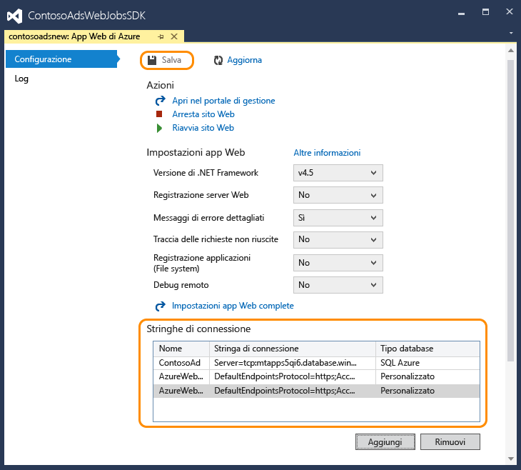

10. In **Esplora server**fare clic con il pulsante destro del mouse sull'app Web, quindi scegliere **Arresta**.

12. Dopo che l'app Web viene arrestata, fare nuovamente clic con il pulsante destro del mouse sull'app Web e scegliere **Avvia**.

	Il processo Web viene avviato automaticamente al momento della pubblicazione, ma si arresta quando si apporta una modifica alla configurazione. Per riavviarlo, è possibile riavviare l'app Web o riavviare il processo Web nel [portale di Azure](http://go.microsoft.com/fwlink/?LinkId=529715). In genere è consigliabile riavviare l'app Web dopo una modifica alla configurazione.

9. Aggiornare la finestra del browser con l'URL dell'app Web nella barra degli indirizzi.

	Viene visualizzata la home page.

10. Creare un annuncio, come quando l'applicazione è stata eseguita in locale.

	La pagina di indice inizialmente viene visualizzata senza alcuna anteprima.

11.	Aggiornare la pagina dopo alcuni secondi e l'anteprima verrà visualizzata.

	Se l'anteprima non viene visualizzata, potrebbe essere necessario attendere circa un minuto per il completamento del riavvio del processo Web. Se dopo alcuni minuti l'anteprima non viene visualizzata quando si aggiorna la pagina, è possibile che il processo Web non sia stato avviato automaticamente. In questo caso, passare alla scheda Processi Web nella pagina del [portale di Azure](https://manage.windowsazure.com) per l'app Web, quindi fare clic su **Avvia**.

### Visualizzare il dashboard di WebJobs SDK

1. Nel [portale di Azure](https://manage.windowsazure.com) selezionare l'app Web.

2. Fare clic sulla scheda **Processi Web**.

3. Fare clic sull'URL nella colonna dei log del processo Web.

	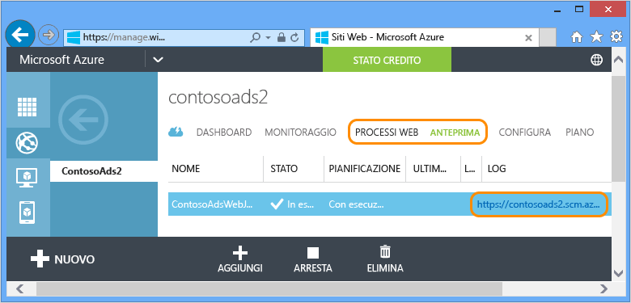

	Una nuova scheda del browser si apre nel dashboard di WebJobs SDK. Il dashboard mostra che il processo Web è in esecuzione e mostra un elenco di funzioni nel codice, attivate da WebJobs SDK.

4. Fare clic su una delle funzioni per visualizzare i dettagli sull'esecuzione.

	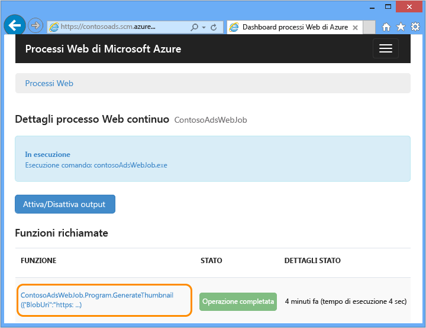

	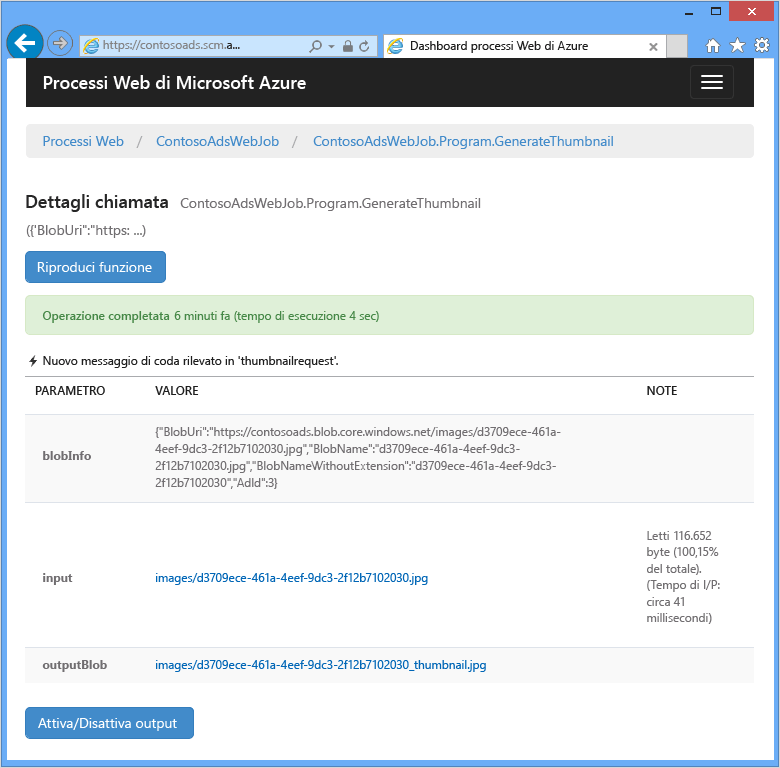

	Facendo clic sul pulsante **Riproduci funzione** di questa pagina, il framework WebJobs SDK chiama nuovamente la funzione ed è possibile modificare i dati passati prima alla funzione.

>[AZURE.NOTE]Al termine del test eliminare l'app Web e l'istanza di database SQL. L'app Web è gratuita, ma l'istanza di database SQL e l'account di archiviazione causano un incremento delle spese (minime date le dimensioni ridotte). In più, se si lascia l'app Web in esecuzione, chiunque individui l'URL potrà creare e visualizzare inserzioni. Nel portale di Azure passare alla scheda **Dashboard** per l'app Web e quindi fare clic sul pulsante **Elimina** nella parte inferiore della pagina. È quindi possibile selezionare una casella di controllo per eliminare contemporaneamente l'istanza del database SQL. Se si vuole semplicemente impedire ad altri utenti di accedere all'app Web, fare invece clic su **Arresta**. In questo caso, continueranno a essere generati addebiti per il database SQL e l'account di archiviazione. È possibile eseguire una procedura analoga per eliminare il database SQL e l'account di archiviazione quando non sono più necessari.

## Creare un'applicazione completamente nuova

In questa sezione verranno eseguite le attività seguenti:

* Creare una soluzione Visual Studio con un progetto Web.
* Aggiungere un progetto libreria di classi per il livello di accesso ai dati condiviso tra front-end e back-end.
* Aggiungere un progetto applicazione console per il back-end, con la distribuzione dei processi Web abilitata.
* Aggiungere i pacchetti NuGet.
* Impostare i riferimenti al progetto.
* Copiare il codice dell'applicazione e i file di configurazione dall'applicazione scaricata con cui si è lavorato nella sezione precedente dell'esercitazione.
* Esaminare le parti del codice che usano i BLOB e le code di Azure e WebJobs SDK.

### Creare una soluzione Visual Studio con un progetto Web e un progetto libreria di classi

1. In Visual Studio scegliere **Nuovo** > **Progetto** dal menu **File**.

2. Nella finestra di dialogo **Nuovo progetto** scegliere **Visual C#** > **Web** > **Applicazione Web ASP.NET**.

3. Assegnare al progetto il nome ContosoAdsWeb e alla soluzione il nome ContosoAdsWebJobsSDK (cambiare il nome della soluzione se la si inserirà nella stessa cartella della soluzione scaricata) e quindi fare clic su **OK**.

	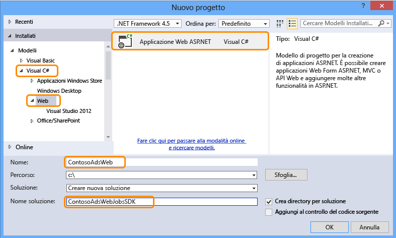

5. Nella finestra di dialogo **Nuovo progetto ASP.NET** scegliere il modello MVC e deselezionare la casella di controllo **Ospita nel cloud** in **Microsoft Azure**.

	Selezionando **Ospita nel cloud**, Visual Studio può creare automaticamente una nuova app Web di Azure e un nuovo database SQL. Poiché sono già stati creati in precedenza, non è necessario farlo ora in fase di creazione del progetto. Per crearne uno nuovo, selezionare la casella di controllo. È quindi possibile configurare la nuova app Web e il nuovo database SQL come è stato fatto in precedenza durante la distribuzione dell'applicazione.

5. Fare clic su **Modifica autenticazione**.

	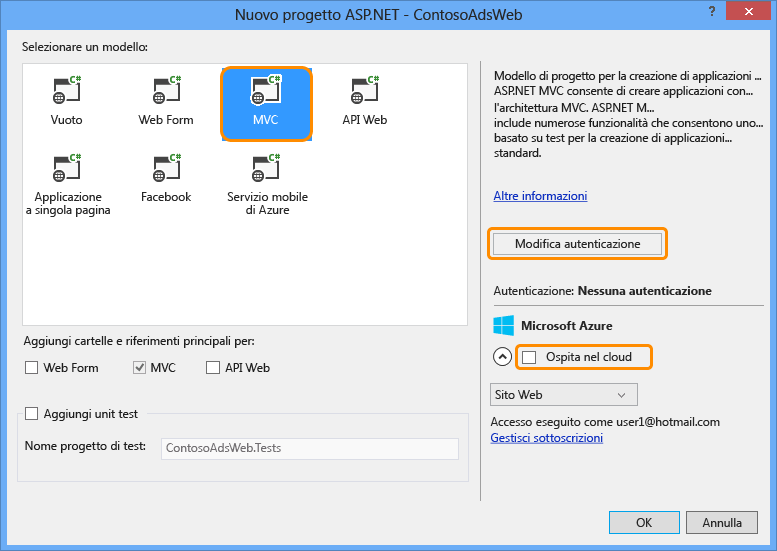

7. Nella finestra di dialogo **Modifica autenticazione** fare clic su **Nessuna autenticazione**, quindi fare clic su **OK**.

	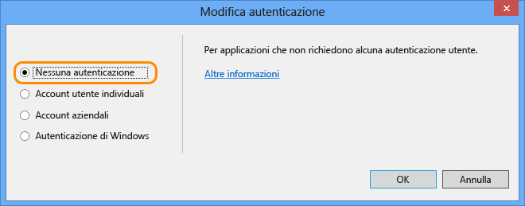

8. Nella finestra di dialogo **Nuovo progetto ASP.NET** fare clic su **OK**.

	Visual Studio crea la soluzione e il progetto Web.

9. In **Esplora soluzioni** fare clic con il pulsante destro del mouse sulla soluzione, non sul progetto, quindi scegliere **Aggiungi** > **Nuovo progetto**.

11. Nella finestra di dialogo **Aggiungi nuovo progetto** scegliere **Visual C#** > **Windows Desktop** > modello **Libreria di classi**.

10. Assegnare il nome *ContosoAdsCommon* al progetto, quindi fare clic su **OK**.

	Questo progetto conterrà il contesto Entity Framework e il modello di dati che verranno usati sia dal front-end che dal back-end. In alternativa, è possibile definire le classi correlate a Entity Framework nel progetto Web e fare riferimento a tale progetto dal progetto processo Web. In tale caso, tuttavia, il progetto processo Web includerebbe un riferimento ad assembly Web non necessari.

### Aggiungere un progetto applicazione console con la distribuzione dei processi Web abilitata.

1. Fare clic con il pulsante destro del mouse sul progetto Web (non sulla soluzione o sul progetto libreria di classi) e quindi scegliere **Aggiungi** > **Nuovo progetto processo Web Azure**.

	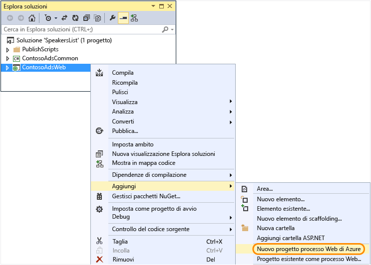

2. Nella finestra di dialogo **Aggiungi processo Web Azure** immettere ContosoAdsWebJob sia come **Nome progetto** che come **Nome processo Web**. Lasciare **Modalità di esecuzione processo Web** impostato su **Esegui in modo continuo**.

3.  Fare clic su **OK**.

	Visual Studio crea un'applicazione console configurata per la distribuzione come processo Web quando si implementa il progetto Web. A tale scopo dopo la creazione del progetto ha eseguito le attività seguenti:

	* Aggiunta di un file *webjob-publish-settings.json* nella cartella delle proprietà del progetto processo Web.
	* Aggiunta di un file *webjobs-list.json* nella cartella delle proprietà del progetto Web.
	* Installazione del pacchetto NuGet Microsoft.Web.WebJobs.Publish nel progetto processo Web.

	Per altre informazioni su queste modifiche, vedere [Come implementare processi Web usando Visual Studio](websites-dotnet-deploy-webjobs.md).

### Aggiungere i pacchetti NuGet

Il modello nuovo-progetto per un progetto processo Web installa automaticamente il pacchetto NuGet per WebJobs SDK [Microsoft.Azure.WebJobs](http://www.nuget.org/packages/Microsoft.Azure.WebJobs) e le relative dipendenze.

Una delle dipendenze di WebJobs SDK installata automaticamente nel progetto processo Web è la libreria client di archiviazione di Azure (SCL, Storage Client Library). Tuttavia, è necessario aggiungerla al progetto Web per usare i BLOB e le code.

1. Aprire la finestra di dialogo **Gestisci pacchetti NuGet** per la soluzione.

2. Nel riquadro sinistro selezionare **Pacchetti installati**.

3. Trovare il pacchetto *Archiviazione di Azure* e quindi fare clic su **Gestisci**.

4. Nella finestra di dialogo **Seleziona progetti** selezionare la casella di controllo **ContosoAdsWeb** e quindi fare clic su **OK**.

	Tutti e tre i progetti usano Entity Framework per lavorare con i dati nel database SQL.

5. Nel riquadro sinistro selezionare **Online**.

6. Individuare il pacchetto NuGet *EntityFramework* e installarlo nei tre progetti.

### Configurare le preferenze del progetto

Sia il progetto Web che il progetto processo Web useranno il database SQL, quindi hanno entrambi bisogno di un riferimento al progetto ContosoAdsCommon.

1. Nel progetto ContosoAdsWeb configurare un riferimento al progetto ContosoAdsCommon. Fare clic con il pulsante destro del mouse sul progetto ContosoAdsWeb, quindi scegliere **Aggiungi** > **Riferimenti**. Nella finestra di dialogo **Gestione riferimenti** selezionare **Soluzione** > **Progetti** > **ContosoAdsCommon**, quindi fare clic su **OK**.

1. Nel progetto ContosoAdsWebJob configurare un riferimento al progetto ContosoAdsCommon.

	Il progetto processo Web ha bisogno di riferimenti per usare le immagini e per accedere alle stringhe di connessione.

3. Nel progetto ContosoAdsWebJob configurare un riferimento a `System.Drawing` e a `System.Configuration`.

### Aggiungere il codice e i file di configurazione

Questa esercitazione non mostra come [creare controlli e visualizzazioni MVC usando lo scaffolding](http://www.asp.net/mvc/tutorials/mvc-5/introduction/getting-started), come [scrivere codice di Entity Framework da usare con database SQL Server](http://www.asp.net/mvc/tutorials/getting-started-with-ef-using-mvc) oppure [le nozioni di base della programmazione asincrona in ASP.NET 4.5](http://www.asp.net/aspnet/overview/developing-apps-with-windows-azure/building-real-world-cloud-apps-with-windows-azure/web-development-best-practices#async). Quindi resta solo da copiare il codice e i file di configurazione dalla soluzione scaricata alla nuova soluzione. Una volta eseguita l'operazione, vedere le sezioni seguenti che illustrano e spiegano parti chiave del codice.

Per aggiungere file a un progetto o a una cartella, fare clic con il pulsante destro del mouse sul progetto o sulla cartella, quindi scegliere **Aggiungi** > **Elemento esistente**. Selezionare i file da aggiungere, quindi fare clic su **Aggiungi**. Se viene richiesto di confermare che si vogliono sostituire i file esistenti, fare clic su **Sì**.

1. Nel progetto ContosoAdsCommon eliminare il file *Class1.cs* e sostituirlo con i file seguenti dal progetto scaricato.

	- *Ad.cs*
	- *ContosoAdscontext.cs*
	- *BlobInformation.cs*  

2. Nel progetto ContosoAdsWeb aggiungere i file seguenti dal progetto scaricato.

	- *Web.config*
	- *Global.asax.cs*  
	- Nel *controller* cartella: *AdController.cs*
	- Nella cartella *Views\\Shared*: il file *\_Layout.cshtml*
	- Nella cartella *Views\\Home*: *Index.cshtml*
	- Nella cartella *Views\\Ad* (creare prima di tutto la cartella): cinque file *.cshtml*   

3. Nel progetto ContosoAdsWebJob aggiungere i file seguenti dal progetto scaricato.

	- *App.config* (impostare il filtro del tipo di file su **Tutti i file**)
	- *Program.cs*
	- *Functions.cs*

Ora è possibile compilare, eseguire e implementare l'applicazione come indicato in precedenza nell'esercitazione. Prima però arrestare il processo Web ancora in esecuzione nella prima app Web in cui è stata eseguita la distribuzione. In caso contrario, il processo Web elaborerà i messaggi delle code creati localmente o dall'app in esecuzione in una nuova app Web, perché usano tutti lo stesso account di archiviazione.

## Verificare il codice dell'applicazione

Le sezioni seguenti illustrano il codice correlato all'uso di WebJobs SDK e dei BLOB e delle code di archiviazione Azure.

> [AZURE.NOTE]Per il codice specifico di WebJobs SDK, passare alle sezioni [Program.cs e Functions.cs](#programcs).

### ContosoAdsCommon - Ad.cs

Il file Ad.cs definisce un'enumerazione per le categorie di inserzione e una classe di entità POCO per le informazioni sulle inserzioni.

		public enum Category
		{
		    Cars,
		    [Display(Name="Real Estate")]
		    RealEstate,
		    [Display(Name = "Free Stuff")]
		    FreeStuff
		}

		public class Ad
		{
		    public int AdId { get; set; }

		    [StringLength(100)]
		    public string Title { get; set; }

		    public int Price { get; set; }

		    [StringLength(1000)]
		    [DataType(DataType.MultilineText)]
		    public string Description { get; set; }

		    [StringLength(1000)]
		    [DisplayName("Full-size Image")]
		    public string ImageURL { get; set; }

		    [StringLength(1000)]
		    [DisplayName("Thumbnail")]
		    public string ThumbnailURL { get; set; }

		    [DataType(DataType.Date)]
		    [DisplayFormat(DataFormatString = "{0:yyyy-MM-dd}", ApplyFormatInEditMode = true)]
		    public DateTime PostedDate { get; set; }

		    public Category? Category { get; set; }
		    [StringLength(12)]
		    public string Phone { get; set; }
		}

### ContosoAdsCommon - ContosoAdsContext.cs

La classe ContosoAdsContext specifica che la classe Ad è usata in una raccolta DbSet, che sarà archiviata da Entity Framework in un database SQL.

		public class ContosoAdsContext : DbContext
		{
		    public ContosoAdsContext() : base("name=ContosoAdsContext")
		    {
		    }
		    public ContosoAdsContext(string connString)
		        : base(connString)
		    {
		    }
		    public System.Data.Entity.DbSet<Ad> Ads { get; set; }
		}

La classe ha due costruttori. Il primo è usato dal progetto Web e specifica il nome di una stringa di connessione archiviata nel file Web.config o nell'ambiente di runtime di Azure. Il secondo costruttore permette di passare la stringa di connessione effettiva, come richiesto dal progetto processo Web, poiché non dispone di un file Web.config. In precedenza è stato indicato il percorso di archiviazione di questa stringa di connessione e più avanti sarà illustrato il modo in cui il codice recupera la stringa di connessione durante la creazione di istanze della classe DbContext.

### ContosoAdsCommon - BlobInformation.cs

La classe `BlobInformation` viene usata per archiviare le informazioni su un BLOB di immagine in un messaggio di una coda.

		public class BlobInformation
		{
		    public Uri BlobUri { get; set; }

		    public string BlobName
		    {
		        get
		        {
		            return BlobUri.Segments[BlobUri.Segments.Length - 1];
		        }
		    }
		    public string BlobNameWithoutExtension
		    {
		        get
		        {
		            return Path.GetFileNameWithoutExtension(BlobName);
		        }
		    }
		    public int AdId { get; set; }
		}

### ContosoAdsWeb - Global.asax.cs

Il codice chiamato dal metodo `Application_Start` crea un contenitore BLOB *images* e una coda *images*, se non esistono già. In questo modo, ogni volta che si inizia a usare un nuovo account di archiviazione, il contenitore BLOB e la coda necessari saranno creati automaticamente.

Il codice ottiene l'accesso all'account di archiviazione tramite la stringa di connessione di archiviazione del file *Web.config* o dell'ambiente di runtime di Azure.

		var storageAccount = CloudStorageAccount.Parse
		    (ConfigurationManager.ConnectionStrings["AzureWebJobsStorage"].ToString());

Ottiene quindi un riferimento al contenitore BLOB *images*, crea il contenitore se non esiste già e configura le autorizzazioni di accesso nel nuovo contenitore. Per impostazione predefinita, i nuovi contenitori permettono l'accesso ai BLOB solo ai client con credenziali dell'account di archiviazione. Per l'app Web è necessario che i BLOB siano pubblici, in modo che sia possibile visualizzare immagini usando gli URL che fanno riferimento ai BLOB delle immagini.

		var blobClient = storageAccount.CreateCloudBlobClient();
		var imagesBlobContainer = blobClient.GetContainerReference("images");
		if (imagesBlobContainer.CreateIfNotExists())
		{
		    imagesBlobContainer.SetPermissions(
		        new BlobContainerPermissions
		        {
		            PublicAccess = BlobContainerPublicAccessType.Blob
		        });
		}

Tramite codice analogo si ottiene un riferimento alla coda *blobnamerequest* e si crea una nuova coda. In questo caso non sono necessarie modifiche alle autorizzazioni. La sezione [ResolveBlobName](#resolveblobname) più avanti nell'esercitazione spiega perché la coda in cui l'applicazione Web scrive venga usata solo per ottenere i nomi dei BLOB e non per generare le anteprime.

		CloudQueueClient queueClient = storageAccount.CreateCloudQueueClient();
		var imagesQueue = queueClient.GetQueueReference("blobnamerequest");
		imagesQueue.CreateIfNotExists();

### ContosoAdsWeb - \_Layout.cshtml

Il file *\_Layout.cshtml* imposta il nome dell'app nell'intestazione e nel piè di pagina e crea una voce di menu "Ads".

### ContosoAdsWeb - Views\\Home\\Index.cshtml

Il file *Views\\Home\\Index.cshtml* visualizza i collegamenti di categoria nella home page. I collegamenti passano il valore Integer dell'enumerazione `Category` in una variabile querystring alla pagina Ads Index.

		<li>@Html.ActionLink("Cars", "Index", "Ad", new { category = (int)Category.Cars }, null)</li>
		<li>@Html.ActionLink("Real estate", "Index", "Ad", new { category = (int)Category.RealEstate }, null)</li>
		<li>@Html.ActionLink("Free stuff", "Index", "Ad", new { category = (int)Category.FreeStuff }, null)</li>
		<li>@Html.ActionLink("All", "Index", "Ad", null, null)</li>

### ContosoAdsWeb - AdController.cs

Nel file *AdController.cs* il costruttore chiama il metodo `InitializeStorage` per creare oggetti della libreria del client di archiviazione di Azure che forniscono un'API per l'uso di BLOB e code.

Il codice ottiene quindi un riferimento al contenitore BLOB *images*, come illustrato in precedenza in *Global.asax.cs*. Durante questa operazione, imposta un [criterio per l'esecuzione di nuovi tentativi](http://www.asp.net/aspnet/overview/developing-apps-with-windows-azure/building-real-world-cloud-apps-with-windows-azure/transient-fault-handling) predefinito appropriato per un'app Web. Il criterio per l'esecuzione di nuovi tentativi predefinito per il backoff esponenziale potrebbe sospendere l'app Web per più di un minuto in caso di nuovi tentativi ripetuti per un errore temporaneo. Il criterio per l'esecuzione di nuovi tentativi specificato qui attende 3 secondi dopo ogni tentativo, fino a un massimo di 3 tentativi.

		var blobClient = storageAccount.CreateCloudBlobClient();
		blobClient.DefaultRequestOptions.RetryPolicy = new LinearRetry(TimeSpan.FromSeconds(3), 3);
		imagesBlobContainer = blobClient.GetContainerReference("images");

Tramite codice analogo si ottiene un riferimento alla coda *images*.

		CloudQueueClient queueClient = storageAccount.CreateCloudQueueClient();
		queueClient.DefaultRequestOptions.RetryPolicy = new LinearRetry(TimeSpan.FromSeconds(3), 3);
		imagesQueue = queueClient.GetQueueReference("blobnamerequest");

La maggior parte del codice del controller è tipica per l'uso di un modello di dati Entity Framework con una classe DbContext. Un'eccezione è costituita dal metodo `Create` HttpPost che carica un file e lo salva nell'archiviazione BLOB. Lo strumento di associazione di modelli fornisce un oggetto [HttpPostedFileBase](http://msdn.microsoft.com/library/system.web.httppostedfilebase.aspx) al metodo.

		[HttpPost]
		[ValidateAntiForgeryToken]
		public async Task<ActionResult> Create(
		    [Bind(Include = "Title,Price,Description,Category,Phone")] Ad ad,
		    HttpPostedFileBase imageFile)

Se l'utente ha selezionato un file da caricare, il codice carica il file, lo salva in un BLOB e aggiorna il record del database Ad con un URL che fa riferimento al BLOB.

		if (imageFile != null && imageFile.ContentLength != 0)
		{
		    blob = await UploadAndSaveBlobAsync(imageFile);
		    ad.ImageURL = blob.Uri.ToString();
		}

Il codice che esegue il caricamento si trova nel metodo `UploadAndSaveBlobAsync`. Crea un nome GUID per il BLOB, aggiorna e salva il file, quindi restituisce un riferimento al BLOB salvato.

		private async Task<CloudBlockBlob> UploadAndSaveBlobAsync(HttpPostedFileBase imageFile)
		{
		    string blobName = Guid.NewGuid().ToString() + Path.GetExtension(imageFile.FileName);
		    CloudBlockBlob imageBlob = imagesBlobContainer.GetBlockBlobReference(blobName);
		    using (var fileStream = imageFile.InputStream)
		    {
		        await imageBlob.UploadFromStreamAsync(fileStream);
		    }
		    return imageBlob;
		}

Dopo avere caricato un BLOB e aggiornato il database, il metodo `Create` HttpPost crea un messaggio di coda per segnalare al processo back-end che un'immagine è pronta per la conversione in anteprima.

		BlobInformation blobInfo = new BlobInformation() { AdId = ad.AdId, BlobUri = new Uri(ad.ImageURL) };
		var queueMessage = new CloudQueueMessage(JsonConvert.SerializeObject(blobInfo));
		await thumbnailRequestQueue.AddMessageAsync(queueMessage);

Il codice per il metodo `Edit` HttpPost è simile, ma, se l'utente seleziona un nuovo file immagine, eventuali BLOB già esistenti per questo annuncio dovranno essere eliminati.

		if (imageFile != null && imageFile.ContentLength != 0)
		{
		    await DeleteAdBlobsAsync(ad);
		    imageBlob = await UploadAndSaveBlobAsync(imageFile);
		    ad.ImageURL = imageBlob.Uri.ToString();
		}

Di seguito è riportato il codice per l'eliminazione dei BLOB in caso di eliminazione di un'inserzione:

		private async Task DeleteAdBlobsAsync(Ad ad)
		{
		    if (!string.IsNullOrWhiteSpace(ad.ImageURL))
		    {
		        Uri blobUri = new Uri(ad.ImageURL);
		        await DeleteAdBlobAsync(blobUri);
		    }
		    if (!string.IsNullOrWhiteSpace(ad.ThumbnailURL))
		    {
		        Uri blobUri = new Uri(ad.ThumbnailURL);
		        await DeleteAdBlobAsync(blobUri);
		    }
		}
		private static async Task DeleteAdBlobAsync(Uri blobUri)
		{
		    string blobName = blobUri.Segments[blobUri.Segments.Length - 1];
		    CloudBlockBlob blobToDelete = imagesBlobContainer.GetBlockBlobReference(blobName);
		    await blobToDelete.DeleteAsync();
		}

### ContosoAdsWeb - Views\\Ad\\Index.cshtml e Details.cshtml

Il file *Index.cshtml* mostra le anteprime insieme agli altri dati delle inserzioni:

		

Il file *Details.cshtml* mostra l'immagine con dimensioni normali:

		

### ContosoAdsWeb - Views\\Ad\\Create.cshtml ed Edit.cshtml

I file *Create.cshtml* e *Edit.cshtml* specificano la codifica di moduli che permettere al controller di ottenere l'oggetto `HttpPostedFileBase`.

		@using (Html.BeginForm("Create", "Ad", FormMethod.Post, new { enctype = "multipart/form-data" }))

Un elemento `<input>` segnala al browser che è necessario fornire una finestra di selezione del file.

		<input type="file" name="imageFile" accept="image/*" class="form-control fileupload" />

### ContosoAdsWebJob - Program.cs

Quando viene avviato il processo Web, il metodo `Main` chiama il metodo di WebJobs SDK `JobHost.RunAndBlock` per iniziare l'esecuzione di funzioni attivate sul thread corrente.

		static void Main(string[] args)
		{
		    JobHost host = new JobHost();
		    host.RunAndBlock();
		}

### ContosoAdsWebJob - Functions.cs - Metodo GenerateThumbnail

WebJobs SDK chiama questo metodo quando viene ricevuto un messaggio di una coda. Il metodo crea un'anteprima e inserisce l'URL dell'anteprima nel database.

		public static void GenerateThumbnail(
		[QueueTrigger("thumbnailrequest")] BlobInformation blobInfo,
		[Blob("images/{BlobName}", FileAccess.Read)] Stream input,
		[Blob("images/{BlobNameWithoutExtension}_thumbnail.jpg")] CloudBlockBlob outputBlob)
		{
		    using (Stream output = outputBlob.OpenWrite())
		    {
		        ConvertImageToThumbnailJPG(input, output);
		        outputBlob.Properties.ContentType = "image/jpeg";
		    }

		    // Entity Framework context class is not thread-safe, so it must
		    // be instantiated and disposed within the function.
		    using (ContosoAdsContext db = new ContosoAdsContext())
		    {
		        var id = blobInfo.AdId;
		        Ad ad = db.Ads.Find(id);
		        if (ad == null)
		        {
		            throw new Exception(String.Format("AdId {0} not found, can't create thumbnail", id.ToString()));
		        }
		        ad.ThumbnailURL = outputBlob.Uri.ToString();
		        db.SaveChanges();
		    }
		}

* L'attributo `QueueTrigger` indica a WebJobs SDK di chiamare questo metodo quando viene ricevuto un nuovo messaggio nella coda thumbnailrequest.

		[QueueTrigger("thumbnailrequest")] BlobInformation blobInfo,

	L'oggetto `BlobInformation` nel messaggio della coda viene automaticamente deserializzato nel parametro `blobInfo`. Al completamento del metodo, il messaggio della coda viene eliminato. Se il metodo non riesce prima del completamento, il messaggio della coda non viene eliminato. Dopo un lease di 10 minuti scade e il messaggio viene rilasciato per essere nuovamente prelevato ed elaborato. Questa sequenza non verrà ripetuta all'infinito se un messaggio genera sempre un'eccezione. Dopo 5 tentativi non riusciti di elaborare un messaggio, il messaggio viene spostato in una coda denominata {queuename}-poison. Il numero massimo di tentativi è configurabile.

* I due `Blob` attributi forniscono oggetti associati ai BLOB: uno al BLOB di immagini esistenti e uno a un nuovo BLOB di anteprima creato dal metodo.

		[Blob("images/{BlobName}", FileAccess.Read)] Stream input,
		[Blob("images/{BlobNameWithoutExtension}_thumbnail.jpg")] CloudBlockBlob outputBlob)

	I nomi dei BLOB derivano dalle proprietà dell'oggetto `BlobInformation` ricevuto nel messaggio della coda (`BlobName` e `BlobNameWithoutExtension`). Per ottenere le funzionalità complete della libreria del client di archiviazione, è possibile usare la classe `CloudBlockBlob` per lavorare con i BLOB. Per riutilizzare il codice scritto per lavorare con gli oggetti `Stream`, è possibile usare la classe `Stream`.

Per altre informazioni su come scrivere funzioni che usano attributi di WebJobs SDK, vedere le risorse seguenti:

* [Come usare il servizio di archiviazione di accodamento di Azure con WebJobs SDK](websites-dotnet-webjobs-sdk-storage-queues-how-to.md)
* [Come usare il servizio di archiviazione BLOB di Azure con WebJobs SDK](websites-dotnet-webjobs-sdk-storage-blobs-how-to.md)
* [Come usare il servizio di archiviazione tabelle di Azure con WebJobs SDK](websites-dotnet-webjobs-sdk-storage-tables-how-to.md)
* [Come usare il bus di servizio di Azure con WebJobs SDK](websites-dotnet-webjobs-sdk-service-bus.md)

> [AZURE.NOTE]
>
> * Se l'applicazione Web viene eseguita su più VM, verranno eseguiti contemporaneamente più processi Web e in alcuni casi ciò può implicare che gli stessi dati verranno elaborati più volte. Ciò non costituisce un problema se si utilizzano la coda, i BLOB e i trigger del bus di servizio integrati. L’SDK garantisce che le funzioni verranno elaborate una sola volta per ogni messaggio o BLOB.
>
> * Per altre informazioni su come implementare l'arresto normale, vedere [Arresto normale](websites-dotnet-webjobs-sdk-storage-queues-how-to.md#graceful).
>
> * Il codice nel metodo `ConvertImageToThumbnailJPG` (non mostrato) usa le classi disponibili nello spazio dei nomi `System.Drawing` per maggiore semplicità. Le classi in questo spazio dei nomi, tuttavia, sono state progettate per l'uso con Windows Form. Non sono supportate per l'uso in un servizio Windows o ASP.NET. Per altre informazioni sulle opzioni di elaborazione delle immagini, vedere [Generazione dinamica delle immagini](http://www.hanselman.com/blog/BackToBasicsDynamicImageGenerationASPNETControllersRoutingIHttpHandlersAndRunAllManagedModulesForAllRequests.aspx) e [Informazioni dettagliate sul ridimensionamento delle immagini](http://www.hanselminutes.com/313/deep-inside-image-resizing-and-scaling-with-aspnet-and-iis-with-imageresizingnet-author-na).

## Passaggi successivi

In questa esercitazione è stata illustrata una semplice applicazione a più livelli che usa WebJobs SDK per l'elaborazione back-end. Questa sezione offre alcuni suggerimenti per ottenere altre informazioni sulle applicazioni ASP.NET multilivello e sui processi Web.

### Funzionalità mancanti

L'applicazione è semplice, in modo da essere idonea per un'esercitazione introduttiva. In un'applicazione concreta si implementano l'[inserimento delle dipendenze](http://www.asp.net/mvc/tutorials/hands-on-labs/aspnet-mvc-4-dependency-injection) e i [modelli relativi a repository e unità di lavoro](http://www.asp.net/mvc/tutorials/getting-started-with-ef-using-mvc/advanced-entity-framework-scenarios-for-an-mvc-web-application#repo), si usa un'[interfaccia per la registrazione](http://www.asp.net/aspnet/overview/developing-apps-with-windows-azure/building-real-world-cloud-apps-with-windows-azure/monitoring-and-telemetry#log), si usano le [migrazioni Code First EF](http://www.asp.net/mvc/tutorials/getting-started-with-ef-using-mvc/migrations-and-deployment-with-the-entity-framework-in-an-asp-net-mvc-application) per gestire le modifiche ai modelli di dati e si usa la [resilienza delle connessioni EF](http://www.asp.net/mvc/tutorials/getting-started-with-ef-using-mvc/connection-resiliency-and-command-interception-with-the-entity-framework-in-an-asp-net-mvc-application) per gestire gli errori di rete temporanei.

### Scalabilità di Processi Web

I processi Web vengono eseguiti nel contesto di un'app Web e non sono scalabili separatamente. Ad esempio, se si ha un'istanza di un'app Web standard, si ha una sola istanza del processo in background in esecuzione, che usa alcune delle risorse del server (CPU, memoria e così via) che altrimenti sarebbero disponibili per la gestione del contenuto Web.

Se il traffico varia in base all'ora del giorno o al giorno della settimana e se non è necessario eseguire subito l'elaborazione back-end, è possibile pianificare l'esecuzione dei processi Web nelle ore in cui il traffico è meno intenso. Se il carico è comunque troppo elevato per la soluzione, è possibile eseguire il back-end come processo Web in un'app Web separata, dedicata a quello scopo specifico. Sarà quindi possibile scalare l'app Web back-end indipendentemente dall'app Web front-end.

Per altre informazioni, vedere [Scalabilità di Processi Web](websites-webjobs-resources.md#scale).

### Come evitare gli arresti per timeout delle app Web

Per assicurarsi che i processi Web siano sempre in esecuzione e che siano in esecuzione in tutte le istanze dell'app Web, è necessario abilitare la funzionalità [AlwaysOn](http://weblogs.asp.net/scottgu/archive/2014/01/16/windows-azure-staging-publishing-support-for-web-sites-monitoring-improvements-hyper-v-recovery-manager-ga-and-pci-compliance.aspx).

### Uso di WebJobs SDK al di fuori dei processi Web

Un programma che usa WebJobs SDK non deve essere eseguito in Azure in un processo Web. Può essere eseguito in locale e anche in altri ambienti, ad esempio un ruolo di lavoro dei servizi cloud o un servizio di Windows. Tuttavia, è possibile accedere al dashboard di WebJobs SDK solo da un'app Web di Azure. Per usare il dashboard, è necessario connettere l'app Web all'account di archiviazione in uso, impostando la stringa di connessione AzureWebJobsDashboard nella scheda **Configura** del portale di Azure. Sarà quindi possibile andare al dashboard tramite il seguente URL:

https://{webappname}.scm.azurewebsites.net/azurejobs/#/functions

Per altre informazioni, vedere [Accesso a un dashboard per lo sviluppo locale con WebJobs SDK](http://blogs.msdn.com/b/jmstall/archive/2014/01/27/getting-a-dashboard-for-local-development-with-the-webjobs-sdk.aspx), in cui tuttavia viene usato un vecchio nome per la stringa di connessione.

### Altra documentazione sui processi Web

Per altre informazioni, vedere [Risorse di documentazione di Processi Web di Azure](http://go.microsoft.com/fwlink/?LinkId=390226).

<!----HONumber=Nov15_HO1-->