# <a name="create-an-aspnet-framework-web-app-in-azure"></a>Creare un'app Web del framework ASP.NET in Azure

[Servizio app di Azure](overview.md) offre un servizio di hosting Web con scalabilità elevata e funzioni di auto-correzione.

Questa guida introduttiva illustra come distribuire la prima app Web ASP.NET nel servizio app di Azure. Al termine si avrà un piano di servizio app. Si avrà anche un'app del servizio app con un'applicazione Web distribuita.

[!INCLUDE [quickstarts-free-trial-note](../../includes/quickstarts-free-trial-note.md)]

## <a name="prerequisites"></a>Prerequisiti

Per completare questa esercitazione, installare <a href="https://www.visualstudio.com/downloads/" target="_blank">Visual Studio 2019</a> con il carico di lavoro **Sviluppo ASP.NET e Web**.

Se Visual Studio 2019 è già installato:

- Installare gli aggiornamenti più recenti in Visual Studio selezionando **?**  > **Controlla aggiornamenti**.
- Aggiungere il carico di lavoro selezionando **Strumenti** > **Ottieni strumenti e funzionalità**.

## Creare un'app Web ASP.NET<a name="create-and-publish-the-web-app"></a>

Creare un'app Web ASP.NET seguendo questa procedura:

1. Aprire Visual Studio e selezionare **Crea un nuovo progetto**.

2. In **Crea un nuovo progetto** trovare e selezionare **Applicazione Web ASP.NET (.NET Framework)** , quindi selezionare **Avanti**.

3. In **Configura il nuovo progetto** assegnare all'applicazione il nome _myFirstAzureWebApp_ e quindi selezionare **Crea**.

   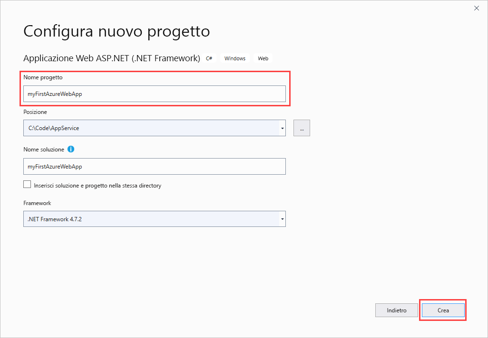

4. È possibile distribuire qualsiasi tipo di app Web ASP.NET in Azure. Per questa guida di avvio rapido scegliere il modello **MVC**.

5. Verificare che l'autenticazione sia impostata su **Nessuna autenticazione**. Selezionare **Create** (Crea).

   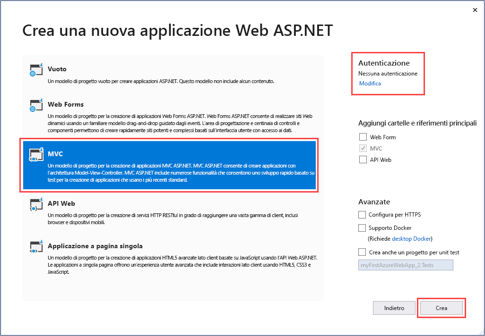

6. Nel menu di Visual Studio selezionare **Debug** > **Avvia senza eseguire debug** per eseguire l'app Web in locale.

   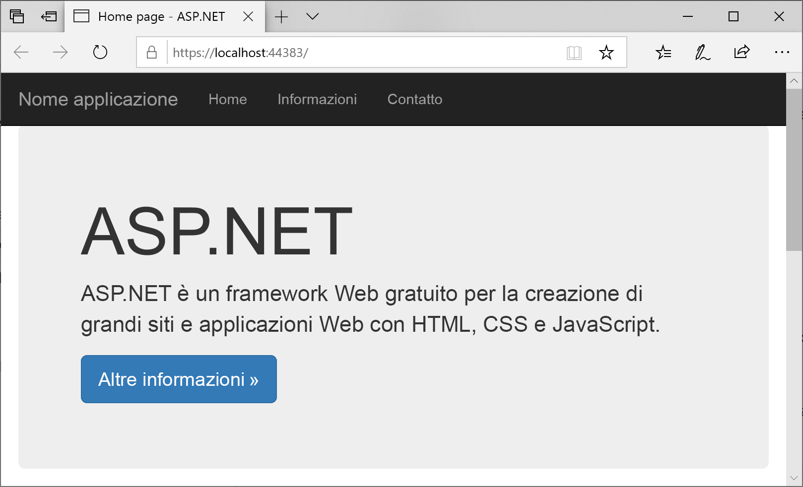

## Pubblicare l'app Web<a name="launch-the-publish-wizard"></a>

1. In **Esplora soluzioni** fare clic con il pulsante destro del mouse sul progetto **myFirstAzureWebApp** e scegliere **Pubblica**.

1. Scegliere **Servizio app** e quindi impostare **Crea profilo** su **Pubblica**.

   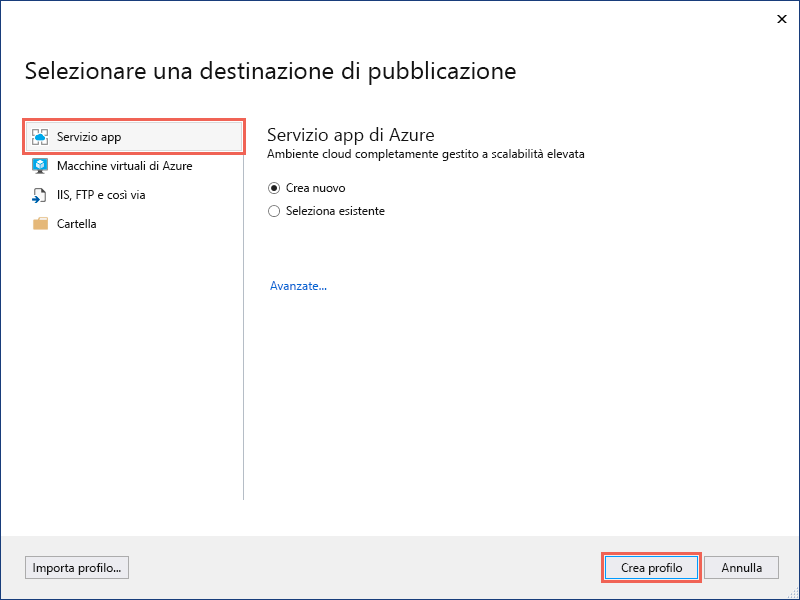

1. In **Servizio app - Crea nuovo** le opzioni disponibili variano a seconda che sia già stato eseguito l'accesso ad Azure e si abbia un account di Visual Studio collegato a un account di Azure. Selezionare **Aggiungi un account** o **Accedi** per accedere alla sottoscrizione di Azure. Se è già stato effettuato l'accesso, selezionare l'account da usare.

   > [!NOTE]
   > Se si è già connessi, non selezionare ancora l'opzione **Crea**.
   >
   >

   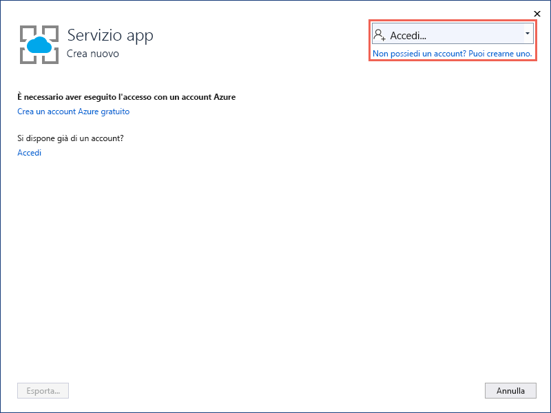

   [!INCLUDE [resource group intro text](../../includes/resource-group.md)]

1. Per **Gruppo di risorse** selezionare **Nuovo**.

1. In **Nome nuovo gruppo di risorse** immettere *myResourceGroup* e scegliere **OK**.

   [!INCLUDE [app-service-plan](../../includes/app-service-plan.md)]

1. Per **Piano di hosting** selezionare **Nuovo**.

1. Nella finestra di dialogo **Configura piano di hosting** immettere i valori della tabella seguente e quindi scegliere **OK**.

   | Impostazione | Valore consigliato | DESCRIZIONE |
   |-|-|-|
   |Piano di servizio app| myAppServicePlan | Nome del piano di servizio app. |
   | Location | Europa occidentale | Data center in cui è ospitata l'app Web. |
   | Dimensione | Gratuito | [Piano tariffario](https://azure.microsoft.com/pricing/details/app-service/?ref=microsoft.com&utm_source=microsoft.com&utm_medium=docs&utm_campaign=visualstudio) che determina le funzionalità di hosting. |

   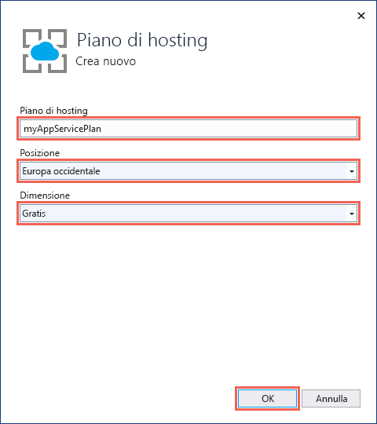

1. In **Nome** immettere un nome univoco per l'app che includa solo i caratteri validi, ossia `a-z`, `A-Z`, `0-9` e `-`. È possibile accettare il nome univoco generato automaticamente. L'URL dell'app Web è `http://<app_name>.azurewebsites.net`, dove `<app_name>` è il nome dell'app.

2. Selezionare **Crea** per avviare la creazione delle risorse di Azure.

   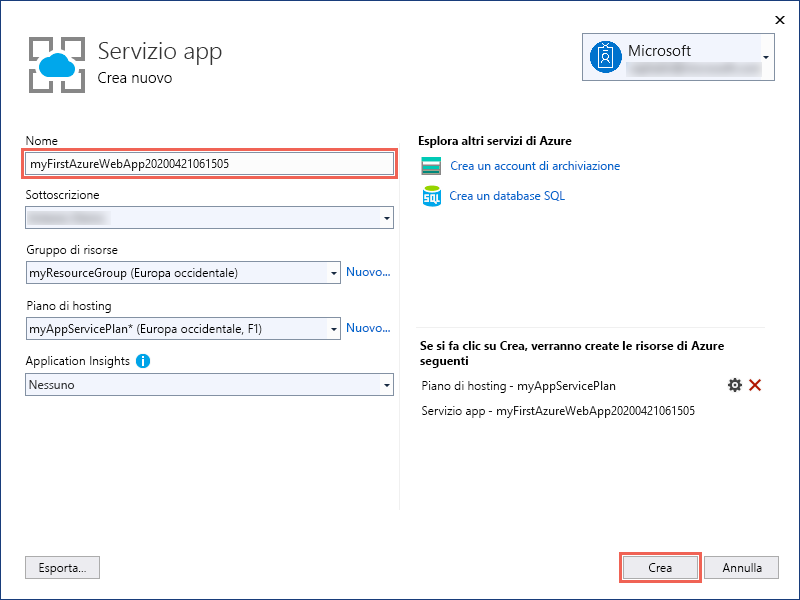

Al termine della procedura guidata, l'app Web ASP.NET viene pubblicata in Azure e avviata nel browser predefinito.

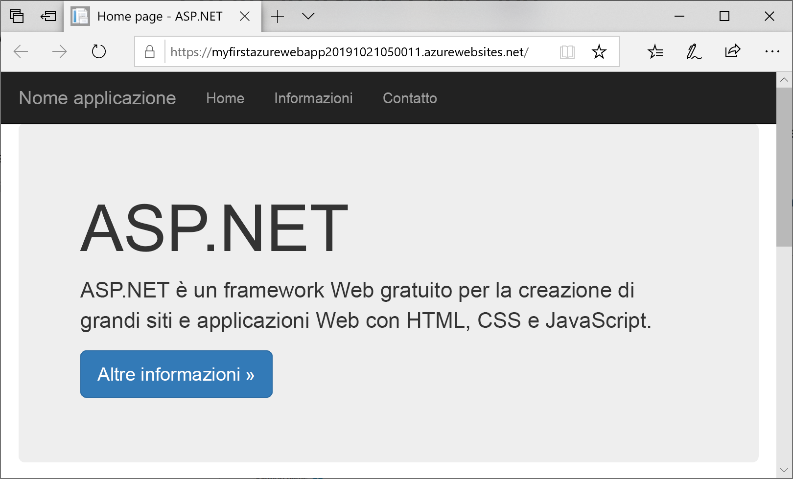

Il nome dell'app specificato nella pagina **Servizio app - Crea nuovo** viene usato come prefisso dell'URL nel formato `http://<app_name>.azurewebsites.net`.

**Congratulazioni** L'app Web ASP.NET è ora in esecuzione nel servizio app di Azure.

## <a name="update-the-app-and-redeploy"></a>Aggiornare e ridistribuire l'app

1. Nel progetto in **Esplora soluzioni** aprire **Visualizzazioni** > **Home** > **Index.cshtml**.

1. Trovare il tag HTML `<div class="jumbotron">` in alto e sostituire l'intero elemento con il codice seguente:

   ```HTML
   <div class="jumbotron">
       <h1>ASP.NET in Azure!</h1>
       <p class="lead">This is a simple app that we’ve built that demonstrates how to deploy a .NET app to Azure App Service.</p>
   </div>
   ```

1. Per la ridistribuzione in Azure, fare clic con il pulsante destro del mouse sul progetto **myFirstAzureWebApp** in **Esplora soluzioni** e selezionare **Pubblica**. Scegliere quindi **Pubblica**.

Al termine del processo di pubblicazione, Visual Studio avvia un browser sull'URL dell'app Web.

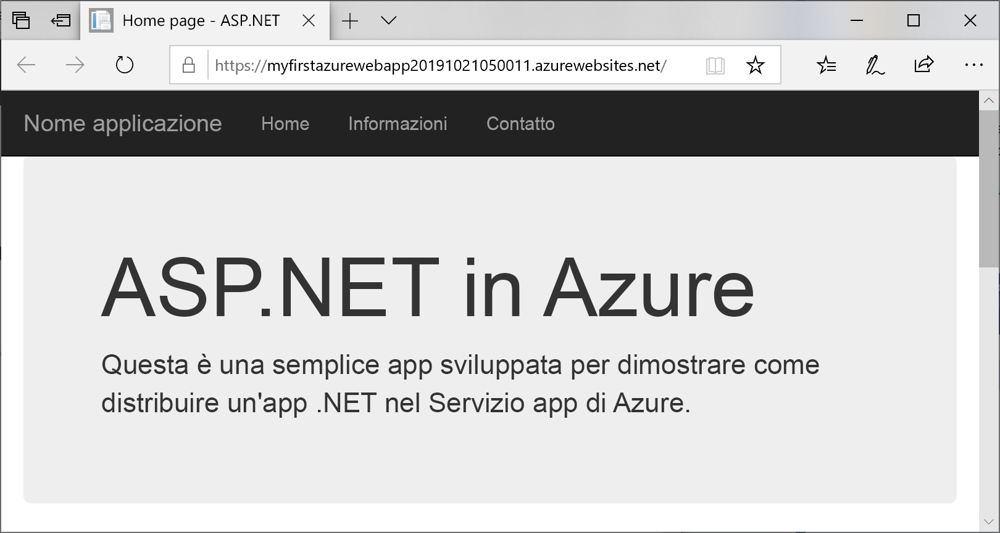

## <a name="manage-the-azure-app"></a>Gestire l'app Azure

1. Per gestire l'app Web, passare al [portale di Azure](https://portal.azure.com), quindi cercare e selezionare **Servizi app**.

   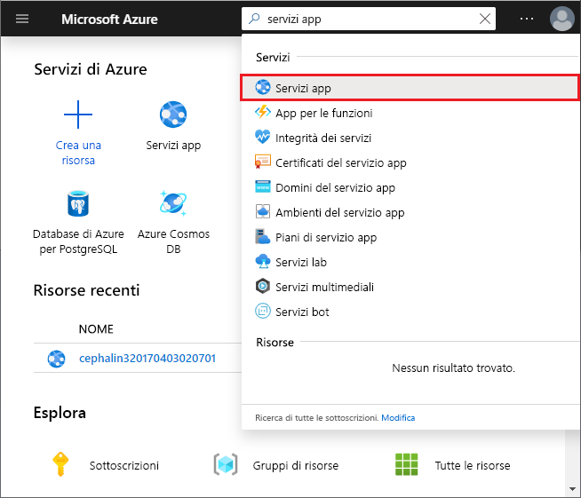

2. Nella pagina **Servizi app** selezionare il nome dell'app Web.

   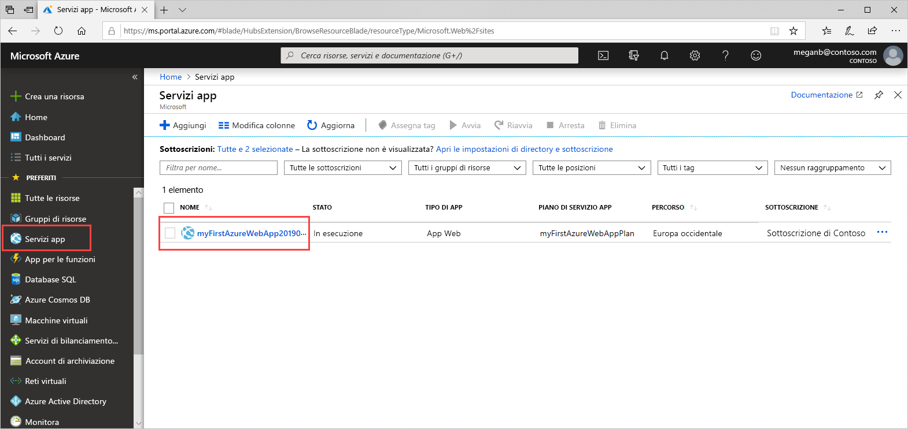

   Verrà visualizzata la pagina di panoramica dell'app Web. Qui è possibile eseguire attività di gestione di base come l'esplorazione, l'arresto, l'avvio, il riavvio e l'eliminazione.

   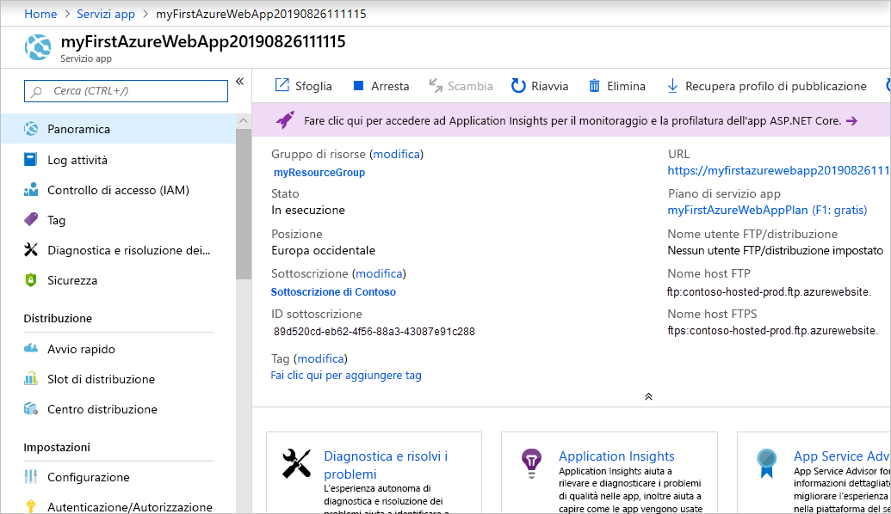

   Il menu a sinistra fornisce varie pagine per la configurazione dell'app.

## <a name="next-steps"></a>Passaggi successivi

> [!div class="nextstepaction"]
> [ASP.NET con database SQL](app-service-web-tutorial-dotnet-sqldatabase.md)
