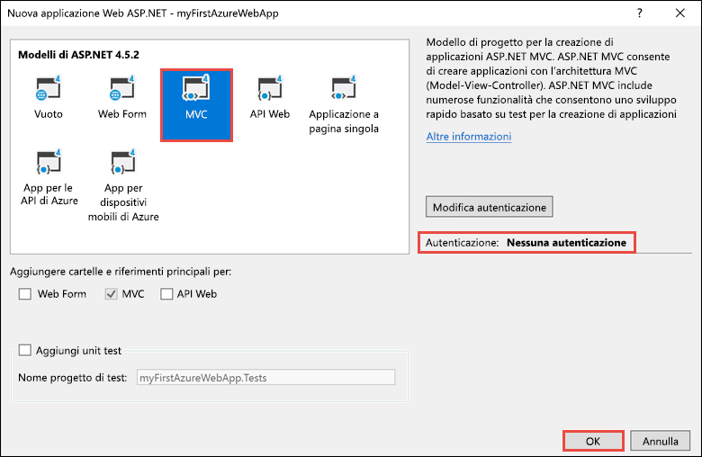
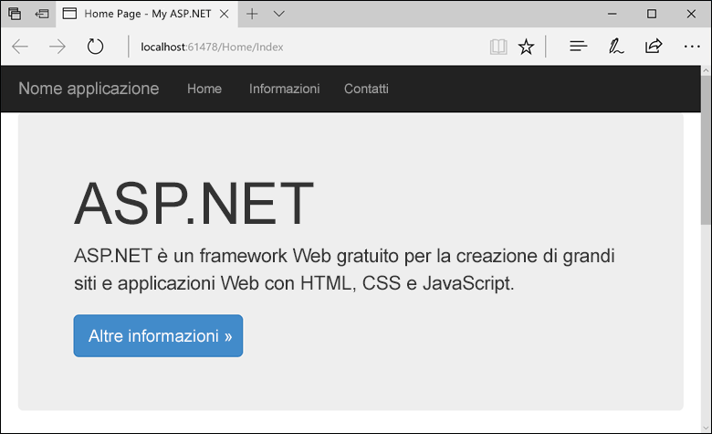
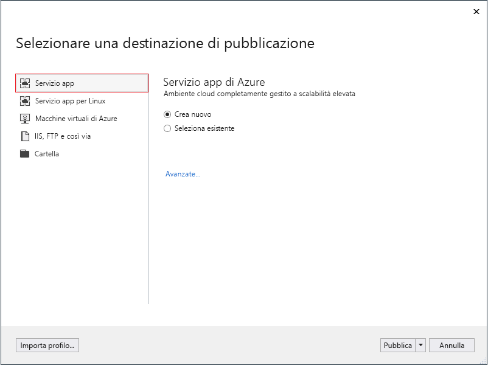
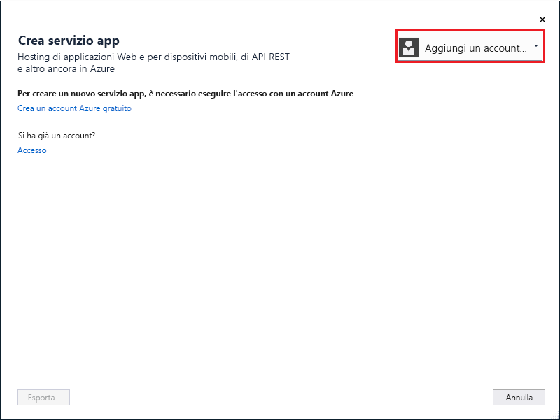
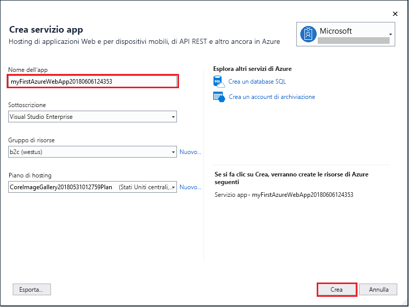
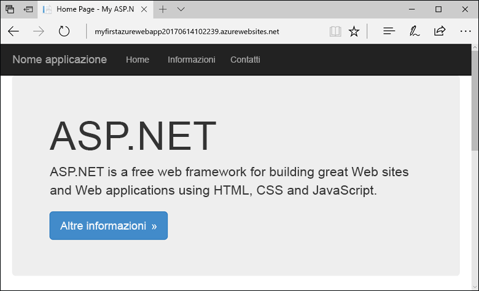
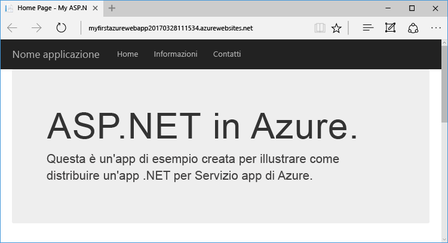
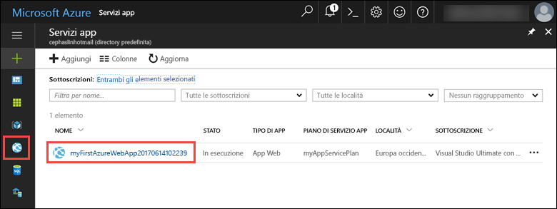

# <a name="create-an-aspnet-web-app-in-azure"></a>Creare un'app Web ASP.NET in Azure

Le [app Web di Azure](app-service-web-overview.md) forniscono un servizio di hosting Web ad alta scalabilità e con funzioni di auto-correzione.  Questa guida introduttiva illustra come distribuire la prima app Web ASP.NET in un'app Web di Azure. Al termine della procedura si avrà un gruppo di risorse costituito da un piano di servizio App e da un'app Web di Azure con un'applicazione Web distribuita.

Guardare il video per osservare il funzionamento di questa guida introduttiva e quindi seguire personalmente la procedura per pubblicare la prima app .NET in Azure.

> [!VIDEO https://channel9.msdn.com/Shows/Azure-for-NET-Developers/Create-a-NET-app-in-Azure-Quickstart/player]

## <a name="prerequisites"></a>Prerequisiti

Per completare questa esercitazione:

* Installare [Visual Studio 2017](https://www.visualstudio.com/downloads/) con i carichi di lavoro seguenti:
    - **Sviluppo Web e ASP.NET**
    - **Sviluppo di Azure**

    

[!INCLUDE [quickstarts-free-trial-note](../../includes/quickstarts-free-trial-note.md)]

## <a name="create-an-aspnet-web-app"></a>Creare un'app Web ASP.NET

In Visual Studio creare un progetto selezionando **File > Nuovo > Progetto**. 

Nella finestra di dialogo **Nuovo progetto** selezionare **Visual C# > Web > Applicazione Web ASP.NET (.NET Framework)**.

Assegnare all'applicazione il nome _myFirstAzureWebApp_ e fare clic su **OK**.
   


È possibile distribuire qualsiasi tipo di app Web ASP.NET in Azure. Per questa guida introduttiva, selezionare il modello **MVC** e verificare che l'autenticazione sia impostata su **Nessuna autenticazione**.
      
Selezionare **OK**.



Nel menu selezionare **Debug > Avvia senza eseguire debug** per eseguire l'app Web in locale.



## <a name="publish-to-azure"></a>Pubblicazione in Azure

In **Esplora soluzioni** fare clic con il pulsante destro del mouse sul progetto **myFirstAzureWebApp** e scegliere **Pubblica**.


Verificare che **Servizio app di Microsoft Azure** sia selezionato e scegliere **Pubblica**.



Viene visualizzata la finestra di dialogo **Crea servizio app**, che consente di creare tutte le risorse di Azure necessarie per eseguire l'app Web ASP.NET in Azure.

## <a name="sign-in-to-azure"></a>Accedere ad Azure

Nella finestra di dialogo **Crea servizio app** fare clic su **Aggiungi un account** e accedere alla sottoscrizione di Azure. Se è già stato eseguito l'accesso, selezionare l'account contenente la sottoscrizione desiderata dall'elenco a discesa.

> [!NOTE]
> Se si è già connessi, non selezionare ancora l'opzione **Crea**.
>
>
   


## <a name="create-a-resource-group"></a>Creare un gruppo di risorse

[!INCLUDE [resource group intro text](../../includes/resource-group.md)]

Accanto a **Gruppo di risorse** selezionare **Nuovo**.

Assegnare al gruppo di risorse il nome **myResourceGroup** e selezionare **OK**.

## <a name="create-an-app-service-plan"></a>Creare un piano di servizio app

[!INCLUDE [app-service-plan](../../includes/app-service-plan.md)]

Accanto a **Piano di servizio app** selezionare **Nuovo**. 

Nella finestra di dialogo **Configura piano di servizio app** usare le impostazioni della tabella riportata sotto l'immagine.


| Impostazione | Valore consigliato | Descrizione |
|-|-|-|
|Piano di servizio app| myAppServicePlan | Nome del piano di servizio app. |
| Località | Europa occidentale | Data center in cui è ospitata l'app Web. |
| Dimensione | Gratuito | [Piano tariffario](https://azure.microsoft.com/pricing/details/app-service/?ref=microsoft.com&utm_source=microsoft.com&utm_medium=docs&utm_campaign=visualstudio) che determina le funzionalità di hosting. |

Selezionare **OK**.

## <a name="create-and-publish-the-web-app"></a>Creare e pubblicare l'app Web

In **Nome app Web** immettere un nome univoco dell'app, usando i caratteri validi `a-z`, `0-9` e `-`, o accettare il nome univoco generato automaticamente. L'URL dell'app Web è `http://<app_name>.azurewebsites.net`, dove `<app_name>` è il nome dell'app Web.

Selezionare **Crea** per avviare la creazione delle risorse di Azure.



Al termine della procedura guidata, l'app Web ASP.NET viene pubblicata in Azure e avviata nel browser predefinito.



Il nome dell'app Web specificato nel passaggio relativo alla [creazione e pubblicazione](#create-and-publish-the-web-app) viene usato come prefisso dell'URL nel formato `http://<app_name>.azurewebsites.net`.

L'app Web ASP.NET è ora in esecuzione nel servizio app di Azure.

## <a name="update-the-app-and-redeploy"></a>Aggiornare e ridistribuire l'app

Da **Esplora soluzioni** aprire _Views\Home\Index.cshtml_.

Trovare il tag HTML `<div class="jumbotron">` in alto e sostituire l'intero elemento con il codice seguente:

```HTML
<div class="jumbotron">
    <h1>ASP.NET in Azure!</h1>
    <p class="lead">This is a simple app that we’ve built that demonstrates how to deploy a .NET app to Azure App Service.</p>
</div>
```

Per la ridistribuzione in Azure, fare clic con il pulsante destro del mouse sul progetto **myFirstAzureWebApp** in **Esplora soluzioni** e selezionare **Pubblica**.

Nella pagina di pubblicazione selezionare **Pubblica**.

Al termine del processo di pubblicazione, Visual Studio avvia un browser sull'URL dell'app Web.



## <a name="manage-the-azure-web-app"></a>Gestire l'app Web di Azure

Accedere al <a href="https://portal.azure.com" target="_blank">portale di Azure</a> per visualizzare l'app Web.

Scegliere **Servizi app** dal menu a sinistra e quindi selezionare il nome dell'app Web di Azure.



Verrà visualizzata la pagina di panoramica dell'app Web. Qui è possibile eseguire attività di gestione di base come l'esplorazione, l'arresto, l'avvio, il riavvio e l'eliminazione dell'app. 


Il menu a sinistra fornisce varie pagine per la configurazione dell'app. 

[!INCLUDE [Clean-up section](../../includes/clean-up-section-portal.md)]

## <a name="next-steps"></a>Passaggi successivi

> [!div class="nextstepaction"]
> [ASP.NET con database SQL](app-service-web-tutorial-dotnet-sqldatabase.md)
