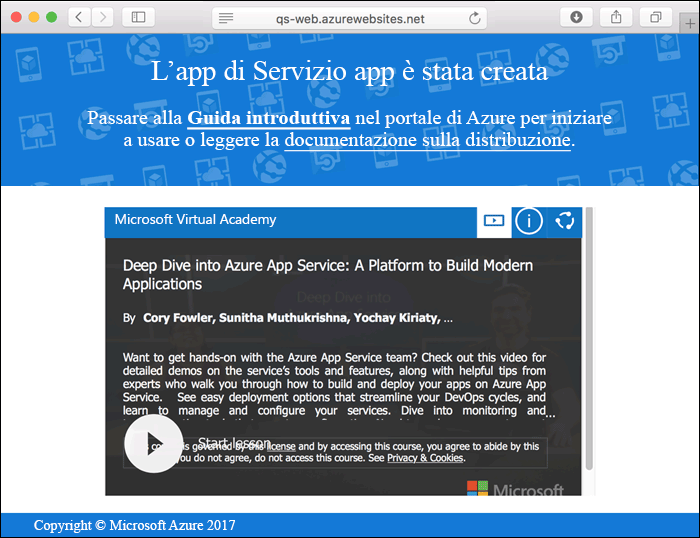
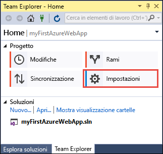
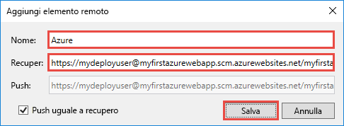
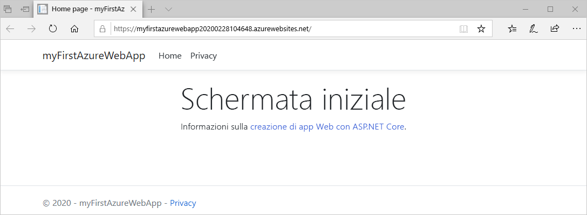
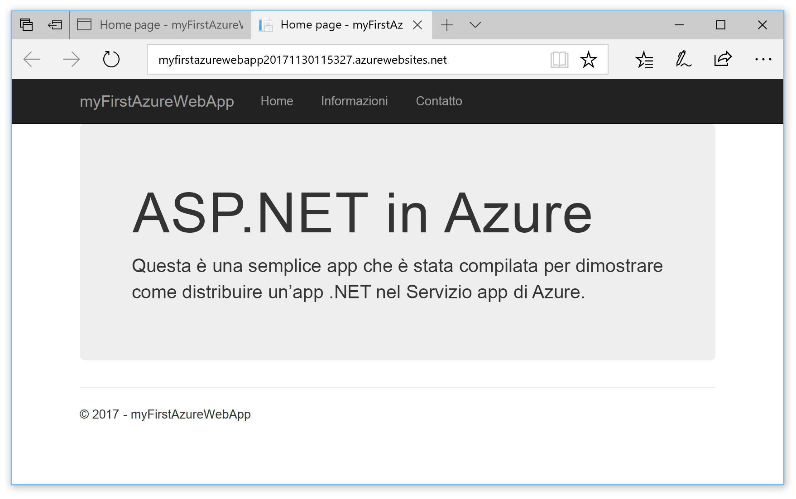

# <a name="create-an-aspnet-core-web-app-in-azure"></a>Creare un'app Web ASP.NET Core in Azure

> [!NOTE]
> Questo articolo consente di distribuire un'app nel servizio app in Windows. Per la distribuzione nel servizio app in _Linux_, vedere [Creare un'app Web .NET Core nel servizio app in Linux](./containers/quickstart-dotnetcore.md).
>
> Per la procedura relativa a un'app ASP.NET Framework, vedere [Creare un'app Web ASP.NET Framework in Azure](app-service-web-get-started-dotnet-framework.md). 
>

Le [app Web di Azure](app-service-web-overview.md) forniscono un servizio di hosting Web ad alta scalabilità e con funzioni di auto-correzione.  Questa guida introduttiva illustra come distribuire la prima app Web ASP.NET Core in un'app Web di Azure. Al termine della procedura si avrà un gruppo di risorse costituito da un piano di servizio App e da un'app Web di Azure con un'applicazione Web distribuita.

[!INCLUDE [quickstarts-free-trial-note](../../includes/quickstarts-free-trial-note.md)]

## <a name="prerequisites"></a>prerequisiti

Per completare questa esercitazione:

* Installare <a href="https://www.visualstudio.com/downloads/" target="_blank">Visual Studio 2017</a> con i carichi di lavoro seguenti:
    - **Sviluppo Web e ASP.NET**
    - **Sviluppo di Azure**

    

## <a name="create-an-aspnet-core-web-app"></a>Creare un'app Web ASP.NET Core

In Visual Studio creare un progetto selezionando **File > Nuovo > Progetto**. 

Nella finestra di dialogo **Nuovo progetto** selezionare **Visual C# > Web > Applicazione Web ASP.NET Core**.

Specificare _myFirstAzureWebApp_ come nome per l'app, quindi selezionare **Crea nuovo repository Git** e infine **OK**.
   


È possibile distribuire qualsiasi tipo di app Web ASP.NET Core in Azure. Per questa guida introduttiva, selezionare il modello **Applicazione Web** e verificare che l'autenticazione sia impostata su **Nessuna autenticazione**.
      
Selezionare **OK**.


Dopo che è stato creato il progetto ASP.NET Core, viene visualizzata la home page di ASP.NET Core con vari collegamenti alle risorse con informazioni utili per iniziare. 


Nel menu selezionare **Debug > Avvia senza eseguire debug** per eseguire l'app Web in locale.


[!INCLUDE [cloud-shell-try-it.md](../../includes/cloud-shell-try-it.md)]

[!INCLUDE [Configure deployment user](../../includes/configure-deployment-user.md)] 

[!INCLUDE [Create resource group](../../includes/app-service-web-create-resource-group.md)] 

[!INCLUDE [Create app service plan](../../includes/app-service-web-create-app-service-plan.md)] 

[!INCLUDE [Create web app](../../includes/app-service-web-create-web-app.md)] 



## <a name="push-to-azure-from-visual-studio"></a>Eseguire il push in Azure da Visual Studio

In Visual Studio dal menu **Visualizza** scegliere **Team Explorer**. Viene visualizzato **Team Explorer**.

Nella visualizzazione **Home** fare clic su **Impostazioni** > **Impostazioni repository**.



Nella sezione **Elementi remoti** di **Impostazioni repository** selezionare **Aggiungi**. Viene visualizzata la finestra di dialogo **Aggiungi elemento remoto**.

Impostare il campo **Nome** su _Azure_, quindi impostare il campo **Recupero** sull'URL salvato da [Crea un'app Web](#create-a-web-app). Fare clic su **Save**.



Questa impostazione equivale al comando `git remote add Azure <URL>` di Git.

Fare clic sul pulsante **Home** in alto.

Selezionare **Impostazioni** > **Impostazioni globali**. Assicurarsi che il nome e l'indirizzo di posta elettronica siano impostati. Selezionare **Aggiorna** se necessario.

Visual Studio ha già eseguito il commit di tutti i file nel repository Git durante la creazione del progetto. È ora sufficiente eseguire il push dei file in Azure.

Fare clic sul pulsante **Home** in alto. Selezionare **Sincronizza** > **Azioni** > **Apri prompt dei comandi**. 

Immettere il comando seguente nella finestra di comando e immettere la password di distribuzione quando richiesto:

```
git push Azure master
```

L'esecuzione del comando può richiedere alcuni minuti. Durante l'esecuzione, il comando visualizza informazioni simili all'esempio seguente:

```
Counting objects: 4, done.
Delta compression using up to 8 threads.
Compressing objects: 100% (4/4), done.
Writing objects: 100% (4/4), 349 bytes | 349.00 KiB/s, done.
Total 4 (delta 3), reused 0 (delta 0)
remote: Updating branch 'master'.
remote: Updating submodules.
remote: Preparing deployment for commit id '9e20345e9c'.
remote: Generating deployment script.
remote: Project file path: .\myFirstAzureWebApp\myFirstAzureWebApp.csproj
remote: Solution file path: .\myFirstAzureWebApp.sln
remote: Generated deployment script files
remote: Running deployment command...
remote: Handling ASP.NET Core Web Application deployment.
remote:   Restoring packages for D:\home\site\repository\myFirstAzureWebApp\myFirstAzureWebApp.csproj...
remote:   Restoring packages for D:\home\site\repository\myFirstAzureWebApp\myFirstAzureWebApp.csproj...
...
remote: Finished successfully.
remote: Running post deployment command(s)...
remote: Deployment successful.
To https://<app_name>.scm.azurewebsites.net/<app_name>.git
 * [new branch]      master -> master
```

## <a name="browse-to-the-app"></a>Passare all'app

In un browser passare all'URL dell'app Web di Azure: `http://<app_name>.azurewebsites.net`.

La pagina è in esecuzione come un'app Web del servizio app di Azure.



L'app Web ASP.NET Core è ora in esecuzione nel servizio app di Azure.

## <a name="update-the-app-and-redeploy"></a>Aggiornare e ridistribuire l'app

Da **Esplora soluzioni** aprire _Pages/Index.cshtml_.

Trovare il tag HTML `<div id="myCarousel" class="carousel slide" data-ride="carousel" data-interval="6000">` in alto e sostituire l'intero elemento con il codice seguente:

```HTML
<div class="jumbotron">
    <h1>ASP.NET in Azure!</h1>
    <p class="lead">This is a simple app that we’ve built that demonstrates how to deploy a .NET app to Azure App Service.</p>
</div>
```

Da **Esplora soluzioni** fare clic con il pulsante destro del mouse su _Pages/Index.cshtml_ e scegliere **Esegui commit**. Immettere un messaggio di commit per la modifica e fare clic su **Esegui commit di tutto**.

Nella finestra del prompt dei comandi eseguire il push delle modifiche del codice in Azure.

```bash
git push Azure master
```

Al termine della distribuzione passare di nuovo a `http://<app_name>.azurewebsites.net`.



## <a name="manage-the-azure-web-app"></a>Gestire l'app Web di Azure

Accedere al <a href="https://portal.azure.com" target="_blank">portale di Azure</a> per visualizzare l'app Web.

Scegliere **Servizi app** dal menu a sinistra e quindi selezionare il nome dell'app Web di Azure.


Verrà visualizzata la pagina di panoramica dell'app Web. Qui è possibile eseguire attività di gestione di base come l'esplorazione, l'arresto, l'avvio, il riavvio e l'eliminazione dell'app. 


Il menu a sinistra fornisce varie pagine per la configurazione dell'app. 

[!INCLUDE [Clean-up section](../../includes/clean-up-section-portal.md)]

## <a name="next-steps"></a>Passaggi successivi

> [!div class="nextstepaction"]
> [ASP.NET Core con database SQL](app-service-web-tutorial-dotnetcore-sqldb.md)
