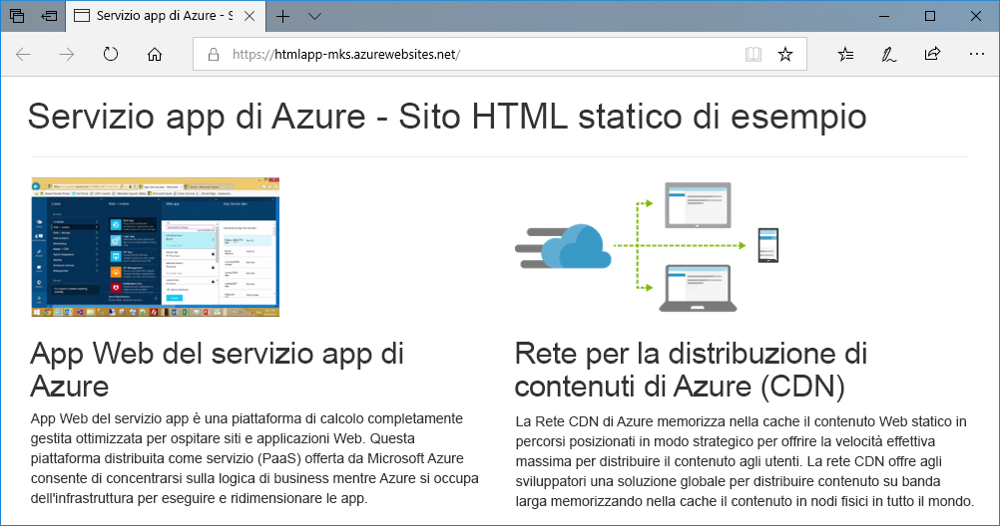
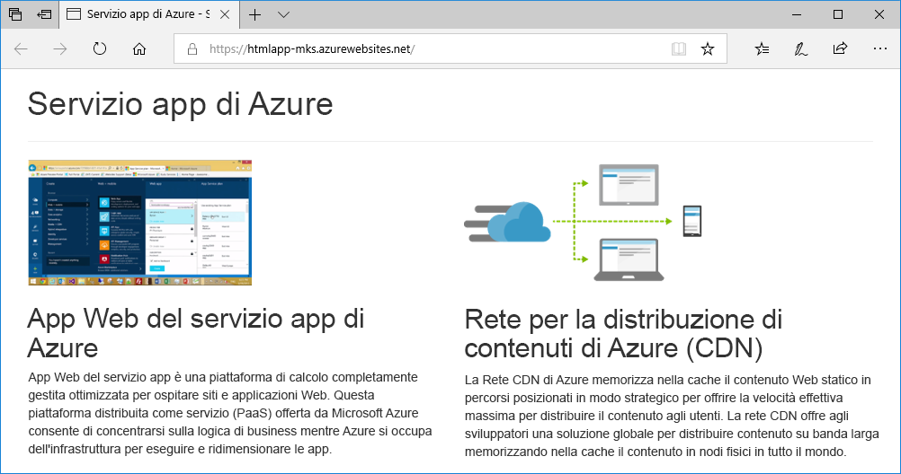
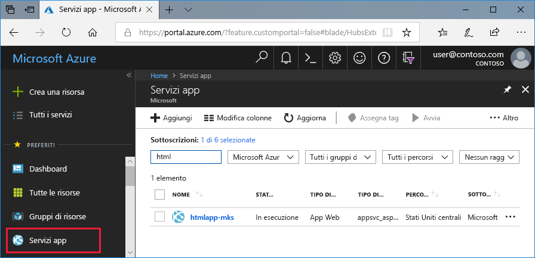
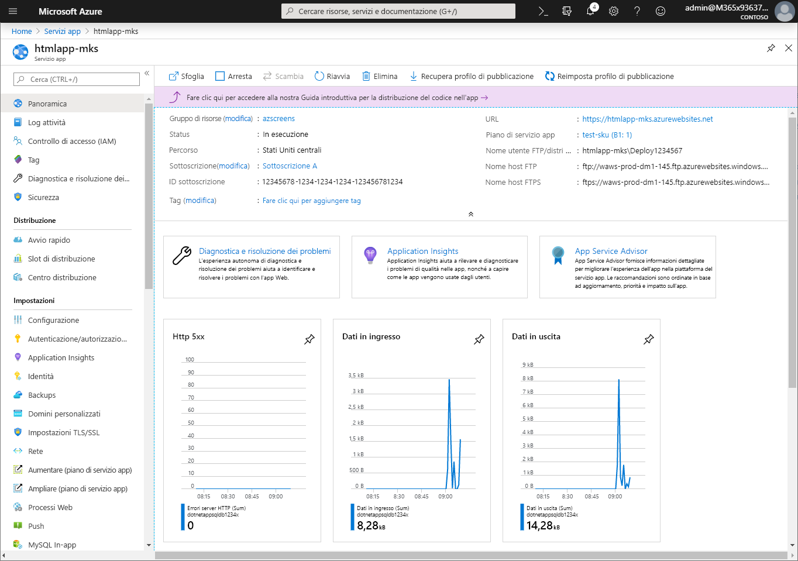

# <a name="create-a-static-html-web-app-in-azure"></a>Creare un'app Web HTML statica in Azure

Le [app Web di Azure](app-service-web-overview.md) forniscono un servizio di hosting Web ad alta scalabilità e con funzioni di auto-correzione.  Questa guida introduttiva illustra come distribuire un sito HTML e CSS di base in un'app Web di Azure. Si creerà l'app Web usando l'[interfaccia della riga di comando di Azure](https://docs.microsoft.com/cli/azure/get-started-with-azure-cli) e si userà Git per distribuire il contenuto HTML di esempio nell'app Web.



È possibile eseguire queste procedure con un computer Mac, Windows o Linux. Una volta installati i prerequisiti, sono necessari circa cinque minuti per completare la procedura.

## <a name="prerequisites"></a>Prerequisiti

Per completare questa guida introduttiva:

- [Installare Git](https://git-scm.com/)

[!INCLUDE [quickstarts-free-trial-note](../../includes/quickstarts-free-trial-note.md)]

## <a name="download-the-sample"></a>Scaricare l'esempio

In una finestra del terminale eseguire il comando seguente per clonare il repository dell'app di esempio nel computer locale.

```bash
git clone https://github.com/Azure-Samples/html-docs-hello-world.git
```

Passare alla directory contenente il codice di esempio.

```bash
cd html-docs-hello-world
```

## <a name="view-the-html"></a>Visualizzare il codice HTML

Passare alla directory contenente il codice HTML di esempio. Aprire il file *index.html* nel browser.


[!INCLUDE [cloud-shell-try-it.md](../../includes/cloud-shell-try-it.md)]

[!INCLUDE [Configure deployment user](../../includes/configure-deployment-user.md)] 

[!INCLUDE [Create resource group](../../includes/app-service-web-create-resource-group.md)] 

[!INCLUDE [Create app service plan](../../includes/app-service-web-create-app-service-plan.md)] 

[!INCLUDE [Create web app](../../includes/app-service-web-create-web-app.md)] 


[!INCLUDE [Push to Azure](../../includes/app-service-web-git-push-to-azure.md)] 

```bash
Counting objects: 13, done.
Delta compression using up to 4 threads.
Compressing objects: 100% (11/11), done.
Writing objects: 100% (13/13), 2.07 KiB | 0 bytes/s, done.
Total 13 (delta 2), reused 0 (delta 0)
remote: Updating branch 'master'.
remote: Updating submodules.
remote: Preparing deployment for commit id 'cc39b1e4cb'.
remote: Generating deployment script.
remote: Generating deployment script for Web Site
remote: Generated deployment script files
remote: Running deployment command...
remote: Handling Basic Web Site deployment.
remote: KuduSync.NET from: 'D:\home\site\repository' to: 'D:\home\site\wwwroot'
remote: Deleting file: 'hostingstart.html'
remote: Copying file: '.gitignore'
remote: Copying file: 'LICENSE'
remote: Copying file: 'README.md'
remote: Finished successfully.
remote: Running post deployment command(s)...
remote: Deployment successful.
To https://<app_name>.scm.azurewebsites.net/<app_name>.git
 * [new branch]      master -> master
```

## <a name="browse-to-the-app"></a>Passare all'app

In un browser passare all'URL dell'app Web di Azure: `http://<app_name>.azurewebsites.net`.

La pagina è in esecuzione come un'app Web del servizio app di Azure.


**Congratulazioni.** La distribuzione della prima app HTML nel Servizio app è stata completata.

## <a name="update-and-redeploy-the-app"></a>Aggiornare e ridistribuire l'app

Aprire il file *index.html* in un editor di testo e apportare una modifica al markup. Modificare ad esempio l'intestazione H1 da "Servizio app di Azure - Sito HTML statico di esempio" a "Servizio app di Azure".

Nella finestra del terminale locale eseguire il commit delle modifiche in Git e quindi eseguire il push delle modifiche al codice in Azure.

```bash
git commit -am "updated HTML"
git push azure master
```

Al termine della distribuzione, aggiornare il browser per visualizzare le modifiche.



## <a name="manage-your-new-azure-web-app"></a>Gestire la nuova app Web di Azure

Accedere al <a href="https://portal.azure.com" target="_blank">portale di Azure</a> per gestire l'app Web creata.

Nel menu a sinistra fare clic su **Servizi app** e quindi sul nome dell'app Web di Azure.



Verrà visualizzata la pagina di panoramica dell'app Web. Qui è possibile eseguire attività di gestione di base come l'esplorazione, l'arresto, l'avvio, il riavvio e l'eliminazione dell'app. 



Il menu a sinistra fornisce varie pagine per la configurazione dell'app. 

[!INCLUDE [cli-samples-clean-up](../../includes/cli-samples-clean-up.md)]

## <a name="next-steps"></a>Passaggi successivi

> [!div class="nextstepaction"]
> [Eseguire il mapping di un dominio personalizzato](app-service-web-tutorial-custom-domain.md)
