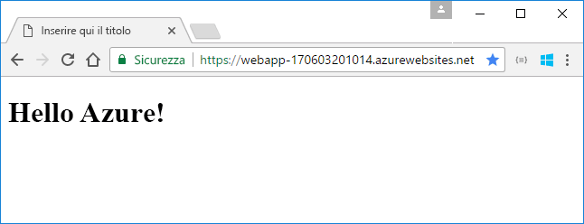
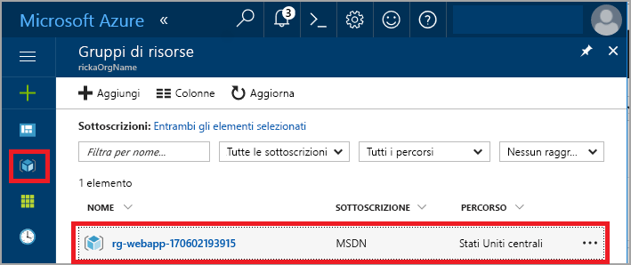
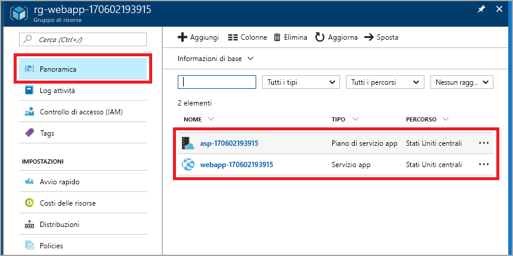
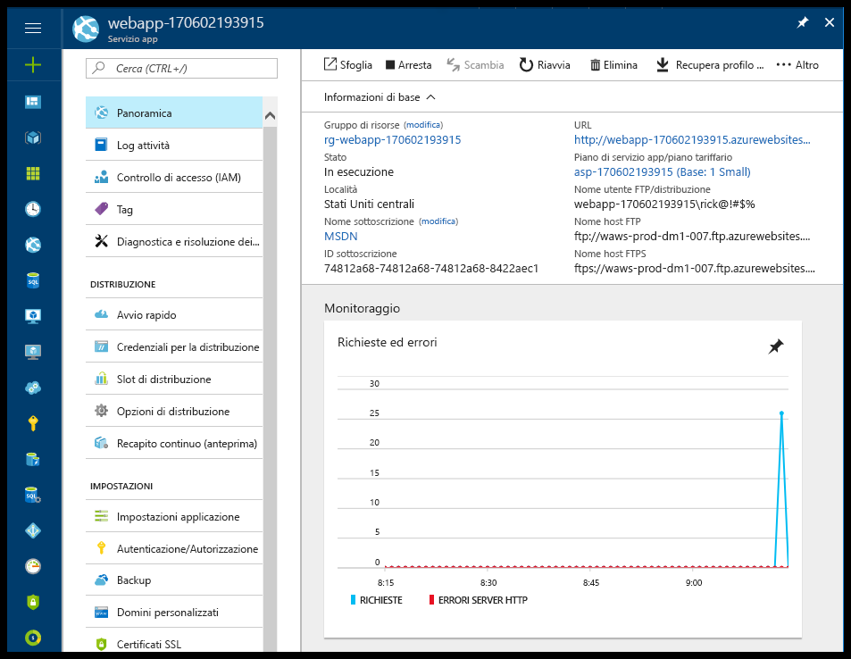

# <a name="create-your-first-java-web-app-in-azure"></a>Creare la prima app Web Java in Azure

Le [app Web](app-service-web-overview.md) di Azure forniscono un servizio di hosting Web ad alta scalabilità e con funzioni di auto-correzione. Questa guida introduttiva illustra come distribuire un'app Web Java nel servizio app usando [Eclipse IDE for Java EE Developers](http://www.eclipse.org/).



## <a name="prerequisites"></a>Prerequisiti

Per completare questa guida introduttiva, installare:

* Lo strumento gratuito [Eclipse IDE for Java EE Developers](http://www.eclipse.org/downloads/). In questa guida introduttiva viene usato Eclipse Neon.
* [Azure Toolkit for Eclipse](/azure/azure-toolkit-for-eclipse-installation).

[!INCLUDE [quickstarts-free-trial-note](../../includes/quickstarts-free-trial-note.md)]

## <a name="create-a-dynamic-web-project-in-eclipse"></a>Creare un progetto Web dinamico in Eclipse

In Eclipse selezionare **File** > **Nuovo** > **Dynamic Web Project** (Progetto Web dinamico).

Nella finestra di dialogo **New Dynamic Web Project** (Nuovo progetto Web dinamico) assegnare al progetto il nome **MyFirstJavaOnAzureWebApp** e selezionare **Fine**.
   


### <a name="add-a-jsp-page"></a>Aggiungere una pagina JSP

Se Esplora progetti non viene visualizzato, è necessario ripristinarlo.


In Esplora progetti espandere il progetto **MyFirstJavaOnAzureWebApp**.
Fare doppio clic su **WebContent** e quindi selezionare **Nuovo** > **JSP File** (File JSP).


Nella finestra di dialogo **New JSP File** (Nuovo file JSP):

* Assegnare al file il nome **index.jsp**.
* Selezionare **Fine**.

  

Nel file index.jsp sostituire l'elemento `<body></body>` con il markup seguente:

```jsp
<body>
<h1><% out.println("Hello Azure!"); %></h1>
</body>
```

Salvare le modifiche.

## <a name="publish-the-web-app-to-azure"></a>Pubblicare l'app Web in Azure

In Esplora progetti fare clic con il pulsante destro del mouse sul progetto e quindi selezionare **Azure** > **Publish as Azure Web App** (Pubblica come app Web di Azure).


Nella finestra di dialogo **Accesso ad Azure** mantenere selezionata l'opzione **Interattivo** opzione e quindi selezionare **Accedi**.

Seguire le istruzioni di accesso.

### <a name="deploy-web-app-dialog-box"></a>Finestra di dialogo Distribuisci app Web

Dopo avere effettuato l'accesso all'account Azure, verrà visualizzata la finestra di dialogo **Distribuisci app Web**.

Selezionare **Crea**.


### <a name="create-app-service-dialog-box"></a>Finestra di dialogo Crea servizio app

Viene visualizzata la finestra di dialogo **Crea servizio app** con i valori predefiniti. Il numero **170602185241** illustrato nell'immagine seguente è diverso da quello visualizzato nella finestra di dialogo reale.


Nella finestra di dialogo **Crea servizio app**:

* Lasciare invariato il nome generato per l'app Web. Il nome deve essere univoco in Azure ed è incluso nell'indirizzo URL relativo all'app Web. Se, ad esempio, il nome dell'app Web è **MyJavaWebApp**, l'URL è *myjavawebapp.azurewebsites.net*.
* Mantenere il contenitore Web predefinito.
* Selezionare una sottoscrizione di Azure.
* Nella scheda **Piano di servizio app**:

  * **Crea nuovo**: mantenere il valore predefinito, ovvero il nome del piano di servizio app.
  * **Località**: selezionare **Europa occidentale** o un'area geografica nelle vicinanze.
  * **Piano tariffario**: selezionare l'opzione gratuita. Per le funzionalità, vedere [Prezzi di Servizio app](https://azure.microsoft.com/pricing/details/app-service/).

   

[!INCLUDE [app-service-plan](../../includes/app-service-plan.md)]

### <a name="resource-group-tab"></a>Scheda Gruppo di risorse

Selezionare la scheda **Gruppo di risorse**. Mantenere il valore predefinito generato per il gruppo di risorse.


[!INCLUDE [resource-group](../../includes/resource-group.md)]

Selezionare **Crea**.

<!--
### The JDK tab

Select the **JDK** tab. Keep the default, and then select **Create**.


-->

Azure Toolkit crea l'app Web e visualizza una finestra di dialogo di avanzamento.


### <a name="deploy-web-app-dialog-box"></a>Finestra di dialogo Distribuisci app Web

Nella finestra di dialogo **Distribuisci app Web** selezionare **Deploy to root** (Distribuisci nella radice). Se si ha un servizio app all'indirizzo *wingtiptoys.azurewebsites.net* e non si esegue la distribuzione nella radice, l'app Web denominata **MyFirstJavaOnAzureWebApp** verrà distribuita in *wingtiptoys.azurewebsites.net/MyFirstJavaOnAzureWebApp*.


Nella finestra di dialogo vengono visualizzate le selezioni del contenitore Web, di Azure e di JDK.

Selezionare **Distribuisci** per pubblicare l'app Web in Azure.

Al termine del processo di pubblicazione, selezionare il collegamento **Pubblicato** nella finestra di dialogo **Log attività di Azure**.


Congratulazioni. L'app Web è stata distribuita in Azure. 


## <a name="update-the-web-app"></a>Aggiornare l'app Web

Modificare il codice JSP di esempio in un messaggio diverso.

```jsp
<body>
<h1><% out.println("Hello again Azure!"); %></h1>
</body>
```

Salvare le modifiche.

In Esplora progetti fare clic con il pulsante destro del mouse sul progetto e quindi selezionare **Azure** > **Publish as Azure Web App** (Pubblica come app Web di Azure).

Viene visualizzata la finestra di dialogo **Distribuisci app Web** in cui viene illustrato il servizio app creato in precedenza. 

> [!NOTE]
> Selezionare **Deploy to root** (Distribuisci nella radice) ogni volta che si esegue una pubblicazione.
>

Selezionare l'app Web e fare clic su **Distribuisci** per pubblicare le modifiche.

Quando viene visualizzato il collegamento **Pubblicazione**, selezionarlo per passare all'app Web e visualizzare le modifiche.

## <a name="manage-the-web-app"></a>Gestire l'app Web

Accedere al <a href="https://portal.azure.com" target="_blank">portale di Azure</a> per visualizzare l'app Web creata.

Nel menu di sinistra selezionare **Gruppi di risorse**.



Selezionare il gruppo di risorse. Nella pagina vengono visualizzate le risorse create in questa guida introduttiva.



Selezionare l'app Web (**webapp 170602193915** nell'immagine precedente).

Viene visualizzata la pagina **Panoramica**, che offre una visualizzazione dello stato dell'app. Qui è possibile eseguire attività di gestione di base come l'esplorazione, l'arresto, l'avvio, il riavvio e l'eliminazione dell'app. Le schede sul lato sinistro della pagina mostrano le diverse configurazioni che è possibile aprire. 



[!INCLUDE [clean-up-section-portal-web-app](../../includes/clean-up-section-portal-web-app.md)]

## <a name="next-steps"></a>Passaggi successivi

> [!div class="nextstepaction"]
> [Eseguire il mapping di un dominio personalizzato](app-service-web-tutorial-custom-domain.md)
