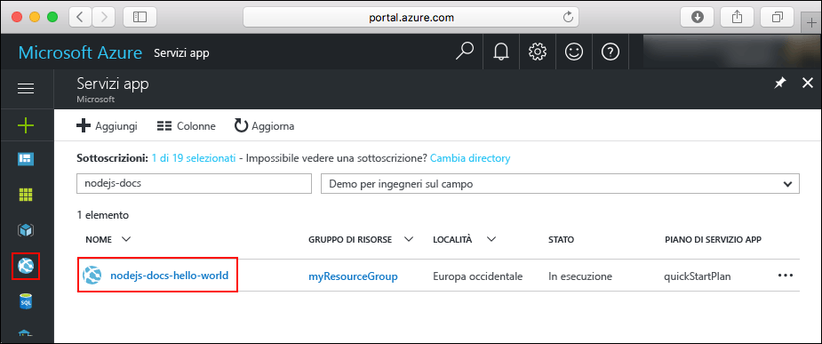
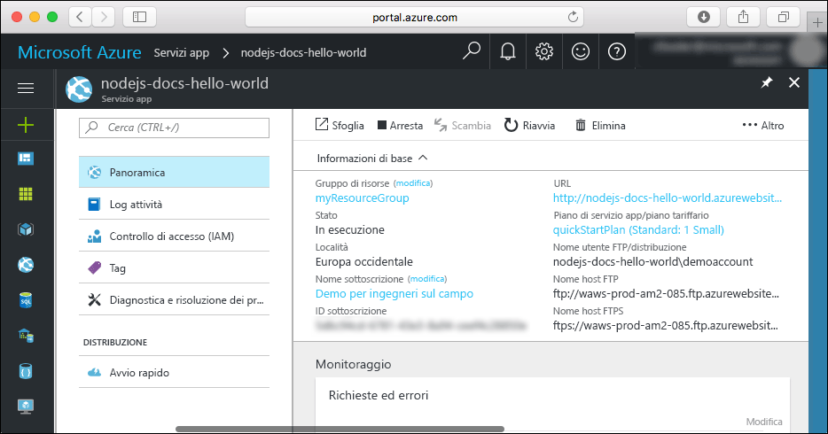

# <a name="create-a-nodejs-web-app-in-azure"></a>Creare un'app Web Node.js in Azure

> [!NOTE]
> Questo articolo consente di distribuire un'app nel servizio app in Windows. Per la distribuzione nel servizio app in _Linux_, vedere [Creare un'app Web Node.js nel Servizio app di Azure in Linux](./containers/quickstart-nodejs.md).
>

Le [app Web di Azure](app-service-web-overview.md) forniscono un servizio di hosting Web ad alta scalabilità e con funzioni di auto-correzione.  Questa guida introduttiva illustra come distribuire un'app Node.js in un'app Web di Azure. Si creerà l'app Web usando l'[interfaccia della riga di comando di Azure](https://docs.microsoft.com/cli/azure/get-started-with-azure-cli) e si userà Git per distribuire il codice Node.js di esempio nell'app Web.


È possibile eseguire queste procedure con un computer Mac, Windows o Linux. Una volta installati i prerequisiti, sono necessari circa cinque minuti per completare la procedura.   

> [!VIDEO https://channel9.msdn.com/Shows/Azure-for-Node-Developers/Create-a-Nodejs-app-in-Azure-Quickstart/player]   

[!INCLUDE [quickstarts-free-trial-note](../../includes/quickstarts-free-trial-note.md)]

## <a name="prerequisites"></a>prerequisiti

Per completare questa guida introduttiva:

* <a href="https://nodejs.org/" target="_blank">Installare Node.js e NPM</a>

## <a name="download-the-sample"></a>Scaricare l'esempio

Scaricare il progetto Node.js di esempio da [https://github.com/Azure-Samples/nodejs-docs-hello-world/archive/master.zip](https://github.com/Azure-Samples/nodejs-docs-hello-world/archive/master.zip) ed estrarre l'archivio ZIP.

In una finestra del terminale passare alla directory radice del progetto Node.js di esempio (quello contenente _index.js_).

## <a name="run-the-app-locally"></a>Eseguire l'app in locale

Per eseguire l'applicazione in locale, aprire una finestra del terminale e usare lo script `npm start` per avviare il server HTTP Node.js predefinito.

```bash
npm start
```

Aprire un Web browser e passare all'app di esempio all'indirizzo `http://localhost:1337`.

Nella pagina verrà visualizzato il messaggio **Hello World** dell'app di esempio.


Nella finestra del terminale premere **CTRL+C** per uscire dal server Web.

[!INCLUDE [Create ZIP file](../../includes/app-service-web-create-zip.md)]

[!INCLUDE [cloud-shell-try-it.md](../../includes/cloud-shell-try-it.md)]

[!INCLUDE [Upload zip file](../../includes/app-service-web-upload-zip.md)]

[!INCLUDE [Create resource group](../../includes/app-service-web-create-resource-group.md)] 

[!INCLUDE [Create app service plan](../../includes/app-service-web-create-app-service-plan.md)] 

## <a name="create-a-web-app"></a>Creare un'app Web

In Cloud Shell creare un'app Web nel piano di servizio app `myAppServicePlan` con il comando [`az webapp create`](/cli/azure/webapp?view=azure-cli-latest#az_webapp_create). 

Nell'esempio seguente sostituire `<app_name>` con un nome app univoco globale. I caratteri validi sono `a-z`, `0-9` e `-`. Il runtime è impostato su `NODE|6.9`. Per visualizzare tutti i runtime supportati, eseguire [`az webapp list-runtimes`](/cli/azure/webapp?view=azure-cli-latest#az_webapp_list_runtimes). 

```azurecli-interactive
az webapp create --resource-group myResourceGroup --plan myAppServicePlan --name <app_name> --runtime "NODE|6.9"
```

Dopo la creazione dell'app Web, l'interfaccia della riga di comando di Azure mostra un output simile all'esempio seguente:

```json
{
  "availabilityState": "Normal",
  "clientAffinityEnabled": true,
  "clientCertEnabled": false,
  "cloningInfo": null,
  "containerSize": 0,
  "dailyMemoryTimeQuota": 0,
  "defaultHostName": "<app_name>.azurewebsites.net",
  "enabled": true,
  < JSON data removed for brevity. >
}
```

Passare all'app Web appena creata. Sostituire _&lt;nome app>_ con un nome di app univoco.

```bash
http://<app name>.azurewebsites.net
```


[!INCLUDE [Deploy uploaded ZIP file](../../includes/app-service-web-deploy-zip.md)]

## <a name="browse-to-the-app"></a>Passare all'app

Passare all'applicazione distribuita con il Web browser.

```bash
http://<app_name>.azurewebsites.net
```

Il codice di esempio Node.js è in esecuzione in un'app Web del servizio app di Azure.


**Congratulazioni** La distribuzione della prima app Node.js nel servizio app è stata completata.

## <a name="update-and-redeploy-the-code"></a>Aggiornare e ridistribuire il codice

Usando un editor di testo, aprire il file `index.js` nell'app Node.js e apportare una piccola modifica al testo nella chiamata a `response.end`:

```nodejs
response.end("Hello Azure!");
```

Nella finestra del terminale locale passare alla directory radice dell'applicazione e creare un nuovo file ZIP per il progetto aggiornato.

```
# Bash
zip -r myUpdatedAppFiles.zip .

# PowerShell
Compress-Archive -Path * -DestinationPath myUpdatedAppFiles.zip
``` 

Caricare questo nuovo file ZIP in Cloud Shell, usando gli stessi passaggi elencati in [Caricare il file ZIP](#upload-the-zip-file).

Distribuire quindi nuovamente in Cloud Shell il file ZIP caricato.

```azurecli-interactive
az webapp deployment source config-zip --resource-group myResouceGroup --name <app_name> --src clouddrive/myUpdatedAppFiles.zip
```

Tornare alla finestra del browser aperta nel passaggio **Passare all'app** e aggiornare la pagina.


## <a name="manage-your-new-azure-web-app"></a>Gestire la nuova app Web di Azure

Accedere al <a href="https://portal.azure.com" target="_blank">portale di Azure</a> per gestire l'app Web creata.

Nel menu a sinistra fare clic su **Servizi app** e quindi sul nome dell'app Web di Azure.



Verrà visualizzata la pagina di panoramica dell'app Web. Qui è possibile eseguire attività di gestione di base come l'esplorazione, l'arresto, l'avvio, il riavvio e l'eliminazione dell'app. 



Il menu a sinistra fornisce varie pagine per la configurazione dell'app. 

[!INCLUDE [cli-samples-clean-up](../../includes/cli-samples-clean-up.md)]

## <a name="next-steps"></a>Passaggi successivi

> [!div class="nextstepaction"]
> [Node.js con MongoDB](app-service-web-tutorial-nodejs-mongodb-app.md)
