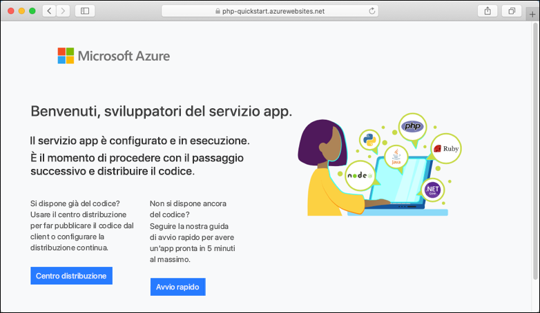
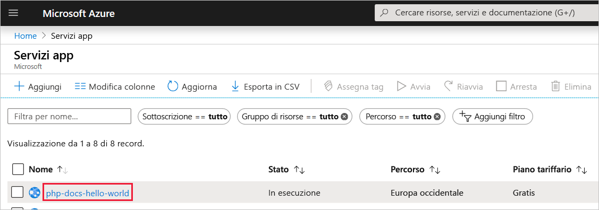
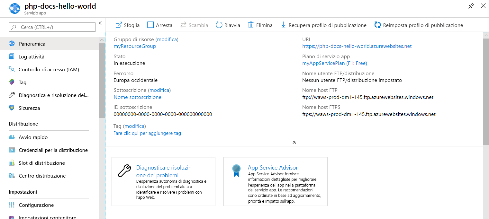

# <a name="create-a-php-web-app-in-azure"></a>Creare un'app Web PHP in Azure

Le [app Web di Azure](app-service-web-overview.md) forniscono un servizio di hosting Web ad alta scalabilità e con funzioni di auto-correzione.  Questa guida introduttiva illustra come distribuire un'app PHP in un'app Web di Azure. Si creerà l'app Web usando l'[interfaccia della riga di comando di Azure](https://docs.microsoft.com/cli/azure/get-started-with-azure-cli) in Cloud Shell e si userà Git per distribuire il codice PHP di esempio nell'app Web.

![App di esempio in esecuzione in Azure]](media/app-service-web-get-started-php/hello-world-in-browser.png)

È possibile eseguire queste procedure con un computer Mac, Windows o Linux. Una volta installati i prerequisiti, sono necessari circa cinque minuti per completare la procedura.

## <a name="prerequisites"></a>Prerequisiti

Per completare questa guida introduttiva:

* [Installare Git](https://git-scm.com/)
* [Installare PHP](https://php.net)

[!INCLUDE [quickstarts-free-trial-note](../../includes/quickstarts-free-trial-note.md)]

## <a name="download-the-sample-locally"></a>Scaricare l'esempio in locale

Eseguire i comandi seguenti in una finestra del terminale. L'applicazione di esempio verrà clonata nel computer locale e verrà visualizzata la directory contenente il codice di esempio.

```bash
git clone https://github.com/Azure-Samples/php-docs-hello-world
cd php-docs-hello-world
```

## <a name="run-the-app-locally"></a>Eseguire l'app in locale

Per eseguire l'applicazione in locale, aprire una finestra del terminale e usare il comando `php` per avviare il server Web PHP predefinito.

```bash
php -S localhost:8080
```

Aprire un Web browser e passare all'app di esempio all'indirizzo `http://localhost:8080`.

Nella pagina verrà visualizzato il messaggio **Hello World!** dell'app di esempio.


Nella finestra del terminale premere **CTRL+C** per uscire dal server Web.

[!INCLUDE [cloud-shell-try-it.md](../../includes/cloud-shell-try-it.md)]

[!INCLUDE [Configure deployment user](../../includes/configure-deployment-user.md)]

[!INCLUDE [Create resource group](../../includes/app-service-web-create-resource-group.md)]

[!INCLUDE [Create app service plan](../../includes/app-service-web-create-app-service-plan.md)]

[!INCLUDE [Create web app](../../includes/app-service-web-create-web-app.md)]



È stata creata una nuova app Web vuota in Azure.

[!INCLUDE [Configure local git](../../includes/app-service-web-configure-local-git.md)] 

[!INCLUDE [Push to Azure](../../includes/app-service-web-git-push-to-azure.md)] 

```bash
Counting objects: 2, done.
Delta compression using up to 4 threads.
Compressing objects: 100% (2/2), done.
Writing objects: 100% (2/2), 352 bytes | 0 bytes/s, done.
Total 2 (delta 1), reused 0 (delta 0)
remote: Updating branch 'master'.
remote: Updating submodules.
remote: Preparing deployment for commit id '25f18051e9'.
remote: Generating deployment script.
remote: Running deployment command...
remote: Handling Basic Web Site deployment.
remote: Kudu sync from: '/home/site/repository' to: '/home/site/wwwroot'
remote: Copying file: '.gitignore'
remote: Copying file: 'LICENSE'
remote: Copying file: 'README.md'
remote: Copying file: 'index.php'
remote: Ignoring: .git
remote: Finished successfully.
remote: Running post deployment command(s)...
remote: Deployment successful.
To https://<app_name>.scm.azurewebsites.net/<app_name>.git
   cc39b1e..25f1805  master -> master
```

## <a name="browse-to-the-app-locally"></a>Passare all'app in locale

Passare all'applicazione distribuita con il Web browser.

```bash
http://<app_name>.azurewebsites.net
```

Il codice di esempio PHP è in esecuzione in un'app Web del servizio app di Azure.


**Congratulazioni.** La distribuzione della prima app PHP nel servizio app è stata completata.

## <a name="update-locally-and-redeploy-the-code"></a>Aggiornare e ridistribuire il codice in locale

Usando un editor di testo locale, aprire il file `index.php` nell'app PHP e apportare una piccola modifica al testo nella stringa accanto a `echo`:

```php
echo "Hello Azure!";
```

Eseguire il commit delle modifiche in Git e quindi effettuare il push delle modifiche al codice in Azure.

```bash
git commit -am "updated output"
git push azure master
```

Al termine della distribuzione, tornare alla finestra del browser aperta nel passaggio **Passare all'app** e aggiornare la pagina.


## <a name="manage-your-new-azure-web-app"></a>Gestire la nuova app Web di Azure

Accedere al <a href="https://portal.azure.com" target="_blank">portale di Azure</a> per gestire l'app Web creata.

Nel menu a sinistra fare clic su **Servizi app** e quindi sul nome dell'app Web di Azure.



Verrà visualizzata la pagina di panoramica dell'app Web. Qui è possibile eseguire attività di gestione di base come l'esplorazione, l'arresto, l'avvio, il riavvio e l'eliminazione dell'app.



Il menu a sinistra fornisce varie pagine per la configurazione dell'app. 

[!INCLUDE [cli-samples-clean-up](../../includes/cli-samples-clean-up.md)]

## <a name="next-steps"></a>Passaggi successivi

> [!div class="nextstepaction"]
> [PHP con MySQL](app-service-web-tutorial-php-mysql.md)
