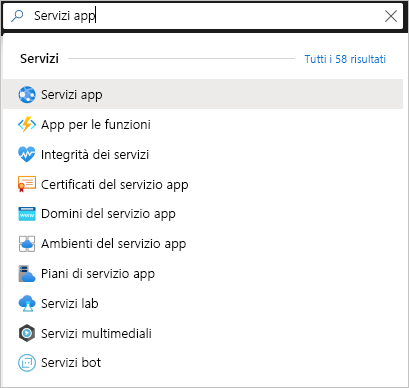

# <a name="create-a-php-web-app-in-azure"></a>Creare un'app Web PHP in Azure

> [!NOTE]
> Questo articolo consente di distribuire un'app nel servizio app in Windows. Per la distribuzione nel servizio app in _Linux_, vedere [Creare un'app Web PHP nel Servizio app in Linux](./containers/quickstart-php.md).
>

[Servizio app di Azure](overview.md) offre un servizio di hosting Web con scalabilità elevata e funzioni di auto-correzione.  Questa esercitazione di avvio rapido illustra come distribuire un'app PHP in Servizio app di Azure. Si creerà l'app Web usando l'[interfaccia della riga di comando di Azure](https://docs.microsoft.com/cli/azure/get-started-with-azure-cli) in Cloud Shell e si userà Git per distribuire il codice PHP di esempio nell'app Web.


È possibile eseguire queste procedure con un computer Mac, Windows o Linux. Una volta installati i prerequisiti, sono necessari circa cinque minuti per completare la procedura.

[!INCLUDE [quickstarts-free-trial-note](../../includes/quickstarts-free-trial-note.md)]

## <a name="prerequisites"></a>Prerequisiti

Per completare questa guida introduttiva:

* <a href="https://git-scm.com/" target="_blank">Installare Git</a>
* <a href="https://php.net/manual/install.php" target="_blank">Installare PHP</a>

## <a name="download-the-sample-locally"></a>Scaricare l'esempio in locale

Eseguire i comandi seguenti in una finestra del terminale. L'applicazione di esempio verrà clonata nel computer locale e verrà visualizzata la directory contenente il codice di esempio. 

```bash
git clone https://github.com/Azure-Samples/php-docs-hello-world
cd php-docs-hello-world
```

## <a name="run-the-app-locally"></a>Eseguire l'app in locale

Eseguire l'applicazione in locale, in modo da verificare l'aspetto che assumerà dopo la distribuzione in Azure. Aprire una finestra del terminale e usare il comando `php` per avviare il server Web PHP predefinito.

```bash
php -S localhost:8080
```

Aprire un Web browser e passare all'app di esempio all'indirizzo `http://localhost:8080`.

Nella pagina verrà visualizzato il messaggio **Hello World!** dell'app di esempio.


Nella finestra del terminale premere **CTRL+C** per uscire dal server Web.

[!INCLUDE [cloud-shell-try-it.md](../../includes/cloud-shell-try-it.md)]

[!INCLUDE [Configure deployment user](../../includes/configure-deployment-user.md)]

[!INCLUDE [Create resource group](../../includes/app-service-web-create-resource-group.md)]

[!INCLUDE [Create app service plan](../../includes/app-service-web-create-app-service-plan.md)]

## <a name="create-a-web-app"></a>Creare un'app Web

In Cloud Shell creare un'app Web nel piano di servizio app `myAppServicePlan` con il comando [`az webapp create`](/cli/azure/webapp?view=azure-cli-latest#az-webapp-create). 

Nell'esempio seguente sostituire `<app_name>` con un nome app univoco globale. I caratteri validi sono `a-z`, `0-9` e `-`. Il runtime è impostato su `PHP|7.0`. Per visualizzare tutti i runtime supportati, eseguire [`az webapp list-runtimes`](/cli/azure/webapp?view=azure-cli-latest#az-webapp-list-runtimes). 

```azurecli-interactive
# Bash
az webapp create --resource-group myResourceGroup --plan myAppServicePlan --name <app_name> --runtime "PHP|7.0" --deployment-local-git
# PowerShell
az --% webapp create --resource-group myResourceGroup --plan myAppServicePlan --name <app_name> --runtime "PHP|7.0" --deployment-local-git
```

Dopo la creazione dell'app Web, l'interfaccia della riga di comando di Azure mostra un output simile all'esempio seguente:

```json
Local git is configured with url of 'https://<username>@<app_name>.scm.azurewebsites.net/<app_name>.git'
{
  "availabilityState": "Normal",
  "clientAffinityEnabled": true,
  "clientCertEnabled": false,
  "cloningInfo": null,
  "containerSize": 0,
  "dailyMemoryTimeQuota": 0,
  "defaultHostName": "<app_name>.azurewebsites.net",
  "enabled": true,
  < JSON data removed for brevity. >
}
```
È stata creata una nuova app Web vuota, con la distribuzione Git abilitata.

> [!NOTE]
> L'URL dell'elemento Git remoto è riportato nella proprietà `deploymentLocalGitUrl`, con il formato `https://<username>@<app_name>.scm.azurewebsites.net/<app_name>.git`. Salvare questo URL, perché è necessario in un secondo momento.
>

Passare all'app Web appena creata. Sostituire _&lt;app name>_ con il nome app univoco creato nel passaggio precedente.

```bash
http://<app name>.azurewebsites.net
```

Ecco l'aspetto che avrà la nuova app Web:


[!INCLUDE [Push to Azure](../../includes/app-service-web-git-push-to-azure.md)] 

```bash
Counting objects: 2, done.
Delta compression using up to 4 threads.
Compressing objects: 100% (2/2), done.
Writing objects: 100% (2/2), 352 bytes | 0 bytes/s, done.
Total 2 (delta 1), reused 0 (delta 0)
remote: Updating branch 'master'.
remote: Updating submodules.
remote: Preparing deployment for commit id '25f18051e9'.
remote: Generating deployment script.
remote: Running deployment command...
remote: Handling Basic Web Site deployment.
remote: Kudu sync from: '/home/site/repository' to: '/home/site/wwwroot'
remote: Copying file: '.gitignore'
remote: Copying file: 'LICENSE'
remote: Copying file: 'README.md'
remote: Copying file: 'index.php'
remote: Ignoring: .git
remote: Finished successfully.
remote: Running post deployment command(s)...
remote: Deployment successful.
To https://<app_name>.scm.azurewebsites.net/<app_name>.git
   cc39b1e..25f1805  master -> master
```

## <a name="browse-to-the-app"></a>Passare all'app

Passare all'applicazione distribuita con il Web browser.

```
http://<app_name>.azurewebsites.net
```

Il codice di esempio PHP è in esecuzione in un'app Web del servizio app di Azure.


**Congratulazioni.** La distribuzione della prima app PHP nel servizio app è stata completata.

## <a name="update-locally-and-redeploy-the-code"></a>Aggiornare e ridistribuire il codice in locale

Usando un editor di testo locale, aprire il file `index.php` nell'app PHP e apportare una piccola modifica al testo nella stringa accanto a `echo`:

```php
echo "Hello Azure!";
```

Nella finestra del terminale locale eseguire il commit delle modifiche in Git e quindi eseguire il push delle modifiche al codice in Azure.

```bash
git commit -am "updated output"
git push azure master
```

Al termine della distribuzione, tornare alla finestra del browser aperta nel passaggio **Passare all'app** e aggiornare la pagina.


## <a name="manage-your-new-azure-app"></a>Gestire la nuova app Azure

1. Accedere al <a href="https://portal.azure.com" target="_blank">portale di Azure</a> per gestire l'app Web creata. Cercare e selezionare **Servizi app**.

    

2. Selezionare il nome dell'app Azure.

    

    Verrà visualizzata la pagina **Panoramica** dell'app Web. Qui è possibile eseguire attività di gestione di base come **esplorazione**, **arresto**, **riavvio** ed **eliminazione**.

    

    Il menu dell'app Web fornisce varie opzioni per la configurazione dell'app. 

[!INCLUDE [cli-samples-clean-up](../../includes/cli-samples-clean-up.md)]

## <a name="next-steps"></a>Passaggi successivi

> [!div class="nextstepaction"]
> [PHP con MySQL](app-service-web-tutorial-php-mysql.md)
