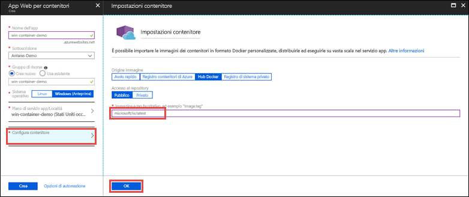

# <a name="run-a-custom-windows-container-in-azure-preview"></a>Eseguire un contenitore Windows personalizzato in Azure (anteprima)

Il [servizio app di Azure](app-service-web-overview.md) offre stack di applicazioni predefiniti in Windows, ad esempio ASP.NET o Node.js, eseguiti in IIS. L'ambiente Windows preconfigurato blocca il sistema operativo impedendo l'accesso amministrativo, le installazioni di software, le modifiche alla Global Assembly Cache e così via (vedere [Funzionalità del sistema operativo in Servizio app di Azure](web-sites-available-operating-system-functionality.md)). Se l'applicazione richiede un accesso superiore a quello consentito dall'ambiente preconfigurato, è possibile distribuire un contenitore Windows personalizzato. Questa guida introduttiva illustra come distribuire un'immagine IIS personalizzata nel servizio app di Azure dall'[hub Docker](https://hub.docker.com/).


## <a name="sign-in-to-azure"></a>Accedere ad Azure

Accedere al portale di Azure all'indirizzo https://portal.azure.com.

## <a name="create-a-windows-container-app"></a>Creare un'app contenitore Windows

1. Scegliere **Crea una risorsa** nell'angolo superiore sinistro del portale di Azure.

2. Nella casella di ricerca sopra l'elenco delle risorse di Azure Marketplace cercare e selezionare **App Web per contenitori**.

3. Specificare un nome di app, ad esempio *mywebapp*, accettare le impostazioni predefinite per creare un nuovo gruppo di risorse e fare clic su **Windows (anteprima)** nella casella **Sistema operativo**.

    

4. Creare un piano di servizio app facendo clic su **Piano di servizio app/Località** > **Crea nuovo**. Assegnare un nome al nuovo piano, accettare le impostazioni predefinite e fare clic su **OK**.

    

5. Fare clic su **Configura contenitore**, digitare _microsoft/iis:latest_ in **Immagine e tag facoltativo** e fare clic su **OK**.

    

    In questo articolo si usa l'immagine pubblica [microsoft/iis:latest](https://hub.docker.com/r/microsoft/iis/) dell'hub Docker. Se si ha un'immagine personalizzata per l'applicazione Web in un'altra posizione, ad esempio in [Registro contenitori di Azure](/azure/container-registry/) o in qualsiasi altro repository privato, si può configurare tale immagine.

6. Fare clic su **Crea** e attendere che Azure crei le risorse necessarie.

## <a name="browse-to-the-container-app"></a>Passare all'app contenitore

Al termine dell'operazione di Azure, verrà visualizzata una casella di notifica.


1. Fare clic su **Vai alla risorsa**.

2. Nella pagina dell'app fare clic sul collegamento sotto **URL**.

Verrà aperta la nuova pagina del browser illustrata di seguito:


Attendere alcuni minuti e riprovare finché non verrà visualizzata la pagina iniziale di IIS:


**Congratulazioni** È ora in esecuzione il primo contenitore Windows personalizzato nel servizio app di Azure.

## <a name="see-container-start-up-logs"></a>Visualizzare i log di avvio del contenitore

Il caricamento del contenitore Windows potrebbe richiedere tempo. Per visualizzare lo stato di avanzamento, passare all'URL seguente sostituendo *\<app_name>* con il nome dell'app.
```
https://<app_name>.scm.azurewebsites.net/api/logstream
```

I log trasmessi sono simili al seguente:

```
2018-07-27T12:03:11  Welcome, you are now connected to log-streaming service.
27/07/2018 12:04:10.978 INFO - Site: win-container-demo - Start container succeeded. Container: facbf6cb214de86e58557a6d073396f640bbe2fdec88f8368695c8d1331fc94b
27/07/2018 12:04:16.767 INFO - Site: win-container-demo - Container start complete
27/07/2018 12:05:05.017 INFO - Site: win-container-demo - Container start complete
27/07/2018 12:05:05.020 INFO - Site: win-container-demo - Container started successfully
```

## <a name="use-a-different-docker-image"></a>Usare un'altra immagine Docker

È possibile eseguire l'app usando un'altra immagine Docker personalizzata. È tuttavia necessario scegliere l'[immagine padre](https://docs.docker.com/develop/develop-images/baseimages/) corretta per il framework desiderato: 

- Per distribuire app .NET Framework, usare un'immagine padre basata sulla versione [Long-Term Servicing Channel (LTSC)](https://docs.microsoft.com/windows-server/get-started/semi-annual-channel-overview#long-term-servicing-channel-ltsc) di Windows Server Core 2016. 
- Per distribuire app .NET Core, usare un'immagine padre basata sulla versione [Long-Term Servicing Channel (LTSC)](https://docs.microsoft.com/windows-server/get-started/semi-annual-channel-overview#long-term-servicing-channel-ltsc) di Windows Server Nano 2016. 

Il download di un'immagine padre durante l'avvio dell'app richiede tempo. È tuttavia possibile ridurre i tempi di avvio usando una delle immagini padre seguenti, già memorizzate nella cache nel servizio app di Azure.

- [microsoft/iis](https://hub.docker.com/r/microsoft/iis/): windowsservercore-ltsc2016 (più recente)
- [microsoft/iis](https://hub.docker.com/r/microsoft/iis/): nanoserver-sac2016
- [microsoft/aspnet](https://hub.docker.com/r/microsoft/aspnet/): 4.7.2-windowsservercore-ltsc2016, 4.7.2 (più recente)
- [microsoft/dotnet](https://hub.docker.com/r/microsoft/dotnet/): 2.1-aspnetcore-runtime
- [microsoft/dotnet](https://hub.docker.com/r/microsoft/dotnet/): 2.1-sdk
