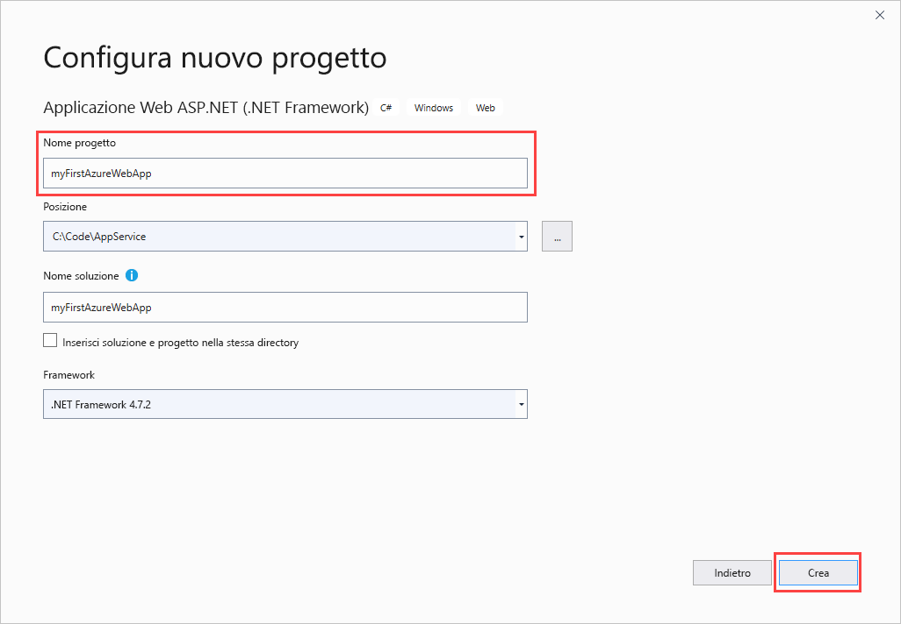
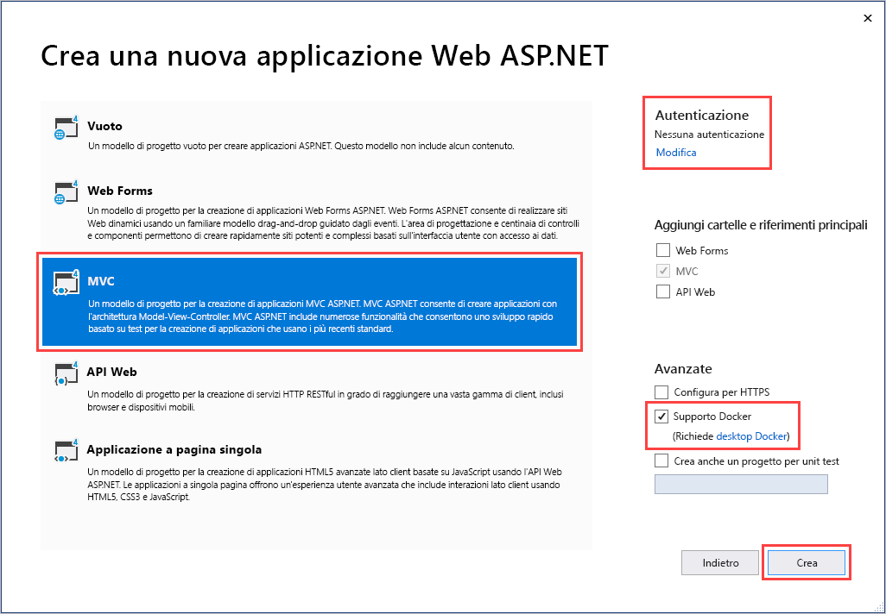
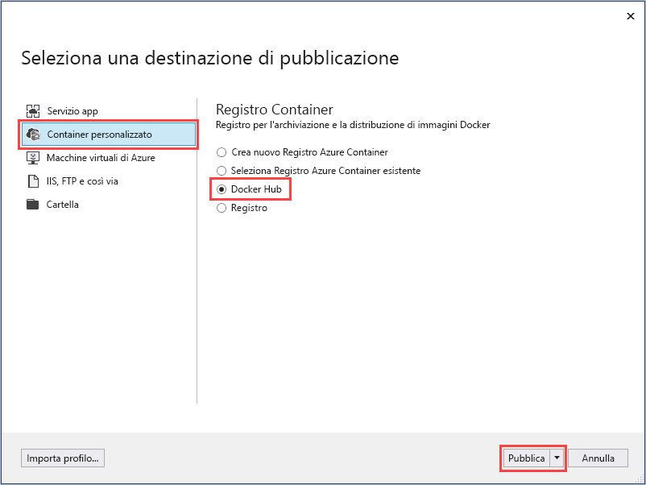
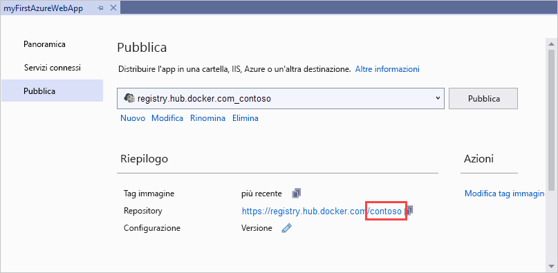
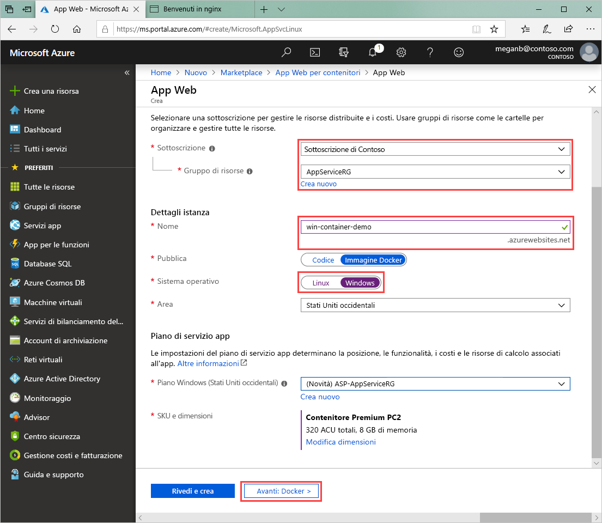
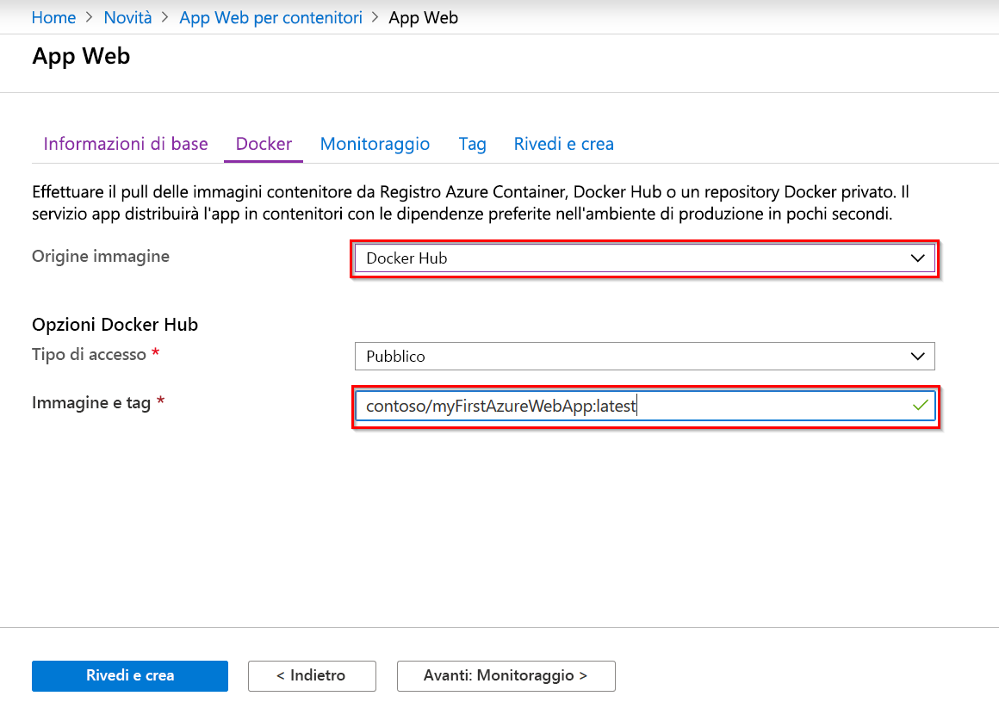

# <a name="run-a-custom-windows-container-in-azure-preview"></a>Eseguire un contenitore Windows personalizzato in Azure (anteprima)

Il [servizio app di Azure](overview.md) offre stack di applicazioni predefiniti in Windows, ad esempio ASP.NET o Node.js, eseguiti in IIS. L'ambiente Windows preconfigurato blocca il sistema operativo impedendo l'accesso amministrativo, le installazioni di software, le modifiche alla Global Assembly Cache e così via. Per altre informazioni, vedere [Funzionalità del sistema operativo in Servizio app di Azure](operating-system-functionality.md). Se l'applicazione richiede un accesso superiore a quello consentito dall'ambiente preconfigurato, è possibile distribuire un contenitore Windows personalizzato.

Questa guida di avvio rapido illustra come distribuire un'app ASP.NET in un'immagine Windows in [Docker Hub](https://hub.docker.com/) da Visual Studio ed eseguirla in un contenitore personalizzato in Servizio app di Azure.

## <a name="prerequisites"></a>Prerequisiti

Per completare questa esercitazione:

- <a href="https://hub.docker.com/" target="_blank">Iscriversi per ottenere un account Docker Hub</a>
- <a href="https://docs.docker.com/docker-for-windows/install/" target="_blank">Installare Docker per Windows</a>.
- <a href="https://docs.microsoft.com/virtualization/windowscontainers/quick-start/quick-start-windows-10" target="_blank">Impostare Docker per eseguire contenitori Windows</a>.
- <a href="https://www.visualstudio.com/downloads/" target="_blank">Installare Visual Studio 2019</a> con i carichi di lavoro **Sviluppo ASP.NET e Web** e **Sviluppo di Azure**. Se Visual Studio 2019 è già installato:

    - Installare gli aggiornamenti più recenti in Visual Studio selezionando **?**  > **Controlla aggiornamenti**.
    - Aggiungere i carichi di lavoro in Visual Studio selezionando **Strumenti** > **Ottieni strumenti e funzionalità**.

## <a name="create-an-aspnet-web-app"></a>Creare un'app Web ASP.NET

Creare un'app Web ASP.NET seguendo questa procedura:

1. Aprire Visual Studio e selezionare **Crea un nuovo progetto**.

1. In **Crea un nuovo progetto** trovare e selezionare **Applicazione Web ASP.NET (.NET Framework)** per C#, quindi selezionare **Avanti**.

1. In **Configura il nuovo progetto** assegnare all'applicazione il nome _myFirstAzureWebApp_ e quindi selezionare **Crea**.

   

1. È possibile distribuire qualsiasi tipo di app Web ASP.NET in Azure. Per questa guida di avvio rapido scegliere il modello **MVC**.

1. Selezionare **Supporto Docker** e verificare che l'autenticazione sia impostata su **Nessuna autenticazione**. Selezionare **Create** (Crea).

   

1. Se il file _Dockerfile_ non viene aperto automaticamente, aprirlo da **Esplora soluzioni**.

1. È necessaria un'[immagine padre supportata](#use-a-different-parent-image). Modificare l'immagine padre sostituendo la riga `FROM` con il codice seguente e salvare il file:

   ```Dockerfile
   FROM mcr.microsoft.com/dotnet/framework/aspnet:4.7.2-windowsservercore-ltsc2019
   ```

1. Nel menu di Visual Studio selezionare **Debug** > **Avvia senza eseguire debug** per eseguire l'app Web in locale.

   

## <a name="publish-to-docker-hub"></a>Eseguire la pubblicazione in Hub Docker

1. In **Esplora soluzioni** fare clic con il pulsante destro del mouse sul progetto **myFirstAzureWebApp** e scegliere **Pubblica**.

1. Scegliere **Servizio app** e quindi selezionare **Pubblica**.

1. In **Selezionare una destinazione di pubblicazione**  selezionare **Registro Container** e **Docker Hub**, quindi fare clic su **Pubblica**.

   

1. Fornire le credenziali dell'account Docker Hub e selezionare **Salva**.

   Attendere il completamento della distribuzione. La pagina **Pubblica** mostra ora il nome del repository da usare successivamente.

   

1. Copiare il nome del repository da usare successivamente.

## <a name="create-a-windows-container-app"></a>Creare un'app contenitore Windows

1. Accedere al [portale di Azure]( https://portal.azure.com).

1. Scegliere **Crea una risorsa** nell'angolo superiore sinistro del portale di Azure.

1. Nella casella di ricerca sopra l'elenco delle risorse di Azure Marketplace cercare **App Web per contenitori** e selezionare **Crea**.

1. In **App Web - Crea** selezionare la propria sottoscrizione e un gruppo in **Gruppo di risorse**. Se necessario, è possibile creare un nuovo gruppo di risorse.

1. Specificare un nome per l'app, ad esempio *win-container-demo*, e selezionare **Windows** per **Sistema operativo**. Selezionare **Avanti: Docker** per continuare.

   

1. Per **Origine immagine** selezionare **Docker Hub** e per **Immagine e tag** immettere il nome del repository copiato in [Eseguire la pubblicazione in Docker Hub](#publish-to-docker-hub).

   

    Se si ha un'immagine personalizzata per l'applicazione Web in un'altra posizione, ad esempio in [Registro Azure Container](/azure/container-registry/) o in qualsiasi altro repository privato, si può configurare tale immagine.

1. Selezionare **Rivedi e crea** e quindi **Crea** e attendere che Azure crei le risorse necessarie.

## <a name="browse-to-the-container-app"></a>Passare all'app contenitore

Al termine dell'operazione di Azure, verrà visualizzata una casella di notifica.


1. Fare clic su **Vai alla risorsa**.

1. Nella panoramica di questa risorsa seguire il collegamento accanto a **URL**.

Si aprirà la nuova pagina del browser illustrata di seguito:


Attendere alcuni minuti e riprovare, finché non viene visualizzata la pagina iniziale di ASP.NET predefinita:


**Congratulazioni** È ora in esecuzione il primo contenitore Windows personalizzato nel servizio app di Azure.

## <a name="see-container-start-up-logs"></a>Visualizzare i log di avvio del contenitore

Il caricamento del contenitore Windows potrebbe richiedere tempo. Per visualizzare lo stato di avanzamento, passare all'URL seguente sostituendo *\<app_name>* con il nome dell'app.
```
https://<app_name>.scm.azurewebsites.net/api/logstream
```

I log trasmessi sono simili al seguente:

```
2018-07-27T12:03:11  Welcome, you are now connected to log-streaming service.
27/07/2018 12:04:10.978 INFO - Site: win-container-demo - Start container succeeded. Container: facbf6cb214de86e58557a6d073396f640bbe2fdec88f8368695c8d1331fc94b
27/07/2018 12:04:16.767 INFO - Site: win-container-demo - Container start complete
27/07/2018 12:05:05.017 INFO - Site: win-container-demo - Container start complete
27/07/2018 12:05:05.020 INFO - Site: win-container-demo - Container started successfully
```

## <a name="update-locally-and-redeploy"></a>Eseguire l'aggiornamento e la ridistribuzione in locale

1. In **Esplora soluzioni** di Visual Studio aprire **Visualizzazioni** > **Home** > **Index.cshtml**.

1. Trovare il tag HTML `<div class="jumbotron">` in alto e sostituire l'intero elemento con il codice seguente:

   ```HTML
   <div class="jumbotron">
       <h1>ASP.NET in Azure!</h1>
       <p class="lead">This is a simple app that we’ve built that demonstrates how to deploy a .NET app to Azure App Service.</p>
   </div>
   ```

1. Per la ridistribuzione in Azure, fare clic con il pulsante destro del mouse sul progetto **myFirstAzureWebApp** in **Esplora soluzioni** e scegliere **Pubblica**.

1. Nella pagina di pubblicazione selezionare **Pubblica** e attendere il completamento della pubblicazione.

1. Per indicare al servizio a di eseguire il pull della nuova immagine da Hub Docker, riavviare l'app. Di nuovo nella pagina dell'app nel portale fare clic su **Riavvia** > **Sì**.

   

[Passare all'app contenitore](#browse-to-the-container-app) di nuovo. Quando si aggiorna la pagina Web, l'app dovrebbe prima tornare alla pagina "Avvio" e quindi visualizzare la pagina Web aggiornata di nuovo dopo alcuni minuti.


## <a name="use-a-different-parent-image"></a>Usare un'immagine padre diversa

È possibile eseguire l'app usando un'altra immagine Docker personalizzata. È tuttavia necessario scegliere l'[immagine padre](https://docs.docker.com/develop/develop-images/baseimages/) corretta per il framework desiderato:

- Per distribuire app .NET Framework, usare un'immagine padre basata sulla versione [Long-Term Servicing Channel (LTSC)](https://docs.microsoft.com/windows-server/get-started-19/servicing-channels-19#long-term-servicing-channel-ltsc) di Windows Server Core 2019. 
- Per distribuire app .NET Core, usare un'immagine padre basata sulla versione [Semi-Annual Servicing Channel (SAC)](https://docs.microsoft.com/windows-server/get-started-19/servicing-channels-19#semi-annual-channel) di Windows Server Nano 1809. 

Il download di un'immagine padre durante l'avvio dell'app richiede tempo. È tuttavia possibile ridurre i tempi di avvio usando una delle immagini padre seguenti, già memorizzate nella cache nel servizio app di Azure.

- [mcr.microsoft.com/dotnet/framework/aspnet](https://hub.docker.com/_/microsoft-dotnet-framework-aspnet/):4.7.2-windowsservercore-ltsc2019
- [mcr.microsoft.com/windows/nanoserver](https://hub.docker.com/_/microsoft-windows-nanoserver/):1809: questa immagine è il contenitore di base usato in tutte le immagini di Microsoft Windows Nano Server in Microsoft [ASP.NET Core](https://hub.docker.com/_microsoft-dotnet-cores-aspnet).

## <a name="next-steps"></a>Passaggi successivi

> [!div class="nextstepaction"]
> [Eseguire la migrazione al contenitore Windows in Azure](app-service-web-tutorial-windows-containers-custom-fonts.md)
