# <a name="run-a-custom-windows-container-in-azure-preview"></a>Eseguire un contenitore Windows personalizzato in Azure (anteprima)

Il [servizio app di Azure](overview.md) offre stack di applicazioni predefiniti in Windows, ad esempio ASP.NET o Node.js, eseguiti in IIS. L'ambiente Windows preconfigurato blocca il sistema operativo impedendo l'accesso amministrativo, le installazioni di software, le modifiche alla Global Assembly Cache e così via (vedere [Funzionalità del sistema operativo in Servizio app di Azure](operating-system-functionality.md)). Se l'applicazione richiede un accesso superiore a quello consentito dall'ambiente preconfigurato, è possibile distribuire un contenitore Windows personalizzato. Questa guida introduttiva illustra come distribuire un'app ASP.NET in un'immagine Windows in [Hub Docker](https://hub.docker.com/) da Visual Studio ed eseguirla in un contenitore personalizzato in Servizio app di Azure.

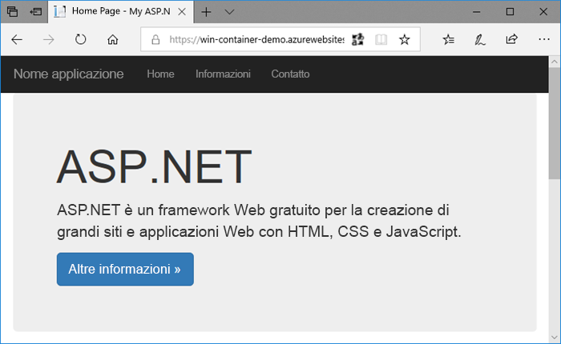

## <a name="prerequisites"></a>Prerequisiti

Per completare questa esercitazione:

- <a href="https://hub.docker.com/" target="_blank">Iscriversi per ottenere un account Docker Hub</a>
- <a href="https://docs.docker.com/docker-for-windows/install/" target="_blank">Installare Docker per Windows</a>.
- <a href="https://docs.microsoft.com/virtualization/windowscontainers/quick-start/quick-start-windows-10#2-switch-to-windows-containers" target="_blank">Impostare Docker per eseguire contenitori Windows</a>.
- <a href="https://www.visualstudio.com/downloads/" target="_blank">Installare Visual Studio 2017</a> con i carichi di lavoro **Sviluppo ASP.NET e Web** e **Sviluppo di Azure**. Se Visual Studio 2017 è già installato:
    - Installare gli aggiornamenti più recenti in Visual Studio facendo clic su **?** > **Controlla aggiornamenti**.
    - Aggiungere i carichi di lavoro in Visual Studio facendo clic su **Strumenti** > **Ottieni strumenti e funzionalità**.

## <a name="create-an-aspnet-web-app"></a>Creare un'app Web ASP.NET

In Visual Studio creare un progetto selezionando **File > Nuovo > Progetto**. 

Nella finestra di dialogo **Nuovo progetto** selezionare **Visual C# > Web > Applicazione Web ASP.NET (.NET Framework)**.

Assegnare all'applicazione il nome _myFirstAzureWebApp_ e fare clic su **OK**.
   


È possibile distribuire qualsiasi tipo di app Web ASP.NET in Azure. Per questa guida introduttiva, selezionare il modello **MVC** e verificare che l'autenticazione sia impostata su **Nessuna autenticazione**.

Selezionare **Abilita supporto Docker Compose**.

Selezionare **OK**.

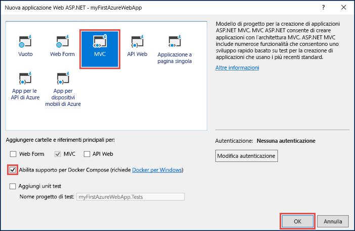

Se il file _Dockerfile_ non viene aperto automaticamente, aprirlo da **Esplora soluzioni**.

È necessario usare un'[immagine padre supportata](#use-a-different-parent-image). Modificare l'immagine padre sostituendo la riga `FROM` con il codice seguente e salvare il file:

```Dockerfile
FROM microsoft/aspnet:4.7.1
```

Nel menu selezionare **Debug > Avvia senza eseguire debug** per eseguire l'app Web in locale.

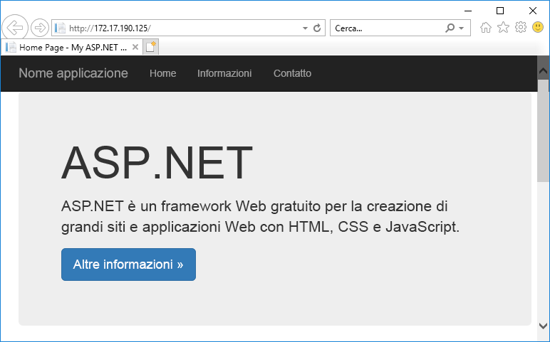

## <a name="publish-to-docker-hub"></a>Eseguire la pubblicazione in Hub Docker

In **Esplora soluzioni** fare clic con il pulsante destro del mouse sul progetto **myFirstAzureWebApp** e scegliere **Pubblica**.

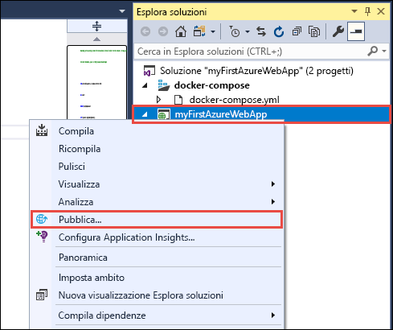

La procedura guidata di pubblicazione viene avviata automaticamente. Selezionare **Registro contenitori** > **Hub Docker** > **Pubblica**.

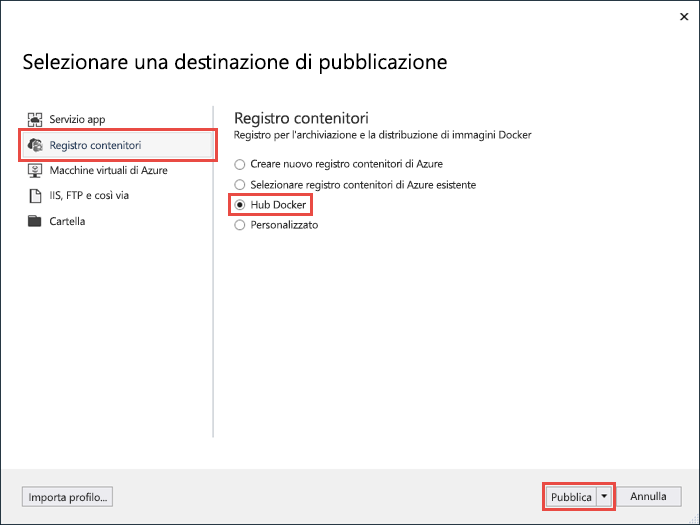

Fornire le credenziali dell'account di Hub Docker e fare clic su **Salva**. 

Attendere il completamento della distribuzione. Nella pagina **Pubblica** verrà visualizzato il nome del repository che si userà successivamente nel servizio app.

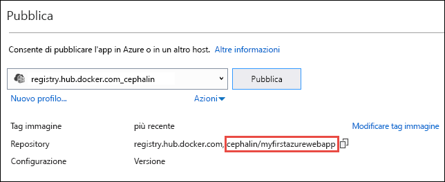

Copiare il nome del repository da usare successivamente.

## <a name="sign-in-to-azure"></a>Accedere ad Azure

Accedere al portale di Azure all'indirizzo https://portal.azure.com.

## <a name="create-a-windows-container-app"></a>Creare un'app contenitore Windows

1. Scegliere **Crea una risorsa** nell'angolo superiore sinistro del portale di Azure.

2. Nella casella di ricerca sopra l'elenco delle risorse di Azure Marketplace cercare e selezionare **App Web per contenitori**.

3. Specificare un nome di app, ad esempio *win-container-demo*, accettare le impostazioni predefinite per creare un nuovo gruppo di risorse e fare clic su **Windows (anteprima)** nella casella **Sistema operativo**.

    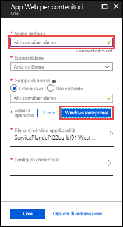

4. Creare un piano di servizio app facendo clic su **Piano di servizio app/Località** > **Crea nuovo**. Assegnare un nome al nuovo piano, accettare le impostazioni predefinite e fare clic su **OK**.

    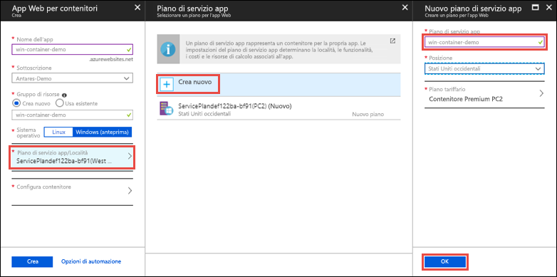

5. Fare clic su **Configura contenitore**. In **Immagine e tag facoltativo** usare il nome del repository copiato in [Eseguire la pubblicazione in Hub Docker](#publish-to-docker-hub) e quindi fare clic su **OK**.

    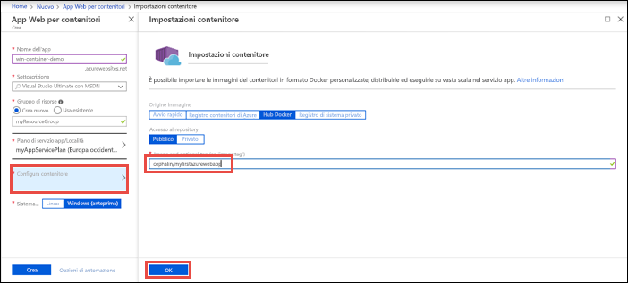

    Se si ha un'immagine personalizzata per l'applicazione Web in un'altra posizione, ad esempio in [Registro Azure Container](/azure/container-registry/) o in qualsiasi altro repository privato, si può configurare tale immagine.

6. Fare clic su **Crea** e attendere che Azure crei le risorse necessarie.

## <a name="browse-to-the-container-app"></a>Passare all'app contenitore

Al termine dell'operazione di Azure, verrà visualizzata una casella di notifica.

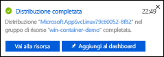

1. Fare clic su **Vai alla risorsa**.

2. Nella pagina dell'app fare clic sul collegamento sotto **URL**.

Verrà aperta la nuova pagina del browser illustrata di seguito:

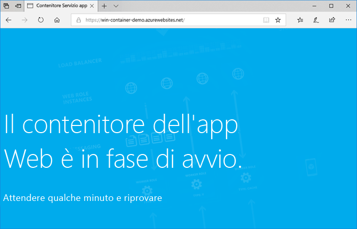

Attendere alcuni minuti e riprovare, finché non viene visualizzata la pagina iniziale di ASP.NET predefinita:


**Congratulazioni** È ora in esecuzione il primo contenitore Windows personalizzato nel servizio app di Azure.

## <a name="see-container-start-up-logs"></a>Visualizzare i log di avvio del contenitore

Il caricamento del contenitore Windows potrebbe richiedere tempo. Per visualizzare lo stato di avanzamento, passare all'URL seguente sostituendo *\<app_name>* con il nome dell'app.
```
https://<app_name>.scm.azurewebsites.net/api/logstream
```

I log trasmessi sono simili al seguente:

```
2018-07-27T12:03:11  Welcome, you are now connected to log-streaming service.
27/07/2018 12:04:10.978 INFO - Site: win-container-demo - Start container succeeded. Container: facbf6cb214de86e58557a6d073396f640bbe2fdec88f8368695c8d1331fc94b
27/07/2018 12:04:16.767 INFO - Site: win-container-demo - Container start complete
27/07/2018 12:05:05.017 INFO - Site: win-container-demo - Container start complete
27/07/2018 12:05:05.020 INFO - Site: win-container-demo - Container started successfully
```

## <a name="update-locally-and-redeploy"></a>Eseguire l'aggiornamento e la ridistribuzione in locale

Da **Esplora soluzioni** aprire _Views\Home\Index.cshtml_.

Trovare il tag HTML `<div class="jumbotron">` in alto e sostituire l'intero elemento con il codice seguente:

```HTML
<div class="jumbotron">
    <h1>ASP.NET in Azure!</h1>
    <p class="lead">This is a simple app that we’ve built that demonstrates how to deploy a .NET app to Azure App Service.</p>
</div>
```

Per la ridistribuzione in Azure, fare clic con il pulsante destro del mouse sul progetto **myFirstAzureWebApp** in **Esplora soluzioni** e selezionare **Pubblica**.

Nella pagina di pubblicazione selezionare **Pubblica** e attendere il completamento della pubblicazione.

Per indicare al servizio a di eseguire il pull della nuova immagine da Hub Docker, riavviare l'app. Di nuovo nella pagina dell'app nel portale fare clic su **Riavvia** > **Sì**.

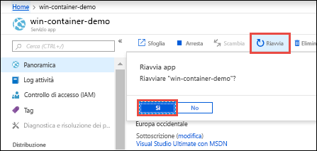

[Passare all'app contenitore](#browse-to-the-container-app) di nuovo. Quando si aggiorna la pagina Web, l'app dovrebbe prima tornare alla pagina "Avvio" e quindi visualizzare la pagina Web aggiornata di nuovo dopo alcuni minuti.

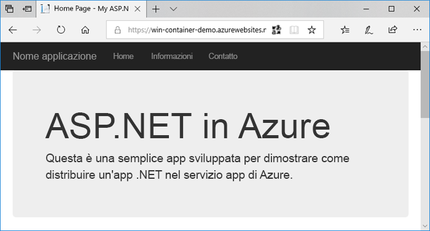

## <a name="use-a-different-parent-image"></a>Usare un'immagine padre diversa

È possibile eseguire l'app usando un'altra immagine Docker personalizzata. È tuttavia necessario scegliere l'[immagine padre](https://docs.docker.com/develop/develop-images/baseimages/) corretta per il framework desiderato: 

- Per distribuire app .NET Framework, usare un'immagine padre basata sulla versione [Long-Term Servicing Channel (LTSC)](https://docs.microsoft.com/windows-server/get-started/semi-annual-channel-overview#long-term-servicing-channel-ltsc) di Windows Server Core 2016. 
- Per distribuire app .NET Core, usare un'immagine padre basata sulla versione [Long-Term Servicing Channel (LTSC)](https://docs.microsoft.com/windows-server/get-started/semi-annual-channel-overview#long-term-servicing-channel-ltsc) di Windows Server Nano 2016. 

Il download di un'immagine padre durante l'avvio dell'app richiede tempo. È tuttavia possibile ridurre i tempi di avvio usando una delle immagini padre seguenti, già memorizzate nella cache nel servizio app di Azure.

- [microsoft/iis](https://hub.docker.com/r/microsoft/iis/): windowsservercore-ltsc2016 (più recente)
- [microsoft/iis](https://hub.docker.com/r/microsoft/iis/): nanoserver-sac2016
- [microsoft/aspnet](https://hub.docker.com/r/microsoft/aspnet/): 4.7.2-windowsservercore-ltsc2016, 4.7.2 (più recente)
- [microsoft/dotnet](https://hub.docker.com/r/microsoft/dotnet/): 2.1-aspnetcore-runtime
- [microsoft/dotnet](https://hub.docker.com/r/microsoft/dotnet/): 2.1-sdk

## <a name="next-steps"></a>Passaggi successivi

> [!div class="nextstepaction"]
> [Eseguire la migrazione al contenitore Windows in Azure](app-service-web-tutorial-windows-containers-custom-fonts.md)
