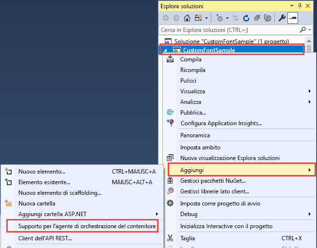
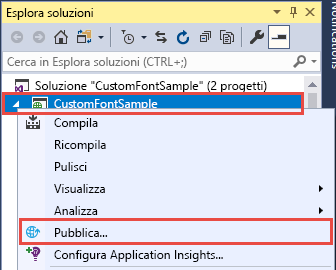
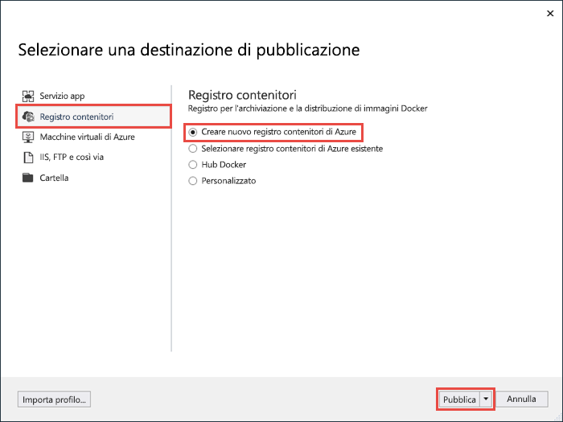
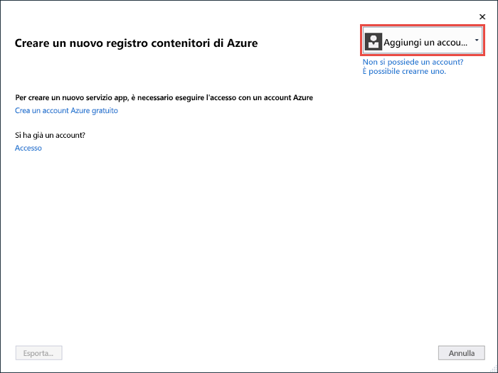
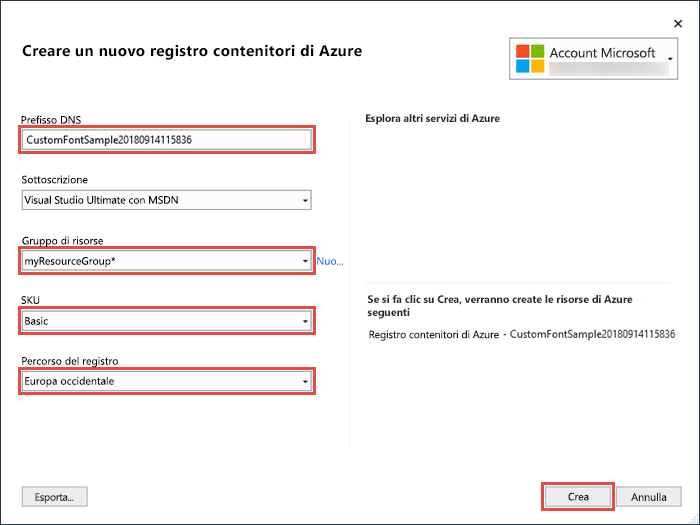
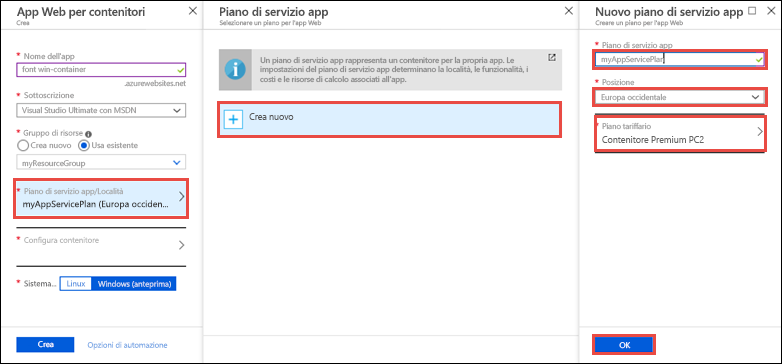
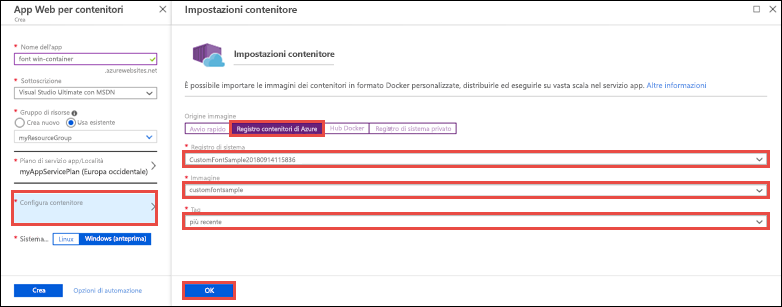
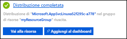

# <a name="migrate-an-aspnet-app-to-azure-app-service-using-a-windows-container-preview"></a>Eseguire la migrazione di un'app ASP.NET in Servizio app di Azure usando un contenitore Windows (anteprima)

Il [servizio app di Azure](overview.md) offre stack di applicazioni predefiniti in Windows, ad esempio ASP.NET o Node.js, eseguiti in IIS. L'ambiente Windows preconfigurato blocca il sistema operativo impedendo l'accesso amministrativo, le installazioni di software, le modifiche alla Global Assembly Cache e così via (vedere [Funzionalità del sistema operativo in Servizio app di Azure](operating-system-functionality.md)). Tuttavia, usando un contenitore Windows personalizzato nel servizio app è possibile apportare le modifiche del sistema operativo necessarie per l'app, per poter eseguire in modo semplice la migrazione di un'app locale che richiede una configurazione personalizzata di software e sistema operativo. Questa esercitazione illustra come eseguire la migrazione al servizio app di un'app ASP.NET che usa tipi di carattere personalizzati installati nella libreria dei tipi di carattere Windows. Si distribuisce un'immagine Windows configurata in modo personalizzato da Visual Studio a [Registro Azure Container](https://docs.microsoft.com/azure/container-registry/) e quindi la si esegue nel servizio app.


## <a name="prerequisites"></a>Prerequisiti

Per completare questa esercitazione:

- <a href="https://hub.docker.com/" target="_blank">Iscriversi per ottenere un account Docker Hub</a>
- <a href="https://docs.docker.com/docker-for-windows/install/" target="_blank">Installare Docker per Windows</a>.
- <a href="https://docs.microsoft.com/virtualization/windowscontainers/quick-start/quick-start-windows-10" target="_blank">Impostare Docker per eseguire contenitori Windows</a>.
- <a href="https://www.visualstudio.com/downloads/" target="_blank">Installare Visual Studio 2017</a> con i carichi di lavoro **Sviluppo ASP.NET e Web** e **Sviluppo di Azure**. Se Visual Studio 2017 è già installato:
    - Installare gli aggiornamenti più recenti in Visual Studio facendo clic su **?** > **Controlla aggiornamenti**.
    - Aggiungere i carichi di lavoro in Visual Studio facendo clic su **Strumenti** > **Ottieni strumenti e funzionalità**.

## <a name="set-up-the-app-locally"></a>Configurare l'app in locale

### <a name="download-the-sample"></a>Scaricare l'esempio

In questo passaggio si configura il progetto .NET locale.

- [Scaricare il progetto di esempio](https://github.com/Azure-Samples/custom-font-win-container/archive/master.zip).
- Estrarre (decomprimere) il file *custom-font-win-container.zip*.

Il progetto di esempio contiene un'applicazione ASP.NET semplice che usa un tipo di carattere personalizzato installato nella libreria dei tipi di carattere Windows. Non è necessario installare i tipi di carattere, ma si tratta di un esempio di app integrata con il sistema operativo sottostante. Per eseguire la migrazione di un'app di questo tipo al servizio app, è necessario riprogettare il codice per rimuovere l'integrazione oppure è possibile eseguire la migrazione dell'app senza modifiche in un contenitore Windows personalizzato.

### <a name="install-the-font"></a>Installare il tipo di carattere

In Esplora risorse passare a _custom-font-win-container-master/CustomFontSample_, fare clic con il pulsante destro del mouse su _FrederickatheGreat-Regular.ttf_ e scegliere **Installa**.

Questo tipo di carattere è disponibile pubblicamente in [Google Fonts](https://fonts.google.com/specimen/Fredericka+the+Great).

### <a name="run-the-app"></a>Esecuzione dell'app

Aprire il file *custom-font-win-container/CustomFontSample.sln* in Visual Studio. 

Digitare `Ctrl+F5` per eseguire l'app senza debug. L'app viene visualizzata nel browser predefinito. 


Poiché usa un tipo di carattere installato, l'app non può essere eseguita nell'ambiente sandbox del servizio app. È tuttavia possibile distribuirla usando un contenitore Windows, perché è possibile installare il tipo di carattere nel contenitore Windows.

### <a name="configure-windows-container"></a>Configurare il contenitore Windows

In Esplora soluzioni fare clic con il pulsante destro del mouse sul progetto **CustomFontSample** e scegliere **Aggiungi** > **Container Orchestration Support** (Supporto orchestrazione contenitori).



Selezionare **Docker Compose** > **OK**.

Il progetto è ora configurato per l'esecuzione in un contenitore Windows. Verrà aggiunto un file _Dockerfile_ al progetto **CustomFontSample** e un progetto **docker-compose** verrà aggiunto alla soluzione. 

Da Esplora soluzioni aprire **Dockerfile**.

È necessario usare un'[immagine padre supportata](app-service-web-get-started-windows-container.md#use-a-different-parent-image). Modificare l'immagine padre sostituendo la riga `FROM` con il codice seguente:

```Dockerfile
FROM microsoft/aspnet:4.7.1
```

Alla fine del file aggiungere la riga seguente e quindi salvare il file:

```Dockerfile
RUN ${source:-obj/Docker/publish/InstallFont.ps1}
```

_InstallFont.ps1_ è disponibile nel progetto **CustomFontSample**. Si tratta di un semplice script che installa il tipo di carattere. Una versione più complessa dello script è disponibile in [Script Center](https://gallery.technet.microsoft.com/scriptcenter/fb742f92-e594-4d0c-8b79-27564c575133).

## <a name="publish-to-azure-container-registry"></a>Eseguire la pubblicazione in Registro Azure Container

[Registro Azure Container](https://docs.microsoft.com/azure/container-registry/) consente di archiviare le immagini per le distribuzioni di contenitori. È possibile configurare il servizio app per usare le immagini ospitate in Registro Azure Container.

### <a name="open-publish-wizard"></a>Aprire la pubblicazione guidata

In Esplora soluzioni fare clic con il pulsante destro del mouse sul progetto **CustomFontSample** e scegliere **Pubblica**.



### <a name="create-registry-and-publish"></a>Creare il registro ed eseguire la pubblicazione

Nella pubblicazione guidata selezionare **Registro contenitori** > **Crea nuovo Registro Azure Container** > **Pubblica**.



### <a name="sign-in-with-azure-account"></a>Accedere con l'account di Azure

Nella finestra di dialogo **Crea un nuovo Registro Azure Container** selezionare **Aggiungi un account** e accedere alla sottoscrizione di Azure. Se è già stato eseguito l'accesso, selezionare l'account contenente la sottoscrizione desiderata dall'elenco a discesa.



### <a name="configure-the-registry"></a>Configurare il registro

Configurare il nuovo registro contenitori in base ai valori suggeriti nella tabella seguente. Al termine, fare clic su **Crea**.

| Impostazione  | Valore consigliato | Per altre informazioni |
| ----------------- | ------------ | ----|
|**Prefisso DNS**| Mantenere il nome del registro generato oppure modificarlo scegliendo un altro nome univoco. |  |
|**Gruppo di risorse**| Fare clic su **Nuovo**, digitare **myResourceGroup** e fare clic su **OK**. |  |
|**SKU**| Basic | [Piani tariffari](https://azure.microsoft.com/pricing/details/container-registry/)|
|**Percorso del registro**| Europa occidentale | |



Verrà aperta una finestra del terminale in cui viene visualizzato l'avanzamento della distribuzione dell'immagine. Attendere il completamento della distribuzione.

## <a name="sign-in-to-azure"></a>Accedere ad Azure

Accedere al portale di Azure all'indirizzo https://portal.azure.com.

## <a name="create-a-web-app"></a>Creare un'app Web

Dal menu a sinistra scegliere **Crea una risorsa** > **Web** > **App Web per contenitori**.

### <a name="configure-the-new-web-app"></a>Configurare la nuova app Web

Nell'interfaccia di creazione configurare le impostazioni in base alla tabella seguente:

| Impostazione  | Valore consigliato | Per altre informazioni |
| ----------------- | ------------ | ----|
|**Nome app**| Digitare un nome univoco. | L'URL dell'app Web è `http://<app_name>.azurewebsites.net`, dove `<app_name>` è il nome dell'app. |
|**Gruppo di risorse**| Selezionare **Usa esistente** e digitare **myResourceGroup**. |  |
|**Sistema operativo**| Windows (anteprima) | |

### <a name="configure-app-service-plan"></a>Configurare il piano di servizio app

Fare clic su **Piano di servizio app/Località** > **Crea nuovo**. Assegnare un nome al piano, selezionare **Europa occidentale** come località e fare clic su **OK**.



### <a name="configure-container"></a>Configurare il contenitore

Fare clic su **Configura contenitore** > **Registro Azure Container**. Selezionare il registro, l'immagine e il tag creati in precedenza in [Eseguire la pubblicazione in Registro Azure Container](#publish-to-azure-container-registry) e fare clic su **OK**.



### <a name="complete-app-creation"></a>Completare la creazione dell'app

Fare clic su **Crea** e attendere che Azure crei le risorse necessarie.

## <a name="browse-to-the-web-app"></a>Passare all'app Web

Al termine dell'operazione di Azure, verrà visualizzata una casella di notifica.



1. Fare clic su **Vai alla risorsa**.

2. Nella pagina dell'app fare clic sul collegamento sotto **URL**.

Verrà aperta la nuova pagina del browser illustrata di seguito:


Attendere alcuni minuti e riprovare, finché non viene visualizzata la pagina iniziale, con il carattere desiderato:


**Congratulazioni** È stata eseguita la migrazione di un'applicazione ASP.NET in Servizio app di Azure in un contenitore Windows.

## <a name="see-container-start-up-logs"></a>Visualizzare i log di avvio del contenitore

Il caricamento del contenitore Windows potrebbe richiedere tempo. Per visualizzare lo stato di avanzamento, passare all'URL seguente sostituendo *\<app_name>* con il nome dell'app.
```
https://<app_name>.scm.azurewebsites.net/api/logstream
```

I log trasmessi sono simili al seguente:

```
14/09/2018 23:16:19.889 INFO - Site: fonts-win-container - Creating container for image: customfontsample20180914115836.azurecr.io/customfontsample:latest.
14/09/2018 23:16:19.928 INFO - Site: fonts-win-container - Create container for image: customfontsample20180914115836.azurecr.io/customfontsample:latest succeeded. Container Id 329ecfedbe370f1d99857da7352a7633366b878607994ff1334461e44e6f5418
14/09/2018 23:17:23.405 INFO - Site: fonts-win-container - Start container succeeded. Container: 329ecfedbe370f1d99857da7352a7633366b878607994ff1334461e44e6f5418
14/09/2018 23:17:28.637 INFO - Site: fonts-win-container - Container ready
14/09/2018 23:17:28.637 INFO - Site: fonts-win-container - Configuring container
14/09/2018 23:18:03.823 INFO - Site: fonts-win-container - Container ready
14/09/2018 23:18:03.823 INFO - Site: fonts-win-container - Container start-up and configuration completed successfully
```

