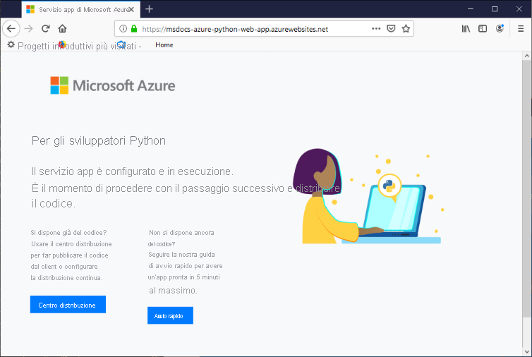

# <a name="configure-a-linux-python-app-for-azure-app-service"></a>Configurare un'app Python in Linux per il servizio app di Azure

Questo articolo descrive il modo in cui il [servizio app di Azure](overview.md) esegue le app Python e come è possibile personalizzare il comportamento del servizio app quando è necessario. Le app Python devono essere distribuite con tutti i moduli [pip](https://pypi.org/project/pip/) richiesti.

Il motore di distribuzione del servizio app attiva automaticamente un ambiente virtuale ed esegue `pip install -r requirements.txt` quando si distribuisce un [repository Git](deploy-local-git.md) o un [pacchetto ZIP](deploy-zip.md).

Questa guida illustra i concetti chiave e le istruzioni per gli sviluppatori Python che usano un contenitore Linux predefinito nel servizio app. Se il servizio app di Azure non è mai stato usato, seguire per prima cosa la [guida di avvio rapido su Python](quickstart-python.md) e l'[esercitazione su Python con PostgreSQL](tutorial-python-postgresql-app.md).

Per la configurazione, è possibile usare il [portale di Azure](https://portal.azure.com) o l'interfaccia della riga di comando di Azure:

- **Portale di Azure** : usare la pagina **Impostazioni** > **Configurazione** dell'app, come descritto in [Configurare un'app del servizio app nel portale di Azure](configure-common.md).

- **Interfaccia della riga di comando di Azure** : sono disponibili due opzioni.

    - Eseguire i comandi di [Azure Cloud Shell](../cloud-shell/overview.md), che è possibile aprire con il pulsante **Prova** nell'angolo in alto a destra dei blocchi di codice.
    - Eseguire i comandi in locale installando l'ultima versione dell'[interfaccia della riga di comando di Azure](/cli/azure/install-azure-cli), quindi accedere ad Azure usando [az login](/cli/azure/reference-index#az-login).
    
> [!NOTE]
> Linux è attualmente la soluzione consigliata per l'esecuzione di app Python nel servizio app. Per informazioni sulla possibilità di usare Windows, vedere [Python per la versione Windows del servizio app ](/visualstudio/python/managing-python-on-azure-app-service).

## <a name="configure-python-version"></a>Configurare la versione di Python

- **Portale di Azure** : usare la scheda **Impostazioni generali** nella pagina **Configurazione** , come descritto in [Configurare le impostazioni generali](configure-common.md#configure-general-settings) per contenitori Linux.

- **Interfaccia della riga di comando di Azure** :

    -  visualizzare la versione corrente di Python con [az webapp config show](/cli/azure/webapp/config#az_webapp_config_show):
    
        ```azurecli-interactive
        az webapp config show --resource-group <resource-group-name> --name <app-name> --query linuxFxVersion
        ```
        
        Sostituire `<resource-group-name>` e `<app-name>` con i valori appropriati per l'app Web.
    
    - Impostare la versione di Python con [az webapp config set](/cli/azure/webapp/config#az_webapp_config_set)
        
        ```azurecli-interactive
        az webapp config set --resource-group <resource-group-name> --name <app-name> --linux-fx-version "PYTHON|3.7"
        ```
    
    - Visualizzare tutte le versioni di Python supportate nel servizio app di Azure con [az webapp list-runtimes](/cli/azure/webapp#az_webapp_list_runtimes):
    
        ```azurecli-interactive
        az webapp list-runtimes --linux | grep PYTHON
        ```
    
È possibile eseguire una versione non supportata di Python creando un'immagine del contenitore personalizzata. Per altre informazioni, vedere [Usare un'immagine Docker personalizzata](tutorial-custom-container.md?pivots=container-linux).

<!-- <a> element here to preserve external links-->
<a name="access-environment-variables"></a>

## <a name="customize-build-automation"></a>Personalizzare l'automazione della compilazione

Il sistema di compilazione del servizio app, Oryx, esegue i passaggi seguenti quando si distribuisce l'app usando pacchetti Git o ZIP:

1. Esegue uno script di pre-compilazione personalizzato se specificato dall'impostazione `PRE_BUILD_COMMAND`.
1. Eseguire `pip install -r requirements.txt`. Il file *requirements.txt* deve essere presente nella cartella radice del progetto. In caso contrario, il processo di compilazione segnala l'errore con un messaggio analogo al seguente: "Non è stato possibile trovare setup.py o requirements.txt; l'installazione di pip non verrà eseguita".
1. Se nella radice del repository viene trovato *manage.py* (che indica un'app Django), esegue *manage.py collectstatic* . Tuttavia, se l'impostazione `DISABLE_COLLECTSTATIC` è `true`, questo passaggio viene ignorato.
1. Esegue uno script di post-compilazione personalizzato se specificato dall'impostazione `POST_BUILD_COMMAND`.

Per impostazione predefinita, le impostazioni `PRE_BUILD_COMMAND`, `POST_BUILD_COMMAND` e `DISABLE_COLLECTSTATIC` sono vuote. 

- Per disabilitare l'esecuzione di collectstatic durante la compilazione di app Django, impostare `DISABLE_COLLECTSTATIC` su true.

- Per eseguire i comandi di pre-compilazione, impostare `PRE_BUILD_COMMAND` in modo che contenga un comando, come `echo Pre-build command`, o il percorso di un file script relativo alla radice del progetto, ad esempio `scripts/prebuild.sh`. Tutti i comandi devono usare percorsi relativi alla cartella radice del progetto.

- Per eseguire i comandi di post-compilazione, impostare `POST_BUILD_COMMAND` in modo che contenga un comando, come `echo Post-build command`, o il percorso di un file di script relativo alla radice del progetto, ad esempio `scripts/postbuild.sh`. Tutti i comandi devono usare percorsi relativi alla cartella radice del progetto.

Per altre impostazioni che personalizzano l'automazione della compilazione, vedere [Configurazione di Oryx](https://github.com/microsoft/Oryx/blob/master/doc/configuration.md). 

Per altre informazioni sull'esecuzione del servizio app e sulla compilazione di app Python in Linux, vedere [come vengono rilevate e compilate le app Python in Oryx](https://github.com/microsoft/Oryx/blob/master/doc/runtimes/python.md).

> [!NOTE]
> Le impostazioni `PRE_BUILD_SCRIPT_PATH` e `POST_BUILD_SCRIPT_PATH` sono identiche a `PRE_BUILD_COMMAND` e `POST_BUILD_COMMAND` e sono supportate per motivi di compatibilità legacy.
> 
> Un'impostazione denominata `SCM_DO_BUILD_DURING_DEPLOYMENT`, se contiene `true` o 1, attiva una compilazione Oryx durante la distribuzione. L'impostazione è true quando si esegue la distribuzione usando git, il comando `az webapp up` dell'interfaccia della riga di comando di Azure e Visual Studio Code.

> [!NOTE]
> Usare sempre percorsi relativi negli script di pre- e post-compilazione, perché il contenitore di compilazione in cui viene eseguito Oryx è diverso dal contenitore di runtime in cui viene eseguita l'app. Non fare mai affidamento sul posizionamento esatto della cartella di progetto dell'app all'interno del contenitore, ad esempio che si trova in *site/wwwroot* .

## <a name="production-settings-for-django-apps"></a>Impostazioni di produzione per le app Django

Per un ambiente di produzione come il servizio app di Azure, le app Django devono seguire l'[elenco di controllo della distribuzione ](https://docs.djangoproject.com/en/3.1/howto/deployment/checklist/) di Django (djangoproject.com).

La tabella seguente descrive le impostazioni di produzione pertinenti per Azure. Queste impostazioni sono definite nel file *setting.py* dell'app.

| Impostazione di Django | Istruzioni per Azure |
| --- | --- |
| `SECRET_KEY` | Archiviare il valore in un'impostazione del servizio app, come descritto in [Accedere alle impostazioni dell'app come variabili di ambiente](#access-app-settings-as-environment-variables). In alternativa, è possibile [archiviare il valore come "segreto" in Azure Key Vault](/azure/key-vault/secrets/quick-create-python). |
| `DEBUG` | Creare un'impostazione `DEBUG` nel servizio app con il valore 0 (false), quindi caricare il valore come variabile di ambiente. Nell'ambiente di sviluppo creare una variabile di ambiente `DEBUG` con il valore 1 (true). |
| `ALLOWED_HOSTS` | In produzione, Django richiede di includere l'URL dell'app nella matrice `ALLOWED_HOSTS` di *settings-py* . È possibile recuperare questo URL in fase di esecuzione con il codice `os.environ['WEBSITE_HOSTNAME']`. Il servizio app imposta automaticamente la variabile di ambiente `WEBSITE_HOSTNAME` sull'URL dell'app. |
| `DATABASES` | Definire le impostazioni nel servizio app per la connessione al database e caricarle come variabili di ambiente per popolare il dizionario [`DATABASES`](https://docs.djangoproject.com/en/3.1/ref/settings/#std:setting-DATABASES). In alternativa, è possibile archiviare i valori, in particolare il nome utente e la password, come [segreti di Azure Key Vault](/azure/key-vault/secrets/quick-create-python). |

## <a name="container-characteristics"></a>Caratteristiche del contenitore

Quando vengono distribuite nel servizio app, le app Python vengono eseguite in un contenitore Docker Linux definito nel [repository GitHub di Python per il servizio app](https://github.com/Azure-App-Service/python). È possibile trovare le configurazioni delle immagini all'interno delle directory specifiche della versione.

Questo contenitore presenta le caratteristiche seguenti:

- Le app vengono eseguite con il [Server HTTP WSGI Gunicorn](https://gunicorn.org/), usando gli argomenti aggiuntivi `--bind=0.0.0.0 --timeout 600`.
    - È possibile specificare le impostazioni di configurazione per Gunicorn tramite un file *gunicorn.conf.py* nella radice del progetto, come descritto nella [panoramica della configurazione di Gunicorn](https://docs.gunicorn.org/en/stable/configure.html#configuration-file) (docs.gunicorn.org). In alternativa, è possibile [personalizzare il comando di avvio](#customize-startup-command).

    - Per proteggere l'app Web da attacchi DDOS accidentali o intenzionali, Gunicorn viene eseguito dietro un proxy inverso Nginx, come descritto nell'articolo sulla [distribuzione di Gunicorn](https://docs.gunicorn.org/en/latest/deploy.html) (docs.gunicorn.org).

- Per impostazione predefinita, l'immagine di base del contenitore include solo il framework Web Flask, ma il contenitore supporta altri framework conformi a WSGI e compatibili con Python 3.6 e versioni successive, come ad esempio Django.

- Per installare altri pacchetti, ad esempio Django, creare un file [*requirements.txt*](https://pip.pypa.io/en/stable/user_guide/#requirements-files) nella radice del progetto che specifica le dipendenze dirette. Il servizio app quindi installa automaticamente queste dipendenze quando si distribuisce il progetto.

    Per l'installazione delle dipendenze, il file *requirements.txt* *deve* essere presente nella radice del progetto. In caso contrario, il processo di compilazione segnala l'errore con un messaggio analogo al seguente: "Non è stato possibile trovare setup.py o requirements.txt; l'installazione di pip non verrà eseguita". Se si verifica questo errore, verificare la posizione del file di requisiti.

- Il servizio app definisce automaticamente una variabile di ambiente denominata `WEBSITE_HOSTNAME` con l'URL dell'app Web, ad esempio `msdocs-hello-world.azurewebsites.net`. Definisce anche `WEBSITE_SITE_NAME` con il nome dell'app, ad esempio `msdocs-hello-world`. 
   
## <a name="container-startup-process"></a>Processo di avvio del contenitore

Durante l'avvio il servizio app in un contenitore Linux esegue i passaggi seguenti:

1. Usa un [comando di avvio personalizzato](#customize-startup-command), se specificato.
2. Verifica l'esistenza di un'[app Django](#django-app) e avvia Gunicorn, se rilevato.
3. Verifica l'esistenza di un'[app Flask](#flask-app) e avvia Gunicorn, se rilevato.
4. Se non vengono trovate altre app, avvia un'app predefinita integrata nel contenitore.

Le sezioni seguenti forniscono informazioni dettagliate aggiuntive su ogni opzione.

### <a name="django-app"></a>App Django

Per le app Django il servizio app cerca un file denominato `wsgi.py` all'interno del codice dell'app e quindi esegue Gunicorn usando il comando seguente:

```bash
# <module> is the name of the folder that contains wsgi.py
gunicorn --bind=0.0.0.0 --timeout 600 <module>.wsgi
```

Per avere un controllo più specifico sul comando di avvio, usare un [comando di avvio personalizzato](#customize-startup-command), sostituire `<module>` con il nome della cartella che contiene *wsgi.py* , quindi aggiungere un argomento `--chdir` se tale modulo non è presente nella radice del progetto. Ad esempio, se il file *wsgi.py* si trova in *knboard/backend/config* rispetto alla radice del progetto, usare gli argomenti `--chdir knboard/backend config.wsgi`.

Per abilitare la registrazione di produzione, aggiungere i parametri `--access-logfile` e `--error-logfile`, come illustrato negli esempi per i [comandi di avvio personalizzati](#customize-startup-command).

### <a name="flask-app"></a>App Flask

Per Flask il servizio app cerca un file denominato *application.py* o *app.py* e avvia Gunicorn come segue:

```bash
# If application.py
gunicorn --bind=0.0.0.0 --timeout 600 application:app

# If app.py
gunicorn --bind=0.0.0.0 --timeout 600 app:app
```

Se il modulo principale dell'app è contenuto in un file diverso, usare un nome diverso per l'oggetto app oppure se si vogliono fornire argomenti aggiuntivi a Gunicorn, usare un [comando di avvio personalizzato](#customize-startup-command).

### <a name="default-behavior"></a>Comportamento predefinito

Se il servizio app non trova un comando personalizzato, un'app Django o un'app Flask, verrà eseguita un'app predefinita di sola lettura che si trova nella cartella _opt/defaultsite_ . L'app predefinita è simile alla seguente:



## <a name="customize-startup-command"></a>Personalizzare un comando di avvio

Come accennato prima in questo articolo, è possibile specificare impostazioni personalizzate per Gunicorn tramite un file *gunicorn.conf.py* nella radice del progetto, come descritto nella [panoramica della configurazione di Gunicorn](https://docs.gunicorn.org/en/stable/configure.html#configuration-file).

Se tale configurazione non è sufficiente, è possibile controllare il comportamento di avvio del contenitore specificando un comando di avvio personalizzato oppure più comandi in un file di comandi di avvio. Per un file di comandi di avvio è possibile usare qualsiasi nome, ad esempio *startup.sh* , *startup.cmd* , *startup.txt* e così via.

Tutti i comandi devono usare percorsi relativi alla cartella radice del progetto.

Per specificare un comando di avvio o un file di comandi:

- **Portale di Azure** : selezionare la pagina **Configurazione** dell'app, quindi selezionare **Impostazioni generali** . Nel campo **Comando di avvio** inserire il testo completo del comando di avvio o il nome del file di comandi di avvio. Quindi selezionare **Salva** per applicare le modifiche. Vedere [Configurare le impostazioni generali](configure-common.md#configure-general-settings) per i contenitori Linux.

- **Interfaccia della riga di comando di Azure** : usare il comando [az webapp config set](/cli/azure/webapp/config#az_webapp_config_set) con il parametro `--startup-file` per impostare il comando di avvio o il file:

    ```azurecli-interactive
    az webapp config set --resource-group <resource-group-name> --name <app-name> --startup-file "<custom-command>"
    ```
        
    Sostituire `<custom-command>` con il testo completo del comando di avvio o con il nome del file di comandi di avvio.
        
Il servizio app ignora gli eventuali errori che possono verificarsi durante l'elaborazione di un comando di avvio o di un file, quindi continua il processo di avvio cercando le app Django e Flask. Se il comportamento non è quello previsto, verificare che il comando di avvio o il file sia privo di errori e che nel servizio app venga distribuito un file di comandi di avvio insieme al codice dell'app. Per altre informazioni, è anche possibile controllare i [log di diagnostica](#access-diagnostic-logs). Controllare anche la pagina **Diagnostica e risoluzione dei problemi** nel [portale di Azure](https://portal.azure.com).

### <a name="example-startup-commands"></a>Comandi di avvio di esempio

- **Argomenti Gunicorn aggiunti** : l'esempio seguente aggiunge `--workers=4` a una riga di comando di Gunicorn per l'avvio di un'app Django: 

    ```bash
    # <module-path> is the relative path to the folder that contains the module
    # that contains wsgi.py; <module> is the name of the folder containing wsgi.py.
    gunicorn --bind=0.0.0.0 --timeout 600 --workers=4 --chdir <module_path> <module>.wsgi
    ```    

    Per altre informazioni, vedere l'articolo relativo all'[esecuzione di Gunicorn](https://docs.gunicorn.org/en/stable/run.html) (docs.gunicorn.org).

- **Abilitare la registrazione di produzione per Django** : aggiungere gli argomenti `--access-logfile '-'` e `--error-logfile '-'` alla riga di comando:

    ```bash    
    # '-' for the log files means stdout for --access-logfile and stderr for --error-logfile.
    gunicorn --bind=0.0.0.0 --timeout 600 --workers=4 --chdir <module_path> <module>.wsgi --access-logfile '-' --error-logfile '-'
    ```    

    Questi log verranno visualizzati nel [flusso di registrazione del servizio app](#access-diagnostic-logs).

    Per altre informazioni, vedere l'articolo relativo alla [registrazione di Gunicorn](https://docs.gunicorn.org/en/stable/settings.html#logging) (docs.gunicorn.org).
    
- **Modulo principale Flask personalizzato** : per impostazione predefinita, il servizio app presuppone che il modulo principale di un'app Flask sia *application.py* o *app.py* . Se il modulo principale usa un nome diverso, è necessario personalizzare il comando di avvio. Ad esempio, se il modulo principale di un'app Flask è *hello.py* e l'oggetto app Flask in tale file è denominato `myapp`, il comando sarà come segue:

    ```bash
    gunicorn --bind=0.0.0.0 --timeout 600 hello:myapp
    ```
    
    Se il modulo principale è contenuto in una sottocartella, ad esempio `website`, specificare tale cartella con l'argomento `--chdir`:
    
    ```bash
    gunicorn --bind=0.0.0.0 --timeout 600 --chdir website hello:myapp
    ```
    
- **Usare un server non Gunicorn** : per usare un server Web diverso, ad esempio [aiohttp](https://aiohttp.readthedocs.io/en/stable/web_quickstart.html), usare il comando appropriato come comando di avvio o nel file di comandi di avvio:

    ```bash
    python3.7 -m aiohttp.web -H localhost -P 8080 package.module:init_func
    ```

## <a name="access-app-settings-as-environment-variables"></a>Accedere alle impostazioni dell'app come variabili di ambiente

Le impostazioni dell'app sono valori specificamente archiviati nel cloud, come descritto in [Configurare le impostazioni dell'app](configure-common.md#configure-app-settings). Queste impostazioni sono disponibili per il codice dell'app come variabili di ambiente e sono accessibili tramite il modello [os.environ](https://docs.python.org/3/library/os.html#os.environ) standard.

Se ad esempio è stata creata un'impostazione dell'app denominata `DATABASE_SERVER`, il codice seguente recupera il relativo valore:

```python
db_server = os.environ['DATABASE_SERVER']
```
    
## <a name="detect-https-session"></a>Rilevare una sessione HTTPS

Nel servizio app la [terminazione SSL](https://wikipedia.org/wiki/TLS_termination_proxy) (wikipedia.org) si verifica nei servizi di bilanciamento del carico di rete, per cui tutte le richieste HTTPS raggiungono l'app come richieste HTTP non crittografate. Se la logica dell'app deve controllare se le richieste degli utenti sono crittografate o meno, esaminare l'intestazione `X-Forwarded-Proto`.

```python
if 'X-Forwarded-Proto' in request.headers and request.headers['X-Forwarded-Proto'] == 'https':
# Do something when HTTPS is used
```

I framework Web più diffusi consentono di accedere alle informazioni `X-Forwarded-*` nel modello di app standard. In [CodeIgniter](https://codeigniter.com/)[is_https()](https://github.com/bcit-ci/CodeIgniter/blob/master/system/core/Common.php#L338-L365) controlla il valore di `X_FORWARDED_PROTO` per impostazione predefinita.

## <a name="access-diagnostic-logs"></a>Accedere ai log di diagnostica

[!INCLUDE [Access diagnostic logs](../../includes/app-service-web-logs-access-linux-no-h.md)]

Per accedere ai log tramite il portale di Azure, selezionare **Monitoraggio** > **Flusso di registrazione** nel menu sinistro dell'app.

## <a name="open-ssh-session-in-browser"></a>Aprire una sessione SSH nel browser

[!INCLUDE [Open SSH session in browser](../../includes/app-service-web-ssh-connect-builtin-no-h.md)]

## <a name="troubleshooting"></a>Risoluzione dei problemi

- **Dopo avere distribuito il codice app personalizzato viene visualizzata l'app predefinita.** L'app predefinita viene visualizzata perché il codice app personalizzato non è stato distribuito nel servizio app o perché il servizio app non è riuscito a trovare il codice app personalizzato e ha quindi eseguito l'app predefinita.

    - Riavviare il servizio app, attendere 15-20 secondi e verifica di nuovo l'app.
    
    - Assicurarsi di usare il servizio app per Linux anziché un'istanza basata su Windows. Dall'interfaccia della riga di comando di Azure, eseguire il comando `az webapp show --resource-group <resource-group-name> --name <app-name> --query kind`, sostituendo `<resource-group-name>` e `<app-service-name>` di conseguenza. L'output dovrebbe essere `app,linux`; in caso contrario, creare di nuovo il servizio app e scegliere Linux.
    
    - Usare SSH o la console Kudu per connettersi direttamente al servizio app e verificare che i file siano presenti in *site/wwwroot* . Se i file non sono presenti, controllare il processo di distribuzione e ridistribuire l'app.
    
    - Se i file sono presenti, il servizio app non è riuscito a identificare il file di avvio specifico. Verificare che l'app sia strutturata come prevista dal servizio app per [Django](#django-app) o [Flask](#flask-app) oppure usare un [comando di avvio personalizzato](#customize-startup-command).

- **Nel browser viene visualizzato il messaggio "Servizio non disponibile".** Si è verificato un timeout del browser durante l'attesa di una risposta dal servizio app, che indica che il servizio app ha avviato il server Gunicorn, ma gli argomenti che specificano il codice app non sono corretti.

    - Aggiornare il browser, in particolare se si usano i piani tariffari inferiori nel piano di servizio app. Ad esempio, l'avvio dell'app potrebbe richiedere più tempo quando si usano i livelli gratuiti e l'app potrebbe rispondere dopo l'aggiornamento del browser.

    - Verificare che l'app sia strutturata come prevista dal servizio app per [Django](#django-app) o [Flask](#flask-app) oppure usare un [comando di avvio personalizzato](#customize-startup-command).

    - Esaminare il [flusso di registrazione](#access-diagnostic-logs) per rilevare eventuali messaggi di errore.

- **Il flusso di registrazione visualizza un messaggio analogo a "Non è stato possibile trovare setup.py o requirements.txt; l'installazione di pip non verrà eseguita".** : il processo di compilazione Oryx non è riuscito a trovare il file *requirements.txt* .

    - Usare SSH o la console Kudu per connettersi direttamente al servizio app e verificare che il file *requirements.txt* sia presente in *site/wwwroot* . Se non è presente, assicurarsi che esista nel repository e che venga incluso nella distribuzione. Se è disponibile in una cartella separata, spostarlo nella radice.

## <a name="next-steps"></a>Passaggi successivi

> [!div class="nextstepaction"]
> [Esercitazione: App Python con PostgreSQL](tutorial-python-postgresql-app.md)

> [!div class="nextstepaction"]
> [Esercitazione: Eseguire la distribuzione da un repository di contenitore privato](tutorial-custom-container.md?pivots=container-linux)

> [!div class="nextstepaction"]
> [Domande frequenti sul Servizio app di Azure in Linux](faq-app-service-linux.md)
