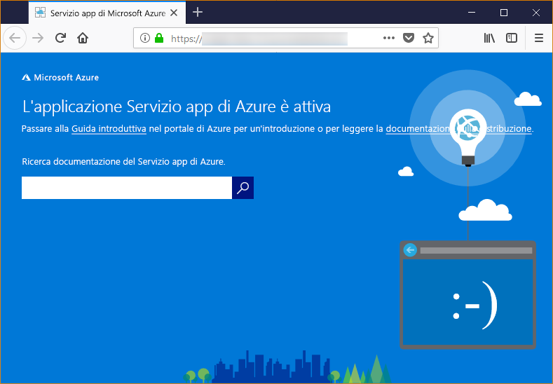

# <a name="configure-your-python-app-for-the-azure-app-service-on-linux"></a>Configurare un'app Python per il Servizio app di Azure in Linux

Questo articolo descrive il modo in cui il [Servizio app di Azure in Linux](app-service-linux-intro.md) esegue le app Python e come è possibile personalizzare il comportamento del servizio app quando è necessario.

## <a name="container-characteristics"></a>Caratteristiche del contenitore

Le app Python distribuite nel servizio app in Linux vengono eseguite all'interno di un contenitore Docker definito nel repository GitHub, [contenitore Azure-App-Service/python](https://github.com/Azure-App-Service/python/tree/master/3.7.0).

Questo contenitore presenta le caratteristiche seguenti:

- L'immagine del contenitore di base è `python-3.7.0-slim-stretch`, che indica che le app vengono eseguite con Python 3.7. Se è necessaria una versione diversa di Python, è necessario compilare e distribuire un'immagine del contenitore personalizzata. Per altre informazioni, vedere [Usare un'immagine Docker personalizzata per l'app Web per contenitori](tutorial-custom-docker-image.md).

- Le app vengono eseguite con il [Server HTTP WSGI Gunicorn](http://gunicorn.org/), usando gli argomenti aggiuntivi `--bind=0.0.0.0 --timeout 600`.

- Per impostazione predefinita, l'immagine di base include il framework Web Flask, ma il contenitore supporta altri framework conformi a WSGI e compatibili con Python 3.7 come ad esempio Django.

- Per installare pacchetti aggiuntivi, ad esempio Django, creare un file [*requirements.txt*](https://pip.pypa.io/en/stable/user_guide/#requirements-files) nella radice del progetto con `pip freeze > requirements.txt`. Pubblicare quindi il progetto nel servizio app con la distribuzione Git, che esegue automaticamente `pip install -r requirements.txt` nel contenitore per installare le dipendenze dell'app.

## <a name="container-startup-process-and-customizations"></a>Processo di avvio di contenitore e personalizzazioni

Durante l'avvio il servizio app in un contenitore Linux esegue i passaggi seguenti:

1. Cerca e applica un comando di avvio personalizzato, se specificato.
1. Verifica l'esistenza del file *wsgi.py* dell'app Django e, se presente, avvia Gunicorn usando tale file.
1. Verifica la presenza di un file denominato *application.py* e, se presente, avvia Gunicorn usando `application:app` presupponendo che sia un'app Flask.
1. Se non vengono trovate altre app, avvia un'app predefinita integrata nel contenitore.

Le sezioni seguenti forniscono informazioni dettagliate aggiuntive su ogni opzione.

### <a name="django-app"></a>App Django

Per le app Django il servizio app cerca un file denominato `wsgi.py` all'interno del codice dell'app e quindi esegue Gunicorn usando il comando seguente:

```bash
# <module> is the path to the folder containing wsgi.py
gunicorn --bind=0.0.0.0 --timeout 600 <module>.wsgi
```

Se si vuole un controllo più specifico sul comando di avvio, usare un [comando di avvio personalizzato](#custom-startup-command) e sostituire `<module>` con il nome del modulo che contiene *wsgi.py*.

### <a name="flask-app"></a>App Flask

Per Flask il servizio app cerca un file denominato *application.py* e avvia Gunicorn come segue:

```bash
gunicorn --bind=0.0.0.0 --timeout 600 application:app
```

Se il modulo principale dell'app è contenuto in un file diverso, usare un nome diverso per l'oggetto app oppure se si vogliono fornire argomenti aggiuntivi a Gunicorn, usare un [comando di avvio personalizzato](#custom-startup-command). Tale sezione fornisce un esempio di Flask con il codice di ingresso in *hello.py* e un oggetto app Flask denominato `myapp`.

### <a name="custom-startup-command"></a>Comando di avvio personalizzato

È possibile controllare il comportamento di avvio del contenitore specificando un comando di avvio Gunicorn personalizzato. Ad esempio, se si ha un'app Flask il cui modulo principale è *hello.py* e l'oggetto app Flask è denominato `myapp`, il comando sarà come segue:

```bash
gunicorn --bind=0.0.0.0 --timeout 600 hello:myapp
```

È anche possibile aggiungere altri argomenti per Gunicorn al comando, ad esempio `--workers=4`. Per altre informazioni, vedere l'articolo relativo all'[esecuzione di Gunicorn](http://docs.gunicorn.org/en/stable/run.html) (docs.gunicorn.org).

Per fornire un comando personalizzato, eseguire i passaggi seguenti:

1. Passare alla pagina [Impostazioni applicazione](../web-sites-configure.md?toc=%2fazure%2fapp-service%2fcontainers%2ftoc.json) nel portale di Azure.

1. Nelle impostazioni **Runtime** impostare l'opzione **Stack** su **Python 3.7** e immettere il comando direttamente nel campo **File di avvio**.

    In alternativa, è possibile salvare il comando in un file di testo nella radice del progetto, usando un nome simile a *startup.txt* (o qualsiasi nome desiderato). Distribuire quindi tale file nel servizio app e specificare il nome del file nel campo **File di avvio**. Questa opzione consente di gestire il comando all'interno del repository del codice sorgente anziché tramite il portale di Azure.

1. Selezionare **Salva**. Il servizio app viene riavviato automaticamente e dopo alcuni secondi viene visualizzato il comando di avvio personalizzato applicato.

> [!Note]
> Il servizio app ignora gli eventuali errori che possono verificarsi durante l'elaborazione di un file di comando personalizzato, quindi continua il processo di avvio cercando le app Django e Flask. Se non viene visualizzato il comportamento previsto, verificare che il file di avvio sia stato distribuito nel servizio app e che non contenga errori.

### <a name="default-behavior"></a>Comportamento predefinito

Se il servizio app non trova un comando personalizzato, un'app Django o un'app Flask, verrà eseguita un'app predefinita di sola lettura che si trova nella cartella _opt/defaultsite_. L'app predefinita è simile alla seguente:



## <a name="troubleshooting"></a>risoluzione dei problemi

- **Dopo avere distribuito il codice app personalizzato viene visualizzata l'app predefinita.**  L'app predefinita viene visualizzata perché il codice app personalizzato non è stato distribuito effettivamente nel servizio app o perché il servizio app non è riuscito a trovare il codice app personalizzato e ha quindi eseguito l'app predefinita.
  - Riavviare il servizio app, attendere 15-20 secondi e verifica di nuovo l'app.
  - Usare SSH o la console Kudu per connettersi direttamente al servizio app e verificare che i file siano presenti in *site/wwwroot*. Se i file non sono presenti, controllare il processo di distribuzione e ridistribuire l'app.
  - Se i file sono presenti, il servizio app non è riuscito a identificare il file di avvio specifico. Verificare che l'app sia strutturata come prevista dal servizio app per [Django](#django-app) o [Flask](#flask-app) oppure usare un [comando di avvio personalizzato](#custom-startup-command).

- **Nel browser viene visualizzato il messaggio "Servizio non disponibile".** Si è verificato un timeout del browser durante l'attesa di una risposta dal servizio app, che indica che il servizio app ha avviato il server Gunicorn, ma gli argomenti che specificano il codice app non sono corretti.
  - Aggiornare il browser, in particolare se si usano i piani tariffari inferiori nel piano di servizio app. Ad esempio, l'avvio dell'app potrebbe richiedere più tempo quando si usano i livelli gratuiti e l'app potrebbe rispondere dopo l'aggiornamento del browser.
  - Verificare che l'app sia strutturata come prevista dal servizio app per [Django](#django-app) o [Flask](#flask-app) oppure usare un [comando di avvio personalizzato](#custom-startup-command).
  - Usare SSH o la Console Kudu per connettersi al servizio app, quindi esaminare i log di diagnostica archiviati nella cartella *LogFiles*. Per altre informazioni sulla registrazione, vedere [Abilitare la registrazione diagnostica per le app Web nel servizio app di Azure](../web-sites-enable-diagnostic-log.md).
