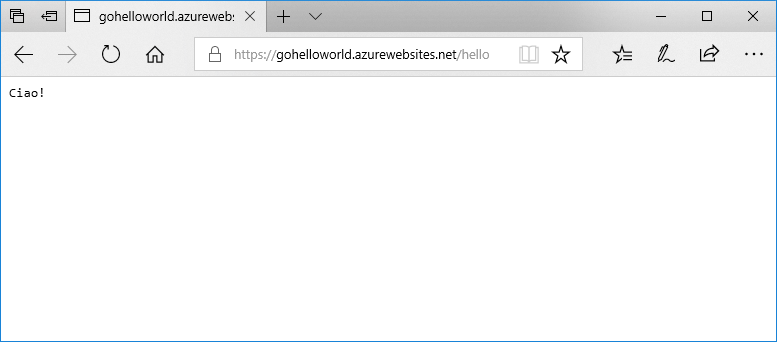

# <a name="deploy-a-dockergo-web-app-in-web-app-for-containers"></a>Distribuire un'app Web Docker/Go in app Web per contenitori

Il [servizio app Linux](app-service-linux-intro.md) fornisce stack di applicazioni predefiniti in Linux con il supporto per linguaggi quali .NET, PHP, Node.js e altri ancora. È anche possibile usare un'immagine Docker personalizzata per eseguire l'app Web in uno stack di applicazioni non ancora definito in Azure. Questa guida introduttiva mostra come creare un'app Web e distribuire un'immagine Go da Docker Hub. Creare l'app Web usando l'[interfaccia della riga di comando di Azure](https://docs.microsoft.com/cli/azure/get-started-with-azure-cli).



[!INCLUDE [quickstarts-free-trial-note](../../../includes/quickstarts-free-trial-note.md)]

[!INCLUDE [cloud-shell-try-it.md](../../../includes/cloud-shell-try-it.md)]

[!INCLUDE [Configure deployment user](../../../includes/configure-deployment-user.md)]

[!INCLUDE [Create resource group](../../../includes/app-service-web-create-resource-group.md)]

[!INCLUDE [Create app service plan](../../../includes/app-service-web-create-app-service-plan-linux.md)]

## <a name="create-a-web-app"></a>Creare un'app Web

Creare un'[app Web](../app-service-web-overview.md) nel piano di servizio app `myAppServicePlan` con il comando [az webapp create](/cli/azure/webapp?view=azure-cli-latest#az_webapp_create). Non dimenticare di sostituire `<app name>` con un nome univoco dell'app a livello globale.

```azurecli-interactive
az webapp create --resource-group myResourceGroup --plan myAppServicePlan --name <app name> --deployment-container-image-name microsoft/azure-appservices-go-quickstart
```

Nel comando precedente `--deployment-container-image-name` fa riferimento all'immagine Docker Hub pubblica [microsoft/azure-appservices-go-quickstart](https://hub.docker.com/r/microsoft/azure-appservices-go-quickstart/).

Dopo la creazione dell'app Web, l'interfaccia della riga di comando di Azure mostra un output simile all'esempio seguente:

```json
{
  "availabilityState": "Normal",
  "clientAffinityEnabled": true,
  "clientCertEnabled": false,
  "cloningInfo": null,
  "containerSize": 0,
  "dailyMemoryTimeQuota": 0,
  "defaultHostName": "<app name>.azurewebsites.net",
  "deploymentLocalGitUrl": "https://<username>@<app name>.scm.azurewebsites.net/<app name>.git",
  "enabled": true,
  < JSON data removed for brevity. >
}
```

## <a name="browse-to-the-app"></a>Passare all'app

```bash
http://<app_name>.azurewebsites.net/hello
```


**Congratulazioni** È stata distribuita un'immagine Docker che esegue un'applicazione Go in app Web per contenitori.

[!INCLUDE [Clean-up section](../../../includes/cli-script-clean-up.md)]

## <a name="next-steps"></a>Passaggi successivi

> [!div class="nextstepaction"]
> [Usare un'immagine Docker personalizzata](tutorial-custom-docker-image.md)
