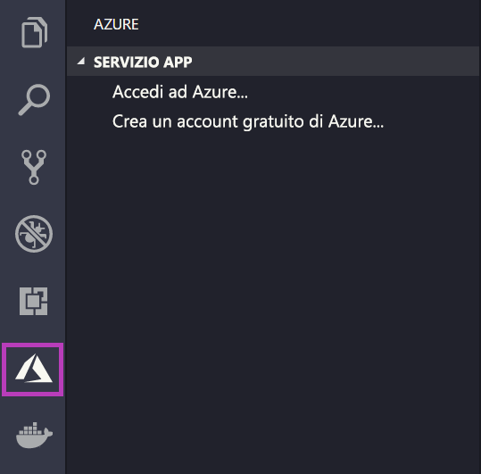
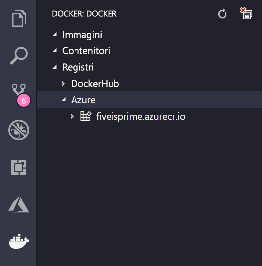

# <a name="deploy-a-custom-linux-container-to-azure-app-service"></a>Distribuire un contenitore Linux personalizzato nel servizio app di Azure

Il servizio app in Linux fornisce stack di applicazioni predefiniti in Linux con il supporto per linguaggi quali .NET, PHP, Node.js e altri ancora. È anche possibile usare un'immagine Docker personalizzata per eseguire l'app Web in uno stack di applicazioni non ancora definito in Azure. Questo argomento di avvio rapido illustra come distribuire un'immagine da un [Registro Azure Container](/azure/container-registry) al servizio app.

## <a name="prerequisites"></a>Prerequisiti

* Un [account Azure](https://azure.microsoft.com/free/?utm_source=campaign&utm_campaign=vscode-tutorial-docker-extension&mktingSource=vscode-tutorial-docker-extension)
* [Docker](https://www.docker.com/community-edition)
* [Visual Studio Code](https://code.visualstudio.com/)
* [Estensione Servizio app di Azure per VS Code](vscode:extension/ms-azuretools.vscode-azureappservice). È possibile usare questa estensione per creare, gestire e distribuire app Web Linux nella piattaforma distribuita come servizio (PaaS) di Azure.
* [Estensione Docker per VS Code](vscode:extension/ms-azuretools.vscode-docker). È possibile usare questa estensione per semplificare la gestione delle immagini e dei comandi Docker locali e per distribuire in Azure immagini di app compilate.

## <a name="create-an-image"></a>Creare un'immagine

Per completare questa guida di avvio rapido, è necessaria un'immagine dell'app Web appropriata archiviata in un [Registro Azure Container](/azure/container-registry). Seguire le istruzioni contenute nell'articolo [Avvio rapido: Creare un registro contenitori privato con il portale di Azure](/azure/container-registry/container-registry-get-started-portal), ma usare l'immagine `mcr.microsoft.com/azuredocs/go` anziché `hello-world`.

> [!IMPORTANT]
> Assicurarsi di impostare l'opzione **Utente amministratore** su **Abilita** durante la creazione del registro contenitori. È anche possibile impostare questa opzione dalla sezione **Chiavi di accesso** della pagina del registro nel portale di Azure. Questa impostazione è obbligatoria per l'accesso al servizio app.

## <a name="sign-in"></a>Accesso

Avviare quindi VS Code e accedere al proprio account Azure usando l'estensione Servizio app di Azure. A tale scopo, selezionare il logo di Azure sulla barra delle attività, passare allo strumento di esplorazione **SERVIZIO APP**, selezionare **Accedi ad Azure** e seguire le istruzioni.



## <a name="check-prerequisites"></a>Verificare i prerequisiti

È ora possibile verificare che tutti i prerequisiti siano installati e configurati correttamente.

In VS Code dovrebbero essere visualizzati l'indirizzo di posta elettronica di Azure sulla barra di stato e la sottoscrizione nello strumento di esplorazione **SERVIZIO APP**.

Verificare quindi che Docker sia installato e in esecuzione. Il comando seguente visualizzerà la versione di Docker, se è in esecuzione.

```bash
docker --version
```

Assicurarsi infine che Registro Azure Container sia connesso. A tale scopo, selezionare il logo Docker sulla barra delle attività e quindi passare a **REGISTRIES** (REGISTRI).



## <a name="deploy-the-image-to-azure-app-service"></a>Distribuire l'immagine nel Servizio app di Azure

Ora che tutto è configurato, è possibile distribuire l'immagine nel [Servizio app di Azure](https://azure.microsoft.com/services/app-service/) direttamente dallo strumento di esplorazione dell'estensione Docker.

Individuare l'immagine nel nodo **Registries** (Registri) nello strumento di esplorazione **DOCKER** ed espanderla per visualizzarne i tag. Fare clic con il pulsante destro del mouse su un tag e quindi scegliere **Deploy Image to Azure App Service** (Distribuisci immagine nel Servizio app di Azure).

Da qui, seguire le istruzioni per scegliere una sottoscrizione, un nome di app univoco a livello globale, un gruppo di risorse e un piano di servizio app. Scegliere **B1 Basic** come piano tariffario e un'area.

Dopo la distribuzione, l'app è disponibile all'indirizzo `http://<app name>.azurewebsites.net`.

Un **gruppo di risorse** è una raccolta denominata di tutte le risorse dell'applicazione in Azure. Può contenere ad esempio un riferimento a un sito Web, a un database e a una funzione di Azure.

Un **piano di servizio app** definisce le risorse fisiche che verranno usate per ospitare il sito Web. Questa guida di avvio rapido usa un piano di hosting **Basic** nell'infrastruttura **Linux**, il che significa che il sito verrà ospitato in un computer Linux insieme ad altri siti Web. Se si inizia con il piano **Basic**, è possibile usare il portale di Azure per aumentare le prestazioni in modo che il proprio sia l'unico sito in esecuzione su un computer.

## <a name="browse-the-website"></a>Esplorare il sito Web

Durante la distribuzione viene visualizzato il pannello **Output** che indica lo stato dell'operazione. Al termine dell'operazione, trovare l'app creata nello strumento di esplorazione **SERVIZIO APP**,fare clic su di essa con il pulsante destro del mouse e quindi scegliere **Browse Website** (Esplora sito Web) per aprire il sito nel browser.

> [!div class="nextstepaction"]
> [Si è verificato un problema](https://www.research.net/r/PWZWZ52?tutorial=quickstart-docker&step=deploy-app)

## <a name="next-steps"></a>Passaggi successivi

L'argomento avvio rapido è stato completato.

Vedere ora le altre estensioni di Azure.

* [Cosmos DB](https://marketplace.visualstudio.com/items?itemName=ms-azuretools.vscode-cosmosdb)
* [Funzioni di Azure](https://marketplace.visualstudio.com/items?itemName=ms-azuretools.vscode-azurefunctions)
* [Strumenti dell'interfaccia della riga di comando di Azure](https://marketplace.visualstudio.com/items?itemName=ms-vscode.azurecli)
* [Strumenti di Azure Resource Manager](https://marketplace.visualstudio.com/items?itemName=msazurermtools.azurerm-vscode-tools)

In alternativa, è possibile ottenere tutte queste soluzioni installando il pacchetto di estensioni [Azure Tools](https://marketplace.visualstudio.com/items?itemName=ms-vscode.vscode-node-azure-pack).
