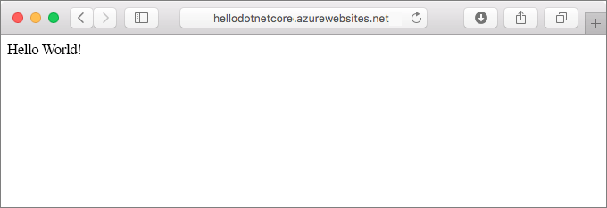
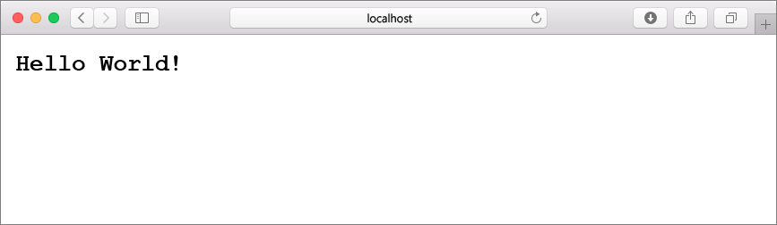
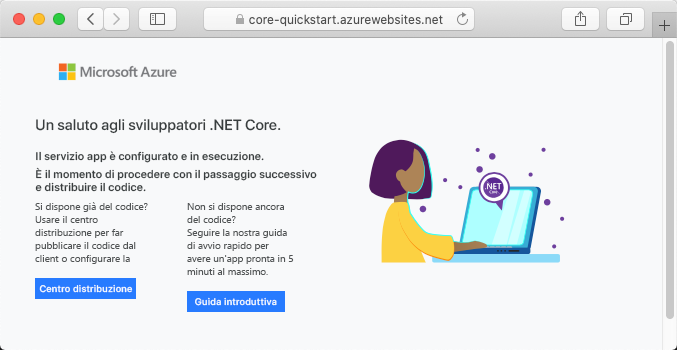
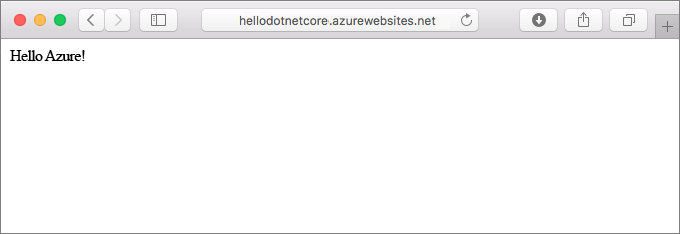
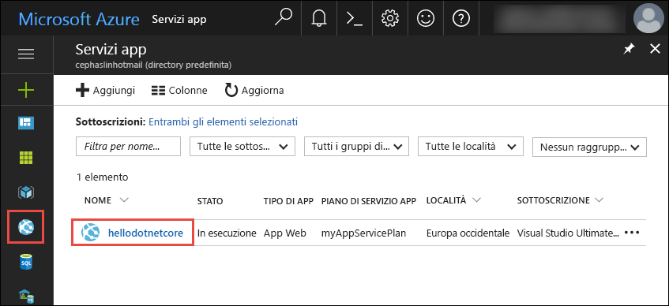
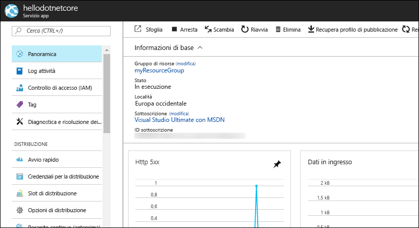

# <a name="create-a-net-core-web-app-in-app-service-on-linux"></a>Creare un'app Web .NET Core nel Servizio app in Linux

Il [Servizio app in Linux](app-service-linux-intro.md) offre un servizio di hosting Web con scalabilità elevata e funzioni di auto-correzione basato sul sistema operativo Linux. Questa guida introduttiva mostra come creare un'app [.NET Core](https://docs.microsoft.com/aspnet/core/) nel Servizio app in Linux. È necessario creare l'app Web usando l'[interfaccia della riga di comando di Azure](https://docs.microsoft.com/cli/azure/get-started-with-azure-cli) e Git per distribuire il codice Node.js nell'app Web.



È possibile eseguire queste procedure con un computer Mac, Windows o Linux.

## <a name="prerequisites"></a>Prerequisiti

Per completare questa guida introduttiva:

* [Installare Git](https://git-scm.com/)
* [Installare .NET Core SDK](https://www.microsoft.com/net/download/core)

[!INCLUDE [quickstarts-free-trial-note](../../../includes/quickstarts-free-trial-note.md)]

## <a name="create-the-app-locally"></a>Creare l'app in locale

In una finestra del terminale nel computer creare una directory denominata `hellodotnetcore` e passare dalla directory corrente a questa.

```bash
md hellodotnetcore
cd hellodotnetcore
```

Creare una nuova app Web .NET Core.

```bash
dotnet new web
```

## <a name="run-the-app-locally"></a>Eseguire l'app in locale

Ripristinare i pacchetti NuGet ed eseguire l'app.

```bash
dotnet restore
dotnet run
```

Aprire un Web browser e passare all'app all'indirizzo `http://localhost:5000`.

Nella pagina verrà visualizzato il messaggio **Hello World** dell'app di esempio.



Nella finestra del terminale premere **CTRL+C** per uscire dal server Web. Inizializzare un repository Git per il progetto .NET Core.

```bash
git init
git add .
git commit -m "first commit"
```

[!INCLUDE [cloud-shell-try-it.md](../../../includes/cloud-shell-try-it.md)]

[!INCLUDE [Configure deployment user](../../../includes/configure-deployment-user.md)]

[!INCLUDE [Create resource group](../../../includes/app-service-web-create-resource-group.md)]

[!INCLUDE [Create app service plan](../../../includes/app-service-web-create-app-service-plan-linux.md)]

## <a name="create-a-web-app-with-built-in-image"></a>Creare un'app Web con immagine incorporata

[!INCLUDE [Create web app](../../../includes/app-service-web-create-web-app-dotnetcore-no-h.md)]

Passare all'app Web appena creata. Sostituire _&lt;nome app>_ con un nome di app univoco.

```bash
http://<app name>.azurewebsites.net
```



[!INCLUDE [Push to Azure](../../../includes/app-service-web-git-push-to-azure.md)] 

```bash
Counting objects: 22, done.
Delta compression using up to 8 threads.
Compressing objects: 100% (18/18), done.
Writing objects: 100% (22/22), 51.21 KiB | 3.94 MiB/s, done.
Total 22 (delta 1), reused 0 (delta 0)
remote: Updating branch 'master'.
remote: Updating submodules.
remote: Preparing deployment for commit id '741f16d1db'.
remote: Generating deployment script.
remote: Project file path: ./hellodotnetcore.csproj
remote: Generated deployment script files
remote: Running deployment command...
remote: Handling ASP.NET Core Web Application deployment.
remote: ...............................................................................................
remote:   Restoring packages for /home/site/repository/hellodotnetcore.csproj...
remote: ....................................
remote:   Installing System.Xml.XPath 4.0.1.
remote:   Installing System.Diagnostics.Tracing 4.1.0.
remote:   Installing System.Threading.Tasks.Extensions 4.0.0.
remote:   Installing System.Reflection.Emit.ILGeneration 4.0.1.
remote:   ...
remote: Finished successfully.
remote: Running post deployment command(s)...
remote: Deployment successful.
To https://cephalin-dotnetcore.scm.azurewebsites.net/cephalin-dotnetcore.git
 * [new branch]      master -> master
```

## <a name="browse-to-the-app"></a>Passare all'app

Passare all'applicazione distribuita con il Web browser.

```bash
http://<app_name>.azurewebsites.net
```

Il codice di esempio Node.js è in esecuzione in un'app Web con immagine incorporata.


**Congratulazioni.** La distribuzione della prima app Node.js nel Servizio app in Linux è stata completata.

## <a name="update-and-redeploy-the-code"></a>Aggiornare e ridistribuire il codice

Nella directory locale aprire il file _Startup.cs_. Apportare una piccola modifica al testo nella chiamata al metodo `context.Response.WriteAsync`:

```csharp
await context.Response.WriteAsync("Hello Azure!");
```

Eseguire il commit delle modifiche in Git e quindi effettuare il push delle modifiche al codice in Azure.

```bash
git commit -am "updated output"
git push azure master
```

Al termine della distribuzione, tornare alla finestra del browser aperta nel passaggio **Passare all'app** e fare clic su Aggiorna.



## <a name="manage-your-new-azure-web-app"></a>Gestire la nuova app Web di Azure

Accedere al <a href="https://portal.azure.com" target="_blank">portale di Azure</a> per gestire l'app Web creata.

Nel menu a sinistra fare clic su **Servizi app** e quindi sul nome dell'app Web di Azure.



Verrà visualizzata la pagina di panoramica dell'app Web. Qui è possibile eseguire attività di gestione di base come l'esplorazione, l'arresto, l'avvio, il riavvio e l'eliminazione dell'app. 



Il menu a sinistra fornisce varie pagine per la configurazione dell'app. 

[!INCLUDE [cli-samples-clean-up](../../../includes/cli-samples-clean-up.md)]

## <a name="next-steps"></a>Passaggi successivi

> [!div class="nextstepaction"]
> [Creare un'app Web .NET Core e database SQL nel Servizio app di Azure in Linux](tutorial-dotnetcore-sqldb-app.md)
