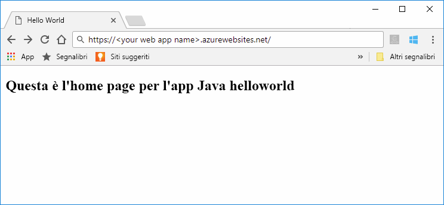
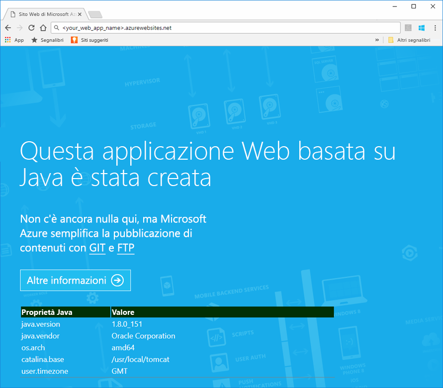
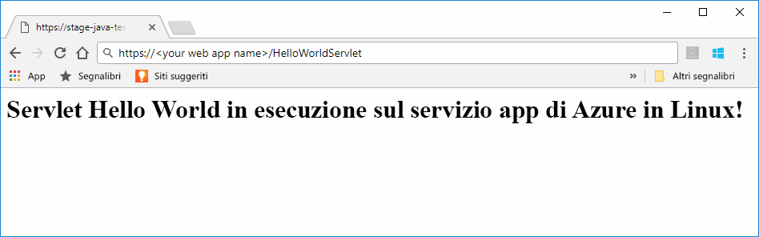
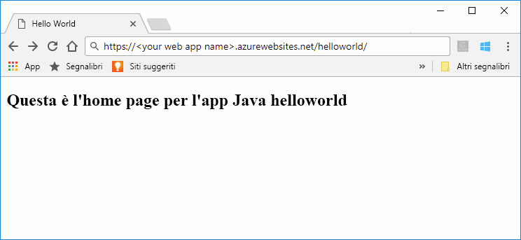
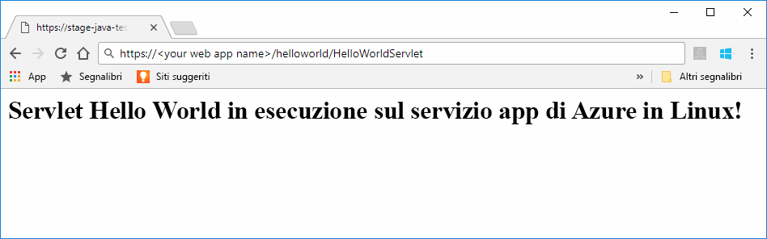

# <a name="preview-create-a-java-web-app-in-app-service-on-linux"></a>Anteprima: creare un'app Web Java nel servizio app in Linux

Il servizio app in Linux attualmente offre una funzionalità in anteprima per supportare app Web Java. Per altre informazioni sulle funzionalità in anteprima, vedere [Condizioni Supplementari per l'Utilizzo delle Anteprime di Microsoft Azure](https://azure.microsoft.com/support/legal/preview-supplemental-terms/). La [distribuzione di app Web Java in un contenitore Linux nel cloud con Azure Toolkit for IntelliJ](https://docs.microsoft.com/java/azure/intellij/azure-toolkit-for-intellij-hello-world-web-app-linux) costituisce un approccio alternativo alla distribuzione di un'app Java in un contenitore dell'utente.

> [!NOTE]
> Questo articolo consente di distribuire un'app Web Java nel servizio app in Linux.
>

Il [Servizio app in Linux](app-service-linux-intro.md) offre un servizio di hosting Web con scalabilità elevata e funzioni di auto-correzione basato sul sistema operativo Linux. Questa guida introduttiva illustra come distribuire un'app Java nel servizio app in Linux usando un'immagine predefinita. Si crea l'app Web con l'immagine predefinita usando l'[interfaccia della riga di comando di Azure](https://docs.microsoft.com/cli/azure/get-started-with-azure-cli) e si distribuisce l'app Java nell'app Web.



[!INCLUDE [quickstarts-free-trial-note](../../../includes/quickstarts-free-trial-note.md)]


## <a name="prerequisites"></a>prerequisiti

Per completare questa guida introduttiva: 

* È necessario disporre di una sottoscrizione di Azure. Se non si ha una sottoscrizione di Azure, creare un [account gratuito](https://azure.microsoft.com/free/?ref=microsoft.com&utm_source=microsoft.com&utm_medium=docs&utm_campaign=visualstudio) prima di iniziare.
* [Installare Git](https://git-scm.com/).
* [Installare Eclipse](https://www.eclipse.org/downloads/).


[!INCLUDE [cloud-shell-try-it.md](../../../includes/cloud-shell-try-it.md)]

[!INCLUDE [Configure deployment user](../../../includes/configure-deployment-user.md)]

[!INCLUDE [Create resource group](../../../includes/app-service-web-create-resource-group-linux.md)]

[!INCLUDE [Create app service plan](../../../includes/app-service-web-create-app-service-plan-linux.md)]


## <a name="create-a-web-app"></a>Creare un'app Web

In Cloud Shell creare un'[app Web](../app-service-web-overview.md) nel piano di servizio app `myAppServicePlan`. A tale scopo è possibile usare il comando [`az webapp create`](/cli/azure/webapp?view=azure-cli-latest#az_webapp_create). Nell'esempio seguente sostituire *\<nome_app>* con un nome app univoco globale. I caratteri validi sono `a-z`, `0-9` e `-`. 

```azurecli-interactive
az webapp create --name <app_name> --resource-group myResourceGroup --plan myAppServicePlan --runtime "TOMCAT|8.5-jre8"
```

Per il parametro **runtime** usare uno dei runtime seguenti:
 * TOMCAT|8.5-jre8
 * TOMCAT|9.0-jre8


Al termine della creazione dell'app Web, l'interfaccia della riga di comando di Azure visualizza informazioni simili all'esempio seguente:

```json
{
  "additionalProperties": {},
  "availabilityState": "Normal",
  "clientAffinityEnabled": true,
  "clientCertEnabled": false,
  "cloningInfo": null,
  "containerSize": 0,
  "dailyMemoryTimeQuota": 0,
  "defaultHostName": "<your web app name>.azurewebsites.net",
  "enabled": true,
  "enabledHostNames": [
    "<your web app name>.azurewebsites.net",
    "<your web app name>.scm.azurewebsites.net"
  ],
  "ftpPublishingUrl": "ftp://<your ftp URL>",  
  < JSON data removed for brevity. >
}
```

Copiare il valore di **ftpPublishingUrl**. Si userà in un secondo momento, se si sceglie la distribuzione tramite FTP.

Passare all'app Web appena creata.

```
http://<app_name>.azurewebsites.net
```

Se l'app Web è operativa, dovrebbe essere visualizzata una schermata predefinita simile all'immagine seguente:




## <a name="download-the-sample-java-app"></a>Scaricare l'app Java di esempio

In una finestra del terminale nel computer eseguire il comando seguente per clonare il repository dell'app di esempio nel computer locale. Questa app di esempio verrà distribuita in un passaggio successivo.

```bash
git clone https://github.com/Azure-Samples/java-docs-hello-world
```


## <a name="deploying-the-java-app-to-app-service-on-linux"></a>Distribuzione dell'app Java nel servizio app in Linux

Aprire il progetto di esempio in [Eclipse](https://www.eclipse.org/downloads/) ed [esportare l'app Java in un file di archivio Web (WAR) ](http://help.eclipse.org/kepler/index.jsp?topic=%2Forg.eclipse.wst.webtools.doc.user%2Ftopics%2Ftwcrewar.html) denominato `helloworld.war`.

Per distribuire il file WAR dell'app Java, è possibile usare WarDeploy (attualmente in [anteprima](https://azure.microsoft.com/support/legal/preview-supplemental-terms/)) o FTP.

A seconda del metodo di distribuzione usato, il percorso relativo per passare all'app Web Java sarà leggermente diverso.

### <a name="deploy-with-wardeploy"></a>Eseguire la distribuzione con WarDeploy 

Per distribuire il file WAR con WarDeploy, usare la riga di comando di esempio di cURL seguente per inviare una richiesta POST a *https://<your app name>.scm.azurewebsites.net/api/wardeploy*. La richiesta POST deve contenere il file WAR nel corpo del messaggio. Le credenziali di distribuzione per l'app vengono fornite nella richiesta usando l'autenticazione di base HTTP. Per altre informazioni su WarDeploy, vedere [Distribuire l'app nel servizio app di Azure con un file ZIP o WAR](../app-service-deploy-zip.md).

```bash
curl -X POST -u <username> --data-binary @"<war_file_path>" https://<app_name>.scm.azurewebsites.net/api/wardeploy
```

Aggiornare i valori seguenti.

* `username`: usare il nome utente delle credenziali di distribuzione create in precedenza.
* `war_file_path`: usare il percorso del file WAR locale.
* `app_name`: usare il nome dell'app creata in precedenza.

Eseguire il comando. Quando richiesto da cURL, digitare la password delle credenziali di distribuzione.

Passare all'applicazione distribuita usando l'URL seguente nel Web browser.

```bash
http://<app_name>.azurewebsites.net
```

Il codice di esempio Java è in esecuzione in un'app Web con l'immagine predefinita.


Passare al servlet con il Web browser.

```bash
http://<app_name>.azurewebsites.net/HelloWorldServlet
```

Il servlet è in esecuzione in un'app Web con l'immagine predefinita.




**Congratulazioni** La distribuzione della prima app Java nel servizio app in Linux è stata completata.


### <a name="ftp-deployment"></a>Distribuzione tramite FTP

In alternativa, è anche possibile distribuire il file WAR file con FTP. 

Distribuire tramite FTP il file nella directory */home/site/wwwroot/webapps* dell'app Web. La riga di comando di esempio seguente usa cURL:

```bash
curl -T war_file_path -u "app_name\username" ftp://webappFTPURL/site/wwwroot/webapps/
```

Aggiornare i valori seguenti.

* `war_file_path`: usare il percorso del file WAR locale.
* `app_name`: usare il nome dell'app creata in precedenza.
* `username`: usare il nome utente delle credenziali di distribuzione create in precedenza.
* `webappFTPURL`: usare il valore del **nome host FTP** per l'app Web copiato in precedenza. Il nome host FTP è riportato anche nel pannello **Panoramica** dell'app Web nel [portale di Azure](https://portal.azure.com/).

Eseguire il comando. Quando richiesto da cURL, digitare la password delle credenziali di distribuzione.


Passare all'applicazione distribuita usando l'URL seguente nel Web browser.

```bash
http://<app_name>.azurewebsites.net/helloworld
```

Il codice di esempio Java è in esecuzione in un'app Web con l'immagine predefinita.



Passare al servlet con il Web browser.

```bash
http://<app_name>.azurewebsites.net/helloworld/HelloWorldServlet
```

Il codice di esempio Java è in esecuzione in un'app Web con l'immagine predefinita.




**Congratulazioni** La distribuzione della prima app Java nel servizio app in Linux è stata completata.


[!INCLUDE [cli-samples-clean-up](../../../includes/cli-samples-clean-up.md)]


## <a name="next-steps"></a>Passaggi successivi

Per altre informazioni sull'uso di Java con Azure, vedere i collegamenti seguenti:

* [Azure per sviluppatori Java](https://docs.microsoft.com/java/azure/)
* [Distribuire un'app Web Hello World in un contenitore Linux sul cloud tramite Azure Toolkit for IntelliJ](https://docs.microsoft.com/java/azure/intellij/azure-toolkit-for-intellij-hello-world-web-app-linux)
* [Strumenti Java per Visual Studio Team Services](https://java.visualstudio.com/)
