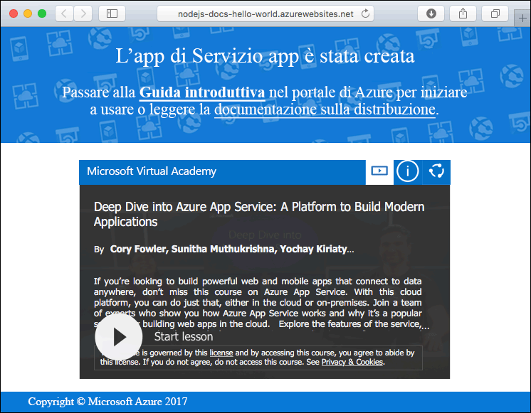
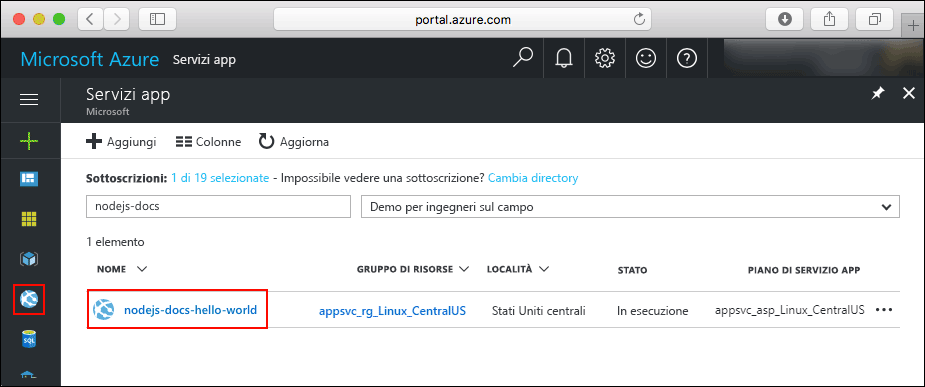
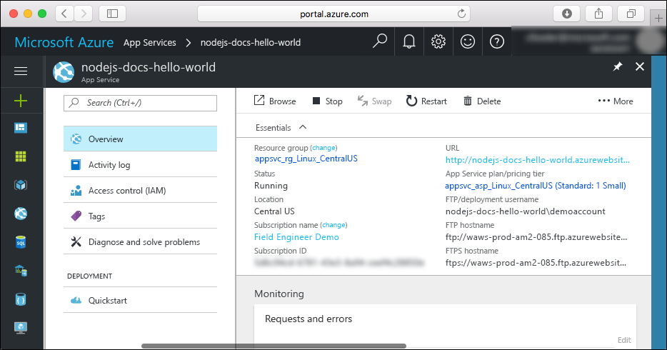

# <a name="create-a-nodejs-web-app-in-azure-app-service-on-linux"></a>Creare un'app Web Node.js nel Servizio app di Azure in Linux

> [!NOTE]
> Questo articolo consente di distribuire un'app nel servizio app in Linux. Per la distribuzione nel servizio app in _Windows_, vedere [Creare un'app Web Node.js in Azure](../app-service-web-get-started-nodejs.md).
>

Il [Servizio app in Linux](app-service-linux-intro.md) offre un servizio di hosting Web con scalabilità elevata e funzioni di auto-correzione basato sul sistema operativo Linux. Questa Guida introduttiva illustra come distribuire un'app Node.js nel Servizio app in Linux usando un'immagine incorporata. È necessario creare l'app Web con immagine incorporata usando l'[interfaccia della riga di comando di Azure](https://docs.microsoft.com/cli/azure/get-started-with-azure-cli) e Git per distribuire il codice Node.js nell'app Web.


È possibile seguire la procedura disponibile in questa esercitazione con un computer Mac, Windows o Linux. È anche possibile seguire [il video](#video) relativo all'argomento di questo articolo.

[!INCLUDE [quickstarts-free-trial-note](../../../includes/quickstarts-free-trial-note.md)]

## <a name="prerequisites"></a>prerequisiti

Per completare questa guida introduttiva:

* <a href="https://git-scm.com/" target="_blank">Installare Git</a>
* <a href="https://nodejs.org/" target="_blank">Installare Node.js e NPM</a>

## <a name="download-the-sample"></a>Scaricare l'esempio

In una finestra del terminale nel computer eseguire il comando seguente per clonare il repository dell'app di esempio nel computer locale.

```bash
git clone https://github.com/Azure-Samples/nodejs-docs-hello-world
```

Questa finestra del terminale dovrà essere usata per eseguire tutti i comandi presenti in questa guida introduttiva.

Passare alla directory contenente il codice di esempio.

```bash
cd nodejs-docs-hello-world
```

## <a name="run-the-app-locally"></a>Eseguire l'app in locale

Per eseguire l'applicazione in locale, aprire una finestra del terminale e usare lo script `npm start` per avviare il server HTTP Node.js predefinito.

```bash
npm start
```

Aprire un Web browser e passare all'app di esempio all'indirizzo `http://localhost:1337`.

Nella pagina verrà visualizzato il messaggio **Hello World** dell'app di esempio.


Nella finestra del terminale premere **CTRL+C** per uscire dal server Web.

[!INCLUDE [cloud-shell-try-it.md](../../../includes/cloud-shell-try-it.md)]

[!INCLUDE [Configure deployment user](../../../includes/configure-deployment-user.md)]

[!INCLUDE [Create resource group](../../../includes/app-service-web-create-resource-group-linux.md)]

[!INCLUDE [Create app service plan](../../../includes/app-service-web-create-app-service-plan-linux.md)]

## <a name="create-a-web-app"></a>Creare un'app Web

[!INCLUDE [Create web app](../../../includes/app-service-web-create-web-app-nodejs-linux-no-h.md)]

Passare all'app Web appena creata. Sostituire _&lt;app name>_ con il nome dell'app Web.

```bash
http://<app name>.azurewebsites.net
```

Ecco l'aspetto che avrà la nuova app Web:



[!INCLUDE [Push to Azure](../../../includes/app-service-web-git-push-to-azure.md)]

```bash
Counting objects: 23, done.
Delta compression using up to 4 threads.
Compressing objects: 100% (21/21), done.
Writing objects: 100% (23/23), 3.71 KiB | 0 bytes/s, done.
Total 23 (delta 8), reused 7 (delta 1)
remote: Updating branch 'master'.
remote: Updating submodules.
remote: Preparing deployment for commit id 'bf114df591'.
remote: Generating deployment script.
remote: Generating deployment script for node.js Web Site
remote: Generated deployment script files
remote: Running deployment command...
remote: Handling node.js deployment.
remote: Kudu sync from: '/home/site/repository' to: '/home/site/wwwroot'
remote: Copying file: '.gitignore'
remote: Copying file: 'LICENSE'
remote: Copying file: 'README.md'
remote: Copying file: 'index.js'
remote: Copying file: 'package.json'
remote: Copying file: 'process.json'
remote: Deleting file: 'hostingstart.html'
remote: Ignoring: .git
remote: Using start-up script index.js from package.json.
remote: Node.js versions available on the platform are: 4.4.7, 4.5.0, 6.2.2, 6.6.0, 6.9.1.
remote: Selected node.js version 6.9.1. Use package.json file to choose a different version.
remote: Selected npm version 3.10.8
remote: Finished successfully.
remote: Running post deployment command(s)...
remote: Deployment successful.
To https://<app_name>.scm.azurewebsites.net:443/<app_name>.git
 * [new branch]      master -> master
```

## <a name="browse-to-the-app"></a>Passare all'app

Passare all'applicazione distribuita con il Web browser.

```bash
http://<app_name>.azurewebsites.net
```

Il codice di esempio Node.js è in esecuzione in un'app Web con immagine incorporata.


**Congratulazioni** La distribuzione della prima app Node.js nel Servizio app in Linux è stata completata.

## <a name="update-and-redeploy-the-code"></a>Aggiornare e ridistribuire il codice

Nella directory locale aprire il file `index.js` nell'app Node.js e apportare una piccola modifica al testo nella chiamata a `response.end`:

```nodejs
response.end("Hello Azure!");
```

Eseguire il commit delle modifiche in Git e quindi effettuare il push delle modifiche al codice in Azure.

```bash
git commit -am "updated output"
git push azure master
```

Al termine della distribuzione, tornare alla finestra del browser aperta nel passaggio **Passare all'app** e fare clic su Aggiorna.


## <a name="manage-your-new-azure-web-app"></a>Gestire la nuova app Web di Azure

Accedere al <a href="https://portal.azure.com" target="_blank">portale di Azure</a> per gestire l'app Web creata.

Nel menu a sinistra fare clic su **Servizi app** e quindi sul nome dell'app Web di Azure.



Verrà visualizzata la pagina di panoramica dell'app Web. Qui è possibile eseguire attività di gestione di base come l'esplorazione, l'arresto, l'avvio, il riavvio e l'eliminazione dell'app. 



Il menu a sinistra fornisce varie pagine per la configurazione dell'app. 

[!INCLUDE [cli-samples-clean-up](../../../includes/cli-samples-clean-up.md)]

## <a name="video"></a>Video

>[!VIDEO https://www.youtube.com/embed/S9eqK7xPKqU]

## <a name="next-steps"></a>Passaggi successivi

> [!div class="nextstepaction"]
> [Node.js con MongoDB](tutorial-nodejs-mongodb-app.md)
