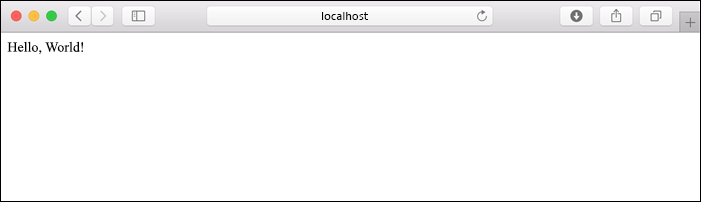

# <a name="quickstart-create-a-python-app-in-azure-app-service-on-linux"></a>Avvio rapido: Creare un'app Python nel Servizio app di Azure in Linux

In questa esercitazione dell'avvio rapido si distribuirà una semplice app Web Python nel [Servizio app in Linux](app-service-linux-intro.md), il servizio di hosting Web con scalabilità elevata e applicazione automatica di patch. Si userà l'[interfaccia della riga di comando di Azure](/cli/azure/install-azure-cli) locale in un computer Mac, Linux o Windows. L'app Web configurata usa un livello di servizio app Gratuito, affinché l'esecuzione delle procedure in questo articolo non comporti l'addebito di costi.

Se si preferisce distribuire le app tramite un IDE, vedere [Distribuire app Python nel Servizio app da Visual Studio Code](/azure/python/tutorial-deploy-app-service-on-linux-01).

## <a name="prerequisites"></a>Prerequisiti

- Sottoscrizione di Azure: [creare un account gratuito](https://azure.microsoft.com/free/?ref=microsoft.com&utm_source=microsoft.com&utm_medium=docs&utm_campaign=visualstudio)
- <a href="https://www.python.org/downloads/" target="_blank">Python 3.7</a> (è supportato anche Python 3.6)
- <a href="https://git-scm.com/downloads" target="_blank">Git</a>
- <a href="https://docs.microsoft.com/cli/azure/install-azure-cli" target="_blank">Interfaccia della riga di comando di Azure</a> 2.0.80 o versione successiva. Eseguire `az --version` per controllare la versione.

## <a name="download-the-sample"></a>Scaricare l'esempio

In una finestra del terminale eseguire il comando seguente per clonare l'applicazione di esempio nel computer locale. 

```terminal
git clone https://github.com/Azure-Samples/python-docs-hello-world
```

Passare quindi alla cartella:

```terminal
cd python-docs-hello-world
```

Il repository contiene un file *application.py*, che indica al Servizio app che il codice contiene un'app Flask. Per altre informazioni, vedere [Processo di avvio di contenitore e personalizzazioni](how-to-configure-python.md).

## <a name="run-the-sample"></a>Eseguire l'esempio

In una finestra del terminale usare i comandi seguenti (a seconda del sistema operativo in uso) per installare le dipendenze necessarie e avviare il server di sviluppo predefinito. 

# <a name="bash"></a>[Bash](#tab/bash)

```bash
python3 -m venv venv
source venv/bin/activate
pip install -r requirements.txt
export FLASK_APP=application.py
flask run
```

# <a name="powershell"></a>[PowerShell](#tab/powershell)

```powershell
py -3 -m venv env
env\scripts\activate
pip install -r requirements.txt
Set-Item Env:FLASK_APP ".\application.py"
flask run
```

# <a name="cmd"></a>[Cmd](#tab/cmd)

```cmd
py -3 -m venv env
env\scripts\activate
pip install -r requirements.txt
SET FLASK_APP=application.py
flask run
```

---

Aprire un Web browser e passare all'app di esempio all'indirizzo `http://localhost:5000/`. L'app visualizza il messaggio **Hello World!** .



Nella finestra del terminale premere **CTRL**+**C** per uscire dal server Web.

## <a name="sign-in-to-azure"></a>Accedere ad Azure

L'interfaccia della riga di comando di Azure offre molti comandi pratici che è possibile usare da un terminale locale per effettuare il provisioning e gestire le risorse di Azure dalla riga di comando. È possibile utilizzare i comandi per completare le stesse attività eseguite tramite il portale di Azure in un browser. È anche possibile usare i comandi dell'interfaccia della riga di comando negli script per automatizzare i processi di gestione.

Per eseguire i comandi di Azure nell'interfaccia della riga di comando di Azure, è prima necessario eseguire l'accesso usando il comando `az login`. Questo comando apre un browser per raccogliere le credenziali.

```azurecli
az login
```

## <a name="deploy-the-sample"></a>Distribuire l'esempio

Il comando [`az webapp up`](/cli/azure/webapp#az-webapp-up) crea l'app Web nel Servizio app e distribuisce il codice.

Nella cartella *python-docs-hello-world* che contiene il codice di esempio eseguire il comando `az webapp up` seguente. Sostituire `<app-name>` con un nome di app univoco globale (*i caratteri validi sono `a-z`, `0-9` e `-`* ).


```azurecli
az webapp up --sku F1 -n <app-name>
```
> [!CAUTION]
> Se si usa l'**interfaccia della riga di comando di Azure versione 2.5.0**, in `az webapp up` è presente una regressione per cui determinati scenari non riusciranno se non si include il parametro `-l <location-name>`. Questo problema viene [segnalato qui](https://github.com/Azure/azure-cli/issues/13257).  
> 
>Per controllare la versione dell'interfaccia della riga di comando di Azure in uso, eseguire il comando `az --version`.
>

Con l'argomento `--sku F1` l'app Web viene creata nel piano tariffario Gratuito. È possibile omettere questo argomento per usare un livello Premium, che però comporta un costo orario.

È possibile facoltativamente includere l'argomento `-l <location-name>` in cui `<location_name>` è un'area di Azure, come **centralus**, **eastasia**, **westeurope**, **koreasouth**, **brazilsouth**, **centralindia** e così via. Per recuperare un elenco di aree consentite per l'account Azure, è possibile eseguire il comando [`az account list-locations`](/cli/azure/appservice?view=azure-cli-latest.md#az-appservice-list-locations).

L'esecuzione del comando `az webapp up` può richiedere alcuni minuti. Durante l'esecuzione, il comando visualizza informazioni simili all'esempio seguente, in cui `<app-name>` corrisponde al nome specificato in precedenza:

<pre>
Creating Resource group 'appsvc_rg_Linux_centralus' ...
Resource group creation complete
Creating App service plan 'appsvc_asp_Linux_centralus' ...
App service plan creation complete
Creating app '&lt;app-name&gt;' ....
Configuring default logging for the app, if not already enabled
Creating zip with contents of dir D:\Examples\python-docs-hello-world ...
Getting scm site credentials for zip deployment
Starting zip deployment. This operation can take a while to complete ...
Deployment endpoint responded with status code 202
You can launch the app at http://&lt;app-name&gt;.azurewebsites.net
{
  "URL": "http://&lt;app-name&gt;.net",
  "appserviceplan": "appsvc_asp_Linux_centralus",
  "location": "eastus",
  "name": "&lt;app-name&gt;",
  "os": "Linux",
  "resourcegroup": "appsvc_rg_Linux_centralus",
  "runtime_version": "python|3.7",
  "runtime_version_detected": "-",
  "sku": "FREE",
  "src_path": "D:\\Examples\\python-docs-hello-world"
}
</pre>

[!INCLUDE [AZ Webapp Up Note](../../../includes/app-service-web-az-webapp-up-note.md)]

## <a name="browse-to-the-app"></a>Passare all'app

Passare all'applicazione distribuita nel Web browser all'URL `http://<app-name>.azurewebsites.net`.

Il codice di esempio Python esegue un contenitore Linux nel Servizio app usando un'immagine predefinita.


**Congratulazioni** La distribuzione dell'app Python nel Servizio app di Azure in Linux è stata completata.

## <a name="redeploy-updates"></a>Ridistribuire gli aggiornamenti

Nell'editor di codice preferito aprire *application.py* e aggiornare la funzione `hello` come indicato di seguito. Con questa modifica viene aggiunta un'istruzione `print` per generare l'output di registrazione da usare nella sezione successiva. 

```python
def hello():
    print("Handling request to home page.")
    return "Hello Azure!"
```

Salvare le modifiche e uscire dall'editor. 

Ridistribuire l'app usando di nuovo il comando `az webapp up`:

```azurecli
az webapp up
```

Questo comando usa i valori memorizzati nella cache nel file *.azure/config*, inclusi il nome dell'app, il gruppo di risorse e il piano di servizio app.

Al termine della distribuzione, tornare alla finestra del browser aperta per `http://<app-name>.azurewebsites.net` e aggiornare la pagina per visualizzare il messaggio modificato:


> [!TIP]
> Visual Studio Code offre estensioni potenti per Python e il Servizio app di Azure, al fine di semplificare il processo di distribuzione delle app Web Python nel Servizio app. Per altre informazioni, vedere [Distribuire app Python nel Servizio app di Azure in Linux da Visual Studio Code](/azure/python/tutorial-deploy-app-service-on-linux-01).

## <a name="stream-logs"></a>Eseguire lo streaming dei log

È possibile accedere ai log della console generati dall'interno dell'app e del contenitore in cui è in esecuzione. I log includono tutti gli output generati tramite le istruzioni `print`.

Per eseguire lo streaming dei log, usare il comando seguente:

```azurecli
az webapp log tail
```

Aggiornare l'app nel browser per generare i log della console, che includeranno righe simili al testo seguente. Se l'output non viene visualizzato immediatamente, riprovare dopo 30 secondi.

<pre>
2020-04-03T22:54:04.236405938Z Handling request to home page.
2020-04-03T22:54:04.236497641Z 172.16.0.1 - - [03/Apr/2020:22:54:04 +0000] "GET / HTTP/1.1" 200 12 "-" "Mozilla/5.0 (Windows NT 10.0; Win64; x64) AppleWebKit/537.36 (KHTML, like Gecko) Chrome/81.0.4044.83 Safari/537.36 Edg/81.0.416.41"
</pre>

È anche possibile esaminare i file di log nel browser all'indirizzo `https://<app-name>.scm.azurewebsites.net/api/logs/docker`.

Per interrompere lo streaming dei log in qualsiasi momento, digitare `Ctrl`+`C`.

## <a name="manage-the-azure-app"></a>Gestire l'app Azure

Accedere al <a href="https://portal.azure.com" target="_blank">portale di Azure</a> per gestire l'app creata. Cercare e selezionare **Servizi app**.


Selezionare il nome dell'app di Azure.


Verrà visualizzata la pagina Panoramica dell'app. Qui è possibile eseguire attività di gestione di base come l'esplorazione, l'arresto, l'avvio, il riavvio e l'eliminazione dell'app.


Nel menu del Servizio app sono disponibili varie pagine per la configurazione dell'app.

## <a name="clean-up-resources"></a>Pulire le risorse

Nei passaggi precedenti sono state create risorse di Azure in un gruppo di risorse. Il gruppo di risorse ha un nome simile a "appsvc_rg_Linux_CentralUS", a seconda della località scelta. Se si usa uno SKU del servizio app diverso dal livello F1 gratuito, per queste risorse verranno addebitati costi su base continuativa. Vedere [Prezzi di Servizio app](https://azure.microsoft.com/pricing/details/app-service/linux/).

Se non si prevede di usare queste risorse in futuro, eliminare il gruppo di risorse con il comando seguente, sostituendo `<resource-group-name>` con il gruppo di risorse riportato nell'output del comando `az webapp up`, ad esempio "appsvc_rg_Linux_centralus". L'esecuzione del comando può richiedere un minuto.

```azurecli
az group delete -n <resource-group-name>
```

## <a name="next-steps"></a>Passaggi successivi

> [!div class="nextstepaction"]
> [Esercitazione: App Web Python (Django) con PostgreSQL](tutorial-python-postgresql-app.md)

> [!div class="nextstepaction"]
> [Aggiungere l'accesso utente a un'app Web Python](../../active-directory/develop/quickstart-v2-python-webapp.md)

> [!div class="nextstepaction"]
> [Configurare un'app Python](how-to-configure-python.md)

> [!div class="nextstepaction"]
> [Esercitazione: Eseguire un'app Python in un contenitore personalizzato](tutorial-custom-docker-image.md)
