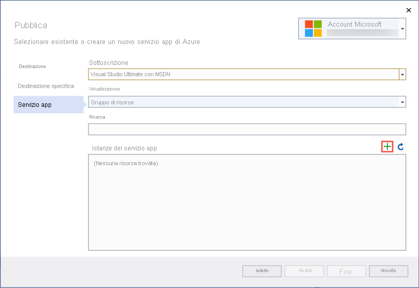
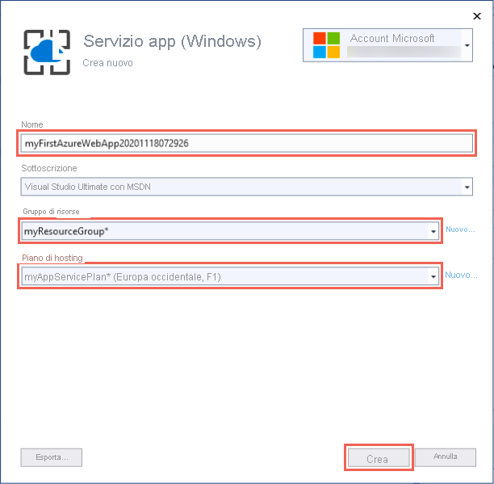
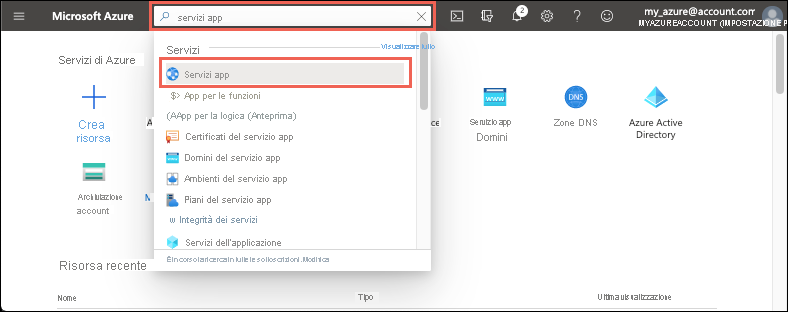

# <a name="quickstart-create-an-aspnet-core-web-app-in-azure"></a>Guida introduttiva: Creare un'app Web ASP.NET Core in Azure

::: zone pivot="platform-windows"  

Questo argomento di avvio rapido illustra come distribuire la prima app Web ASP.NET Core nel [Servizio app di Azure](overview.md). Il servizio app supporta app .NET 5.0.

Al termine, si avrà un gruppo di risorse di Azure costituito da un piano di hosting del servizio app e un servizio app con un'applicazione Web distribuita.

## <a name="prerequisites"></a>Prerequisiti

- Un account Azure con una sottoscrizione attiva. [Creare un account gratuitamente](https://azure.microsoft.com/free/dotnet/).
- Installare <a href="https://www.visualstudio.com/downloads/" target="_blank">Visual Studio 2019</a> con il carico di lavoro **Sviluppo ASP.NET e Web**.

  Se Visual Studio 2019 è già installato:

  - Installare gli aggiornamenti più recenti in Visual Studio selezionando **?**  > **Controlla aggiornamenti**. Gli aggiornamenti più recenti contengono .NET 5.0 SDK.
  - Aggiungere il carico di lavoro selezionando **Strumenti** > **Ottieni strumenti e funzionalità**.


## <a name="create-an-aspnet-core-web-app"></a>Creare un'app Web ASP.NET Core

Creare un'app Web ASP.NET Core in Visual Studio seguendo questa procedura:

# <a name="net-core-31"></a>[.NET Core 3.1](#tab/netcore31)

1. Aprire Visual Studio e selezionare **Crea un nuovo progetto**.

1. In **Crea un nuovo progetto** selezionare **Applicazione Web ASP.NET Core** e verificare che **C#** sia elencato nei linguaggi disponibili per tale scelta, quindi selezionare **Avanti**.

1. In **Configura il nuovo progetto** assegnare al progetto di applicazione Web il nome *myFirstAzureWebApp* e selezionare **Crea**.

   

1. È possibile distribuire qualsiasi tipo di app Web ASP.NET Core in Azure, ma per questo argomento di avvio rapido scegliere il modello **Applicazione Web**. Verificare che l'opzione **Autenticazione** sia impostata su **Nessuna autenticazione** e che non sia selezionata nessun'altra opzione. Scegliere quindi **Create** (Crea).

    
   
1. Nel menu di Visual Studio selezionare **Debug** > **Avvia senza eseguire debug** per eseguire l'app Web in locale.

   

# <a name="net-50"></a>[.NET 5.0](#tab/net50)

1. Aprire Visual Studio e selezionare **Crea un nuovo progetto**.

1. In **Crea un nuovo progetto** selezionare **Applicazione Web ASP.NET Core** e verificare che **C#** sia elencato nei linguaggi disponibili per tale scelta, quindi selezionare **Avanti**.

1. In **Configura il nuovo progetto** assegnare al progetto di applicazione Web il nome *myFirstAzureWebApp* e selezionare **Crea**.

   

1. Per un'app .NET 5.0, selezionare **ASP.NET Core 5.0** nell'elenco a discesa.

1. È possibile distribuire qualsiasi tipo di app Web ASP.NET Core in Azure, ma per questo argomento di avvio rapido scegliere il modello **App Web ASP.NET Core**. Verificare che l'opzione **Autenticazione** sia impostata su **Nessuna autenticazione** e che non sia selezionata nessun'altra opzione. Scegliere quindi **Create** (Crea).

    
   
1. Nel menu di Visual Studio selezionare **Debug** > **Avvia senza eseguire debug** per eseguire l'app Web in locale.

   

---

## <a name="publish-your-web-app"></a>Pubblicare l'app Web

Per pubblicare l'app Web, è necessario prima creare e configurare un nuovo servizio app in cui pubblicarla. 

Come parte della configurazione del servizio app, si creeranno:

- Un nuovo [gruppo di risorse](../azure-resource-manager/management/overview.md#terminology) che conterrà tutte le risorse di Azure per il servizio.
- Un nuovo [piano di hosting](./overview-hosting-plans.md) che specifica la località, le dimensioni e le funzionalità della server farm Web che ospita l'app.

Seguire questa procedura per creare il servizio app e pubblicare l'app Web:

1. In **Esplora soluzioni** fare clic con il pulsante destro del mouse sul progetto **myFirstAzureWebApp** e scegliere **Pubblica**. 

1. In **Pubblica** selezionare **Azure** e fare clic su **Avanti**.

1. Le opzioni disponibili variano a seconda che sia già stato eseguito l'accesso ad Azure e che si abbia un account di Visual Studio collegato a un account di Azure. Selezionare **Aggiungi un account** o **Accedi** per accedere alla sottoscrizione di Azure. Se è già stato effettuato l'accesso, selezionare l'account da usare.

   

1. A destra di **Istanze di Servizio app** fare clic su **+** .

   

1. Per **Sottoscrizione**, accettare la sottoscrizione elencata o sceglierne una nuova nell'elenco a discesa.

1. Per **Gruppo di risorse** selezionare **Nuovo**. In **Nome nuovo gruppo di risorse** immettere *myResourceGroup* e scegliere **OK**. 

1. Per **Piano di hosting** selezionare **Nuovo**. 

1. Nella finestra di dialogo **Piano di hosting: Crea nuovo** immettere i valori specificati nella tabella seguente:

   | Impostazione  | Valore consigliato | Descrizione |
   | -------- | --------------- | ----------- |
   | **Piano di hosting**  | *myFirstAzureWebAppPlan* | Nome del piano di servizio app. |
   | **Posizione**      | *Europa occidentale* | Data center in cui è ospitata l'app Web. |
   | **Dimensione**          | *Free* | [Piano tariffario](https://azure.microsoft.com/pricing/details/app-service/?ref=microsoft.com&utm_source=microsoft.com&utm_medium=docs&utm_campaign=visualstudio) che determina le funzionalità di hosting. |
   
   

1. In **Nome** immettere un nome univoco per l'app che includa solo i caratteri validi, ossia `a-z`, `A-Z`, `0-9` e `-`. È possibile accettare il nome univoco generato automaticamente. L'URL dell'app Web è `http://<app-name>.azurewebsites.net`, dove `<app-name>` è il nome dell'app.

2. Selezionare **Crea** per creare le risorse di Azure.

   

   Al termine della procedura guidata, le risorse di Azure vengono create automaticamente ed è possibile procedere alla pubblicazione.

3. Selezionare **Fine** per chiudere la procedura guidata.

1. Nella pagina **Pubblica** fare clic su **Pubblica**. Visual Studio compila, crea il pacchetto e pubblica l'app in Azure, quindi la avvia nel browser predefinito.

   

**Congratulazioni** L'app Web ASP.NET Core è ora in esecuzione nel servizio app di Azure.

## <a name="update-the-app-and-redeploy"></a>Aggiornare e ridistribuire l'app

Seguire questa procedura per aggiornare e ridistribuire l'app Web:

1. Nel progetto in **Esplora soluzioni** aprire **Pagine** > **Index.cshtml**.

1. Sostituire l'intero tag `<div>` con il codice seguente:

   ```html
   <div class="jumbotron">
       <h1>ASP.NET in Azure!</h1>
       <p class="lead">This is a simple app that we've built that demonstrates how to deploy a .NET app to Azure App Service.</p>
   </div>
   ```

1. Per la ridistribuzione in Azure, fare clic con il pulsante destro del mouse sul progetto **myFirstAzureWebApp** in **Esplora soluzioni** e selezionare **Pubblica**.

1. Nella pagina di riepilogo **Pubblica** selezionare **Pubblica**.

   <!--  -->

    Al termine del processo di pubblicazione, Visual Studio avvia un browser sull'URL dell'app Web.

    

## <a name="manage-the-azure-app"></a>Gestire l'app Azure

Per gestire l'app Web, passare al [portale di Azure](https://portal.azure.com), quindi cercare e selezionare **Servizi app**.



Nella pagina **Servizi app** selezionare il nome dell'app Web.

:::image type="content" source="./media/quickstart-dotnetcore/select-app-service.png" alt-text="Screenshot della pagina Servizi app con un'app Web di esempio selezionata.":::

La pagina **Panoramica** per l'app Web contiene le opzioni per la gestione di base, ad esempio Sfoglia, Arresta, Avvia, Riavvia ed Elimina. Il menu a sinistra include ulteriori pagine per la configurazione dell'app.


[!INCLUDE [Clean-up section](../../includes/clean-up-section-portal.md)]

## <a name="next-steps"></a>Passaggi successivi

In questo argomento di avvio rapido è stato usato Visual Studio per creare e distribuire un'app Web ASP.NET Core nel Servizio app di Azure.

Procedere con l'articolo successivo per informazioni su come creare un'app .NET Core e connetterla a un database SQL:

> [!div class="nextstepaction"]
> [ASP.NET Core con database SQL](tutorial-dotnetcore-sqldb-app.md)

> [!div class="nextstepaction"]
> [Configurare l'app ASP.NET Core](configure-language-dotnetcore.md)

::: zone-end  

::: zone pivot="platform-linux"
Il [Servizio app in Linux](overview.md#app-service-on-linux) offre un servizio di hosting Web con scalabilità elevata e funzioni di auto-correzione basato sul sistema operativo Linux. Questa guida introduttiva mostra come creare un'app [.NET Core](/aspnet/core/) nel Servizio app in Linux. È necessario creare l'app usando l'[interfaccia della riga di comando di Azure](/cli/azure/get-started-with-azure-cli) e GIT per distribuire il codice Node.js nell'app.


È possibile seguire la procedura disponibile in questo articolo con un computer Mac, Windows o Linux.

[!INCLUDE [quickstarts-free-trial-note](../../includes/quickstarts-free-trial-note.md)]

## <a name="set-up-your-initial-environment"></a>Configurare l'ambiente iniziale

# <a name="net-core-31"></a>[.NET Core 3.1](#tab/netcore31)

Per completare questa guida introduttiva:

* <a href="https://dotnet.microsoft.com/download/dotnet-core/3.1" target="_blank">Installare l'ultima versione di .NET Core 3.1 SDK</a>.
* <a href="/cli/azure/install-azure-cli" target="_blank">Installare la versione più recente dell'interfaccia della riga di comando di Azure</a>.

# <a name="net-50"></a>[.NET 5.0](#tab/net50)

Per completare questa guida introduttiva:

* <a href="https://dotnet.microsoft.com/download/dotnet/5.0" target="_blank">Installare l'ultima versione di .NET 5.0 SDK</a>.
* <a href="/cli/azure/install-azure-cli" target="_blank">Installare la versione più recente dell'interfaccia della riga di comando di Azure</a>.

---

[Problemi? Segnalarli](https://aka.ms/DotNetAppServiceLinuxQuickStart).

## <a name="create-the-app-locally"></a>Creare l'app in locale

In una finestra del terminale nel computer creare una directory denominata `hellodotnetcore` e passare dalla directory corrente a questa.

```bash
mkdir hellodotnetcore
cd hellodotnetcore
```

Creare una nuova app .NET Core.

```bash
dotnet new web
```

## <a name="run-the-app-locally"></a>Eseguire l'app in locale

Eseguire l'applicazione in locale, in modo da verificare l'aspetto che assumerà dopo la distribuzione in Azure. 

```bash
dotnet run
```

Aprire un Web browser e passare all'app all'indirizzo `http://localhost:5000`.

Nella pagina verrà visualizzato il messaggio **Hello World** dell'app di esempio.


[Problemi? Segnalarli](https://aka.ms/DotNetAppServiceLinuxQuickStart).

## <a name="sign-into-azure"></a>Accedere ad Azure
Nella finestra del terminale accedere ad Azure con il comando seguente:

```azurecli
az login
```

## <a name="deploy-the-app"></a>Distribuire l'app

Distribuire il codice nella cartella locale (*hellodotnetcore*) usando il comando `az webapp up`:

```azurecli
az webapp up --sku F1 --name <app-name> --os-type linux
```

- Se il comando `az` non viene riconosciuto, verificare di aver installato l'interfaccia della riga di comando di Azure come descritto in [Configurare l'ambiente iniziale](#set-up-your-initial-environment).
- Sostituire `<app-name>` con un nome univoco nell'ambito di Azure (*i caratteri validi sono `a-z`, `0-9` e `-`* ). Un criterio valido consiste nell'usare una combinazione del nome della società e di un identificatore dell'app.
- Con l'argomento `--sku F1` l'app Web viene creata nel piano tariffario Gratuito. Omettere questo argomento per usare un livello Premium più rapido, che però comporta un costo orario.
- Facoltativamente, è possibile includere l'argomento `--location <location-name>`, dove `<location-name>` è un'area di Azure disponibile. Per recuperare un elenco di aree consentite per l'account Azure, è possibile eseguire il comando [`az account list-locations`](/cli/azure/appservice#az-appservice-list-locations).

Il completamento del comando può richiedere alcuni minuti. Durante l'esecuzione, vengono visualizzati messaggi sulla creazione del gruppo di risorse, sul piano di servizio app e l'app di hosting, la configurazione della registrazione e quindi la distribuzione dello ZIP. Viene quindi visualizzato il messaggio che indica che è possibile avviare l'app all'indirizzo http://&lt;nome-app&gt;.azurewebsites.net, ovvero l'URL dell'app in Azure.

# <a name="net-core-31"></a>[.NET Core 3.1](#tab/netcore31)


# <a name="net-50"></a>[.NET 5.0](#tab/net50)

<!-- Deploy the code in your local folder (*hellodotnetcore*) using the `az webapp up` command:

```azurecli
az webapp up --sku B1 --name <app-name> --os-type linux
```

- If the `az` command isn't recognized, be sure you have the Azure CLI installed as described in [Set up your initial environment](#set-up-your-initial-environment).
- Replace `<app-name>` with a name that's unique across all of Azure (*valid characters are `a-z`, `0-9`, and `-`*). A good pattern is to use a combination of your company name and an app identifier.
- The `--sku B1` argument creates the web app in the Basic pricing tier, which incurs an hourly cost. Omit this argument to use a faster premium tier, which costs more.
- You can optionally include the argument `--location <location-name>` where `<location-name>` is an available Azure region. You can retrieve a list of allowable regions for your Azure account by running the [`az account list-locations`](/cli/azure/appservice#az-appservice-list-locations) command.

The command may take a few minutes to complete. While running, it provides messages about creating the resource group, the App Service plan and hosting app, configuring logging, then performing ZIP deployment. It then gives the message, "You can launch the app at http://&lt;app-name&gt;.azurewebsites.net", which is the app's URL on Azure. -->


---

[Problemi? Segnalarli](https://aka.ms/DotNetAppServiceLinuxQuickStart).

[!include [az webapp up command note](../../includes/app-service-web-az-webapp-up-note.md)]

## <a name="browse-to-the-app"></a>Passare all'app

Passare all'applicazione distribuita con il Web browser.

```bash
http://<app_name>.azurewebsites.net
```

Il codice di esempio .NET Core è in esecuzione nel servizio app in Linux con un'immagine predefinita.


**Congratulazioni** La distribuzione della prima app .NET Core nel Servizio app in Linux è stata completata.

[Problemi? Segnalarli](https://aka.ms/DotNetAppServiceLinuxQuickStart).

## <a name="update-and-redeploy-the-code"></a>Aggiornare e ridistribuire il codice

Nella directory locale aprire il file _Startup.cs_. Apportare una piccola modifica al testo nella chiamata al metodo `context.Response.WriteAsync`:

```csharp
await context.Response.WriteAsync("Hello Azure!");
```

Salvare le modifiche, quindi ridistribuire l'app usando di nuovo il comando `az webapp up`:

```azurecli
az webapp up
```

Questo comando usa i valori memorizzati nella cache in locale nel file *.azure/config*, inclusi il nome dell'app, il gruppo di risorse e il piano di servizio app.

Al termine della distribuzione, tornare alla finestra del browser aperta nel passaggio **Passare all'app** e fare clic su Aggiorna.


[Problemi? Segnalarli](https://aka.ms/DotNetAppServiceLinuxQuickStart).

## <a name="manage-your-new-azure-app"></a>Gestire la nuova app Azure

Accedere al <a href="https://portal.azure.com" target="_blank">portale di Azure</a> per gestire l'app creata.

Nel menu a sinistra fare clic su **Servizi app** e quindi sul nome dell'app Azure.

:::image type="content" source="./media/quickstart-dotnetcore/portal-app-service-list-up.png" alt-text="Screenshot della pagina Servizi app con un'app Azure di esempio selezionata.":::

Verrà visualizzata la pagina Panoramica dell'app. Qui è possibile eseguire attività di gestione di base come l'esplorazione, l'arresto, l'avvio, il riavvio e l'eliminazione dell'app. 


Il menu a sinistra fornisce varie pagine per la configurazione dell'app. 

[!INCLUDE [cli-samples-clean-up](../../includes/cli-samples-clean-up.md)]

[Problemi? Segnalarli](https://aka.ms/DotNetAppServiceLinuxQuickStart).

## <a name="next-steps"></a>Passaggi successivi

> [!div class="nextstepaction"]
> [Esercitazione: App ASP.NET Core con database SQL](tutorial-dotnetcore-sqldb-app.md)

> [!div class="nextstepaction"]
> [Configurare l'app ASP.NET Core](configure-language-dotnetcore.md)

::: zone-end